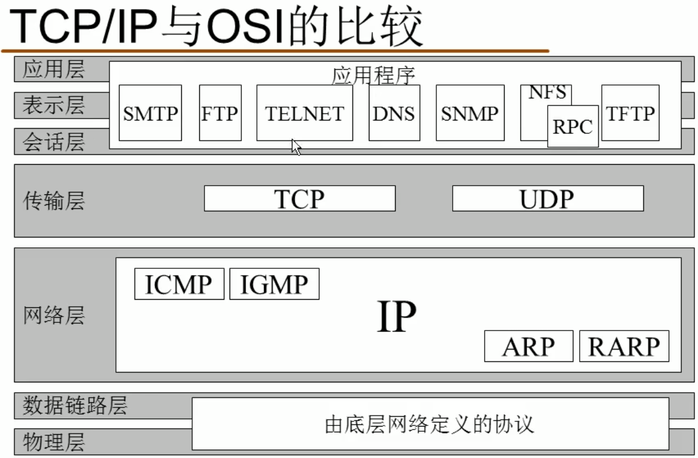

<!--
 * @Autor: 李逍遥
 * @Date: 2021-03-31 10:41:22
 * @LastEditors: 李逍遥
 * @LastEditTime: 2021-04-03 10:24:28
 * @Descriptiong: 
-->

# 目录 #

- [目录](#目录)
- [Java基础](#java基础)
  - [集合](#集合)
    - [Map](#map)
  - [设计模式](#设计模式)
    - [GOF](#gof)
    - [装饰模式](#装饰模式)
  - [输入输出流](#输入输出流)
- [Java虚拟机](#java虚拟机)
  - [Java内存区域与内存溢出异常](#java内存区域与内存溢出异常)
    - [运行时数据区域](#运行时数据区域)
  - [虚拟机类加载机制](#虚拟机类加载机制)
- [Java网络编程](#java网络编程)
  - [概念](#概念)
    - [TCP/IP](#tcpip)
    - [UDP](#udp)
    - [OSI](#osi)
    - [端口](#端口)
  - [基于TCP/IP的Socket编程](#基于tcpip的socket编程)
  - [基于UDP的Socket编程](#基于udp的socket编程)

# Java基础 #

## 集合 ##

### Map ###

数组 + 链表(linkedList) --实现--> hashMap --实现--> hashSet  

hashMap中putVal方法比较key的实现逻辑：  
`p.hash == hash && ((k = p.key) == key || (key != null && key.equals(k)))`  

>在JavaBean中是否重写 hashcode 和 equals 方法，如果涉及到集合操纵的话可以重写，否则无意义；  

## 设计模式 ##

### GOF ###

gang of four  
主要有23种：  
|模式|应用|
|:-|:-|
|单例模式|恶汉/懒汉|
|原型模式||
|池化模式|多例|
|工厂模式|静态的|
|装饰模式|BufferedInputStream|
|适配器模式|预实现|

### 装饰模式 ###

主要应用在流和连接(jdbc)中。  

## 输入输出流 ##

常用的：  

```txt
FileInputStream
FileOutputStream

装饰流
ByteArrayInputStream
ByteArrayOutputStream

BufferedInputStream
BufferedOutputStream

ObjectInputStream
ObjectOutputStream
```

# Java虚拟机 #

## Java内存区域与内存溢出异常 ##

### 运行时数据区域 ###

- Java虚拟机栈
  Java Virtual Machine Stacks  
  Java虚拟机栈是线程私有的，它的生命周期与线程相同。  
  虚拟机栈描述的是Java方法执行的内存模型——每个方法在执行的同时都会创建一个栈帧（Stack Frame）用于存储局部变量、操作数栈、动态链接、方法出口等信息。  
  每一个方法从调用到执行完成的过程，就对应着一个栈在虚拟机栈中入栈到出栈（弹栈）的过程。  
  >压栈(压方法帧)，弹栈。  

  - 方法帧 - method frame  
    栈帧分为三部分：局部变量区（Local Variables）、操作数栈（Operand Stack）和帧数据区（Frame Data）。  
  - 异常情况  
    - 如果线程请求的栈深度大于虚拟机所允许的深度，将抛出 `StackOverflowError` 异常。  
    - 如果虚拟机栈可以动态扩展，当无法申请到足够的内存时，就会抛出 `OutOfMemoryError` 异常。  

  >使用 Java VisualVM 工具可以监控栈空间使用情况。  

- 本地方法栈（Native Method Stack）  

  >使用 jconsole 工具可以监控堆的使用情况。  

- Java堆（Java Heap）  

- 方法区（Method Area）  

- 运行时常量池（Runtime Constant Pool）  

- 直接内存（Direct Memory）  


- jvm调优  
  - -Xss 堆栈大小  
  - -Xms 堆的初始值  
    默认为内存的1/64，可这样设置：-Xms200m。  
  - -Xmx 堆的最大值  
  - -Xmn 堆年轻代大小
  - -XX:NewSize=n 设置年轻代大小  
  - -XX:NewRatio=n 设置年轻代与年老代的比值（年老代是年轻代的倍数）  
  - XX:SurvivorRatio=n 年轻代中Eden区与两个Survivor区的比值  
  - -XX:PermSize 1.8移除了  
  - -XX:MaxPermSize 1.8移除了  

  
  

  >java -X 查看说明

## 虚拟机类加载机制 ##

# Java网络编程 #

## 概念 ##

### TCP/IP ###

- TCP(transfer control protocal, 传输控制协议) 是一种基于连接的通信协议。  
  所谓连接，就是两个对等实体为进行数据通信而进行的一种结合。面向连接的服务分为：连接建立、数据传输和连接释放三个阶段。  
  
- TCP协议工作机制（三次握手两次确认）  
  - A发送syn信号x给B  
  - B接收到A的syn信号x，构造一个ack信号x+1，准备自己的syn信号y  
  - B向A发送 x+1 和 y 信号  
  - A接收B的 ack + syn 信息，对B的身份进行认证，同时构造ack信号(y+1)  
  - A发送 ack(y+1) 信息发送给B  
  - B接收到A的ack信息，对A的身份进行认证  
  

- IP  : internet pro 网络协议  
- FTP : File tranfer protocal 文件传输协议  

### UDP ###

UDP(User Datagram Protocol, 用户数据报协议) 是一种无连接的服务。  

只需要发送者和接收者，发送者不管接收者是否接到。  

### OSI ###

open system internet  
七层协议  

- 物理层：二进制传输  
- 数据链路层：介质访问  
- 网络层：确定地址和最佳路径  
- 传输层：端到端连接  
- 会话层：互连主机通信  
- 表示层：数据表示  
- 应用层：为应用程序提供网络服务  




### 端口 ###


常用的端口  


## 基于TCP/IP的Socket编程 ##

Socket=IP+TCP/UDP+端口  
DatagramSocket 数据报套接字  

QQ通信实践
  

## 基于UDP的Socket编程 ##

屏广项目实践  


