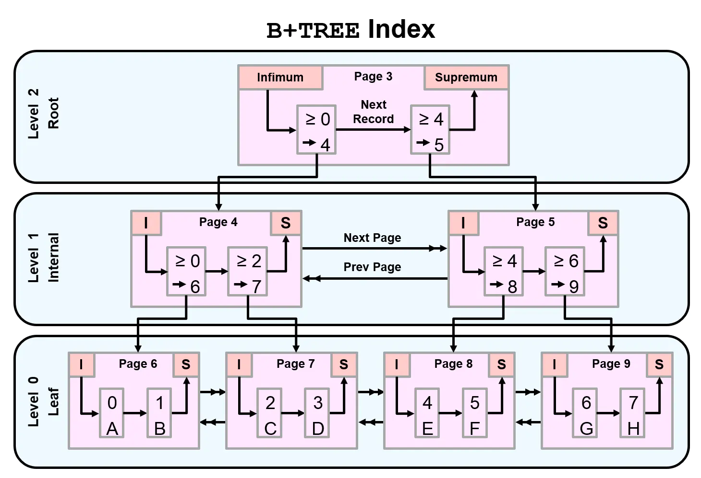

<!--
 * @Autor: 李逍遥
 * @Date: 2021-02-05 17:23:39
 * @LastEditors: 李逍遥
 * @LastEditTime: 2021-02-25 22:27:28
 * @Descriptiong: DBA的学习指南
-->

# 目录 #

- [目录](#目录)
- [概念](#概念)
  - [数据库产品](#数据库产品)
  - [MySQL企业版GA选择](#mysql企业版ga选择)
    - [大版本（主流）：5.6,5.7,8.0](#大版本主流565780)
- [需要学习的内容](#需要学习的内容)
  - [1.MySQL 5.7 安装部署（二进制），编译自己的扩展](#1mysql-57-安装部署二进制编译自己的扩展)
    - [手动安装部署，以Linux通用版(generic)为例](#手动安装部署以linux通用版generic为例)
    - [分析处理MySQL数据库无法启动的问题](#分析处理mysql数据库无法启动的问题)
    - [管理员密码管理（root@localhost）](#管理员密码管理rootlocalhost)
  - [2.MySQL升级步骤扩展](#2mysql升级步骤扩展)
  - [3.MySQL 5.7 体系结构](#3mysql-57-体系结构)
    - [MySQL C/S结构介绍](#mysql-cs结构介绍)
    - [MySQL实例的构成](#mysql实例的构成)
    - [MySQL中myslqd服务的结构](#mysql中myslqd服务的结构)
    - [逻辑结构](#逻辑结构)
    - [物理结构](#物理结构)
  - [4.MySQL基础管理](#4mysql基础管理)
    - [用户管理](#用户管理)
    - [权限管理](#权限管理)
    - [连接管理](#连接管理)
    - [启动和关闭](#启动和关闭)
    - [初始化配置](#初始化配置)
    - [MySQL多实例](#mysql多实例)
  - [5.基础SQL语句使用](#5基础sql语句使用)
    - [介绍](#介绍)
    - [数据类型](#数据类型)
    - [列属性和约束](#列属性和约束)
    - [SQL语句应用](#sql语句应用)
  - [6.SQL高级应用](#6sql高级应用)
  - [7.Information_schema获取元数据](#7information_schema获取元数据)
  - [8.索引](#8索引)
    - [测试环境准备](#测试环境准备)
    - [索引的作用](#索引的作用)
    - [索引的种类（算法）](#索引的种类算法)
    - [B+树](#b树)
    - [索引在功能上的分类](#索引在功能上的分类)
    - [辅助索引细分](#辅助索引细分)
    - [索引树的高度受什么影响？](#索引树的高度受什么影响)
    - [索引的管理操作](#索引的管理操作)
    - [面试问题：简单说明InnoDB聚集索引与辅助索引的区别](#面试问题简单说明innodb聚集索引与辅助索引的区别)
  - [9.执行计划管理（基础优化）](#9执行计划管理基础优化)
    - [作用](#作用)
    - [执行计划获取](#执行计划获取)
    - [执行计划分析](#执行计划分析)
    - [面试题：explain(desc)使用场景](#面试题explaindesc使用场景)
    - [索引应用规范](#索引应用规范)
    - [不走索引的情况（开发规范）](#不走索引的情况开发规范)
  - [10.存储引擎](#10存储引擎)
    - [InnoDB引擎介绍](#innodb引擎介绍)
    - [引擎种类](#引擎种类)
    - [InnoDB存储引擎的核心特性](#innodb存储引擎的核心特性)
    - [存储引擎相关操作](#存储引擎相关操作)
    - [InnoDB存储引擎物理存储结构](#innodb存储引擎物理存储结构)
    - [InnoDB事务的ACID特性](#innodb事务的acid特性)
    - [InnoDB 事务的ACID如何保证](#innodb-事务的acid如何保证)
    - [事务的隔离级别](#事务的隔离级别)
    - [InnoDB核心参数](#innodb核心参数)
  - [11.日志管理](#11日志管理)
    - [排错](#排错)
    - [数据恢复](#数据恢复)
    - [优化](#优化)
  - [12.备份与恢复](#12备份与恢复)
  - [13.主从复制及架构演变](#13主从复制及架构演变)
  - [14.传统的高可用及读写分离（MHA&Atlas）](#14传统的高可用及读写分离mhaatlas)
  - [15.传统分布式架构设计与实现-扩展（Mycat-->DBLE,DRDS）](#15传统分布式架构设计与实现-扩展mycat--dbledrds)
  - [16.MySQL 5.7 高可用及分布式架构-扩展（MGR,InnoDB Cluster）](#16mysql-57-高可用及分布式架构-扩展mgrinnodb-cluster)
  - [17.MySQL优化（安全，性能）](#17mysql优化安全性能)
    - [锁](#锁)
  - [18.MySQL监控（zabbix,open-falcon）](#18mysql监控zabbixopen-falcon)
  - [19.RDS（阿里云）](#19rds阿里云)
- [还需要学习的Nosql](#还需要学习的nosql)
  - [1.Redis](#1redis)
  - [2.MongoDB](#2mongodb)
- [另外需要了解的关系型数据库](#另外需要了解的关系型数据库)
  - [1.Oracle](#1oracle)
  - [2.postgresql](#2postgresql)

# 概念 #

  DBA —— 数据库管理员

>数据库的发展情况大概如下（目前还处在第二个阶段）：
>RDBMS(关系型数据库) --> NOSQL+RDBMS --> NOSQL(RDBMS),RDBMS(NOSQL) --> NewSQL

## 数据库产品 ##

- **RDBMS**
  Oracle,MySQL,PostgreSQL,SqlServer

- **NoSQL**
  MongoDB,Redis,Elasticsearch

- **NewSQL(特点是分布式)**
  TiDB,Spanner,PolarDB

## MySQL企业版GA选择 ##

### 大版本（主流）：5.6,5.7,8.0 ###

各大版本中的主流版本  
5.6 : 5.6.34 , 5.6.36 , 5.6.38(2017913) , 5.6.40  
5.7 : 5.7.18 , 5.7.20(2017913) , 5.7.24  
8.0 : 8.0.14 , 8.0.15 , 8.0.16  

# 需要学习的内容 #

## 1.MySQL 5.7 安装部署（二进制），编译自己的扩展 ##

### 手动安装部署，以Linux通用版(generic)为例 ###

- 下载并上传二进制文件或者直接使用 wget 命令下载，解压并移动到指定目录
  这里使用 `mysql-5.7.26-linux-glibc2.12-x86_64.tar.gz` 版本，命令如下：

  ```shell
  # 解压
  tar xf mysql-5.7.26-linux-glibc2.12-x86_64.tar.gz
  # 创建目录
  mkdir /application
  # 将MySQL文件移动并重命名
  mv mysql-5.7.26-linux-glibc2.12-x86_64 /application/mysql
  ```

- 处理原始环境

  ```shell
  # 查看是否安装 mariadb
  rpm -qa|grep mariadb
  # 如果有，使用下面的命令卸载掉相关软件，否则会初始化失败
  rpm -e mariadb
  # 如果因为被依赖而无法卸载的话，可以使用以下命令进行卸载
  yum remove mariadb-libs-xxxx -y
  # 也可以加上 --nodeps 不检查依赖关系强制卸载
  rpm -e --nodeps mariadb
  ```

- 配置环境变量

  ```shell
  # 配置环境变量
  vim /etc/profile
  # 在最后一行添加下面的代码
  export PATH=/application/mysql/bin:$PATH
  # 让配置生效
  source /etc/profile
  # 查看MySQL版本(确认环境变量是否生效)
  mysql -V
  ```

- 挂载数据盘

  ```shell
  # 创建数据路径
  # 在虚拟机上可以添加一块新磁盘模拟数据盘
  # 查看磁盘情况
  fdisk -l
  # 可看到新加的虚拟硬盘，一般名为：Disk /dev/sdb
  # 格式化
  mkfs.xfs /dev/sdb
  # 创建目录
  mkdir /data
  # 挂载
  # 查看磁盘的UUID
  blkid
  # 在配置文件中将磁盘挂载到 data 目录下
  vim /etc/fstab
  # 添加以下代码
  UUID=xxxxxx-xxxx-xxxx-xxxx-xxxxxx /data xfs defaults 0 0
  # 自动挂载
  mount -a
  # 查看是否挂载成功
  df -h
  # 未挂载成功的话，也可以使用以下方法
  cd /sys/class/scsi_host
  echo "---" > host0/scan # 接口扫描新加磁盘
  ```

- 创建用户并授权

  ```shell
  # 创建管理MySQL的用户（不需要有登录权限）
  useradd -s /sbin/nologin mysql
  # 授权
  mkdir /data/mysql/data -p
  chown -R mysql.mysql /application/*
  chown -R mysql.mysql /data
  ```

- 初始化数据（创建系统数据）

  ```shell
  # 5.6的命令是：/application/mysql/scripts/mysql_install_db
  # 先进入MySQL安装目录
  cd /application/mysql/
  # 初始化
  mysqld --initialize --user=mysql --basedir=/application/mysql --datadir=/data/mysql/data
  # 如果初始化报错缺少 libaio 的话，需安装 libaio-devel
  yum install -y libaio-devel
  # 初始化后会生成一个临时密码，如下：
  #### ..... A temporary password is generated for root@localhost: xxxxxx
  ```

  >参数说明：
  >initialize
  >1.对密码复杂度进行定制，包含四种字符且达到12位；
  >2.给root@localhost 用户设置临时密码；
  >initialize-insecure : 无限制无临时密码，生产中往往使用该方式初始化。

- 配置文件

  ```shell
  # 准备配置文件
  # 在 /etc/my.cnf 中写入以下项(最基本的配置项)
  cat >/etc/my.cnf <<EOF
  [mysqld]
  user=mysql
  basedir=/application/mysql
  datadir=/data/mysql/data
  socket=/tmp/mysql.sock
  server_id=6
  port=3306
  [mysql]
  socket=/tmp/mysql.sock
  EOF
  ```

- 启动数据库
  1.使用 sys-v

  ```shell
  # 进入命令所在目录
  cd /application/mysql/support-files/
  # 启动
  ./mysql.server start

  # 还可以将 mysql.server 命令放到init.d中管理
  ## 将命令拷贝到 init.d
  cp /application/mysql/support-files/mysql.server /etc/init.d/mysqld
  ## 启动
  service mysqld start
  # 同 /etc/init.d/mysql start
  # 实际上是启动了 mysql.server 然后调用了 /application/mysql/bin/mysqld_safe(脚本)  然后启动了 mysqld

  # 以上还包括 start|stop|restart|status 等
  ```

  2.使用systemd管理MySQL服务（5.7的新特性）

  ```shell
  # 将MySQL服务加入systemd
  cat >/etc/systemd/system/mysqld.service <<EOF
  [Unit]
  Description=MySQL Server
  Documentation=man:mysqld(7)
  Documentation=http://dev.mysql.com/doc/refman/en/using-systemd.html
  After=network.target
  After=syslog.target
  [Install]
  WantedBy=multi-user.target
  [Service]
  User=mysql
  Group=mysql
  ExecStart=/application/mysql/bin/mysqld --defaults-file=/etc/my.cnf
  LimitNOFILE = 5000
  EOF

  # 启动
  systemctl start mysqld

  # 设置开机启动
  systemctl enable mysqld

  ## 判断服务是否启动
  netstat -lnp|grep mysqld
  netstat -lnp|grep 3306
  ps -ef |grep mysqld
  systemctl status mysqld
  ss -tulpn|grep mysqld
  ss -tulpn|grep 3306
  lsof -i :3306
  ```

### 分析处理MySQL数据库无法启动的问题 ###

例如：类似 `without updating PID file` 的错误；  
如果控制台上的报错信息没有其他具体信息的话，需要查看日志，日志位置在 `/data/mysql/data/主机名.err`,找 [error] 项的上下文进行分析；  
**可能的原因：**  
a.配置文件 `/etc/my.cnf` 路径不对；  
b. `/tmp/mysql.sock` 文件被修改或者删除；  
c.数据目录未给mysql用户权限；  
d.配置文件 `/etc/my.cnf` 参数错误；  

### 管理员密码管理（root@localhost） ###

- 设置/修改密码

  ```shell
  # 该命令需要输入旧密码，有则输入无则跳过
  mysqladmin -uroot -p password newpassword
  ```

- 找回管理员密码
  1.先关闭数据库

  ```shel
  systemctl stop mysqld
  ```

  2.使用维护模式启动数据库

  ```shell
  mysqld_safe --skip-grant-tables --skip-networking &
  ```

  3.登录并修改密码

  ```shell
  # 登录MySQL
  mysql
  # 修改密码
  alter user root@'localhost' indentified by 'pwd';
  # 上面的命令会失败，刷新后再修改就成功了
  flush privileges;
  ```

  4.关闭数据库，正常启动，就可以使用新密码登录了

  ```shell
  kill mysqld
  systemctl start mysqld
  ```

## 2.MySQL升级步骤扩展 ##

## 3.MySQL 5.7 体系结构 ##

### MySQL C/S结构介绍 ###


两种连接方法：网络连接串和套接字文件

```shell
#TCP/IP方式（远程、本地）：
mysql -uroot -p -h xx.x.x.xx -P3306
#Socket方式(仅本地)：
mysql -uroot -p -S /tmp/mysql.sock # -S可省略
```

### MySQL实例的构成 ###

实例：mysqld守护进程 + master thread + task thread + 预分配内存。

### MySQL中myslqd服务的结构 ###


- **连接层**
  - 1.提供连接协议：Socket和TCP/IP
  - 2.提供验证：用户、密码，IP，SOCKET
  - 3.派生一个专用的线程（接收SQL，返回结果），使用`show processlist;` 命令可查看连接的线程

  >思考：
  >使用维护模式找回密码时，启动命令使用了以下参数分别是什么意思？
  >--skip-grant-tables : 不启动用户密码验证
  >--skip-networking : 不启用TCP/IP连接

- **SQL层（在SQL优化方面至关重要）**
  - 1.接收上层传递的SQL语句
  - 2.语法验证模块：验证语句语法，是否满足SQL_MODE
  - 3.语义检查：判断语句的类型（DDL,DML等）
  - 4.权限检查：用户对库表的权限
  - 5.解析器：对语句执行前,进行预处理，生成解析树(执行计划)，即生成多种执行方案
  - 6.优化器：根据解析器得出的多种执行计划，进行判断，选择最优的执行计划（代价最低的，5.7以后是代价模型）
      代价模型：资源（CPU  IO  MEM）的损耗评估性能好坏。
  - 7.执行器：根据最有执行计划执行SQL语句，产生结果（在磁盘的哪个位置上）
  - 8.提供查询缓存（默认是没开启的），会使用redis tair替代查询缓存功能
  - 9.提供日志记录（具体见日志管理章节）：binlog，默认是没开启的

- **存储引擎层**
  真正和磁盘打交道的层次，类似Linux中的文件系统。
  根据SQL层提供的地址从磁盘上拿到数据，返回给SQL，结构化成表，再通过连接层返回给用户。

### 逻辑结构 ###


### 物理结构 ###


*面试题：*
说明MyISAM和InnoDB在存储方式上的异同？

- **微观结构**

  页（page）：最小的存储（IO）单元，默认16k
  区：64个（默认）连续的页，共1M
  段：一个表就是一个段，包含一个或多个区
  总结：一个表就是一个段（分区表除外），MySQL分配空间时至少分配一个区，每个区默认是1M（64个页），MySQL最小的IO单元是page（16K）。

## 4.MySQL基础管理 ##

### 用户管理 ###

- **作用**
  登录数据库
  管理数据库对象

- **定义**
  用户名@'白名单'。
  白名单：IP地址。
  例如：
  root@'10.0.0.51'
  root@'10.0.0.%'
  root@'10.0.0.5%'
  root@'10.0.0.0/255.255.254.0'
  root@'%'
  root@'xxx.com'
  root@'localhost'
  root@'db01'

  最常用的是以下四种：
  root@'10.0.0.%'
  root@'10.0.0.5%'
  root@'10.0.0.0/255.255.254.0'
  root@'localhost'

- **操作**
  创建用户

  ```sql
  create user lee@'10.0.0.%' identified by 'pwd';
  ```

  查询用户

  ```sql
  # 查看user表的结构
  desc mysql.user;
  # 查看user表
  select user,host,authentication_string from mysql.user;
  ```

  删除用户

  ```sql
  drop user lee@'10.0.0.%';
  ```

  修改用户

  ```sql
  alter user lee@'10.0.0.%' identified by 'pwd';
  ```

### 权限管理 ###

- **权限的作用**
  控制用户登陆之后能对MySQL对象做哪些命令。
- **权限定义**
  mysql的权限定义就是SQL语句。

  ```sql
  ALL:
  SELECT,INSERT, UPDATE, DELETE, CREATE, DROP, RELOAD, SHUTDOWN, PROCESS, FILE, REFERENCES, INDEX, ALTER, SHOW DATABASES, SUPER, CREATE TEMPORARY TABLES, LOCK TABLES, EXECUTE, REPLICATION SLAVE, REPLICATION CLIENT, CREATE VIEW, SHOW VIEW, CREATE ROUTINE, ALTER ROUTINE, CREATE USER, EVENT, TRIGGER, CREATE TABLESPACE
  ALL : 以上所有权限，一般是普通管理员拥有的
  with grant option：超级管理员才具备的，给别的用户授权的功能
  ```

  **8.0版本新特性**（了解）
  加入了角色的概念。

- **授权**

  ```sql
  # 示例
  grant  ALL on wordpress.* to wordpress@'10.0.0.%' identified by '123456';
  # 解析
  grant 权限(insert,update,...) on 范围(库) to 用户 indentified by '密码';

  # 范围
  # *.*                  ---->所有的库所有表
  # wordpress.*          ---->库里的所有表
  # wordpress.t1         ---->指定表
  ```

  >命令 indentified by '密码' 可以修改用户密码，如不需要修改密码可以不用，另外MySQL8以前的版本可以使用 grant 命令同时创建用户+授权，8以后需要先创建用户再授权；

- **查看用户权限**

  ```sql
  # 普通用户
  mysql> show grants for lee@'%';
  +---------------------------------+
  | Grants for lee@%                |
  +---------------------------------+
  | GRANT USAGE ON *.* TO 'lee'@'%' |
  +---------------------------------+
  1 row in set (0.00 sec)
  # 超级管理员
  mysql> show grants for root@'localhost';
  +---------------------------------------------------------------------+
  | Grants for root@localhost                                           |
  +---------------------------------------------------------------------+
  | GRANT ALL PRIVILEGES ON *.* TO 'root'@'localhost' WITH GRANT OPTION |
  | GRANT PROXY ON ''@'' TO 'root'@'localhost' WITH GRANT OPTION        |
  +---------------------------------------------------------------------+
  2 rows in set (0.00 sec)

  # USAGE 表示空权限，只能连接数据库，不能做任何操作；
  # ALL PRIVILEGES 表示拥有所有权限，是管理员
  # WITH GRANT OPTION 超级管理员
  ```

- **回收用户权限**
  >重复（重新）授权会导致权限叠加，不会减少权限，想要减少权限只能通过回收授权；

  ```sql
  revoke delete on *.* from 'lee'@'%';
  ```

  **面试题：**
  1.开发人员找DBA开用户，需要DBA和开发人员沟通什么？  
    a.你要做哪些操作（确定权限）；  
    b.你会从什么地址来连接数据库（确定ip地址或者网段）；  
    c.要对什么对象（库表）进行操作；  

  2.开发人员找DBA要管理员的root用户密码，作为DBA你怎么处理？  
    a.一般公司，走正规流程；  
    b.金融公司严令禁止私自向DBA索要，如有私自索要按规定举报；  
    c.小公司root用户会滥用，学会保护自己，可以提意见制定流程；  

### 连接管理 ###

- 自带客户端命令
  常用的命令：

  ```shell
  -u                   用户
  -p                   密码
  -h                   IP
  -P                   端口
  -S                   socket文件
  -e                   免交互执行命令
  <                    导入SQL脚本

  [root@db01 ~]# mysql -uroot -p -h 10.0.0.51 -P3306
  Enter password:
  mysql> select @@socket;
  +-----------------+
  | @@socket        |
  +-----------------+
  | /tmp/mysql.sock |
  
  # 管理员最常用的连接方式，一般省略 -S
  [root@db01 ~]# mysql -uroot -p -S /tmp/mysql.sock
  Enter password:
  # 查看连接方式
  mysql> show processlist;
  +----+------+-----------+------+---------+------+----------+------------------+
  | Id | User | Host      | db   | Command | Time | State    | Info             |
  +----+------+-----------+------+---------+------+----------+------------------+
  |  2 | root | localhost | NULL | Query   |    0 | starting | show processlist |
  +----+------+-----------+------+---------+------+----------+------------------+
  1 row in set (0.00 sec)
  
  # 免交互执行命令
  [root@db01 ~]# mysql -uroot -p -e "select user,host from mysql.user;"
  Enter password:
  +---------------+-----------+
  | user          | host      |
  +---------------+-----------+
  | abc          | 10.0.0.%  |
  | app          | 10.0.0.%  |
  | root          | 10.0.0.%  |
  | mysql.session | localhost |
  | mysql.sys    | localhost |
  | root          | localhost |
  +---------------+-----------+
  
  # 执行sql脚本
  [root@db01 ~]# mysql -uroot -p <world.sql
  Enter password:
  [root@db01 ~]#
  ```

  **问题：**
  怎么证明你的数据库是可用的？
  1.证明进程和端口是存在的；

  ```shell
  # 查看mysqld进程
  ps -ef | grep mysqld
  # 查看端口
  netstat -lnp|grep [3306|mysqld]
  ```

  2.验证用户远程可以连接，使用命令 `mysql -uxxx -p -hxxxx`

  - 远程客户端工具
    SQLyog,MySQL Workbanch,Navicat等

### 启动和关闭 ###

- 辅助脚本方式（普通的启动关闭）：
  sys-v   : /etc/init.d/mysqld
  systemd : /etc/systemd/system/mysqld.service

  >**不建议以sys-v方式启动**，其是安全模式，mysqld服务异常关闭后mysqld_safe会自动启动mysqld，但MySQL启动过程会做数据回滚，所以建议先做数据备份再启动。

- 维护性的启动方式：
  可以定制一些参数
  1./application/mysql/bin/mysqld_safe --skip-grant-tableds --skip-networking &
  2./application/mysql/bin/mysqld &

### 初始化配置 ###

- 预编译时进行设置（略）
  只能在编译安装中实现，硬编码配置到程序中。
- 初始化配置文件(my.cnf)
  - 初始化文件默认读取位置
    读取顺序如下，如果这些位置都有配置文件，以最后一个为准（后面的配置覆盖前面的配置）

    ```shell
    # 使用命令查看 my.cnf 的读取顺序
    mysqld --help --verbose | grep "my.cnf"
    /etc/my.cnf /etc/mysql/my.cnf /usr/local/mysql/etc/my.cnf ~/.my.cnf
    ```

    也可以使用参数 `--defaults-file=/opt/my.cnf` 指定读取配置文件（使用mysqld_safe/mysqld 启动时）；

- 命令行模式（启动时用参数指定配置信息）
- 初始化配置文件的应用
  - 作用
    影响到数据库的启动：mysqld mysqld_safe
    影响到客户端的连接：mysql mysqldump mysqladmin
  - 书写格式

    ```cnf
    [标签]
    配置项=xxxx

    标签类型：服务端、客户端
    服务器端标签：
    [mysqld]
    [mysqld_safe]
    [server]

    客户端标签：
    [mysql]
    [mysqldump]
    [client]

    配置文件的示例：
    [mysqld]
    user=mysql
    basedir=/application/mysql
    datadir=/data/mysql/data
    socket=/tmp/mysql.sock
    server_id=6
    port=3306
    log_error=/data/mysql/mysql.log
    [mysql]
    socket=/tmp/mysql.sock
    prompt=Master [\\d]>
    ```

  - 常用配置项（通用模板）

    ```cnf
    [mysqld]
    user=mysql
    basedir=/application/mysql
    datadir=/data/mysql/data
    socket=/tmp/mysql.sock
    # server_id 大于1 主从集群时必须设置且不同
    server_id=6
    port=3306
    log_error=/data/mysql/mysql.log
    # 二进制日志位置+文件名的前缀（mysql-bin）
    log_bin=/data/mysql/data/mysql-bin
    [mysql]
    socket=/tmp/mysql.sock
    ```

### MySQL多实例 ###

- 准备多个目录

  ```shell
  mkdir -p /data/330{7,8,9}/data
  ```

- 准备配置文件

  ```shell
  cat > /data/3307/my.cnf <<EOF
  [mysqld]
  basedir=/application/mysql
  datadir=/data/3307/data
  socket=/data/3307/mysql.sock
  log_error=/data/3307/mysql.log
  port=3307
  server_id=7
  log_bin=/data/3307/mysql-bin
  EOF

  cat > /data/3308/my.cnf <<EOF
  [mysqld]
  basedir=/application/mysql
  datadir=/data/3308/data
  socket=/data/3308/mysql.sock
  log_error=/data/3308/mysql.log
  port=3308
  server_id=8
  log_bin=/data/3308/mysql-bin
  EOF

  cat > /data/3309/my.cnf <<EOF
  [mysqld]
  basedir=/application/mysql
  datadir=/data/3309/data
  socket=/data/3309/mysql.sock
  log_error=/data/3309/mysql.log
  port=3309
  server_id=9
  log_bin=/data/3309/mysql-bin
  EOF
  ```

- 初始化三套数据

  ```shell
  mv /etc/my.cnf /etc/my.cnf.bak
  mysqld --initialize-insecure  --user=mysql --datadir=/data/3307/data --basedir=/app/mysql
  mysqld --initialize-insecure  --user=mysql --datadir=/data/3308/data --basedir=/app/mysql
  mysqld --initialize-insecure  --user=mysql --datadir=/data/3309/data --basedir=/app/mysql
  ```

- systemd管理多实例

  ```shell
  # 定制不同的启动脚本
  cd /etc/systemd/system
  cp mysqld.service mysqld3307.service
  cp mysqld.service mysqld3308.service
  cp mysqld.service mysqld3309.service

  # 分别修改配置文件
  vim mysqld3307.service
  ExecStart=/application/mysql/bin/mysqld  --defaults-file=/data/3307/my.cnf
  vim mysqld3308.service
  ExecStart=/application/mysql/bin/mysqld  --defaults-file=/data/3308/my.cnf
  vim mysqld3309.service
  ExecStart=/application/mysql/bin/mysqld  --defaults-file=/data/3309/my.cnf
  ```

- 授权

  ```shell
  chown -R mysql.mysql /data/*
  ```

- 启动

  ```shell
  systemctl start mysqld3307.service
  systemctl start mysqld3308.service
  systemctl start mysqld3309.service
  ```

- 验证多实例

  ```shell
  netstat -lnp|grep 330
  # sql语句验证
  mysql -S /data/3307/mysql.sock -e "select @@server_id"
  mysql -S /data/3308/mysql.sock -e "select @@server_id"
  mysql -S /data/3309/mysql.sock -e "select @@server_id"
  ```

## 5.基础SQL语句使用 ##

### 介绍 ###

结构化查询语言(Structured Query Language)，主要分为4大类：
数据查询语言（DQL:Data Query Language）
数据操作语言（DML:Data Manipulation Language）
数据控制语言（DCL:Data Control Language）
数据定义语言（DDL:Data Definition Language）
>官方文档中DQL属于DML。

SQL标准：到目前为止，SQL共推出四代标准，分别是SQL-89、SQL-92、SQL-99、SQL-2003。
MySQL从5.7版本开始，加入了SQL_Mode 严格模式，开始遵守SQL标准。

>关于SQL标准的详细情况，参照：
<https://my.oschina.net/goopand/blog/393628>
<https://www.ripjava.com/article/1370280574320672>

### 数据类型 ###

控制数据的规范性，让数据具有具体含义，在离殇进行控制。

- 字符型
  常用的：
  char(n):定长（固定存储空间），最多为255个字符。
  varchar(n):可变长（按需分配存储空间），最多为65535个字符，推荐最长设为255（会单独占用一个字符来记录字符串长度，超过255后需要两个字节记录字符串长度）。
  enum('bj','tj','sh')：枚举类型，比较适合于取值范围固定的列，可以很大程度的优化索引结构（**禁存数字**，容易与索引产生错乱）。

  

- 数值型
  常用的：
  tinyint : 不需要知道长度；
  int : 不需要知道长度，注意，最多存10位数字（比如不能用来存手机号）；
  bigint : 不需要知道长度；

  

- 时间类型
  常用的：
  date
  datetime : 范围为从 1000-01-01 00:00:00.000000 至 9999-12-31 23:59:59.999999。
  timestamp : 范围为从 1970-01-01 00:00:00.000000 至 2038-01-19 03:14:07.999999 且会受到时区的影响。

  

- 二进制类型

  

**面试题：**  

```txt
1.char he varchar的区别？
  1) 255    65535
  2) 定长   变长 （由于需要计算字符串长度，在同样长度字符串插入的情况下varchar稍有劣势）

2.char 和 varchar 如何选择？
  1) char类型：固定长度的字符串列，比如手机号、身份证号、银行卡号等；
  2) varchar: 不确定长度的字符串；
  3) abc

3.为什么不尽量使用char？会影响到索引的高度？

- 表属性
  - 存储引擎（engine）
    MyISAM(5.7以前常用),InnoDB
  - 字符集和字符序(charset/character set,collation)
    字符集最好使用 utf8mb4(真正的Unicode编码)
    字符序也叫排序规则或者校对规则，主要针对英文字符大小写排序比较的问题。
```

### 列属性和约束 ###

- 主键 primary key (PK)  
  唯一非空，尽量是数字列、整数列、无关列、自增的。  
  是一种约束，也是一种索引类型（聚集索引），在一个表中只能有一个主键（可以由多个列构成）。  
- 自增 auto_increment  
  针对数字列自动生成顺序值（可设置增长间隔），往往与主键成对出现。  
- 非空 not null  
  必填项（建议，对于普通列尽量设置为非空，利于索引应用）。  
- 默认值 default  
  数字列使用0，字符串使用nul/null，往往与非空配合使用。
- 唯一 unique  
  唯一性约束，也是唯一索引。  
- 无符号 unsigned  
  针对数字列（必须为正数）。  
- 注释 comment

### SQL语句应用 ###

- DDL 数据定义语言
  - 库：建、改、删（生成中禁止删操作）
  - 表：建、改、删（生成中禁止删操作）
  - 列：增、改、删（生成中禁止删操作）
  - 建库表规范
    1.库名表名使用小写字母；（开发环境如果与生产环境不同，容易混用大小写导致问题，比如Windows中大小写不敏感而Linux中敏感导致不注意名称中的大小写问题）
    2.不能以数字和下划线开头；
    3.不能使用保留字；
    4.与业务相关；

- DML 数据操作语言
  insert,update,delete

  >需求：由于业务需要删除数据，但又不希望真的删除数据，可以设计伪删除。
  >使用update替代delete，进行伪删除。
  >1.添加状态列，区分存在和删除，字段默认值为存在。
  >2.需要删除数据时更新字段值为删除状态。
  >3.业务端修改语句，加上状态限制。

- DQL 数据查询语言
  select : 获取MySQL表中的数据行；
  show : a

>以上，不熟悉的可以查看官方文档，例如 `help create database`
>删除库、表和列是危险操作，不建议在生产环境操作。
>**ALTER** 操作会阻塞整个表的读写操作，建议在业务空闲期操作，如确实比较紧急可以使用 `onlie-DDL` 和 `pt-osc` 等工具。
>SQL_MODE的影响：参数 only_full_group_by(5.6和8.0中没有该参数) 不允许select 后的列不在group by中且不在聚合函数中（对主键和唯一列分组时例外）。
>命令详情见 `MySQL/使用笔记.md`

## 6.SQL高级应用 ##

## 7.Information_schema获取元数据 ##

元数据储存在基表（无法直接查询和修改）中
-> 使用 DDL 进行元数据修改
-> 使用 show,desc,information_schema(全局的统计和查询) 查看元数据。

>详细用法见 `MySQL/使用笔记.md`

## 8.索引 ##

### 测试环境准备 ###

先准备数据，命令如下：

```sql
-- 进入测试用的库
use test;
-- 创建测试表
create table t100w(
id int,
num int,
k1 char(2),
k2 char(4),
dt timestamp
) charset utf8mb4 collate utf8mb4_bin;

-- 创建存储过程
delimiter //
create procedure rand_data(in num int)
begin
declare str char(62) default 'abcdefghijklmnopqrstuvwxyzABCDEFGHIJKLMNOPQRSTUVWXYZ0123456789';
declare str2 char(2);
declare str4 char(4);
declare i int default 0;
while i < num do
set str2=concat(substring(str,1+floor(rand()*61),1),substring(str,1+floor(rand()*61),1));
set str4=concat(substring(str,1+floor(rand()*61),2),substring(str,1+floor(rand()*61),2));
set i=i+1;
insert into t100w values (i,floor(rand()*num),str2,str4,now());
end while;
end;
//
delimiter ;

-- 调用存储过程，插入100w数据
call rand_data(1000000);
```

使用MySQL自带的工具进行压力测试（模仿100个连接一共做1000次查询），命令如下：

```shell
mysqlslap --defaults-file=/etc/my.cnf \
--concurrency=100 --iterations=1 --create-schema='test' \
--query="select * from test.t100w where k2='HIGH'" engine=innodb \
--number-of-queries=2000 -uroot -p123 -verbose
# 测试结果
Benchmark
        Running for engine rbose
        Average number of seconds to run all queries: 5064.970 seconds
        Minimum number of seconds to run all queries: 5064.970 seconds
        Maximum number of seconds to run all queries: 5064.970 seconds
        Number of clients running queries: 100
        Average number of queries per client: 20
```

### 索引的作用 ###

提供了类似于书中目录的作用,目的是为了优化查询。

### 索引的种类（算法） ###

B+树
Hash
R树
Full text
GIS

### B+树 ###



B-Tree 普通B树
B+Tree MySQL使用的
B*Tree MySQL在B+树上进一步优化

>B+Tree 在叶子节点上增加了双向指针，在范围查询方面提供了更好的性能(> < >= <= like)。
>MySQL在B+树上又进行了优化，主要是在枝节点上增加了双向指针。

### 索引在功能上的分类 ###

- 辅助索引（S）
  1.辅助索引是基于表的列进行生成的；
  2.取出所有键值（索引列的所有值）；
  3.进行所有键值的排序；
  4.将所有键值按顺序落到B+Tree索引的叶子节点上；
  5.进而生成枝节点和根节点；
  6.叶子节点除了存储键值外，还存储了相邻叶子节点的指针，另外还会保存原表数据的指针；

- 聚集索引（C）
  前提：
  1.建表时有主键列（比如ID列）；
  2.表数据进行存储时，会按照ID列的顺序，有序的存储每行数据到数据页上（聚集索引组织表）；
  3.表的数据页被作为聚集索引的叶子节点；
  4.上层节点和根节点只需要利用叶子节点的主键值来生成；

- 聚集索引和辅助索引构成的区别
  1.聚集索引只能有一个（可以由多列构成，但代价比较高）,非空唯一,一般是主键，如果没有主键会选唯一键，如果都没有则会生成一个隐藏例作为主键；
    辅助索引,可以有多个,是配合聚集索引使用的；
  2.聚集索引叶子节点,就是磁盘的数据行存储的数据页（MySQL是根据聚集索引组织存储数据,数据存储时就是按照聚集索引的顺序进行存储，所以推荐使用自增ID做主键）；
    辅助索引,只会提取索引键值,进行自动排序生成B树结构；

### 辅助索引细分 ###

- 单列辅助索引
- 联合多列辅助索引（联合索引，可能实现覆盖）
- 唯一索引
- 前缀索引

### 索引树的高度受什么影响？ ###

1.数据行多 —— 分表（分区，分库，分布式）
2.索引列值教长 —— 前缀索引
3.在数据行很多的情况下char类型数据列可能会比varchar类型索引树高 —— 表设计需要更合理
4.基于enum类型数据列的特点（实际存储时只需要存数字），可能大大优化索引高度 —— 优先使用

### 索引的管理操作 ###

增、删、查

>详细命令见 `MySQL/使用笔记.md`

### 面试问题：简单说明InnoDB聚集索引与辅助索引的区别 ###

1.一张表只能有一个聚集索引，最好是自增的数字列；
2.聚集索引叶子节点有序存储了整行数据；
3.辅助索引一个表可以有多个；
4.辅助索引叶子节点存储的是索引列的有序值+此列值的主键值；

## 9.执行计划管理（基础优化） ##

### 作用 ###

1.上线新的查询语句之前，预估语句的性能；
2.在出现性能问题时，找到合理的解决思路；

### 执行计划获取 ###

使用 desc 或 explain 命令获取查询语句的简化执行计划。  
执行计划中关键词解析：  
table         —— 执行计划针对的表  
type          —— 索引的应用级别  
possible_keys —— 可能会使用到的suoyin  
key           —— 实际上使用的索引
key_len       —— 联合索引覆盖长度（数值越大越好）  
rows          —— 查询的行数（越少越好）  
Extra         —— 额外的信息  

### 执行计划分析 ###

- 索引的应用级别（type）
  有哪些级别：
  1.all —— 全表扫描，代价最大。  
    原因：没建索引；  
          建了索引但未使用，比如（辅助索引）：全表查询（没有条件），使用 like '%%' in not in <> 等逻辑运算和对索引列进行函数运算等；  
  2.index —— 全索引扫描，代价也很大。  
  3.range —— 索引范围扫描。  
    哪些运算会带来这个结果：  
    1)辅助索引时 > >= < <= like in or 等；  
    2)主键时 还有 !=/<> 运算；  
    注意：查询语句优化到这个级别才算及格，另外要尽量避免使用 in or 等运算，前面的大于小于like等可以享受到B+树上有针对性（双向指针）的优化；  
    优化建议：in和or运算可改写成 union all 。  
  4.ref —— 辅助索引等值查询。  
  5.eq_ref  —— 在多表连接查询时，on的条件列是唯一索引或主键。  
  6.const/system —— 主键或者唯一键等值查询。  

- **Extra 额外信息**  
  using filesort —— 使用了文件排序。  
  原因：例如在既有where条件也有排序的时候，排序没有用到索引。  
  解决：安装执行顺序设计联合索引。  

- **key_len**  
  **key_len的计算**：  
  1.对于字符串  
  | 编码 | 字符所占字节数 | key_len(有非空约束的)  | key_len(可为空的列) |
  |:--:|:--:|:--:|:--:|
  | latin1 | 1 | `char(10)*1=10` | `char(10)*1=10+1` |
  | utf8 | 3 | `char(10)*3=30` | `char(10)*3=30+1` |
  | gbk | 2 | `char(10)*2=20` | `char(10)*2=20+1` |
  | utf8mb4 | 4 | `char(10)*4=40` | `char(10)*4=40+1` |
  > `char(10)*1` 为 列类型的字符长度*编码的字节数。
  
  2.对于整数
    tinyint 分别是 1和1+1
    int 分别是 4和4+1
  **key_len的值是大好还是小好**
  维度一：从索引列的列值长度来看的话，越小越好，比如列类型为varchar(255)，此时会希望使用前缀索引只为前几个字符建索引；  
  维度二：从联合索引覆盖长度来看，越大越好；  

### 面试题：explain(desc)使用场景 ###

题目解释：公司业务很慢，请你从数据库的角度分析原因。  
1.MySQL出现性能问题，有以下两种情况：  
  a.应激性的慢：突然夯住了，卡了，资源耗尽；  
    处理过程：  
    1)使用 `show processlist` 命令，查看数据库正在运行的命令，观察判断导致数据库卡顿的语句；  
    2)一般是开销比较大的查询，这时需要使用关键词 `explain` 查看语句的执行计划，分析原因；  
    3)索引的问题建索引或者改索引，语句语法有问题改语法，语句逻辑有问题改逻辑；  
  b.持续性的慢；  
    处理过程：  
    1)记录慢日志slowlog，分析slowlog，找到开销大的语句；  
    2)使用关键词 `explain` 查看语句的执行计划，分析原因；  
    3)索引的问题建索引或者改索引，语句语法有问题改语法，语句逻辑有问题改逻辑；  

### 索引应用规范 ###

分析业务：
1.产品的功能；
2.用户的行为；
对于“热”查询语句 -> 通过slowlog锁定需要优化的语句；
“热”数据

- 建立索引的原则（给DBA的建议）
  为了使索引的使用效率更高，在创建索引时，必须考虑在哪些字段上创建索引和创建什么类型的索引。
  由此引出索引的设计原则是：
  1.建表时一定要有主键，如果没有可创建无关列，最好是自增ID列；
  2.优先选择唯一值多的列作为索引；
    如果非得使用重复值较多的列作为查询条件（例如男女），优化方案：
    1)可以将表逻辑拆分；
    2)可以将此列和其他查询较多的列做联合索引（联合后数据唯一）；
  3.为经常需要在 where/order by/group by/join on 等操作中使用的字段建立索引来优化查询。
    例如：语句 where A group by B order by C 如何建索引？
    答：按 (A,B,C)的顺序建联合索引，且A尽量使用等值查询（否则分组和排序不会走索引）。
  4.尽量使用前缀索引，如果索引字段的值很长，最好使用值的前缀来索引。
  5.要限制索引的数量。
    索引并不是越多越好，过多的索引会产生的问题：
    1)每个索引都需要占用磁盘空间，索引越多占用的磁盘空间越大；
    2)增、删、改数据时，都会对索引进行重构或者更新，索引过多会使更新表变得很浪费时间；
    3)优化器的负担会很重，有可能会影响到优化器的选择；
  6.删除不在使用或者很少使用的索引；
    表中的数据被大量更新或数据的使用方式改变后，原有的一些索引可能不再需要，DBA应定期找出这些索引，将其删除，从而减少索引对更新操作的影响。
    使用 **`percona-toolkit`** 工具，分析索引是否有用（pt-duplicate-key-checker 等）。
  7.小表（比如10w行以内）不建议建索引；
  8.索引维护（包括新增）要避开业务繁忙期；
  9.尽量不在经常进行更新操作的列上建索引；

- 关于联合索引
  1.类似语句 `where A group by B order by C` 时，索引顺序按 (A,B,C) 来建；
  2.类似语句 `where A B C` 时；
    a.都是等值的话，在5.5以后无关索引顺序，注意一个原则，唯一值多的列放在联合索引的最左侧;
    b.如果有非等值的查询，例如 `where A= and B> and C=` 时，索引顺序为 ACB(AC也需要看谁唯一值多)，语句改写为 ACB ；
    注意：遇到非等值查询时就无法走索引了；

### 不走索引的情况（开发规范） ###

- 没有查询条件或者查询条件没有建索引。  
  比如：`select * from tab;` 或 `select * from tab where 1=1;` 语句；  
  在业务数据库中，特别是数据量比较大的表，是没有全表扫描这种需求的，不利于用户查看数据对服务器压力也很大；  
  **解决**：  
  1.改成使用 `limit` 命令限制输出（5.7之后优化器会做同义词转换，把limit转换成 ID<某值）；  
  2.改成使用等值查询，并对使用列建索引；  
- 查询的结果集是原表中的大部分数据（25%以上）。  
  查询的结果集超过总行数的25%，优化器就会自动转换为全表扫描；  
  **解决**：  
  1.分析业务，有没有更好的查询方式；  
  2.如果必须查询这么多数据的话，尽量不要使用MySQL查询，比如可以放大Redis中；  
- 索引本身失效，统计数据不真实。  
  索引自我维护能力较差，当表数据变化比较频繁的时候，有可能会出现索引失效；  
  **解决**：一般做法是删除重建；  
- 查询条件中对索引列使用函数或进行运算（包括 `+-*/!` 等）。  
- 隐式转换。  
  比如 where条件中列类型是字符串却在等值条件中给一个数字（相当于需要先用函数将数字转换成字符串）；  
- 对于辅助索引，<> 和 not in 会导致不走索引；
- like 模糊查询，适用最左原则（左边%不走索引）。  
  对于模糊匹配的需求，可以使用更擅长的数据库，比如ES或者MongoDB 。  

>注意：单独的 `>,<,in` 这些范围查询，可能走索引也可能不走，和结果集有关，尽量结合业务添加limit分页；  
>对于 `in,or` 可以改下成 union ；  

- **面试题**
  现象：有一条select语句，平常查询很快，突然有一天很慢，你认为会是什么原因？
  如果是select语句的话，是索引失效，统计数据不真实；
  如果是DML语句，是锁冲突；

## 10.存储引擎 ##

### InnoDB引擎介绍 ###

类似于Linux系统中的文件系统。  
存储引擎是作用在表上的，所以不同的表可以使用不同的存储引擎。  

- **功能**
  数据读写
  数据安全和一致性
  提高性能
  热备份
  自动故障恢复
  高可用方面的支持
  

### 引擎种类 ###

**Oracle的MySQL**：  
innodb  
myisam  
csv  
memory  
archive  
**其他MySQL的存储引擎**：  
PerconaDB:默认是XtraDB  
MariaDB:默认是InnoDB  
**支持的其他存储引擎**：  
TokuDB  
RocksDB  
MyRocks  
以上三种存储引擎的共同点：压缩比较高，数据插入性能极高。  
这些是很多NewSQL产品使用比较多的功能特性。  

### InnoDB存储引擎的核心特性 ###

1、事务 (Transaction)  
2、MVCC (Multi-Version Concurrency Control) 多版本并发控制  
3、行级锁 (Row-level Lock)  
4、ACSR (Auto Crash Safey Recovery) 自动的故障安全恢复  
5、支持热备份 (Hot Backup)  
6、Replication (复制) : Group Commit , GTID (Global Transaction ID) ,多线程 MTS(Multi-Threads-SQL)  
7、外键(生产中一般不用)  

### 存储引擎相关操作 ###

- 查询

  ```sql
  -- 查看所有支持的存储引擎
  show engines;
  -- 查看默认的引擎
  show variables like 'default_storage_engine';
  -- 查看默认的引擎
  select @@default_storage_engine;
  ```

- 默认存储引擎设置（生产环境谨慎操作）
  会话级别：`set default_storage_engine=myisam;`
  全局级别（仅影响新会话）：`set global default_storage_engine=myisam;`
  以上重启之后参数配置会失效；
  如要永久生效，需要写入配置文件 `/etc/my.cnf` 中，参数如下：

  ```cnf
  [mysqld]
  default_storage_engine=myisam
  ```

  >在线修改MySQL参数：
  >会话级别：只影响当前会话（窗口），命令为 `set [session] 参数=param;`
  >全局级别：只影响新会话，不影响当前和历史会话，命令为 `set global 参数=param;`
  >*以上两种方法在重启之后会失效，除非参数添加到 my.cnf*

- 修改表的存储引擎
  使用命令 `alter table tbl_name engine innodb;`
  >此命令经常被用来进行innodb表的碎片整理。

  生产需求：将某库下的所有表（很多）的存储引擎从myisam替换为innodb
  做法：使用 concat 函数拼接处修改存储引擎的语句；

- 拓展：如何批量修改表的存储引擎
  需求：将zabbix库中的所有表的引擎修改为tokudb
  方法：使用 information_schema的tables表来拼接所有表的修改语句，语句如下：

  ```sql
  select concat('alter table zabbix.',table_name,'engine tokudb;')
  from information_schema.tables
  where table_schema = 'zabbix'
  into outfile '/tmp/tokudb.sql';
  ```

### InnoDB存储引擎物理存储结构 ###

例如，MySQL的数据存储目录 `/data/mysql/data`　　
ibdata1 : 系统数据字典信息(统计信息)，UNDO(回滚)表空间等数据。　　
ib_logfile0 ~ ib_logfile1: REDO(重做)日志文件，事务日志文件。　　
ibtmp1：临时表空间磁盘位置，存储临时表。比如 group by/join/union/存储过程等时会用到临时表。　　
ib_buffer_pool : 热数据缓存（5.7新特性，在关机时MySQL会将以往比较常用到的数据缓存到这里，开机后优先加载）。*了解*　　
frm：存储表的列信息。　　
ibd：存储表的数据行和索引。　　

- 表空间（Tablespace）  
  - 1.共享表空间  
    需要将所有数据存储到同一个表空间中，管理比较混乱。  
    历史：  
    5.5版本出现的管理模式，也是默认的管理模式；（包括 数据字典，undo，临时表，索引，表数据）  
    5.6版本以，共享表空间保留，只用来存储:数据字典信息,undo,临时表。  
    5.7 版本,临时表被独立出来了。  
    8.0版本,undo也被独立出去了。  
    具体变化参照官方文档：  
    <https://dev.mysql.com/doc/refman/5.6/en/innodb-architecture.html>  
    <https://dev.mysql.com/doc/refman/5.7/en/innodb-architecture.html>  
    <https://dev.mysql.com/doc/refman/8.0/en/innodb-architecture.html>  

  - 2.共享表空间设置  

    ```sql
    -- 查看共享表空间设置（1 为独立表空间，0 为共享表空间-即使用ibdata文件）
    select @@innodb_file_per_table;

    -- 查看共享表空间配置
    select @@innodb_data_file_path;
    show variables like '%extend%';

    -- 共享表空间设置(在搭建MySQL时，初始化数据之前设置到参数文件my.cnf中)
    -- 设置两个文件，大小为512，自动增长
    innodb_data_file_path=ibdata1:512M:ibdata2:512M:autoextend
    -- 增量大小，单位为M
    innodb_autoextend_increment=64
    ```

  - 3.独立表空间  
    从5.6，默认表空间不再使用共享表空间，替换为独立表空间，主要存储的是用户数据。  
    存储特点为：  
      a.一个表一个ibd文件，存储数据行和索引信息；  
      b.基本表结构元数据（列信息）存储在 xxx.frm 文件；  
    **mysql表数据**:  
    |  | 元数据 | 数据行+索引 |
    |:-:|:-:|:-:|
    | 存储文件 | ibdataX+frm |ibd(段、区、页)
    | 操作 | DDL | DML+DQL |

    MySQL的存储引擎日志：  
    Redo Log: ib_logfile0  ib_logfile1，重做日志  
    Undo Log: ibdata1 ibdata2(存储在共享表空间中)，回滚日志  
    临时表: ibtmp1，在做join union 等操作产生的临时数据，用完就自动删除。  

  - 4.独立表空间设置  

    ```sql
    -- 查看独立表空间设置
    select @@innodb_file_per_table;
    -- 删除表空间
    alter table tbl_name dicard tablespace;
    -- 导入表空间
    alter table tbl_name import tablespace;
    ```

- 应用案例  
  硬件及软件环境:  
  磁盘500G 没有raid  
  centos 6.8  
  mysql 5.6.33  innodb引擎  独立表空间  
  备份没有，日志也没开  

  开发用户专用库:  
  jira(bug追踪) 、 confluence(内部知识库)    ------> LNMT  

  故障描述：  
  断电了，启动完成后“/” 只读  
  fsck修复系统（提前克隆了磁盘） 重启,系统成功启动,mysql启动不了。  
  结果：confulence库在  ， jira库不见了。  

  处理方法：  
  confulence库中一共有107张表。  
  1.创建107和和原来一模一样的表。  
    有2016年的历史库，使用 `mysqldump` 备份confulence库的表结构；  
    使用命令 `mysqldump -uroot -ppassw0rd -B  confulence --no-data >test.sql`  
    拿到测试库，进行恢复。  
    到这步为止，表结构有了。  
  2.表空间删除。  
    使用concat函数拼接 discard 语句:  
    `select concat('alter table ',table_schema,'.'table_name,' discard tablespace;') from information_schema.tables where table_schema='confluence' into outfile '/tmp/discad.sql';`  
    在MySQL中执行 `source /tmp/discard.sql` 命令执行SQL脚本；  
    执行过程中发现，有20-30个表无法成功，主外键关系；  
    使用 `set foreign_key_checks=0` 命令跳过外键检查。  
  3.拷贝生产中confulence库下的所有表的ibd文件拷贝到准备好的环境中。  
    语句：  
    `select concat('alter table ',table_schema,'.'table_name,' import tablespace;') from information_schema.tables where table_schema='confluence' into outfile '/tmp/discad.sql';`
  4.验证数据。  
    表都可以访问了，数据挽回到了出现问题时刻的状态。  

### InnoDB事务的ACID特性 ###

  影响了DML语句(insert update delete 和 一部分 select)操作的完整性一致性等。  
  **Atomic（原子性）**  
  所有语句作为一个单元全部成功执行或全部取消。不能出现中间状态。  
  **Consistent（一致性）**  
  如果数据库在事务开始时处于一致状态，则在执行该事务期间将保留一致状态。  
  **Isolated（隔离性）**  
  事务之间不相互影响。  
  **Durable（持久性）**  
  事务成功完成后，所做的所有更改都会准确地记录在数据库中，所做的更改不会丢失。  
  >官方文档: <https://dev.mysql.com/doc/refman/5.7/en/glossary.html>

- **事务的生命周期（事务控制语句）**  
  - 事务的开始  
    命令 `begin;`  
    说明: 在5.5 以上的版本，不需要手工begin，只要你执行的是一个DML，会自动在前面加一个begin命令。  
  - 事务的结束  
    命令 `commit;` ， 提交事务  
    完成一个事务，一旦事务提交成功 ，就说明具备ACID特性了。  
    命令 `rollback;` ，回滚事务  
    将内存中，已执行过的操作，回滚回去。  
  - 自动提交策略（autocommit）  

    ```sql
    -- 查看自动提交配置(1 表示开启 0 表示关闭)
    select @@autocommit;

    -- 在线修改
    -- 关闭自动提交配置
    -- 会话级别
    set autocommit=0;
    -- 全局级别
    set global autocommit=0;

    -- 在初始化配置中修改
    -- 在配置文件 /etc/my.cnf 中加入 autocommit=0
    ```

    >**注意**：  
    >自动提交是否打开，一般在有事务需求的MySQL中，将其关闭；  
    >不管有没有事务需求，一般也都建议设置为0，可以很大程度上提高数据库性能；  
    >另外，当自动提交配置关闭后，可以不使用 begin 开始，但必须使用 commit 提交事务；  

  - 事务的隐式控制  
    用于隐式提交的 SQL 语句：  

    ```sql
    -- 第二个 begin会将第一个事务提交
    begin 
    a
    b
    begin

    -- set 命令会将上一个未完成的事务提交
    SET xxxx

    -- 导致提交的非事务语句：
    -- DDL语句： （ALTER、CREATE 和 DROP）
    -- DCL语句： （GRANT、REVOKE 和 SET PASSWORD）
    -- 锁定语句：（LOCK TABLES 和 UNLOCK TABLES）
    
    -- 导致隐式提交的语句示例：
    TRUNCATE TABLE;
    LOAD DATA INFILE xxx;
    SELECT FOR UPDATE xxx;
    ```

    >以上都是指同一个会话中未完成的事务；  

  - 事务使用示例  

    ```sql
    -- 1、检查autocommit是否为关闭状态
    select @@autocommit;
    -- 或者：
    show variables like 'autocommit';

    -- 2、开启事务,并结束事务
    begin
    delete from student where name='alexsb';
    update student set name='alexsb' where name='alex';
    rollback;

    begin
    delete from student where name='alexsb';
    update student set name='alexsb' where name='alex';
    commit;
    ```

### InnoDB 事务的ACID如何保证 ###

- 概念  
  redo log ---> 重做日志 ib_logfile0~1   默认50M,轮询使用。  
  redo log buffer ---> redo内存区域（专门加载redo）。  
  ibd     ----> 存储 数据行和索引。  
  buffer pool --->  缓冲区池,数据和索引的缓冲。  
  LSN : 日志序列号  
        在这些区域中都有LSN，磁盘数据页,redo文件,buffer pool,redo buffer 。  
        MySQL 每次数据库启动,都会比较磁盘数据页和redolog的LSN,必须要求两者LSN一致数据库才能正常启动。  
  WAL : write ahead log 日志优先写的方式实现持久化。  
  脏页: 内存脏页,内存中发生了修改,没写入到磁盘之前,我们把内存页称之为脏页。  
  CKPT: Checkpoint,检查点,就是将脏页刷写到磁盘的动作。  
  TXID: 事务号,InnoDB会为每一个事务生成一个事务号,伴随着整个事务。  

  

- redo log  
  redo,顾名思义“重做日志”，是事务日志的一种。  
  **作用**：  
    在事务ACID过程中，实现的是“D”持久化的作用。对于AC也有相应的作用。  
  **日志位置**：  
    redo的日志文件, iblogfile0 iblogfile1... 。  
  **redo buffer**:  
    redo的buffer:数据页的变化信息+数据页当时的LSN号。  
  **redo的刷新策略**：  
    commit;  
    刷新当前事务的redo buffer到磁盘；  
    还会顺便将一部分redo buffer中没有提交的事务日志也刷新到磁盘，会区分已提交和为提交。  
  **redo-CSR——前滚**  
    MySQL : 在启动时,必须保证redo日志文件和数据文件LSN必须一致, 如果不一致就会触发CSR,最终保证一致；  
    例如:  
      我们做了一个事务,begin;update;commit.  
      1.在begin ,会立即分配一个TXID=tx_01.  
      2.update时,会将需要修改的数据页(dp_01,LSN=101),加载到data buffer中  
      3.DBWR线程,会进行dp_01数据页修改更新,并更新LSN=102  
      4.LOGBWR日志写线程,会将dp_01数据页的变化+LSN+TXID存储到redobuffer  
      1. 执行commit时,LGWR日志写线程会将redobuffer信息写入redolog日志文件中,基于WAL原则,在日志完全写入磁盘后,commit命令才执行成功(会将此日志打上commit标记)  
      6.假如此时宕机,内存脏页没有来得及写入磁盘,内存数据全部丢失  
      7.MySQL再次重启时，必须要redolog和磁盘数据页的LSN是一致的。但是此时dp_01,TXID=tx_01磁盘是LSN=101,dp_01,TXID=tx_01,redolog中LSN=102,MySQL此时无法正常启动,MySQL触发CSR.在内存追平LSN号,触发ckpt,将内存数据页更新到磁盘,从而保证磁盘数据页和redolog LSN一值.这时MySQL正长启动。  
    以上的工作过程，我们把它称之为基于REDO的"前滚操作"。  

- undo 回滚日志  
  顾名思义“回滚日志”，撤销日志。  
  **作用**：  
    在事务ACID过程中，实现的是“A” 原子性的作用，另外CI也依赖于Undo 。  
    在rolback时,将数据恢复到修改之前的状态；  
    在CSR中实现的是,将redo当中记录的未提交的时候进行回滚；  
    undo提供快照技术,保存事务修改之前的数据状态.保证了MVCC,隔离性,mysqldump的热备。  

### 事务的隔离级别 ###

影响到数据的读取，默认的级别是RR模式（可重复读）。  
隔离级别参数是 `transaction_isolation` 。  
负责的是 MVCC 读一致性问题。  
RU  : 读未提交，可脏读，一般不允许出现。  
**RC**  : read-committed 读已提交(不可重复读)，可以防止脏读，可能出现幻读。  
**RR**  : repeatable-read 解决了不可重复读问题和"幻读"现象。是利用undo的快照技术和GAP(间隙锁)+NextLock(下键锁)解决的。  
SR  : 可串行化,可以防止死锁,但是并发事务性能较差  
**注意**:  
在RC级别下，可以减轻GAP+NextLock锁的问题，但是会出现幻读现象；  
一般在为了读一致性会在正常select后添加for update语句（享受RR级别的待遇）；  
但是，请记住执行完一定要commit 否则容易出现所等待比较严重。  
例如:  

```sql
select * from city where id=999 for update;
commit;
```

- 幻读  
  RC 模式下会出现幻读现象；  
  当一个事务在按范围条件更新数据时，另一个事务在该事务完成前插入了一个满足更新条件的数据并提交，则该事务提交后会发现新加入的数据未更新；  
  在 RR 模式下 GAP(间隙锁)+NextLock(下键锁) 会阻塞掉上述插入操作；

### InnoDB核心参数 ###

- **双一标准**：  
  - innodb_flush_log_at_trx_commit=1  
    作用：控制了redo buffer 的刷写策略，是一个安全参数，在5.6以上版本中默认的参数。  
    参数值说明：  
    1 : 每次事务提交，都会立即刷写redo到磁盘（redo buffer -每事务-> os buffer -每事务-> 磁盘）；  
    0 : 当时事务提交时，不做日志写入操作（redo buffer -每秒-> os buffer -每秒-> 磁盘）；  
    2 ：每次事务提交引起写入文件系统缓存（redo buffer -每事务-> os buffer -每秒-> 磁盘）；  
  - innodb_flush_method=O_DIRECT  
    控制的是，log buffer 和 data buffer 刷写磁盘的时候是否经过文件系统缓存。  
    默认的是 `fsync`  
    生产中建议配置成 `innodb_flush_method=O_DIRECT` ，由于该参数是只读参数，只能在初始化(my.cnf)配置中设置。  
    参数值说明：  
    O_DIRECT  : 数据缓冲区写磁盘,不走 OS buffer(日志刷写磁盘走 os buffer)  
    fsync     : 日志和数据缓冲区写磁盘,都走OS buffer  
    O_DSYNC   : 日志缓冲区写磁盘,不走 OS buffer  
  - 使用建议  
    **最高安全模式**：  
    innodb_flush_log_at_trx_commit=1  
    Innodb_flush_method=O_DIRECT  
    **最高性能**：  
    innodb_flush_log_at_trx_commit=0  
    Innodb_flush_method=fsync  
    对数据丢失有一定容忍度的业务可以使用高新能方式，比如zabbix等监控系统；  

  

- redo相关的参数设置  
  innodb_log_buffer_size=16777216  
  innodb_log_file_size=50331648  
  innodb_log_files_in_group=3  
  注意：  
    size参数的单位是字节；  
    buffer 一般设置为128M起，越大越支持的线程越多，但需要结合业务系统CPU压力和内存大小调节；  
    file_size 一般是buffer的2-3倍；  
    group 一般为 3-4 ；  
- innodb_buffer_pool_size  
  生产中，一般调整为物理内存的50%-80%（单实例时）；  

## 11.日志管理 ##

### 排错 ###

- 错误日志
  通过错误日志进行排错。  
  默认开启配置，默认位置是：`datadir/hostname.err`；  
  查看错误日志目录的命令 `select @@log_error;` ；  
  - 配置方式  
    在初始化配置 /etc/my.cnf 中，配置 `log_error=/data/mysql/data/mysql.log` 。  
  - 使用方法  
    查看 `[ERROR]` 上下文  

### 数据恢复 ###

- binlog(二进制日志)  
  作用：数据恢复，主从复制；  
  如何配置：  
    参数 `log_bin` 即是开关，也用来设定存放位置；  
    参数 `sever_id` 5.6中不需要配置，5.7及以上必须配置；  
  例如：
    `log_bin=/data/binlog/mysql-bin`  
    `server_id=6`  
    注意，其中 mysql-bin 为日志文件名前缀，server_id的值要大于0，且各实例不能重复。  

  - binlog记录了什么  
    记录了数据库中的变更类操作（包括 DDL DCL DML）。  
    - DDL 和 DCL 语句  
      直接记录执行的语句；  
    - DML (insert update delete)
      前提：只记录已经提交的事务；  
      记录格式：  
      ROW       : RBR 行记录模式，记录的是行的变化；日志量大，但严谨。  
      STATEMENT : SBR 语句记录模式，记录操作语句（类似DDL）；日质量少，可读性较强；对于函数类的操作恢复时会造成错误。  
      MIXED     : MBR 混合记录模式，由MySQL决定；  
      查看参数配置命令 `select @@binlog_format;`
      >5.7 版本默认是 RBR ，是企业建议模式。

    - 二进制日志事件(event)  
      二进制日志的最小记录单元；  
      对于DDL DCL ，一个瑜伽就是一个event ；  
      对于 DML 语句，值记录已提交的事务；  
      例如：  
      |事件|position号|position号|
      |:-:|:-:|:-:|
      |begin;|120|340|
      |DML1|340|460|
      |DML2|460|550|
      |commit;|550|760|

    - event的组成  
      (1) 事件的开始标识  
      (2) 事件内容  
      (3) 事件的结束标识  

      Position:  
      开始标识: at 194  
      结束标识: end_log_pos 254  

      194? 254?  
      某个事件在binlog中的相对位置号  
      位置号的作用是什么？  
      为了方便我们截取事件  

  >**注意**：生产要求日志与数据分开（磁盘）存放。  

- 二进制日志的查看
  - 查看二进制日志所在位置  
    `show variables like '%log_bin%';`  
  - 查看使用的二进制文件  
    `show binary logs;`  
    log_name: 目前MySQL存在的二进制日志名字  
    file_size: 目前MySQL用到那个position号了  
    `show master status;` 查看正在使用的二进制文件  
  - 查看二进制日志内容  
    查看二进制日志事件 `show binlog events in 'mysql-bin.000001';`  
    字段说明：  
    |字段名|说明|
    |:-:|:-:|
    |log_name|日志名|
    |pos|事件开始的position|
    |event_type|事件类型|
    |server_id|发生在哪台机器的事件|
    |end_log_pos|事件结束的position|
    |info|事件内容|
    >事件 Format_desc 和 Previous_gtids 是头信息，每一行是一个事件。

    `mysqlbinlog mysql-bin.000001 | grep -v "SET" >/tmp/aa.txt`  
    `mysqlbinlog --base64-output=decode-rows -vvv mysql-bin.000001`  

- 基于二进制日志的数据恢复  
  如何按需截取日志？核心在于找七点和终点  
  1.基于position号的截取  
  使用两个参数: --start-position=xxx --stop-position=xxx  
  具体命令如下:  
  `mysqlbinlog --start-position=353 --stop-position=436 /data/binlog/mysql-bin.000001`  
  `mysqlbinlog --start-position=353 --stop-position=436 /data/binlog/mysql-bin.000001 >/tmp/bin-210225.sql`  
  恢复：  
  先临时关闭当前窗口的二进制日志记录 `set sql_log_bin=0;`  
  然后使用source命令导入SQL文件 `source /tmp/bin-210225.sql`  
  2.基于时间点的截取（了解）  
  使用两个参数: --start-datetime --stop-datetime  
  时间格式: 2004-12-25 11:25:56  

  ```sql
  # 案例: 使用binlog日志进行数据恢复
  -- 模拟:
  -- 1. 
  create database binlog charset utf8;
  -- 2. 
  use binlog;
  create table t1(id int);
  -- 3. 
  insert into t1 values(1);
  commit;
  insert into t1 values(2);
  commit;
  insert into t1 values(3);
  commit;
  -- 4. 
  drop database binlog;
  -- 恢复:
  -- 找binlog事件的起点终点
  show master status ;
  show binlog events in 'mysql-bin.000001';
  -- 截取日志
  -- [root@db01 binlog]# mysqlbinlog --start-position=1331 --stop-position=2446 /data/binlog/mysql-bin.000001 >/tmp/bin.sql
  set sql_Log_bin=0;
  source /tmp/bin.sql
  ```

- 开启GTID功能的二进制日志管理  
  基于position号的恢复需要多次截取，找起点和终点过程很复杂，这里引入GTID功能。  
  - GTID(Global Transaction ID) 全局事务编号  
    5.6 版本新加的特性,5.7中做了加强  
    5.6 中不开启,没有这个功能,5.7 中的GTID,即使不开也会有自动生成  
    `SET @@SESSION.GTID_NEXT= 'ANONYMOUS'`  
    GTID是对于一个已提交事务的编号，并且是一个全局唯一的编号  
    它的官方定义如下：  
    GTID = source_id ：transaction_id  
    7E11FA47-31CA-19E1-9E56-C43AA21293967:29  
    **说明**：
    DDL DCL 一条语句（事件）就是一个事务，占一个GTID号  
    DML 一个完整的事务(begin -> commit)，占一个GTID号  
  - 开启GTID  

    ```shell
    # 进入初始化配置
    vim /etc/my.cnf
    # 加入下列参数
    # 开启GTID模式
    gtid-mode=on
    # 强制GTID一致性
    enforce-gtid-consistency=true

    # 修改初始化配置后需要重启mysqld
    systemctl restart mysqld
    ```

  - 查看本机GTID信息  
    查看binlog `show master status;` Executed_Gtid_Set 列多出了GTID  
  - 基于GTID截取二进制日志  
    使用命令如下：  

    ```shell
    # 该命令在别的机器(server-uuid 不同的)可以恢复数据
    mysqlbinlog --include-gtids='aabf49c8-6dbb-11eb-8fa1-080027f570fd:1-5' /data/binlog/mysql-bin.000002 >/tmp/gtid.sql
    # 由于gtid的幂等性，导致上面的命令不能完成数据恢复
    # 本机恢复用下面的命令，跳过GTID的验证
    mysqlbinlog --skip-gtids --include-gtids='aabf49c8-6dbb-11eb-8fa1-080027f570fd:1-5' /data/binlog/mysql-bin.000002 >/tmp/gtid.sql

    # 跳过某些gtid不截取，在命令中加入下面的参数
    # 1.连续的
    --exclude-gtids='aabf49c8-6dbb-11eb-8fa1-080027f570fd:2-4'
    # 2.不连续的
    --exclude-gtids='aabf49c8-6dbb-11eb-8fa1-080027f570fd:2,aabf49c8-6dbb-11eb-8fa1-080027f570fd:4'
    ```

### 优化 ###

## 12.备份与恢复 ##

## 13.主从复制及架构演变 ##

## 14.传统的高可用及读写分离（MHA&Atlas） ##

## 15.传统分布式架构设计与实现-扩展（Mycat-->DBLE,DRDS） ##

## 16.MySQL 5.7 高可用及分布式架构-扩展（MGR,InnoDB Cluster） ##

## 17.MySQL优化（安全，性能） ##

### 锁 ###

“锁”顾名思义就是锁定的意思。  
在事务ACID过程中，“锁”和“隔离级别”一起来实现“I”隔离性（需要配合undo）和"C"一致性 (redo也有参与)。  

- InnoDB锁级别  
  行级锁：悲观锁，谁先操作某个数据行,就会持有<这行>的(X)锁。  
  解决：优化业务SQL，让事务串联执行。  

- 扩展  
  Next LOCK  
  GAP LOCK  

>工作中需要排查锁的争用、锁等待、死锁等故障。

## 18.MySQL监控（zabbix,open-falcon） ##

## 19.RDS（阿里云） ##

# 还需要学习的Nosql #

## 1.Redis ##

## 2.MongoDB ##

# 另外需要了解的关系型数据库 #

## 1.Oracle ##

## 2.postgresql ##
