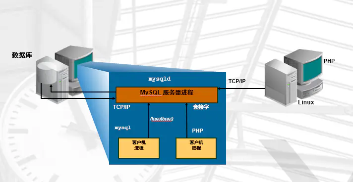
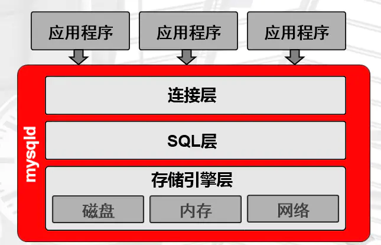
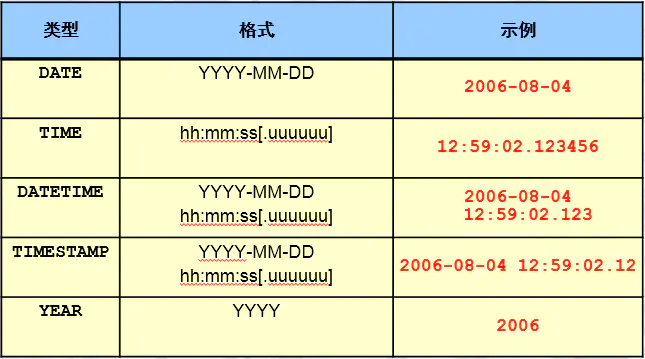

<!--
 * @Autor: 李逍遥
 * @Date: 2021-02-05 17:23:39
 * @LastEditors: 李逍遥
 * @LastEditTime: 2021-02-17 22:17:38
 * @Descriptiong: DBA的学习指南
-->

# DBA的成长之路 #

- [DBA的成长之路](#dba的成长之路)
  - [概念](#概念)
    - [数据库产品](#数据库产品)
    - [MySQL企业版GA选择](#mysql企业版ga选择)
  - [需要学习的内容](#需要学习的内容)
    - [1.MySQL 5.7 安装部署（二进制），编译自己的扩展](#1mysql-57-安装部署二进制编译自己的扩展)
    - [2.MySQL升级步骤扩展](#2mysql升级步骤扩展)
    - [3.MySQL 5.7 体系结构](#3mysql-57-体系结构)
    - [4.MySQL基础管理](#4mysql基础管理)
    - [5.基础SQL语句使用](#5基础sql语句使用)
    - [6.SQL高级应用](#6sql高级应用)
    - [7.Information_schema获取元数据](#7information_schema获取元数据)
    - [8.索引、执行计划管理（基础优化）](#8索引执行计划管理基础优化)
    - [9.存储引擎](#9存储引擎)
    - [10.日志管理](#10日志管理)
    - [11.备份与恢复](#11备份与恢复)
    - [12.主从复制及架构演变](#12主从复制及架构演变)
    - [13.传统的高可用及读写分离（MHA&Atlas）](#13传统的高可用及读写分离mhaatlas)
    - [14.传统分布式架构设计与实现-扩展（Mycat-->DBLE,DRDS）](#14传统分布式架构设计与实现-扩展mycat--dbledrds)
    - [15.MySQL 5.7 高可用及分布式架构-扩展（MGR,InnoDB Cluster）](#15mysql-57-高可用及分布式架构-扩展mgrinnodb-cluster)
    - [16.MySQL优化（安全，性能）](#16mysql优化安全性能)
    - [17.MySQL监控（zabbix,open-falcon）](#17mysql监控zabbixopen-falcon)
    - [18.RDS（阿里云）](#18rds阿里云)
  - [还需要学习的Nosql](#还需要学习的nosql)
    - [1.Redis](#1redis)
    - [2.MongoDB](#2mongodb)
  - [另外需要了解的关系型数据库](#另外需要了解的关系型数据库)
    - [1.Oracle](#1oracle)
    - [2.postgresql](#2postgresql)

## 概念 ##

  DBA —— 数据库管理员

>数据库的发展情况大概如下（目前还处在第二个阶段）：
>RDBMS(关系型数据库) --> NOSQL+RDBMS --> NOSQL(RDBMS),RDBMS(NOSQL) --> NewSQL

### 数据库产品 ###

- **RDBMS**
  Oracle,MySQL,PostgreSQL,SqlServer

- **NoSQL**
  MongoDB,Redis,Elasticsearch

- **NewSQL(特点是分布式)**
  TiDB,Spanner,PolarDB

### MySQL企业版GA选择 ###

- **大版本（主流）：5.6,5.7,8.0**
  各大版本中的主流版本  
  5.6 : 5.6.34 , 5.6.36 , 5.6.38(2017913) , 5.6.40  
  5.7 : 5.7.18 , 5.7.20(2017913) , 5.7.24
  8.0 : 8.0.14 , 8.0.15 , 8.0.16

## 需要学习的内容 ##

### 1.MySQL 5.7 安装部署（二进制），编译自己的扩展 ###

- **手动安装部署，以Linux通用版(generic)为例**

  - 下载并上传二进制文件或者直接使用 wget 命令下载，解压并移动到指定目录
    这里使用 `mysql-5.7.26-linux-glibc2.12-x86_64.tar.gz` 版本，命令如下：

    ```shell
    # 解压
    tar xf mysql-5.7.26-linux-glibc2.12-x86_64.tar.gz
    # 创建目录
    mkdir /application
    # 将MySQL文件移动并重命名
    mv mysql-5.7.26-linux-glibc2.12-x86_64 /application/mysql
    ```

  - 处理原始环境

    ```shell
    # 查看是否安装 mariadb
    rpm -qa|grep mariadb
    # 如果有，使用下面的命令卸载掉相关软件，否则会初始化失败
    rpm -e mariadb
    # 如果因为被依赖而无法卸载的话，可以使用以下命令进行卸载
    yum remove mariadb-libs-xxxx -y
    # 也可以加上 --nodeps 不检查依赖关系强制卸载
    rpm -e --nodeps mariadb
    ```

  - 配置环境变量

    ```shell
    # 配置环境变量
    vim /etc/profile
    # 在最后一行添加下面的代码
    export PATH=/application/mysql/bin:$PATH
    # 让配置生效
    source /etc/profile
    # 查看MySQL版本(确认环境变量是否生效)
    mysql -V
    ```

  - 挂载数据盘

    ```shell
    # 创建数据路径
    # 在虚拟机上可以添加一块新磁盘模拟数据盘
    # 查看磁盘情况
    fdisk -l
    # 可看到新加的虚拟硬盘，一般名为：Disk /dev/sdb
    # 格式化
    mkfs.xfs /dev/sdb
    # 创建目录
    mkdir /data
    # 挂载
    # 查看磁盘的UUID
    blkid
    # 在配置文件中将磁盘挂载到 data 目录下
    vim /etc/fstab
    # 添加以下代码
    UUID=xxxxxx-xxxx-xxxx-xxxx-xxxxxx /data xfs defaults 0 0
    # 自动挂载
    mount -a
    # 查看是否挂载成功
    df -h
    # 未挂载成功的话，也可以使用以下方法
    cd /sys/class/scsi_host
    echo "---" > host0/scan # 接口扫描新加磁盘
    ```

  - 创建用户并授权

    ```shell
    # 创建管理MySQL的用户（不需要有登录权限）
    useradd -s /sbin/nologin mysql
    # 授权
    mkdir /data/mysql/data -p
    chown -R mysql.mysql /application/*
    chown -R mysql.mysql /data
    ```

  - 初始化数据（创建系统数据）

    ```shell
    # 5.6的命令是：/application/mysql/scripts/mysql_install_db
    # 先进入MySQL安装目录
    cd /application/mysql/
    # 初始化
    mysqld --initialize --user=mysql --basedir=/application/mysql --datadir=/data/mysql/data
    # 如果初始化报错缺少 libaio 的话，需安装 libaio-devel
    yum install -y libaio-devel
    # 初始化后会生成一个临时密码，如下：
    #### ..... A temporary password is generated for root@localhost: xxxxxx
    ```

    >参数说明：
    >initialize
    >1.对密码复杂度进行定制，包含四种字符且达到12位；
    >2.给root@localhost 用户设置临时密码；
    >initialize-insecure : 无限制无临时密码，生产中往往使用该方式初始化。

  - 配置文件

    ```shell
    # 准备配置文件
    # 在 /etc/my.cnf 中写入以下项(最基本的配置项)
    cat >/etc/my.cnf <<EOF
    [mysqld]
    user=mysql
    basedir=/application/mysql
    datadir=/data/mysql/data
    socket=/tmp/mysql.sock
    server_id=6
    port=3306
    [mysql]
    socket=/tmp/mysql.sock
    EOF
    ```

  - 启动数据库
    1.使用 sys-v

    ```shell
    # 进入命令所在目录
    cd /application/mysql/support-files/
    # 启动
    ./mysql.server start

    # 还可以将 mysql.server 命令放到init.d中管理
    ## 将命令拷贝到 init.d
    cp /application/mysql/support-files/mysql.server /etc/init.d/mysqld
    ## 启动
    service mysqld start
    # 同 /etc/init.d/mysql start
    # 实际上是启动了 mysql.server 然后调用了 /application/mysql/bin/mysqld_safe(脚本)  然后启动了 mysqld

    # 以上还包括 start|stop|restart|status 等
    ```

    2.使用systemd管理MySQL服务（5.7的新特性）

    ```shell
    # 将MySQL服务加入systemd
    cat >/etc/systemd/system/mysqld.service <<EOF
    [Unit]
    Description=MySQL Server
    Documentation=man:mysqld(7)
    Documentation=http://dev.mysql.com/doc/refman/en/using-systemd.html
    After=network.target
    After=syslog.target
    [Install]
    WantedBy=multi-user.target
    [Service]
    User=mysql
    Group=mysql
    ExecStart=/application/mysql/bin/mysqld --defaults-file=/etc/my.cnf
    LimitNOFILE = 5000
    EOF

    # 启动
    systemctl start mysqld

    # 设置开机启动
    systemctl enable mysqld

    ## 判断服务是否启动
    netstat -lnp|grep mysqld
    netstat -lnp|grep 3306
    ps -ef |grep mysqld
    systemctl status mysqld
    ss -tulpn|grep mysqld
    ss -tulpn|grep 3306
    lsof -i :3306
    ```

- **分析处理MySQL数据库无法启动的问题**
  例如：类似 `without updating PID file` 的错误；
  如果控制台上的报错信息没有其他具体信息的话，需要查看日志，日志位置在 `/data/mysql/data/主机名.err`,找 [error] 项的上下文进行分析；
  **可能的原因：**
  a.配置文件 `/etc/my.cnf` 路径不对；
  b. `/tmp/mysql.sock` 文件被修改或者删除；
  c.数据目录未给mysql用户权限；
  d.配置文件 `/etc/my.cnf` 参数错误；

******

- **管理员密码管理（root@localhost）**
  - 设置/修改密码

    ```shell
    # 该命令需要输入旧密码，有则输入无则跳过
    mysqladmin -uroot -p password newpassword
    ```

  - 找回管理员密码
    1.先关闭数据库

    ```shel
    systemctl stop mysqld
    ```

    2.使用维护模式启动数据库

    ```shell
    mysqld_safe --skip-grant-tables --skip-networking &
    ```

    3.登录并修改密码

    ```shell
    # 登录MySQL
    mysql
    # 修改密码
    alter user root@'localhost' indentified by 'pwd';
    # 上面的命令会失败，刷新后再修改就成功了
    flush privileges;
    ```

    4.关闭数据库，正常启动，就可以使用新密码登录了

    ```shell
    kill mysqld
    systemctl start mysqld
    ```

### 2.MySQL升级步骤扩展 ###

### 3.MySQL 5.7 体系结构 ###

- **MySQL C/S结构介绍**

  

  两种连接方法：网络连接串和套接字文件

  ```shell
  #TCP/IP方式（远程、本地）：
  mysql -uroot -p -h xx.x.x.xx -P3306
  #Socket方式(仅本地)：
  mysql -uroot -p -S /tmp/mysql.sock # -S可省略
  ```

- **MySQL实例的构成**
  实例：mysqld守护进程 + master thread + task thread + 预分配内存。

- **MySQL中myslqd服务的结构**

  

  - **连接层**
    - 1.提供连接协议：Socket和TCP/IP
    - 2.提供验证：用户、密码，IP，SOCKET
    - 3.派生一个专用的线程（接收SQL，返回结果），使用`show processlist;` 命令可查看连接的线程

    >思考：
    >使用维护模式找回密码时，启动命令使用了以下参数分别是什么意思？
    >--skip-grant-tables : 不启动用户密码验证
    >--skip-networking : 不启用TCP/IP连接

  - **SQL层（在SQL优化方面至关重要）**
    - 1.接收上层传递的SQL语句
    - 2.语法验证模块：验证语句语法，是否满足SQL_MODE
    - 3.语义检查：判断语句的类型（DDL,DML等）
    - 4.权限检查：用户对库表的权限
    - 5.解析器：对语句执行前,进行预处理，生成解析树(执行计划)，即生成多种执行方案
    - 6.优化器：根据解析器得出的多种执行计划，进行判断，选择最优的执行计划（代价最低的，5.7以后是代价模型）
        代价模型：资源（CPU  IO  MEM）的损耗评估性能好坏。
    - 7.执行器：根据最有执行计划执行SQL语句，产生结果（在磁盘的哪个位置上）
    - 8.提供查询缓存（默认是没开启的），会使用redis tair替代查询缓存功能
    - 9.提供日志记录（具体见日志管理章节）：binlog，默认是没开启的

  - **存储引擎层**
    真正和磁盘打交道的层次，类似Linux中的文件系统。
    根据SQL层提供的地址从磁盘上拿到数据，返回给SQL，结构化成表，再通过连接层返回给用户。

- **逻辑结构**

  

- **物理结构**

  

  *面试题：*
  说明MyISAM和InnoDB在存储方式上的异同？

  - **微观结构**

    页（page）：最小的存储（IO）单元，默认16k
    区：64个（默认）连续的页，共1M
    段：一个表就是一个段，包含一个或多个区
    总结：一个表就是一个段（分区表除外），MySQL分配空间时至少分配一个区，每个区默认是1M（64个页），MySQL最小的IO单元是page（16K）。

### 4.MySQL基础管理 ###

- **用户管理**
  - **作用**
    登录数据库
    管理数据库对象

  - **定义**
    用户名@'白名单'。
    白名单：IP地址。
    例如：
    root@'10.0.0.51'
    root@'10.0.0.%'
    root@'10.0.0.5%'
    root@'10.0.0.0/255.255.254.0'
    root@'%'
    root@'xxx.com'
    root@'localhost'
    root@'db01'

    最常用的是以下四种：
    root@'10.0.0.%'
    root@'10.0.0.5%'
    root@'10.0.0.0/255.255.254.0'
    root@'localhost'

  - **操作**
    创建用户

    ```sql
    create user lee@'10.0.0.%' identified by 'pwd';
    ```

    查询用户

    ```sql
    # 查看user表的结构
    desc mysql.user;
    # 查看user表
    select user,host,authentication_string from mysql.user;
    ```

    删除用户

    ```sql
    drop user lee@'10.0.0.%';
    ```

    修改用户

    ```sql
    alter user lee@'10.0.0.%' identified by 'pwd';
    ```

- **权限管理**
  - **权限的作用**
    控制用户登陆之后能对MySQL对象做哪些命令。
  - **权限定义**
    mysql的权限定义就是SQL语句。

    ```sql
    ALL:
    SELECT,INSERT, UPDATE, DELETE, CREATE, DROP, RELOAD, SHUTDOWN, PROCESS, FILE, REFERENCES, INDEX, ALTER, SHOW DATABASES, SUPER, CREATE TEMPORARY TABLES, LOCK TABLES, EXECUTE, REPLICATION SLAVE, REPLICATION CLIENT, CREATE VIEW, SHOW VIEW, CREATE ROUTINE, ALTER ROUTINE, CREATE USER, EVENT, TRIGGER, CREATE TABLESPACE
    ALL : 以上所有权限，一般是普通管理员拥有的
    with grant option：超级管理员才具备的，给别的用户授权的功能
    ```

    **8.0版本新特性**（了解）
    加入了角色的概念。

  - **授权**

    ```sql
    # 示例
    grant  ALL on wordpress.* to wordpress@'10.0.0.%' identified by '123456';
    # 解析
    grant 权限(insert,update,...) on 范围(库) to 用户 indentified by '密码';

    # 范围
    # *.*                  ---->所有的库所有表
    # wordpress.*          ---->库里的所有表
    # wordpress.t1         ---->指定表
    ```

  - **查看用户权限**

    ```sql
    # 普通用户
    mysql> show grants for lee@'%';
    +---------------------------------+
    | Grants for lee@%                |
    +---------------------------------+
    | GRANT USAGE ON *.* TO 'lee'@'%' |
    +---------------------------------+
    1 row in set (0.00 sec)
    # 超级管理员
    mysql> show grants for root@'localhost';
    +---------------------------------------------------------------------+
    | Grants for root@localhost                                           |
    +---------------------------------------------------------------------+
    | GRANT ALL PRIVILEGES ON *.* TO 'root'@'localhost' WITH GRANT OPTION |
    | GRANT PROXY ON ''@'' TO 'root'@'localhost' WITH GRANT OPTION        |
    +---------------------------------------------------------------------+
    2 rows in set (0.00 sec)

    # USAGE 表示空权限，只能连接数据库，不能做任何操作；
    # ALL PRIVILEGES 表示拥有所有权限，是管理员
    # WITH GRANT OPTION 超级管理员
    ```

  - **回收用户权限**
    >重复（重新）授权会导致权限叠加，不会减少权限，想要减少权限只能通过回收授权；

    ```sql
    revoke delete on *.* from 'lee'@'%';
    ```

    **面试题：**
    1.开发人员找DBA开用户，需要DBA和开发人员沟通什么？
      a.你要做哪些操作（确定权限）；
      b.你会从什么地址来连接数据库（确定ip地址或者网段）；
      c.要对什么对象（库表）进行操作；

    2.开发人员找DBA要管理员的root用户密码，作为DBA你怎么处理？
      a.一般公司，走正规流程；
      b.金融公司严令禁止私自向DBA索要，如有私自索要按规定举报；
      c.小公司root用户会滥用，学会保护自己，可以提意见制定流程；

- **连接管理**
  - 自带客户端命令
    常用的命令：

    ```shell
    -u                   用户
    -p                   密码
    -h                   IP
    -P                   端口
    -S                   socket文件
    -e                   免交互执行命令
    <                    导入SQL脚本

    [root@db01 ~]# mysql -uroot -p -h 10.0.0.51 -P3306
    Enter password:
    mysql> select @@socket;
    +-----------------+
    | @@socket        |
    +-----------------+
    | /tmp/mysql.sock |
    
    # 管理员最常用的连接方式，一般省略 -S
    [root@db01 ~]# mysql -uroot -p -S /tmp/mysql.sock
    Enter password:
    # 查看连接方式
    mysql> show processlist;
    +----+------+-----------+------+---------+------+----------+------------------+
    | Id | User | Host      | db   | Command | Time | State    | Info             |
    +----+------+-----------+------+---------+------+----------+------------------+
    |  2 | root | localhost | NULL | Query   |    0 | starting | show processlist |
    +----+------+-----------+------+---------+------+----------+------------------+
    1 row in set (0.00 sec)
    
    # 免交互执行命令
    [root@db01 ~]# mysql -uroot -p -e "select user,host from mysql.user;"
    Enter password:
    +---------------+-----------+
    | user          | host      |
    +---------------+-----------+
    | abc          | 10.0.0.%  |
    | app          | 10.0.0.%  |
    | root          | 10.0.0.%  |
    | mysql.session | localhost |
    | mysql.sys    | localhost |
    | root          | localhost |
    +---------------+-----------+
    
    # 执行sql脚本
    [root@db01 ~]# mysql -uroot -p <world.sql
    Enter password:
    [root@db01 ~]#
    ```

    **问题：**
    怎么证明你的数据库是可用的？
    1.证明进程和端口是存在的；

    ```shell
    # 查看mysqld进程
    ps -ef | grep mysqld
    # 查看端口
    netstat -lnp|grep [3306|mysqld]
    ```

    2.验证用户远程可以连接，使用命令 `mysql -uxxx -p -hxxxx`

  - 远程客户端工具
    SQLyog,MySQL Workbanch,Navicat等

- **启动和关闭**
  - 辅助脚本方式（普通的启动关闭）：
    sys-v   : /etc/init.d/mysqld
    systemd : /etc/systemd/system/mysqld.service

    >**不建议以sys-v方式启动**，其是安全模式，mysqld服务异常关闭后mysqld_safe会自动启动mysqld，但MySQL启动过程会做数据回滚，所以建议先做数据备份再启动。

  - 维护性的启动方式：
    可以定制一些参数
    1./application/mysql/bin/mysqld_safe --skip-grant-tableds --skip-networking &
    2./application/mysql/bin/mysqld &

- **初始化配置**
  - 预编译时进行设置（略）
    只能在编译安装中实现，硬编码配置到程序中。
  - 初始化配置文件(my.cnf)
    - 初始化文件默认读取位置
      读取顺序如下，如果这些位置都有配置文件，以最后一个为准（后面的配置覆盖前面的配置）

      ```shell
      # 使用命令查看 my.cnf 的读取顺序
      mysqld --help --verbose | grep "my.cnf"
      /etc/my.cnf /etc/mysql/my.cnf /usr/local/mysql/etc/my.cnf ~/.my.cnf
      ```

      也可以使用参数 `--defaults-file=/opt/my.cnf` 指定读取配置文件（使用mysqld_safe/mysqld 启动时）；

  - 命令行模式（启动时用参数指定配置信息）
  - 初始化配置文件的应用
    - 作用
      影响到数据库的启动：mysqld mysqld_safe
      影响到客户端的连接：mysql mysqldump mysqladmin
    - 书写格式

      ```cnf
      [标签]
      配置项=xxxx

      标签类型：服务端、客户端
      服务器端标签：
      [mysqld]
      [mysqld_safe]
      [server]

      客户端标签：
      [mysql]
      [mysqldump]
      [client]

      配置文件的示例：
      [mysqld]
      user=mysql
      basedir=/application/mysql
      datadir=/data/mysql/data
      socket=/tmp/mysql.sock
      server_id=6
      port=3306
      log_error=/data/mysql/mysql.log
      [mysql]
      socket=/tmp/mysql.sock
      prompt=Master [\\d]>
      ```

    - 常用配置项（通用模板）

      ```cnf
      [mysqld]
      user=mysql
      basedir=/application/mysql
      datadir=/data/mysql/data
      socket=/tmp/mysql.sock
      # server_id 大于1 主从集群时必须设置且不同
      server_id=6
      port=3306
      log_error=/data/mysql/mysql.log
      # 二进制日志位置+文件名的前缀（mysql-bin）
      log_bin=/data/mysql/data/mysql-bin
      [mysql]
      socket=/tmp/mysql.sock
      ```

- **MySQL多实例**
  - 准备多个目录

    ```shell
    mkdir -p /data/330{7,8,9}/data
    ```

  - 准备配置文件

    ```shell
    cat > /data/3307/my.cnf <<EOF
    [mysqld]
    basedir=/application/mysql
    datadir=/data/3307/data
    socket=/data/3307/mysql.sock
    log_error=/data/3307/mysql.log
    port=3307
    server_id=7
    log_bin=/data/3307/mysql-bin
    EOF

    cat > /data/3308/my.cnf <<EOF
    [mysqld]
    basedir=/application/mysql
    datadir=/data/3308/data
    socket=/data/3308/mysql.sock
    log_error=/data/3308/mysql.log
    port=3308
    server_id=8
    log_bin=/data/3308/mysql-bin
    EOF

    cat > /data/3309/my.cnf <<EOF
    [mysqld]
    basedir=/application/mysql
    datadir=/data/3309/data
    socket=/data/3309/mysql.sock
    log_error=/data/3309/mysql.log
    port=3309
    server_id=9
    log_bin=/data/3309/mysql-bin
    EOF
    ```

  - 初始化三套数据

    ```shell
    mv /etc/my.cnf /etc/my.cnf.bak
    mysqld --initialize-insecure  --user=mysql --datadir=/data/3307/data --basedir=/app/mysql
    mysqld --initialize-insecure  --user=mysql --datadir=/data/3308/data --basedir=/app/mysql
    mysqld --initialize-insecure  --user=mysql --datadir=/data/3309/data --basedir=/app/mysql
    ```

  - systemd管理多实例

    ```shell
    # 定制不同的启动脚本
    cd /etc/systemd/system
    cp mysqld.service mysqld3307.service
    cp mysqld.service mysqld3308.service
    cp mysqld.service mysqld3309.service

    # 分别修改配置文件
    vim mysqld3307.service
    ExecStart=/application/mysql/bin/mysqld  --defaults-file=/data/3307/my.cnf
    vim mysqld3308.service
    ExecStart=/application/mysql/bin/mysqld  --defaults-file=/data/3308/my.cnf
    vim mysqld3309.service
    ExecStart=/application/mysql/bin/mysqld  --defaults-file=/data/3309/my.cnf
    ```

  - 授权

    ```shell
    chown -R mysql.mysql /data/*
    ```

  - 启动

    ```shell
    systemctl start mysqld3307.service
    systemctl start mysqld3308.service
    systemctl start mysqld3309.service
    ```

  - 验证多实例

    ```shell
    netstat -lnp|grep 330
    # sql语句验证
    mysql -S /data/3307/mysql.sock -e "select @@server_id"
    mysql -S /data/3308/mysql.sock -e "select @@server_id"
    mysql -S /data/3309/mysql.sock -e "select @@server_id"
    ```

### 5.基础SQL语句使用 ###

- 介绍
  结构化查询语言(Structured Query Language)，主要分为4大类：
  数据查询语言（DQL:Data Query Language）
  数据操作语言（DML:Data Manipulation Language）
  数据控制语言（DCL:Data Control Language）
  数据定义语言（DDL:Data Definition Language）
  >多数时候 DQL也会归为DML。

  SQL标准：到目前为止，SQL共推出四代标准，分别是SQL-89、SQL-92、SQL-99、SQL-2003。
  MySQL从5.7版本开始，加入了SQL_Mode 严格模式，开始遵守SQL标准。

  >关于SQL标准的详细情况，参照：
  <https://my.oschina.net/goopand/blog/393628>
  <https://www.ripjava.com/article/1370280574320672>

- 数据类型
  控制数据的规范性，让数据具有具体含义，在离殇进行控制。

  - 字符型
    常用的：
    char(n):定长（固定存储空间），最多为255个字符。
    varchar(n):可变长（按需分配存储空间），最多为65535个字符，推荐最长设为255（会单独占用一个字符来记录字符串长度，超过255后需要两个字节记录字符串长度）。
    enum('bj','tj','sh')：枚举类型，比较适合于取值范围固定的列，可以很大程度的优化索引结构（**禁存数字**，容易与索引产生错乱）。

    

  - 数值型
    常用的：
    tinyint : 不需要知道长度；
    int : 不需要知道长度，注意，最多存10位数字（比如不能用来存手机号）；
    bigint : 不需要知道长度；

    

  - 时间类型
    常用的：
    date
    datetime : 范围为从 1000-01-01 00:00:00.000000 至 9999-12-31 23:59:59.999999。
    timestamp : 范围为从 1970-01-01 00:00:00.000000 至 2038-01-19 03:14:07.999999 且会受到时区的影响。

    

  - 二进制类型

    

  **面试题：**
  1.char he varchar的区别？
    1) 255    65535
    2) 定长   变长 （由于需要计算字符串长度，在同样长度字符串插入的情况下varchar稍有劣势）

  2.char 和 varchar 如何选择？
    1) char类型：固定长度的字符串列，比如手机号、身份证号、银行卡号等；
    2) varchar: 不确定长度的字符串；
    3) abc

  3.为什么不尽量使用char？会影响到索引的高度？

- 表属性
  - 存储引擎（engine）
    MyISAM(5.7以前常用),InnoDB
  - 字符集和字符序(charset/character set,collation)
    字符集最好使用 utf8mb4(真正的Unicode编码)
    字符序也叫排序规则或者校对规则，主要针对英文字符大小写问题。

- 列属性和约束
  常用的：
  **主键** primary key (PK) 唯一非空，尽量是数字列、整数列、无关列、自增的。聚集索引？是一种约束，也是一种索引类型，在一个表中只能有一个主键（可以由多个列构成）。
  **自增** auto_increment 针对数字列自动生成顺序值（可设置增长间隔），往往与主键成对出现。
  **非空** not null 必填项（建议，对于普通列尽量设置为非空，利于索引应用）。
  **默认值** default 数字列使用0，字符串使用nul/null，往往与非空配合使用。
  **唯一** unique 不能重复。
  **无符号** unsigned 针对数字列（必须为正数）
  **注释** comment

- SQL语句应用
  - DDL
    - 库：建、改、删（生成中禁止删操作）
    - 表：建、改、删
    - 建库表规范
      1.库名表名使用小写字母；（开发中中环境混乱，与生成平台不同，容易混用大小写导致问题）
      2.不能以数字和下划线开头；
      3.不能使用保留字；
      4.与业务相关；

>以上，不熟悉的可以查看官方文档，例如 `help create database`
>详情见MySQL/使用笔记.md

### 6.SQL高级应用 ###

### 7.Information_schema获取元数据 ###

### 8.索引、执行计划管理（基础优化） ###

### 9.存储引擎 ###

### 10.日志管理 ###

### 11.备份与恢复 ###

### 12.主从复制及架构演变 ###

### 13.传统的高可用及读写分离（MHA&Atlas） ###

### 14.传统分布式架构设计与实现-扩展（Mycat-->DBLE,DRDS） ###

### 15.MySQL 5.7 高可用及分布式架构-扩展（MGR,InnoDB Cluster） ###

### 16.MySQL优化（安全，性能） ###

### 17.MySQL监控（zabbix,open-falcon） ###

### 18.RDS（阿里云） ###

## 还需要学习的Nosql ##

### 1.Redis ###

### 2.MongoDB ###

## 另外需要了解的关系型数据库 ##

### 1.Oracle ###

### 2.postgresql ###
