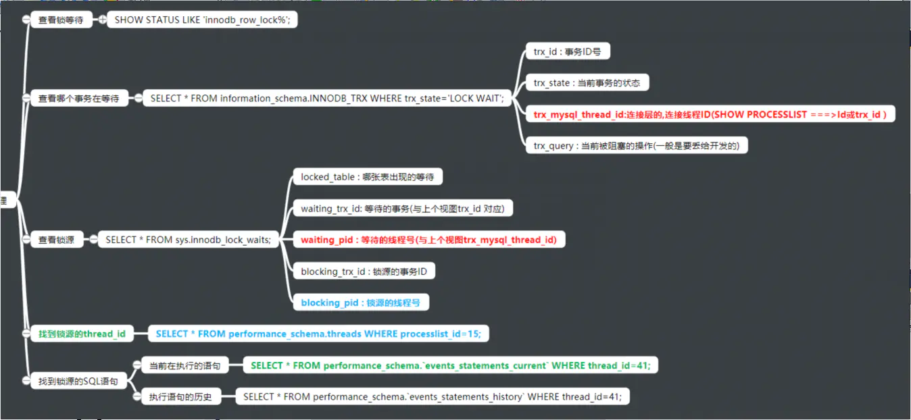

<!--
 * @Autor: 李逍遥
 * @Date: 2021-02-05 17:23:39
 * @LastEditors: 李逍遥
 * @LastEditTime: 2021-03-09 14:09:26
 * @Descriptiong: DBA的学习指南
-->

# 目录 #

- [目录](#目录)
- [概念](#概念)
  - [数据库产品](#数据库产品)
  - [MySQL企业版GA选择](#mysql企业版ga选择)
    - [大版本（主流）：5.6,5.7,8.0](#大版本主流565780)
- [需要学习的内容](#需要学习的内容)
  - [1.MySQL 5.7 安装部署（二进制），编译自己的扩展](#1mysql-57-安装部署二进制编译自己的扩展)
    - [手动安装部署，以Linux通用版(generic)为例](#手动安装部署以linux通用版generic为例)
    - [分析处理MySQL数据库无法启动的问题](#分析处理mysql数据库无法启动的问题)
    - [管理员密码管理（root@localhost）](#管理员密码管理rootlocalhost)
  - [2.MySQL升级步骤扩展](#2mysql升级步骤扩展)
  - [3.MySQL 5.7 体系结构](#3mysql-57-体系结构)
    - [MySQL C/S结构介绍](#mysql-cs结构介绍)
    - [MySQL实例的构成](#mysql实例的构成)
    - [MySQL中myslqd服务的结构](#mysql中myslqd服务的结构)
    - [逻辑结构](#逻辑结构)
    - [物理结构](#物理结构)
  - [4.MySQL基础管理](#4mysql基础管理)
    - [用户管理](#用户管理)
    - [权限管理](#权限管理)
    - [连接管理](#连接管理)
    - [启动和关闭](#启动和关闭)
    - [初始化配置](#初始化配置)
    - [MySQL多实例](#mysql多实例)
  - [5.基础SQL语句使用](#5基础sql语句使用)
    - [介绍](#介绍)
    - [数据类型](#数据类型)
    - [列属性和约束](#列属性和约束)
    - [SQL语句应用](#sql语句应用)
  - [6.SQL高级应用](#6sql高级应用)
  - [7.Information_schema获取元数据](#7information_schema获取元数据)
  - [8.索引](#8索引)
    - [测试环境准备](#测试环境准备)
    - [索引的作用](#索引的作用)
    - [索引的种类（算法）](#索引的种类算法)
    - [B+树](#b树)
    - [索引在功能上的分类](#索引在功能上的分类)
    - [辅助索引细分](#辅助索引细分)
    - [索引树的高度受什么影响？](#索引树的高度受什么影响)
    - [索引的管理操作](#索引的管理操作)
    - [面试问题：简单说明InnoDB聚集索引与辅助索引的区别](#面试问题简单说明innodb聚集索引与辅助索引的区别)
  - [9.执行计划管理（基础优化）](#9执行计划管理基础优化)
    - [作用](#作用)
    - [执行计划获取](#执行计划获取)
    - [执行计划分析](#执行计划分析)
    - [面试题：explain(desc)使用场景](#面试题explaindesc使用场景)
    - [索引应用规范](#索引应用规范)
    - [不走索引的情况（开发规范）](#不走索引的情况开发规范)
  - [10.存储引擎](#10存储引擎)
    - [InnoDB引擎介绍](#innodb引擎介绍)
    - [引擎种类](#引擎种类)
    - [InnoDB存储引擎的核心特性](#innodb存储引擎的核心特性)
    - [存储引擎相关操作](#存储引擎相关操作)
    - [InnoDB存储引擎物理存储结构](#innodb存储引擎物理存储结构)
    - [InnoDB事务的ACID特性](#innodb事务的acid特性)
    - [InnoDB 事务的ACID如何保证](#innodb-事务的acid如何保证)
    - [事务的隔离级别](#事务的隔离级别)
    - [InnoDB核心参数](#innodb核心参数)
  - [11.日志管理](#11日志管理)
    - [排错](#排错)
    - [数据恢复](#数据恢复)
    - [优化](#优化)
  - [12.备份与恢复](#12备份与恢复)
    - [DBA在数据库备份恢复方面的职责](#dba在数据库备份恢复方面的职责)
    - [备份类型](#备份类型)
    - [备份方式及工具介绍](#备份方式及工具介绍)
    - [逻辑备份和物理备份的比较](#逻辑备份和物理备份的比较)
    - [备份策略](#备份策略)
    - [逻辑备份工具-mysqldump](#逻辑备份工具-mysqldump)
    - [备份恢复案例1(mysqldump+binlog)](#备份恢复案例1mysqldumpbinlog)
    - [XBK(xtrabackup)的应用](#xbkxtrabackup的应用)
    - [备份恢复案例2(XBK full_inc_binlog)](#备份恢复案例2xbk-full_inc_binlog)
    - [MySQL数据迁移](#mysql数据迁移)
  - [13.主从复制及架构演变](#13主从复制及架构演变)
    - [主从复制简介](#主从复制简介)
    - [搭建主从复制](#搭建主从复制)
    - [主从复制工作过程](#主从复制工作过程)
    - [主从复制监控及故障处理](#主从复制监控及故障处理)
    - [延时从库](#延时从库)
    - [过滤复制](#过滤复制)
    - [半同步复制-了解](#半同步复制-了解)
    - [GTID复制](#gtid复制)
  - [14.传统的高可用及读写分离（MHA&Atlas）](#14传统的高可用及读写分离mhaatlas)
    - [高可用MHA](#高可用mha)
    - [主从复制架构演变](#主从复制架构演变)
    - [MHA架构模型](#mha架构模型)
    - [MHA工作过程](#mha工作过程)
    - [MHA故障模拟及处理](#mha故障模拟及处理)
    - [MHA的vip功能](#mha的vip功能)
    - [MHA的邮件提醒](#mha的邮件提醒)
    - [Binlog Server](#binlog-server)
    - [MySQL读写分离Atlas](#mysql读写分离atlas)
    - [Atlas基本管理](#atlas基本管理)
    - [其他读写分离产品扩展](#其他读写分离产品扩展)
  - [15.传统分布式架构设计与实现-扩展（Mycat-->DBLE,DRDS）](#15传统分布式架构设计与实现-扩展mycat--dbledrds)
    - [MyCAT基础架构图](#mycat基础架构图)
    - [MyCAT基础架构准备](#mycat基础架构准备)
    - [MySQL分布式架构介绍](#mysql分布式架构介绍)
    - [MyCAT安装和配置](#mycat安装和配置)
    - [MyCAT核心特性-分片(水平拆分)](#mycat核心特性-分片水平拆分)
  - [16.MySQL 5.7 高可用及分布式架构-扩展（MGR,InnoDB Cluster）](#16mysql-57-高可用及分布式架构-扩展mgrinnodb-cluster)
  - [17.MySQL优化（安全，性能）](#17mysql优化安全性能)
    - [优化哲学](#优化哲学)
    - [优化工具的使用](#优化工具的使用)
    - [优化思路分解](#优化思路分解)
    - [优化细节](#优化细节)
    - [锁](#锁)
    - [锁的监控及处理](#锁的监控及处理)
    - [主从优化](#主从优化)
  - [18.MySQL监控（zabbix,open-falcon）](#18mysql监控zabbixopen-falcon)
  - [19.RDS（阿里云）](#19rds阿里云)
- [还需要学习的Nosql](#还需要学习的nosql)
  - [1.Redis](#1redis)
    - [Redis简介](#redis简介)
    - [NoSQL 产品(key-value)](#nosql-产品key-value)
    - [Redis功能介绍](#redis功能介绍)
  - [2.MongoDB](#2mongodb)
- [另外需要了解的关系型数据库](#另外需要了解的关系型数据库)
  - [1.Oracle](#1oracle)
  - [2.postgresql](#2postgresql)

# 概念 #

  DBA —— 数据库管理员

>数据库的发展情况大概如下（目前还处在第二个阶段）：
>RDBMS(关系型数据库) --> NOSQL+RDBMS --> NOSQL(RDBMS),RDBMS(NOSQL) --> NewSQL

## 数据库产品 ##

- **RDBMS**
  Oracle,MySQL,PostgreSQL,SqlServer

- **NoSQL**
  MongoDB,Redis,Elasticsearch

- **NewSQL(特点是分布式)**
  TiDB,Spanner,PolarDB

## MySQL企业版GA选择 ##

### 大版本（主流）：5.6,5.7,8.0 ###

各大版本中的主流版本  
5.6 : 5.6.34 , 5.6.36 , 5.6.38(2017913) , 5.6.40  
5.7 : 5.7.18 , 5.7.20(2017913) , 5.7.24  
8.0 : 8.0.14 , 8.0.15 , 8.0.16  

# 需要学习的内容 #

## 1.MySQL 5.7 安装部署（二进制），编译自己的扩展 ##

### 手动安装部署，以Linux通用版(generic)为例 ###

- 下载并上传二进制文件或者直接使用 wget 命令下载，解压并移动到指定目录
  这里使用 `mysql-5.7.26-linux-glibc2.12-x86_64.tar.gz` 版本，命令如下：

  ```shell
  # 解压
  tar xf mysql-5.7.26-linux-glibc2.12-x86_64.tar.gz
  # 创建目录
  mkdir /application
  # 将MySQL文件移动并重命名
  mv mysql-5.7.26-linux-glibc2.12-x86_64 /application/mysql
  ```

- 处理原始环境

  ```shell
  # 查看是否安装 mariadb
  rpm -qa|grep mariadb
  # 如果有，使用下面的命令卸载掉相关软件，否则会初始化失败
  rpm -e mariadb
  # 如果因为被依赖而无法卸载的话，可以使用以下命令进行卸载
  yum remove mariadb-libs-xxxx -y
  # 也可以加上 --nodeps 不检查依赖关系强制卸载
  rpm -e --nodeps mariadb
  ```

- 配置环境变量

  ```shell
  # 配置环境变量
  vim /etc/profile
  # 在最后一行添加下面的代码
  export PATH=/application/mysql/bin:$PATH
  # 让配置生效
  source /etc/profile
  # 查看MySQL版本(确认环境变量是否生效)
  mysql -V
  ```

- 挂载数据盘

  ```shell
  # 创建数据路径
  # 在虚拟机上可以添加一块新磁盘模拟数据盘
  # 查看磁盘情况
  fdisk -l
  # 可看到新加的虚拟硬盘，一般名为：Disk /dev/sdb
  # 格式化
  mkfs.xfs /dev/sdb
  # 创建目录
  mkdir /data
  # 挂载
  # 查看磁盘的UUID
  blkid
  # 在配置文件中将磁盘挂载到 data 目录下
  vim /etc/fstab
  # 添加以下代码
  UUID=xxxxxx-xxxx-xxxx-xxxx-xxxxxx /data xfs defaults 0 0
  # 自动挂载
  mount -a
  # 查看是否挂载成功
  df -h
  # 未挂载成功的话，也可以使用以下方法
  cd /sys/class/scsi_host
  echo "---" > host0/scan # 接口扫描新加磁盘
  ```

- 创建用户并授权

  ```shell
  # 创建管理MySQL的用户（不需要有登录权限）
  useradd -s /sbin/nologin mysql
  # 授权
  mkdir /data/mysql/data -p
  chown -R mysql.mysql /application/*
  chown -R mysql.mysql /data
  ```

- 初始化数据（创建系统数据）

  ```shell
  # 5.6的命令是：/application/mysql/scripts/mysql_install_db
  # 先进入MySQL安装目录
  cd /application/mysql/
  # 初始化
  mysqld --initialize --user=mysql --basedir=/application/mysql --datadir=/data/mysql/data
  # 如果初始化报错缺少 libaio 的话，需安装 libaio-devel
  yum install -y libaio-devel
  # 初始化后会生成一个临时密码，如下：
  #### ..... A temporary password is generated for root@localhost: xxxxxx
  ```

  >参数说明：
  >initialize
  >1.对密码复杂度进行定制，包含四种字符且达到12位；
  >2.给root@localhost 用户设置临时密码；
  >initialize-insecure : 无限制无临时密码，生产中往往使用该方式初始化。

- 配置文件

  ```shell
  # 准备配置文件
  # 在 /etc/my.cnf 中写入以下项(最基本的配置项)
  cat >/etc/my.cnf <<EOF
  [mysqld]
  user=mysql
  basedir=/application/mysql
  datadir=/data/mysql/data
  socket=/tmp/mysql.sock
  server_id=6
  port=3306
  [mysql]
  socket=/tmp/mysql.sock
  EOF
  ```

- 启动数据库
  1.使用 sys-v

  ```shell
  # 进入命令所在目录
  cd /application/mysql/support-files/
  # 启动
  ./mysql.server start

  # 还可以将 mysql.server 命令放到init.d中管理
  ## 将命令拷贝到 init.d
  cp /application/mysql/support-files/mysql.server /etc/init.d/mysqld
  ## 启动
  service mysqld start
  # 同 /etc/init.d/mysql start
  # 实际上是启动了 mysql.server 然后调用了 /application/mysql/bin/mysqld_safe(脚本)  然后启动了 mysqld

  # 以上还包括 start|stop|restart|status 等
  ```

  2.使用systemd管理MySQL服务（5.7的新特性）

  ```shell
  # 将MySQL服务加入systemd
  cat >/etc/systemd/system/mysqld.service <<EOF
  [Unit]
  Description=MySQL Server
  Documentation=man:mysqld(7)
  Documentation=http://dev.mysql.com/doc/refman/en/using-systemd.html
  After=network.target
  After=syslog.target
  [Install]
  WantedBy=multi-user.target
  [Service]
  User=mysql
  Group=mysql
  ExecStart=/application/mysql/bin/mysqld --defaults-file=/etc/my.cnf
  LimitNOFILE = 5000
  EOF

  # 启动
  systemctl start mysqld

  # 设置开机启动
  systemctl enable mysqld

  ## 判断服务是否启动
  netstat -lnp|grep mysqld
  netstat -lnp|grep 3306
  ps -ef |grep mysqld
  systemctl status mysqld
  ss -tulpn|grep mysqld
  ss -tulpn|grep 3306
  lsof -i :3306
  ```

### 分析处理MySQL数据库无法启动的问题 ###

例如：类似 `without updating PID file` 的错误；  
如果控制台上的报错信息没有其他具体信息的话，需要查看日志，日志位置在 `/data/mysql/data/主机名.err`,找 [error] 项的上下文进行分析；  
**可能的原因：**  
a.配置文件 `/etc/my.cnf` 路径不对；  
b. `/tmp/mysql.sock` 文件被修改或者删除；  
c.数据目录未给mysql用户权限；  
d.配置文件 `/etc/my.cnf` 参数错误；  

### 管理员密码管理（root@localhost） ###

- 设置/修改密码

  ```shell
  # 该命令需要输入旧密码，有则输入无则跳过
  mysqladmin -uroot -p password newpassword
  ```

- 找回管理员密码
  1.先关闭数据库

  ```shel
  systemctl stop mysqld
  ```

  2.使用维护模式启动数据库

  ```shell
  mysqld_safe --skip-grant-tables --skip-networking &
  ```

  3.登录并修改密码

  ```shell
  # 登录MySQL
  mysql
  # 修改密码
  alter user root@'localhost' indentified by 'pwd';
  # 上面的命令会失败，刷新后再修改就成功了
  flush privileges;
  ```

  4.关闭数据库，正常启动，就可以使用新密码登录了

  ```shell
  kill mysqld
  systemctl start mysqld
  ```

## 2.MySQL升级步骤扩展 ##

## 3.MySQL 5.7 体系结构 ##

### MySQL C/S结构介绍 ###


两种连接方法：网络连接串和套接字文件

```shell
#TCP/IP方式（远程、本地）：
mysql -uroot -p -h xx.x.x.xx -P3306
#Socket方式(仅本地)：
mysql -uroot -p -S /tmp/mysql.sock # -S可省略
```

### MySQL实例的构成 ###

实例：mysqld守护进程 + master thread + task thread + 预分配内存。  

### MySQL中myslqd服务的结构 ###


- **连接层**  
  - 1.提供连接协议：Socket和TCP/IP  
  - 2.提供验证：用户、密码，IP，SOCKET  
  - 3.派生一个专用的线程（接收SQL，返回结果），使用`show processlist;` 命令可查看连接的线程  

  >思考：  
  >使用维护模式找回密码时，启动命令使用了以下参数分别是什么意思？  
  >--skip-grant-tables : 不启动用户密码验证  
  >--skip-networking : 不启用TCP/IP连接  

- **SQL层（在SQL优化方面至关重要）**
  - 1.接收上层传递的SQL语句  
  - 2.语法验证模块：验证语句语法，是否满足SQL_MODE  
  - 3.语义检查：判断语句的类型（DDL,DML等）  
  - 4.权限检查：用户对库表的权限  
  - 5.解析器：在语句执行前,进行预处理，生成解析树(执行计划)，即生成多种执行方案  
  - 6.优化器：根据解析器得出的多种执行计划，进行判断，选择最优的执行计划（代价最低的，5.7以后是代价模型）  
      代价模型：资源（CPU  IO  MEM）的损耗评估性能好坏。  
  - 7.执行器：根据最优执行计划执行SQL语句，产生结果（在磁盘的哪个位置上）  
  - 8.提供查询缓存（默认是没开启的），一般会使用redis 来做查询缓存  
  - 9.提供日志记录（具体见日志管理章节）：binlog，默认是没开启的  

- **存储引擎层**  
  真正和磁盘打交道的层次，类似Linux中的文件系统。  
  根据SQL层提供的地址从磁盘上拿到数据，返回给SQL，结构化成表，再通过连接层返回给用户。  

### 逻辑结构 ###


### 物理结构 ###


*面试题：*
说明MyISAM和InnoDB在存储方式上的异同？

- **微观结构**

  页（page）：最小的存储（IO）单元，默认16k  
  区：64个（默认）连续的页，共1M  
  段：一个表就是一个段，包含一个或多个区  
  总结：一个表就是一个段（分区表除外），MySQL分配空间时至少分配一个区，每个区默认是1M（64个页），MySQL最小的IO单元是page（16K）。  

## 4.MySQL基础管理 ##

### 用户管理 ###

- **作用**
  登录数据库
  管理数据库对象

- **定义**
  用户名@'白名单'。
  白名单：IP地址。
  例如：
  root@'10.0.0.51'
  root@'10.0.0.%'
  root@'10.0.0.5%'
  root@'10.0.0.0/255.255.254.0'
  root@'%'
  root@'xxx.com'
  root@'localhost'
  root@'db01'

  最常用的是以下四种：
  root@'10.0.0.%'
  root@'10.0.0.5%'
  root@'10.0.0.0/255.255.254.0'
  root@'localhost'

- **操作**  
  创建用户  

  ```sql
  create user lee@'10.0.0.%' identified by 'pwd';
  ```

  查询用户  

  ```sql
  # 查看user表的结构
  desc mysql.user;
  # 查看user表
  select user,host,authentication_string from mysql.user;
  ```

  删除用户  

  ```sql
  drop user lee@'10.0.0.%';
  ```

  修改用户  

  ```sql
  alter user lee@'10.0.0.%' identified by 'pwd';
  ```

### 权限管理 ###

- **权限的作用**  
  控制用户登陆之后能对MySQL对象做哪些命令。  
- **权限定义**  
  mysql的权限定义就是SQL语句。  

  ```sql
  ALL:
  SELECT,INSERT, UPDATE, DELETE, CREATE, DROP, RELOAD, SHUTDOWN, PROCESS, FILE, REFERENCES, INDEX, ALTER, SHOW DATABASES, SUPER, CREATE TEMPORARY TABLES, LOCK TABLES, EXECUTE, REPLICATION SLAVE, REPLICATION CLIENT, CREATE VIEW, SHOW VIEW, CREATE ROUTINE, ALTER ROUTINE, CREATE USER, EVENT, TRIGGER, CREATE TABLESPACE
  ALL : 以上所有权限，一般是普通管理员拥有的
  with grant option：超级管理员才具备的，给别的用户授权的功能
  ```

  **8.0版本新特性**（了解）  
  加入了角色的概念。  

- **授权**

  ```sql
  # 示例
  grant  ALL on wordpress.* to wordpress@'10.0.0.%' identified by '123456';
  # 解析
  grant 权限(insert,update,...) on 范围(库) to 用户 indentified by '密码';

  # 范围
  # *.*                  ---->所有的库所有表
  # wordpress.*          ---->库里的所有表
  # wordpress.t1         ---->指定表
  
  # 授权后推荐更新下权限表
  flush privileges;
  ```

  >命令 indentified by '密码' 可以修改用户密码，如不需要修改密码可以不用，另外MySQL8以前的版本可以使用 grant 命令同时创建用户+授权，8以后需要先创建用户再授权；  

- **查看用户权限**

  ```sql
  # 普通用户
  mysql> show grants for lee@'%';
  +---------------------------------+
  | Grants for lee@%                |
  +---------------------------------+
  | GRANT USAGE ON *.* TO 'lee'@'%' |
  +---------------------------------+
  1 row in set (0.00 sec)
  # 超级管理员
  mysql> show grants for root@'localhost';
  +---------------------------------------------------------------------+
  | Grants for root@localhost                                           |
  +---------------------------------------------------------------------+
  | GRANT ALL PRIVILEGES ON *.* TO 'root'@'localhost' WITH GRANT OPTION |
  | GRANT PROXY ON ''@'' TO 'root'@'localhost' WITH GRANT OPTION        |
  +---------------------------------------------------------------------+
  2 rows in set (0.00 sec)

  # USAGE 表示空权限，只能连接数据库，不能做任何操作；
  # ALL PRIVILEGES 表示拥有所有权限，是管理员
  # WITH GRANT OPTION 超级管理员
  ```

- **回收用户权限**  
  >重复（重新）授权会导致权限叠加，不会减少权限，想要减少权限只能通过回收授权；  

  ```sql
  # 回收delete权限，与grant类似
  revoke delete on *.* from 'lee'@'%';
  # 推荐更新权限表
  flush privileges
  ```

  **面试题：**  
  1.开发人员找DBA开用户，需要DBA和开发人员沟通什么？  
    a.你要做哪些操作（确定权限）；  
    b.你会从什么地址来连接数据库（确定ip地址或者网段）；  
    c.要对什么对象（库表）进行操作；  

  2.开发人员找DBA要管理员的root用户密码，作为DBA你怎么处理？  
    a.一般公司，走正规流程；  
    b.金融公司严令禁止私自向DBA索要，如有私自索要按规定举报；  
    c.小公司root用户会滥用，学会保护自己，可以提意见制定流程；  

### 连接管理 ###

- 自带客户端命令
  常用的命令：

  ```shell
  -u                   用户
  -p                   密码
  -h                   IP
  -P                   端口
  -S                   socket文件
  -e                   免交互执行命令
  <                    导入SQL脚本

  [root@db01 ~]# mysql -uroot -p -h 10.0.0.51 -P3306
  Enter password:
  mysql> select @@socket;
  +-----------------+
  | @@socket        |
  +-----------------+
  | /tmp/mysql.sock |
  
  # 管理员最常用的连接方式，一般省略 -S
  [root@db01 ~]# mysql -uroot -p -S /tmp/mysql.sock
  Enter password:
  # 查看连接方式
  mysql> show processlist;
  +----+------+-----------+------+---------+------+----------+------------------+
  | Id | User | Host      | db   | Command | Time | State    | Info             |
  +----+------+-----------+------+---------+------+----------+------------------+
  |  2 | root | localhost | NULL | Query   |    0 | starting | show processlist |
  +----+------+-----------+------+---------+------+----------+------------------+
  1 row in set (0.00 sec)
  
  # 免交互执行命令
  [root@db01 ~]# mysql -uroot -p -e "select user,host from mysql.user;"
  Enter password:
  +---------------+-----------+
  | user          | host      |
  +---------------+-----------+
  | abc          | 10.0.0.%  |
  | app          | 10.0.0.%  |
  | root          | 10.0.0.%  |
  | mysql.session | localhost |
  | mysql.sys    | localhost |
  | root          | localhost |
  +---------------+-----------+
  
  # 执行sql脚本
  [root@db01 ~]# mysql -uroot -p <world.sql
  Enter password:
  [root@db01 ~]#
  ```

  **问题：**
  怎么证明你的数据库是可用的？  
  1.证明进程和端口是存在的；  

  ```shell
  # 查看mysqld进程
  ps -ef | grep mysqld
  # 查看端口
  netstat -lnp|grep [3306|mysqld]
  ```

  2.验证用户远程可以连接，使用命令 `mysql -uxxx -p -hxxxx`  

  - 远程客户端工具  
    SQLyog,MySQL Workbanch,Navicat等  

### 启动和关闭 ###

- 辅助脚本方式（普通的启动关闭）：
  sys-v   : /etc/init.d/mysqld
  systemd : /etc/systemd/system/mysqld.service

  >**不建议以sys-v方式启动**，其是安全模式，mysqld服务异常关闭后mysqld_safe会自动启动mysqld，但MySQL启动过程会做数据回滚，所以建议先做数据备份再启动。

- 维护性的启动方式：
  可以定制一些参数
  1./application/mysql/bin/mysqld_safe --skip-grant-tableds --skip-networking &
  2./application/mysql/bin/mysqld &

### 初始化配置 ###

- 预编译时进行设置（略）  
  只能在编译安装中实现，硬编码配置到程序中。  
- 初始化配置文件(my.cnf)  
  - 初始化文件默认读取位置  
    读取顺序如下，如果这些位置都有配置文件，以最后一个为准（后面的配置覆盖前面的配置）  

    ```shell
    # 使用命令查看 my.cnf 的读取顺序
    mysqld --help --verbose | grep "my.cnf"
    /etc/my.cnf /etc/mysql/my.cnf /usr/local/mysql/etc/my.cnf ~/.my.cnf
    ```

    也可以使用参数 `--defaults-file=/opt/my.cnf` 指定读取配置文件（使用mysqld_safe/mysqld 启动时）；  

- 命令行模式（启动时用参数指定配置信息）  
- 初始化配置文件的应用  
  - 作用  
    影响到数据库的启动：mysqld mysqld_safe  
    影响到客户端的连接：mysql mysqldump mysqladmin  
  - 书写格式  

    ```cnf
    [标签]
    配置项=xxxx

    标签类型：服务端、客户端
    服务器端标签：
    [mysqld]
    [mysqld_safe]
    [server]

    客户端标签：
    [mysql]
    [mysqldump]
    [client]

    配置文件的示例：
    [mysqld]
    user=mysql
    basedir=/application/mysql
    datadir=/data/mysql/data
    socket=/tmp/mysql.sock
    server_id=6
    port=3306
    log_error=/data/mysql/mysql.log
    [mysql]
    socket=/tmp/mysql.sock
    # 在MySQL客户端显示信息
    prompt=Master [\\d]>
    ```

  - 常用配置项（通用模板）  

    ```cnf
    [mysqld]
    user=mysql
    basedir=/application/mysql
    datadir=/data/mysql/data
    socket=/tmp/mysql.sock
    # server_id 大于1 主从集群时必须设置且不同
    server_id=6
    port=3306
    log_error=/data/mysql/mysql.log
    # 二进制日志位置+文件名的前缀（mysql-bin）
    log_bin=/data/mysql/data/mysql-bin
    [mysql]
    socket=/tmp/mysql.sock
    ```

### MySQL多实例 ###

- 准备多个目录  

  ```shell
  mkdir -p /data/330{7,8,9}/data
  ```

- 准备配置文件  

  ```shell
  cat > /data/3307/my.cnf <<EOF
  [mysqld]
  basedir=/application/mysql
  datadir=/data/3307/data
  socket=/data/3307/mysql.sock
  log_error=/data/3307/mysql.log
  port=3307
  server_id=7
  log_bin=/data/3307/mysql-bin
  EOF

  cat > /data/3308/my.cnf <<EOF
  [mysqld]
  basedir=/application/mysql
  datadir=/data/3308/data
  socket=/data/3308/mysql.sock
  log_error=/data/3308/mysql.log
  port=3308
  server_id=8
  log_bin=/data/3308/mysql-bin
  EOF

  cat > /data/3309/my.cnf <<EOF
  [mysqld]
  basedir=/application/mysql
  datadir=/data/3309/data
  socket=/data/3309/mysql.sock
  log_error=/data/3309/mysql.log
  port=3309
  server_id=9
  log_bin=/data/3309/mysql-bin
  EOF
  ```

- 初始化三套数据  

  ```shell
  mv /etc/my.cnf /etc/my.cnf.bak
  mysqld --initialize-insecure  --user=mysql --datadir=/data/3307/data --basedir=/application/mysql
  mysqld --initialize-insecure  --user=mysql --datadir=/data/3308/data --basedir=/application/mysql
  mysqld --initialize-insecure  --user=mysql --datadir=/data/3309/data --basedir=/application/mysql
  ```

- systemd管理多实例  

  ```shell
  # 定制不同的启动脚本
  cd /etc/systemd/system
  cp mysqld.service mysqld3307
  cp mysqld.service mysqld3308
  cp mysqld.service mysqld3309

  # 分别修改配置文件
  vim mysqld3307.service
  ExecStart=/application/mysql/bin/mysqld  --defaults-file=/data/3307/my.cnf
  vim mysqld3308.service
  ExecStart=/application/mysql/bin/mysqld  --defaults-file=/data/3308/my.cnf
  vim mysqld3309.service
  ExecStart=/application/mysql/bin/mysqld  --defaults-file=/data/3309/my.cnf
  ```

- 授权

  ```shell
  chown -R mysql.mysql /data/*
  ```

- 启动

  ```shell
  systemctl start mysqld3307.service
  systemctl start mysqld3308.service
  systemctl start mysqld3309.service
  ```

- 验证多实例

  ```shell
  netstat -lnp|grep 330
  # sql语句验证
  mysql -S /data/3307/mysql.sock -e "select @@server_id"
  mysql -S /data/3308/mysql.sock -e "select @@server_id"
  mysql -S /data/3309/mysql.sock -e "select @@server_id"
  ```

## 5.基础SQL语句使用 ##

### 介绍 ###

结构化查询语言(Structured Query Language)，主要分为4大类：  
数据查询语言（DQL:Data Query Language）  
数据操作语言（DML:Data Manipulation Language）  
数据控制语言（DCL:Data Control Language）  
数据定义语言（DDL:Data Definition Language）  
>官方文档中DQL属于DML。  

SQL标准：到目前为止，SQL共推出四代标准，分别是SQL-89、SQL-92、SQL-99、SQL-2003。  
MySQL从5.7版本开始，加入了SQL_Mode 严格模式，开始遵守SQL标准。  

>关于SQL标准的详细情况，参照：  
><https://my.oschina.net/goopand/blog/393628>  
><https://www.ripjava.com/article/1370280574320672>  

### 数据类型 ###

控制数据的规范性，让数据具有具体含义，在列上进行控制。  

- 字符型  
  常用的：  
  char(n):定长（固定存储空间），最多为255个字符。  
  varchar(n):可变长（按需分配存储空间），最多为65535个字符，推荐最长设为255（会单独占用一个字符来记录字符串长度，超过255后需要两个字节记录字符串长度）。  
  enum('bj','tj','sh')：枚举类型，比较适合于取值范围固定的列，可以很大程度的优化索引结构（**禁存数字**，容易与索引产生错乱）。  

  

- 数值型  
  常用的：  
  tinyint : 不需指定长度；  
  int : 不需要指定长度，注意，最多存10位数字（比如不能用来存手机号）；  
  bigint : 不需要指定长度；  

  

- 时间类型  
  常用的：  
  date
  datetime : 范围为从 1000-01-01 00:00:00.000000 至 9999-12-31 23:59:59.999999。  
  timestamp : 范围为从 1970-01-01 00:00:00.000000 至 2038-01-19 03:14:07.999999 且会受到时区的影响。  

  

- 二进制类型  

  

**面试题：**  

```txt
1.char he varchar的区别？
  1) 255    65535
  2) 定长   变长
  3) char类型存储时，相比varchar类型存储效率更高，不需要判断（计算）字符长度，直接分配磁盘空间，在同样长度字符串插入的情况下varchar稍有劣势

2.char 和 varchar 如何选择？
  1) 从原则上来讲，字符串长度不固定的话，选择varchar类型，字符串长度固定不变则选择char类型（比如手机号、身份证号、银行卡号等）
  2) 生产中在考虑数据写入性能，比如需要大量插入（insert）操作的应用中，可以考虑使用char去代替varchar
  3) 如果业务中，大量是查询类操作的应用，数据量级又比较大情况下，变长长度数据类型，可以考虑采用varchar，一方面节省空间，可以有效的减少索引树的高度，从而提高索引的优化查询的效果。

3.为什么不尽量使用char？会影响到索引的高度？

- 表属性
  - 存储引擎（engine）
    MyISAM(5.7以前常用),InnoDB
  - 字符集和字符序(charset/character set,collation)
    字符集最好使用 utf8mb4(真正的Unicode编码)
    字符序也叫排序规则或者校对规则，主要针对英文字符大小写排序比较的问题。
```

### 列属性和约束 ###

- 主键 primary key(PK)  
  唯一非空，尽量是数字列、整数列、无关列、自增的。  
  是一种约束，也是一种索引类型（聚集索引），在一个表中只能有一个主键（可以由多个列构成）。  
- 自增 auto_increment  
  针对数字列自动生成顺序值（可设置增长间隔），往往与主键成对出现。  
- 非空 not null  
  必填项（建议，对于普通列尽量设置为非空，利于索引应用）。  
- 默认值 default  
  数字列使用0，字符串使用nul/null，往往与非空配合使用。  
- 唯一 unique  
  唯一性约束，也是唯一索引。  
- 无符号 unsigned  
  针对数字列（必须为正数）。  
- 注释 comment  

### SQL语句应用 ###

- DDL 数据定义语言  
  - 库：建、改、删（生产中禁止删操作）  
  - 表：建、改、删（生产中禁止删操作）  
  - 列：增、改、删（生产中禁止删操作）  
  - 建库表规范  
    1.库名表名使用小写字母；（开发环境如果与生产环境不同，容易混用大小写导致问题，比如Windows中大小写不敏感而Linux中敏感导致不注意名称中的大小写问题）  
    2.不能以数字和下划线开头；  
    3.不能使用保留字；  
    4.与业务相关。  

- DML 数据操作语言  
  insert,update,delete  

  >需求：由于业务需要删除数据，但又不希望真的删除数据，可以设计伪删除。  
  >使用update替代delete，进行伪删除。  
  >1.添加状态列，区分存在和删除，字段默认值为存在。  
  >2.需要删除数据时更新字段值为删除状态。  
  >3.业务端修改语句，加上状态限制。  

- DQL 数据查询语言  
  select : 获取MySQL表中的数据行；  
  show : 获取系统信息。  

>以上，不熟悉的可以查看官方文档，例如 `help create database`  
>删除库、表和列是危险操作，不建议在生产环境操作。  
>**ALTER** 操作会阻塞整个表的读写操作，建议在业务空闲期操作，如确实比较紧急可以使用 `onlie-DDL` 和 `pt-osc` 等工具。  
>SQL_MODE的影响：参数 only_full_group_by(5.6和8.0中没有该参数) 不允许select 后的列不在group by中且不在聚合函数中（对主键和唯一列分组时例外）  
>命令详情见 `MySQL/使用笔记.md`  

## 6.SQL高级应用 ##

## 7.Information_schema获取元数据 ##

元数据储存在基表（无法直接查询和修改）中
-> 使用 DDL 进行元数据修改
-> 使用 show,desc,information_schema(全局的统计和查询) 查看元数据。

>详细用法见 `MySQL/使用笔记.md`

## 8.索引 ##

### 测试环境准备 ###

先准备数据，命令如下：  

```sql
-- 进入测试用的库
use test;
-- 创建测试表
create table t100w(
id int,
num int,
k1 char(2),
k2 char(4),
dt timestamp
) charset utf8mb4 collate utf8mb4_bin;

-- 创建存储过程
delimiter //
create procedure rand_data(in num int)
begin
declare str char(62) default 'abcdefghijklmnopqrstuvwxyzABCDEFGHIJKLMNOPQRSTUVWXYZ0123456789';
declare str2 char(2);
declare str4 char(4);
declare i int default 0;
while i < num do
set str2=concat(substring(str,1+floor(rand()*61),1),substring(str,1+floor(rand()*61),1));
set str4=concat(substring(str,1+floor(rand()*61),2),substring(str,1+floor(rand()*61),2));
set i=i+1;
insert into t100w values (i,floor(rand()*num),str2,str4,now());
end while;
end;
//
delimiter ;

-- 调用存储过程，插入100w数据
call rand_data(1000000);
```

使用MySQL自带的工具进行压力测试（模仿100个连接一共做1000次查询），命令如下：  

```shell
mysqlslap --defaults-file=/etc/my.cnf \
--concurrency=100 --iterations=1 --create-schema='test' \
--query="select * from test.t100w where k2='HIGH'" engine=innodb \
--number-of-queries=2000 -uroot -p123 -verbose
# 测试结果
Benchmark
        Running for engine rbose
        Average number of seconds to run all queries: 5064.970 seconds
        Minimum number of seconds to run all queries: 5064.970 seconds
        Maximum number of seconds to run all queries: 5064.970 seconds
        Number of clients running queries: 100
        Average number of queries per client: 20
```

### 索引的作用 ###

提供了类似于书中目录的作用,目的是为了优化查询。  

### 索引的种类（算法） ###

B+树  
Hash  
R树  
Full text  
GIS  

### B+树 ###


B-Tree 普通B树  
B+Tree MySQL使用的  
B*Tree MySQL在B+树上进一步优化  

>B+Tree 在叶子节点上增加了双向指针，在范围查询方面提供了更好的性能(> < >= <= like)。
>MySQL在B+树上又进行了优化，主要是在枝节点上增加了双向指针。

### 索引在功能上的分类 ###

- 辅助索引（S）  
  1.辅助索引是基于表的列进行生成的；  
  2.取出所有键值（索引列的所有值）；  
  3.进行所有键值的排序；  
  4.将所有键值按顺序落到B+Tree索引的叶子节点上；  
  5.进而生成枝节点和根节点；  
  6.叶子节点除了存储键值外，还存储了相邻叶子节点的指针，另外还会保存原表数据的指针；  

- 聚集索引（C）  
  前提：  
  1.建表时有主键列（比如ID列）；  
  2.表数据进行存储时，会按照ID列的顺序，有序的存储每行数据到数据页上（聚集索引组织表）；  
  3.表的数据页被作为聚集索引的叶子节点；  
  4.上层节点和根节点只需要利用叶子节点的主键值来生成；  

- 聚集索引和辅助索引构成的区别  
  1.聚集索引只能有一个（可以由多列构成，但代价比较高）,非空唯一,一般是主键，如果没有主键会选唯一键，如果都没有则会生成一个隐藏例作为主键；  
    辅助索引,可以有多个,是配合聚集索引使用的；  
  2.聚集索引叶子节点,就是磁盘的数据行存储的数据页（MySQL是根据聚集索引组织存储数据,数据存储时就是按照聚集索引的顺序进行存储，所以推荐使用自增ID做主键）；  
    辅助索引,只会提取索引键值,进行自动排序生成B树结构；  

### 辅助索引细分 ###

- 单列辅助索引  
- 联合多列辅助索引（联合索引，可能实现覆盖）  
- 唯一索引  
- 前缀索引  

### 索引树的高度受什么影响？ ###

1.数据行多 —— 分表（分区，分库，分布式）  
2.索引列值教长 —— 前缀索引  
3.在数据行很多的情况下char类型数据列可能会比varchar类型索引树高 —— 表设计需要更合理  
4.基于enum类型数据列的特点（实际存储时只需要存数字），可能大大优化索引高度 —— 优先使用  

### 索引的管理操作 ###

增、删、查

>详细命令见 `MySQL/使用笔记.md`

### 面试问题：简单说明InnoDB聚集索引与辅助索引的区别 ###

1.一张表只能有一个聚集索引，最好是自增的数字列；  
2.聚集索引叶子节点有序存储了整行数据；  
3.辅助索引一个表可以有多个；  
4.辅助索引叶子节点存储的是索引列的有序值+此列值的主键值；  

## 9.执行计划管理（基础优化） ##

### 作用 ###

1.上线新的查询语句之前，预估语句的性能；  
2.在出现性能问题时，找到合理的解决思路；  

### 执行计划获取 ###

使用 desc 或 explain 命令获取查询语句的简化执行计划。  
执行计划中关键词解析：  
table         —— 执行计划针对的表  
type          —— 索引的应用级别  
possible_keys —— 可能会使用到的索引  
key           —— 实际上使用的索引
key_len       —— 联合索引覆盖度（数值越大越好）  
rows          —— 查询的行数（越少越好）  
Extra         —— 额外的信息  

### 执行计划分析 ###

- 索引的应用级别（type）  
  有哪些级别：  
  1.all —— 全表扫描，代价最大。  
    原因：没建索引；  
          建了索引但未使用，比如（辅助索引）：全表查询（没有条件），使用 like '%%' in not in <> 等逻辑运算和对索引列进行函数运算等；  
  2.index —— 全索引扫描，代价也很大。  
  3.range —— 索引范围扫描。  
    哪些运算会带来这个结果：  
    1)辅助索引时 > >= < <= like in or 等；  
    2)主键时 还有 !=/<> 运算；  
    注意：查询语句优化到这个级别才算及格，另外要尽量避免使用 in or 等运算，前面的大于小于like等可以享受到B+树上有针对性（双向指针）的优化；  
    优化建议：in和or运算可改写成 union all 。  
  4.ref —— 辅助索引等值查询。  
  5.eq_ref  —— 在多表连接查询时，on的条件列是唯一索引或主键。  
  6.const/system —— 主键或者唯一键等值查询。  

- **Extra 额外信息**  
  using filesort —— 使用了文件排序。  
  原因：例如在既有where条件也有排序的时候，排序没有用到索引。  
  解决：按照执行顺序设计联合索引。  

- **key_len**  
  **key_len的计算**：  
  1.对于字符串  
  | 编码 | 字符所占字节数 | key_len(有非空约束的)  | key_len(可为空的列) |
  |:--:|:--:|:--:|:--:|
  | latin1 | 1 | `char(10)*1=10` | `char(10)*1=10+1` |
  | utf8 | 3 | `char(10)*3=30` | `char(10)*3=30+1` |
  | gbk | 2 | `char(10)*2=20` | `char(10)*2=20+1` |
  | utf8mb4 | 4 | `char(10)*4=40` | `char(10)*4=40+1` |
  > `char(10)*1` 为 列类型的字符长度*编码的字节数。  
  
  2.对于整数  
    tinyint 分别是 1和1+1  
    int 分别是 4和4+1  
  **key_len的值是大好还是小好**  
  维度一：从索引列的列值长度来看的话，越小越好，比如列类型为varchar(255)，此时会希望使用前缀索引只为前几个字符建索引；  
  维度二：从联合索引覆盖长度来看，越大越好；  

### 面试题：explain(desc)使用场景 ###

题目解释：公司业务很慢，请你从数据库的角度分析原因。  
1.MySQL出现性能问题，有以下两种情况：  
  a.应激性的慢：突然夯住了，卡了，资源耗尽；  
    处理过程：  
    1)使用 `show processlist` 命令，查看数据库正在运行的命令，观察判断导致数据库卡顿的语句；  
    2)一般是开销比较大的查询，这时需要使用关键词 `explain` 查看语句的执行计划，分析原因；  
    3)索引的问题建索引或者改索引，语句语法有问题改语法，语句逻辑有问题改逻辑；  
  b.持续性的慢；  
    处理过程：  
    1)记录慢日志slowlog，分析slowlog，找到开销大的语句；  
    2)使用关键词 `explain` 查看语句的执行计划，分析原因；  
    3)索引的问题建索引或者改索引，语句语法有问题改语法，语句逻辑有问题改逻辑；  

### 索引应用规范 ###

分析业务：
1.产品的功能；
2.用户的行为；
对于“热”查询语句 -> 通过slowlog锁定需要优化的语句；
“热”数据

- 建立索引的原则（给DBA的建议）  
  为了使索引的使用效率更高，在创建索引时，必须考虑在哪些字段上创建索引和创建什么类型的索引。  
  由此引出索引的设计原则是：  
  1.建表时一定要有主键，如果没有可创建无关列，最好是自增ID列；  
  2.优先选择唯一值多的列作为索引；  
    如果非得使用重复值较多的列作为查询条件（例如男女），优化方案：  
    1)可以将表逻辑拆分；  
    2)可以将此列和其他查询较多的列做联合索引（联合后数据唯一）；  
  3.为经常需要在 where/order by/group by/join on 等操作中使用的字段建立索引来优化查询。  
    例如：语句 where A group by B order by C 如何建索引？  
    答：按 (A,B,C)的顺序建联合索引，且A尽量使用等值查询（否则分组和排序不会走索引）。  
  4.尽量使用前缀索引，如果索引字段的值很长，最好使用值的前缀来索引。  
  5.要限制索引的数量。  
    索引并不是越多越好，过多的索引会产生的问题：  
    1)每个索引都需要占用磁盘空间，索引越多占用的磁盘空间越大；  
    2)增、删、改数据时，都会对索引进行重构或者更新，索引过多会使更新表变得很浪费时间；  
    3)优化器的负担会很重，有可能会影响到优化器的选择；  
  6.删除不在使用或者很少使用的索引；  
    表中的数据被大量更新或数据的使用方式改变后，原有的一些索引可能不再需要，DBA应定期找出这些索引，将其删除，从而减少索引对更新操作的影响。  
    使用 **`percona-toolkit`** 工具，分析索引是否有用（pt-duplicate-key-checker 等）。  
  7.小表（比如10w行以内）不建议建索引；  
  8.索引维护（包括新增）要避开业务繁忙期；  
  9.尽量不在经常进行更新操作的列上建索引；  

- 关于联合索引  
  1.类似语句 `where A group by B order by C` 时，索引顺序按 (A,B,C) 来建；  
  2.类似语句 `where A B C` 时；  
    a.都是等值的话，在5.5以后无关索引顺序，注意一个原则，唯一值多的列放在联合索引的最左侧;  
    b.如果有非等值的查询，例如 `where A= and B> and C=` 时，索引顺序为 ACB(AC也需要看谁唯一值多)，语句改写为 ACB ；  
    注意：遇到非等值查询时就无法走索引了；  

### 不走索引的情况（开发规范） ###

- 没有查询条件或者查询条件没有建索引。  
  比如：`select * from tab;` 或 `select * from tab where 1=1;` 语句；  
  在业务数据库中，特别是数据量比较大的表，是没有全表扫描这种需求的，不利于用户查看数据对服务器压力也很大；  
  **解决**：  
  1.改成使用 `limit` 命令限制输出（5.7之后优化器会做同义词转换，把limit转换成 ID<某值）；  
  2.改成使用等值查询，并对使用列建索引；  
- 查询的结果集是原表中的大部分数据（25%以上）。  
  查询的结果集超过总行数的25%，优化器就会自动转换为全表扫描；  
  **解决**：  
  1.分析业务，有没有更好的查询方式；  
  2.如果必须查询这么多数据的话，尽量不要使用MySQL查询，比如可以放到Redis中；  
- 索引本身失效，统计数据不真实。  
  索引自我维护能力较差，当表数据变化比较频繁的时候，有可能会出现索引失效；  
  **解决**：一般做法是删除重建；(或者使用analyze table)  
- 查询条件中对索引列使用函数或进行运算（包括 `+-*/!` 等）。  
- 隐式转换。  
  比如 where条件中列类型是字符串却在等值条件中给一个数字（相当于需要先用函数将数字转换成字符串）；  
- 对于辅助索引，<> 和 not in 会导致不走索引；
- like 模糊查询，适用最左原则（左边%不走索引）。  
  对于模糊匹配的需求，可以使用更擅长的数据库，比如ES或者MongoDB 。  

>注意：单独的 `>,<,in` 这些范围查询，可能走索引也可能不走，和结果集有关，尽量结合业务添加limit分页；  
>对于 `in,or` 可以改下成 union ；  

- **面试题**  
  现象：有一条select语句，平常查询很快，突然有一天很慢，你认为会是什么原因？  
  如果是select语句的话，是索引失效，统计数据不真实；  
  如果是DML语句，是锁冲突；  

## 10.存储引擎 ##

### InnoDB引擎介绍 ###

类似于Linux系统中的文件系统。  
存储引擎是作用在表上的，所以不同的表可以使用不同的存储引擎。  

- **功能**  
  数据读写  
  数据安全和一致性  
  提高性能  
  热备份  
  自动故障恢复  
  高可用方面的支持  
  

### 引擎种类 ###

**Oracle的MySQL**：  
innodb  
myisam  
csv  
memory  
archive  
**其他MySQL的存储引擎**：  
PerconaDB:默认是XtraDB  
MariaDB:默认是InnoDB  
**支持的其他存储引擎**：  
TokuDB  
RocksDB  
MyRocks  
以上三种存储引擎的共同点：压缩比较高，数据插入性能极高。  
这些是很多NewSQL产品使用比较多的功能特性。  

### InnoDB存储引擎的核心特性 ###

1、事务 (Transaction)  
2、MVCC (Multi-Version Concurrency Control) 多版本并发控制  
3、行级锁 (Row-level Lock)  
4、ACSR (Auto Crash Safey Recovery) 自动的故障安全恢复  
5、支持热备份 (Hot Backup)  
6、Replication (复制) : Group Commit , GTID (Global Transaction ID) ,多线程 MTS(Multi-Threads-SQL)  
7、外键(生产中一般不用)  

### 存储引擎相关操作 ###

- 查询

  ```sql
  -- 查看所有支持的存储引擎
  show engines;
  -- 查看默认的引擎
  show variables like 'default_storage_engine';
  -- 查看默认的引擎
  select @@default_storage_engine;
  ```

- 默认存储引擎设置（生产环境谨慎操作）
  会话级别：`set default_storage_engine=myisam;`
  全局级别（仅影响新会话）：`set global default_storage_engine=myisam;`
  以上重启之后参数配置会失效；
  如要永久生效，需要写入配置文件 `/etc/my.cnf` 中，参数如下：

  ```cnf
  [mysqld]
  default_storage_engine=myisam
  ```

  >在线修改MySQL参数：
  >会话级别：只影响当前会话（窗口），命令为 `set [session] 参数=param;`
  >全局级别：只影响新会话，不影响当前和历史会话，命令为 `set global 参数=param;`
  >*以上两种方法在重启之后会失效，除非参数添加到 my.cnf*

- 修改表的存储引擎
  使用命令 `alter table tbl_name engine innodb;`
  >此命令经常被用来进行innodb表的碎片整理。

  生产需求：将某库下的所有表（很多）的存储引擎从myisam替换为innodb
  做法：使用 concat 函数拼接处修改存储引擎的语句；

- 拓展：如何批量修改表的存储引擎
  需求：将zabbix库中的所有表的引擎修改为tokudb
  方法：使用 information_schema的tables表来拼接所有表的修改语句，语句如下：

  ```sql
  select concat('alter table zabbix.',table_name,'engine tokudb;')
  from information_schema.tables
  where table_schema = 'zabbix'
  into outfile '/tmp/tokudb.sql';
  ```

### InnoDB存储引擎物理存储结构 ###

例如，MySQL的数据存储目录 `/data/mysql/data`　　
ibdata1 : 系统数据字典信息(统计信息)，UNDO(回滚)表空间等数据。　　
ib_logfile0 ~ ib_logfile1: REDO(重做)日志文件，事务日志文件。　　
ibtmp1：临时表空间磁盘位置，存储临时表。比如 group by/join/union/存储过程等时会用到临时表。　　
ib_buffer_pool : 热数据缓存（5.7新特性，在关机时MySQL会将以往比较常用到的数据缓存到这里，开机后优先加载）。*了解*　　
frm：存储表的列信息。　　
ibd：存储表的数据行和索引。　　

- 表空间（Tablespace）  
  - 1.共享表空间  
    需要将所有数据存储到同一个表空间中，管理比较混乱。  
    历史：  
    5.5版本出现的管理模式，也是默认的管理模式；（包括 数据字典，undo，临时表，索引，表数据）  
    5.6版本以，共享表空间保留，只用来存储:数据字典信息,undo,临时表。  
    5.7 版本,临时表被独立出来了。  
    8.0版本,undo也被独立出去了。  
    具体变化参照官方文档：  
    <https://dev.mysql.com/doc/refman/5.6/en/innodb-architecture.html>  
    <https://dev.mysql.com/doc/refman/5.7/en/innodb-architecture.html>  
    <https://dev.mysql.com/doc/refman/8.0/en/innodb-architecture.html>  

  - 2.共享表空间设置  

    ```sql
    -- 查看共享表空间设置（1 为独立表空间，0 为共享表空间-即使用ibdata文件）
    select @@innodb_file_per_table;

    -- 查看共享表空间配置
    select @@innodb_data_file_path;
    show variables like '%extend%';

    -- 共享表空间设置(在搭建MySQL时，初始化数据之前设置到参数文件my.cnf中)
    -- 设置两个文件，大小为512，自动增长
    innodb_data_file_path=ibdata1:512M:ibdata2:512M:autoextend
    -- 增量大小，单位为M
    innodb_autoextend_increment=64
    ```

  - 3.独立表空间  
    从5.6，默认表空间不再使用共享表空间，替换为独立表空间，主要存储的是用户数据。  
    存储特点为：  
      a.一个表一个ibd文件，存储数据行和索引信息；  
      b.基本表结构元数据（列信息）存储在 xxx.frm 文件；  
    **mysql表数据**:  
    |  | 元数据 | 数据行+索引 |
    |:-:|:-:|:-:|
    | 存储文件 | ibdataX+frm |ibd(段、区、页)
    | 操作 | DDL | DML+DQL |

    MySQL的存储引擎日志：  
    Redo Log: ib_logfile0  ib_logfile1，重做日志  
    Undo Log: ibdata1 ibdata2(存储在共享表空间中)，回滚日志  
    临时表: ibtmp1，在做join union 等操作产生的临时数据，用完就自动删除。  

  - 4.独立表空间设置  

    ```sql
    -- 查看独立表空间设置
    select @@innodb_file_per_table;
    -- 删除表空间
    alter table tbl_name dicard tablespace;
    -- 导入表空间
    alter table tbl_name import tablespace;
    ```

- 应用案例  
  硬件及软件环境:  
  磁盘500G 没有raid  
  centos 6.8  
  mysql 5.6.33  innodb引擎  独立表空间  
  备份没有，日志也没开  

  开发用户专用库:  
  jira(bug追踪) 、 confluence(内部知识库)    ------> LNMT  

  故障描述：  
  断电了，启动完成后“/” 只读  
  fsck修复系统（提前克隆了磁盘） 重启,系统成功启动,mysql启动不了。  
  结果：confulence库在  ， jira库不见了。  

  处理方法：  
  confulence库中一共有107张表。  
  1.创建107和和原来一模一样的表。  
    有2016年的历史库，使用 `mysqldump` 备份confulence库的表结构；  
    使用命令 `mysqldump -uroot -ppassw0rd -B  confulence --no-data >test.sql`  
    拿到测试库，进行恢复。  
    到这步为止，表结构有了。  
  2.表空间删除。  
    使用concat函数拼接 discard 语句:  
    `select concat('alter table ',table_schema,'.'table_name,' discard tablespace;') from information_schema.tables where table_schema='confluence' into outfile '/tmp/discad.sql';`  
    在MySQL中执行 `source /tmp/discard.sql` 命令执行SQL脚本；  
    执行过程中发现，有20-30个表无法成功，主外键关系；  
    使用 `set foreign_key_checks=0` 命令跳过外键检查。  
  3.拷贝生产中confulence库下的所有表的ibd文件拷贝到准备好的环境中。  
    语句：  
    `select concat('alter table ',table_schema,'.'table_name,' import tablespace;') from information_schema.tables where table_schema='confluence' into outfile '/tmp/discad.sql';`
  4.验证数据。  
    表都可以访问了，数据挽回到了出现问题时刻的状态。  

### InnoDB事务的ACID特性 ###

  影响了DML语句(insert update delete 和 一部分 select)操作的完整性一致性等。  
  **Atomic（原子性）**  
  所有语句作为一个单元全部成功执行或全部取消。不能出现中间状态。  
  **Consistent（一致性）**  
  如果数据库在事务开始时处于一致状态，则在执行该事务期间将保留一致状态。  
  **Isolated（隔离性）**  
  事务之间不相互影响。  
  **Durable（持久性）**  
  事务成功完成后，所做的所有更改都会准确地记录在数据库中，所做的更改不会丢失。  
  >官方文档: <https://dev.mysql.com/doc/refman/5.7/en/glossary.html>

- **事务的生命周期（事务控制语句）**  
  - 事务的开始  
    命令 `begin;`  
    说明: 在5.5 以上的版本，不需要手工begin，只要你执行的是一个DML，会自动在前面加一个begin命令。  
  - 事务的结束  
    命令 `commit;` ， 提交事务  
    完成一个事务，一旦事务提交成功 ，就说明具备ACID特性了。  
    命令 `rollback;` ，回滚事务  
    将内存中，已执行过的操作，回滚回去。  
  - 自动提交策略（autocommit）  

    ```sql
    -- 查看自动提交配置(1 表示开启 0 表示关闭)
    select @@autocommit;

    -- 在线修改
    -- 关闭自动提交配置
    -- 会话级别
    set autocommit=0;
    -- 全局级别
    set global autocommit=0;

    -- 在初始化配置中修改
    -- 在配置文件 /etc/my.cnf 中加入 autocommit=0
    ```

    >**注意**：  
    >自动提交是否打开，一般在有事务需求的MySQL中，将其关闭；  
    >不管有没有事务需求，一般也都建议设置为0，可以很大程度上提高数据库性能；  
    >另外，当自动提交配置关闭后，可以不使用 begin 开始，但必须使用 commit 提交事务；  

  - 事务的隐式控制  
    用于隐式提交的 SQL 语句：  

    ```sql
    -- 第二个 begin会将第一个事务提交
    begin 
    a
    b
    begin

    -- set 命令会将上一个未完成的事务提交
    SET xxxx

    -- 导致提交的非事务语句：
    -- DDL语句： （ALTER、CREATE 和 DROP）
    -- DCL语句： （GRANT、REVOKE 和 SET PASSWORD）
    -- 锁定语句：（LOCK TABLES 和 UNLOCK TABLES）
    
    -- 导致隐式提交的语句示例：
    TRUNCATE TABLE;
    LOAD DATA INFILE xxx;
    SELECT FOR UPDATE xxx;
    ```

    >以上都是指同一个会话中未完成的事务；  

  - 事务使用示例  

    ```sql
    -- 1、检查autocommit是否为关闭状态
    select @@autocommit;
    -- 或者：
    show variables like 'autocommit';

    -- 2、开启事务,并结束事务
    begin
    delete from student where name='alexsb';
    update student set name='alexsb' where name='alex';
    rollback;

    begin
    delete from student where name='alexsb';
    update student set name='alexsb' where name='alex';
    commit;
    ```

### InnoDB 事务的ACID如何保证 ###

- 概念  
  redo log ---> 重做日志 ib_logfile0~1   默认50M,轮询使用。  
  redo log buffer ---> redo内存区域（专门加载redo）。  
  ibd     ----> 存储 数据行和索引。  
  buffer pool --->  缓冲区池,数据和索引的缓冲。  
  LSN : 日志序列号  
        在这些区域中都有LSN，磁盘数据页,redo文件,buffer pool,redo buffer 。  
        MySQL 每次数据库启动,都会比较磁盘数据页和redolog的LSN,必须要求两者LSN一致数据库才能正常启动。  
  WAL : write ahead log 日志优先写的方式实现持久化。  
  脏页: 内存脏页,内存中发生了修改,没写入到磁盘之前,我们把内存页称之为脏页。  
  CKPT: Checkpoint,检查点,就是将脏页刷写到磁盘的动作。  
  TXID: 事务号,InnoDB会为每一个事务生成一个事务号,伴随着整个事务。  

  

- redo log  
  redo,顾名思义“重做日志”，是事务日志的一种。  
  **作用**：  
    在事务ACID过程中，实现的是“D”持久化的作用。对于AC也有相应的作用。  
  **日志位置**：  
    redo的日志文件, iblogfile0 iblogfile1... 。  
  **redo buffer**:  
    redo的buffer:数据页的变化信息+数据页当时的LSN号。  
  **redo的刷新策略**：  
    commit;  
    刷新当前事务的redo buffer到磁盘；  
    还会顺便将一部分redo buffer中没有提交的事务日志也刷新到磁盘，会区分已提交和为提交。  
  **redo-CSR——前滚**  
    MySQL : 在启动时,必须保证redo日志文件和数据文件LSN必须一致, 如果不一致就会触发CSR,最终保证一致；  
    例如:  
      我们做了一个事务,begin;update;commit.  
      1.在begin ,会立即分配一个TXID=tx_01.  
      2.update时,会将需要修改的数据页(dp_01,LSN=101),加载到data buffer中  
      3.DBWR线程,会进行dp_01数据页修改更新,并更新LSN=102  
      4.LOGBWR日志写线程,会将dp_01数据页的变化+LSN+TXID存储到redobuffer  
      5. 执行commit时,LGWR日志写线程会将redobuffer信息写入redolog日志文件中,基于WAL原则,在日志完全写入磁盘后,commit命令才执行成功(会将此日志打上commit标记)  
      6.假如此时宕机,内存脏页没有来得及写入磁盘,内存数据全部丢失  
      7.MySQL再次重启时，必须要redolog和磁盘数据页的LSN是一致的。但是此时dp_01,TXID=tx_01磁盘是LSN=101,dp_01,TXID=tx_01,redolog中LSN=102,MySQL此时无法正常启动,MySQL触发CSR.在内存追平LSN号,触发ckpt,将内存数据页更新到磁盘,从而保证磁盘数据页和redolog LSN一致.这时MySQL正常启动。  
    以上的工作过程，我们把它称之为基于REDO的"前滚操作"。  

- undo 回滚日志  
  顾名思义“回滚日志”，撤销日志。  
  **作用**：  
    在事务ACID过程中，实现的是“A” 原子性的作用，另外CI也依赖于Undo 。  
    在rollback时,将数据恢复到修改之前的状态；  
    在CSR中实现的是,将redo当中记录的未提交的时候进行回滚；  
    undo提供快照技术,保存事务修改之前的数据状态.保证了MVCC,隔离性,mysqldump的热备。  

### 事务的隔离级别 ###

影响到数据的读取，默认的级别是RR模式（可重复读）。  
隔离级别参数是 `transaction_isolation` 。  
负责的是 MVCC 读一致性问题。  
RU  : 读未提交，可脏读，一般不允许出现。  
**RC**  : read-committed 读已提交(不可重复读)，可以防止脏读，可能出现幻读。  
**RR**  : repeatable-read 解决了不可重复读问题和"幻读"现象。是利用undo的快照技术和GAP(间隙锁)+NextLock(下键锁)解决的。  
SR  : 可串行化,可以防止死锁,但是并发事务性能较差。  
**注意**:  
在RC级别下，可以减轻GAP+NextLock锁的问题，但是会出现幻读现象；  
一般在为了读一致性会在正常select后添加for update语句（享受RR级别的待遇）；  
但是，请记住执行完一定要commit 否则容易出现比较严重的锁等待。  
例如:  

```sql
select * from city where id=999 for update;
commit;
```

- 幻读  
  RC 模式下会出现幻读现象；  
  当一个事务在按范围条件更新数据时，另一个事务在该事务完成前插入了一个满足更新条件的数据并提交，则该事务提交后会发现新加入的数据未更新；  
  在 RR 模式下 GAP(间隙锁)+NextLock(下键锁) 会阻塞掉上述插入操作；  

### InnoDB核心参数 ###

- **双一标准**：  
  - innodb_flush_log_at_trx_commit=1  
    作用：控制了redo buffer 的刷写策略，是一个安全参数，在5.6以上版本中默认的参数。  
    参数值说明：  
    1 : 每次事务提交，都会立即刷写redo到磁盘（redo buffer -每事务-> os buffer -每事务-> 磁盘）；  
    0 : 当时事务提交时，不做日志写入操作（redo buffer -每秒-> os buffer -每秒-> 磁盘）；  
    2 ：每次事务提交引起写入文件系统缓存（redo buffer -每事务-> os buffer -每秒-> 磁盘）；  
  - innodb_flush_method=O_DIRECT  
    控制的是，log buffer 和 data buffer 刷写磁盘的时候是否经过文件系统缓存。  
    默认的是 `fsync`  
    生产中建议配置成 `innodb_flush_method=O_DIRECT` ，由于该参数是只读参数，只能在初始化(my.cnf)配置中设置。  
    参数值说明：  
    O_DIRECT  : 数据缓冲区刷写磁盘,不走 OS buffer(日志刷写磁盘走 os buffer)  
    fsync     : 日志和数据缓冲区刷写磁盘,都走OS buffer  
    O_DSYNC   : 日志缓冲区刷写磁盘,不走 OS buffer  
  - 使用建议  
    **最高安全模式**：  
    innodb_flush_log_at_trx_commit=1  
    Innodb_flush_method=O_DIRECT  
    **最高性能**：  
    innodb_flush_log_at_trx_commit=0  
    Innodb_flush_method=fsync  
    对数据丢失有一定容忍度的业务可以使用高新能方式，比如zabbix等监控系统；  

  

- redo相关的参数设置  
  innodb_log_buffer_size=16777216  
  innodb_log_file_size=50331648  
  innodb_log_files_in_group=3  
  注意：  
    size参数的单位是字节；  
    buffer 一般设置为128M起，越大越支持的线程越多，但需要结合业务系统CPU压力和内存大小调节；  
    file_size 一般是buffer的2-3倍；  
    group 一般为 3-4 ；  
- innodb_buffer_pool_size  
  生产中，一般调整为物理内存的50%-80%（单实例时）；  

## 11.日志管理 ##

### 排错 ###

- 错误日志
  通过错误日志进行排错。  
  默认开启配置，默认位置是：`datadir/hostname.err`；  
  查看错误日志目录的命令 `select @@log_error;` ；  
  - 配置方式  
    在初始化配置 /etc/my.cnf 中，配置 `log_error=/data/mysql/data/mysql.log` 。  
  - 使用方法  
    查看 `[ERROR]` 上下文  

### 数据恢复 ###

- binlog(二进制日志)  
  作用：数据恢复，主从复制；  
  如何配置：  
    参数 `log_bin` 即是开关，也用来设定存放位置；  
    参数 `sever_id` 5.6中不需要配置，5.7及以上必须配置；  
  例如：
    `log_bin=/data/binlog/mysql-bin`  
    `server_id=6`  
    注意，其中 mysql-bin 为日志文件名前缀，server_id的值要大于0，且各实例不能重复。  

  - binlog记录了什么  
    记录了数据库中的变更类操作（包括 DDL DCL DML）。  
    - DDL 和 DCL 语句  
      直接记录执行的语句；  
    - DML (insert update delete)  
      前提：只记录已经提交的事务；  
      记录格式：  
      ROW       : RBR 行记录模式，记录的是行的变化；日志量大，但严谨。  
      STATEMENT : SBR 语句记录模式，记录操作语句（类似DDL）；日质量少，可读性较强；对于函数类的操作恢复时会造成错误。  
      MIXED     : MBR 混合记录模式，由MySQL决定；  
      查看参数配置命令 `select @@binlog_format;`  
      >5.7 版本默认是 RBR ，是企业建议模式。  

    - 二进制日志事件(event)  
      二进制日志的最小记录单元；  
      对于DDL DCL ，一个语句就是一个event ；  
      对于 DML 语句，只记录已提交的事务；  
      例如：  
      |事件|position号|position号|
      |:-:|:-:|:-:|
      |begin;|120|340|
      |DML1|340|460|
      |DML2|460|550|
      |commit;|550|760|

    - event的组成  
      (1) 事件的开始标识  
      (2) 事件内容  
      (3) 事件的结束标识  

      Position:  
      开始标识: at 194  
      结束标识: end_log_pos 254  

      194? 254?  
      某个事件在binlog中的相对位置号  
      位置号的作用是什么？  
      为了方便我们截取事件  

  >**注意**：生产要求日志与数据分开（磁盘）存放。  

- 二进制日志的查看  
  - 查看二进制日志所在位置  
    `show variables like '%log_bin%';`  
  - 查看使用的二进制文件  
    `show binary logs;`  
    log_name: 目前MySQL存在的二进制日志名字  
    file_size: 目前MySQL用到那个position号了  
    `show master status;` 查看正在使用的二进制文件  
  - 查看二进制日志内容  
    查看二进制日志事件 `show binlog events in 'mysql-bin.000001';`  
    字段说明：  
    |字段名|说明|
    |:-|:-|
    |log_name|日志名|
    |pos|事件开始的position|
    |event_type|事件类型|
    |server_id|发生在哪台机器的事件|
    |end_log_pos|事件结束的position|
    |info|事件内容|
    >事件 Format_desc 和 Previous_gtids 是头信息，每一行是一个事件。

    `mysqlbinlog mysql-bin.000001 | grep -v "SET" >/tmp/aa.txt`  
    `mysqlbinlog --base64-output=decode-rows -vvv mysql-bin.000001`  

- 基于二进制日志的数据恢复  
  如何按需截取日志？核心在于找七点和终点  
  1.基于position号的截取  
  使用两个参数: --start-position=xxx --stop-position=xxx  
  具体命令如下:  
  `mysqlbinlog --start-position=353 --stop-position=436 /data/binlog/mysql-bin.000001`  
  `mysqlbinlog --start-position=353 --stop-position=436 /data/binlog/mysql-bin.000001 >/tmp/bin-210225.sql`  
  恢复：  
  先临时关闭当前窗口的二进制日志记录 `set sql_log_bin=0;`  
  然后使用source命令导入SQL文件 `source /tmp/bin-210225.sql`  
  2.基于时间点的截取（了解）  
  使用两个参数: --start-datetime --stop-datetime  
  时间格式: 2004-12-25 11:25:56  

  ```sql
  # 案例: 使用binlog日志进行数据恢复
  -- 模拟:
  -- 1. 
  create database binlog charset utf8;
  -- 2. 
  use binlog;
  create table t1(id int);
  -- 3. 
  insert into t1 values(1);
  commit;
  insert into t1 values(2);
  commit;
  insert into t1 values(3);
  commit;
  -- 4. 
  drop database binlog;
  -- 恢复:
  -- 找binlog事件的起点终点
  show master status ;
  show binlog events in 'mysql-bin.000001';
  -- 截取日志
  -- [root@db01 binlog]# mysqlbinlog --start-position=1331 --stop-position=2446 /data/binlog/mysql-bin.000001 >/tmp/bin.sql
  set sql_Log_bin=0;
  source /tmp/bin.sql
  ```

- 开启GTID功能的二进制日志管理  
  基于position号的恢复需要多次截取，找起点和终点过程很复杂，这里引入GTID功能。  
  - GTID(Global Transaction ID) 全局事务编号  
    5.6 版本新加的特性,5.7中做了加强  
    5.6 中不开启,没有这个功能,5.7 中的GTID,即使不开也会有自动生成  
    `SET @@SESSION.GTID_NEXT= 'ANONYMOUS'`  
    GTID是对于一个已提交事务的编号，并且是一个全局唯一的编号  
    它的官方定义如下：  
    GTID = source_uuid ：transaction_id  
    7E11FA47-31CA-19E1-9E56-C43AA21293967:29  
    **说明**：  
    DDL DCL 一条语句（事件）就是一个事务，占一个GTID号  
    DML 一个完整的事务(begin -> commit)，占一个GTID号  
  - 开启GTID  

    ```shell
    # 进入初始化配置
    vim /etc/my.cnf
    # 加入下列参数
    # 开启GTID模式
    gtid-mode=on
    # 强制GTID一致性
    enforce-gtid-consistency=true

    # 修改初始化配置后需要重启mysqld
    systemctl restart mysqld
    ```

  - 查看本机GTID信息  
    查看binlog `show master status;` Executed_Gtid_Set 列多出了GTID  
  - 基于GTID截取二进制日志  
    使用命令如下：  

    ```shell
    # 该命令在别的机器(server-uuid 不同的)可以恢复数据
    mysqlbinlog --include-gtids='aabf49c8-6dbb-11eb-8fa1-080027f570fd:1-5' /data/binlog/mysql-bin.000002 >/tmp/gtid.sql
    # 由于gtid的幂等性，导致上面的命令不能完成数据恢复
    # 本机恢复用下面的命令，跳过GTID的验证
    mysqlbinlog --skip-gtids --include-gtids='aabf49c8-6dbb-11eb-8fa1-080027f570fd:1-5' /data/binlog/mysql-bin.000002 >/tmp/gtid.sql

    # 跳过某些gtid不截取，在命令中加入下面的参数
    # 1.连续的
    --exclude-gtids='aabf49c8-6dbb-11eb-8fa1-080027f570fd:2-4'
    # 2.不连续的
    --exclude-gtids='aabf49c8-6dbb-11eb-8fa1-080027f570fd:2,aabf49c8-6dbb-11eb-8fa1-080027f570fd:4'
    ```

- 二进制日志的其他操作  
  - 临时关闭当前窗口的二进制日志记录 `set sql_log_bin=0`  
  - 自动清理日志配置  
    参数: expire_logs_days 日志过期天数  
    设置依据：至少是一个全备周期+1，企业建议至少2个全备周期+1  
    设置：在线设置可以使用 `set [global] expire_logs_days=7` ,或者在初始化文件 my.cnf 中配置  
  - 手工清理日志  

    ```sql
    PURGE BINARY LOGS BEFORE now() - INTERVAL 3 day;
    PURGE BINARY LOGS TO 'mysql-bin.000010';
    ```

    >注意: 不要手动 rm binlog文件  

    如果binlog文件被rm后怎么启动数据库？  
    1.my.cnf binlog关闭掉,启动数据库  
    2.把数据库关闭,开启binlog,启动数据库  

  - `reset master;`  
    删除所有binlog,并从000001开始重新记录日志  
    *主从关系中，主库执行此操作，主从环境必崩*  
  - 日志滚动  
    - 手动滚动日志  
      1.`flush logs;`  
      2.使用命令 `mysqladmin -uroot -p flush-logs`  
      3.重启mysql也会自动滚动一个新的日志文件  
      4.日志文件达到1G大小(max_binlog_size)也会触发滚动日志  
      5.备份的时候增加一些参数触发滚动  
    - 日志文件大小设置  
      使用命令查看 `show variables like '%max_binlog_size%';`  
      日志文件达到1G大小(默认大小)  

### 优化 ###

- slowlog
  记录慢SQL语句的日志，定位低效SQL语句的工具日志  
  - 开启慢日志（默认没有开启）  
    初始化配置文件中的配置如下：  

    ```cnf
    # 开启slowlog
    slow_query_log=1
    # 设置slowlog存储位置，默认在datadir/主机名-slow.log
    slow_query_log_file=/data/mysql/data/localhost-slow.log
    # 设置慢SQL阈值
    long_query_time=1
    # 不使用索引的语句也记录
    log_queries_not_using_indexes
    ```

  - mysqldumpslow 分析慢日志
    使用命令 `mysqldumpslow -s c -t 10 /data/mysql/slow.log`  
    说明，按使用次数排序取前10条语句  

    **第三方工具**
    <https://www.percona.com/downloads/percona-toolkit/LATEST/>  
    yum install perl-DBI perl-DBD-MySQL perl-Time-HiRes perl-IO-Socket-SSL perl-Digest-MD5  
    toolkit工具包中的命令:  
    ./pt-query-diagest  /data/mysql/slow.log  
    Anemometer 基于pt-query-digest将MySQL慢查询可视化  

## 12.备份与恢复 ##

### DBA在数据库备份恢复方面的职责 ###

- 设计备份策略：全备，增量，时间，自动  
- 日常备份检查  
  备份存在性，备份空间是否够用  
- 定期恢复演练（测试库）  
- 故障恢复  
  通过现有备份能够数据库恢复到故障之前的时间点  
- 迁移  
  工具，停机时间，回退方案  

### 备份类型 ###

- 热备  
  在数据库正常业务时,备份数据,并且能够一致性恢复。  
  只有innodb支持热备  
  对业务影响非常小  
- 温备  
  锁表备份,只能查询不能修改（myisam）  
  影响到写入操作  
- 冷备  
  关闭数据库业务,数据库没有任何变更的情况下,进行备份数据  
  业务停止  

### 备份方式及工具介绍 ###

- 逻辑备份工具  
  基于SQL语句进行备份  
  myslqdump(MDP) mysqlbinlog  
- 物理备份工具  
  基于磁盘数据文件备份  
  xtrabackup(XBK) ：percona 第三方工具（是服务器端工具，不能远程备份）  
  MySQL Enterprise Backup(MEB) 官方工具  

### 逻辑备份和物理备份的比较 ###

- mysqldump(MDP)  
  **优点**：  
  1.不需要下载安装  
  2.备份出来的是SQL，文本格式，可读性高,便于备份处理  
  3.压缩比较高，节省备份的磁盘空间  
  **缺点**：
  依赖于数据库引擎(mysqld)，需要从磁盘把数据(页)读出，然后转换成SQL进行转储，比较耗费资源，数据量大的话效率较低。  
  **建议**：  
  100G以内的数据量级，可以使用mysqldump  
  超过TB以上，我们也可能选择的是mysqldump，配合分布式的系统  
  (1EB  =1024 PB =1,000,000 TB)  
- xtrabackup(XBK)  
  **优点**：  
  1.类似于直接cp数据文件，不需要管逻辑结构，相对来说性能较高  
  **缺点**：  
  1.可读性差  
  2.压缩比低，需要更多磁盘空间  
  **建议**：  
  大于100G小于TB时使用  

  >TB以上级别，一般会做分库分表，如果存储空间允许就用XBK，空间紧缺就用MDP。

### 备份策略 ###

备份方式：  
全备:全库备份，备份所有数据  
增量:备份变化的数据  
逻辑备份=mysqldump+mysqlbinlog  
物理备份=xtrabackup_full+xtrabackup_incr+binlog 或者 xtrabackup_full+binlog  

备份周期:  
根据数据量设计备份周期  
比如：周日全备，周1-周6增量  

其他：通过主从复制备份  

### 逻辑备份工具-mysqldump ###

- 客户端通用参数  

  ```shell
  -- -u  -p   -S   -h  -P    
  -- 本地备份:
  mysqldump -uroot -p  -S /tmp/mysql.sock
  -- 远程备份:
  mysqldump -uroot -p  -h 10.0.0.51 -P3306
  ```

- 基本备份参数  
  **-A 全备**  

    ```shell
    # 例子:实现全库备份
    mkdir -p /data/backup
    mysqldump -uroot -p -A >/data/backup/full.sql
    Enter password: 

    mysqldump: [Warning] Using a password on the command line interface can be insecure.
    Warning: A partial dump from a server that has GTIDs will by default include the GTIDs of all transactions, even those that changed suppressed parts of the database. If you don't want to restore GTIDs, pass --set-gtid-purged=OFF. To make a complete dump, pass --all-databases --triggers --routines --events. 

    # 补充:
    # 1.常规备份是要加 --set-gtid-purged=OFF,解决备份时的警告
    mysqldump -uroot -p123 -A  --set-gtid-purged=OFF  >/backup/full.sql
    # 2.构建主从时,做的备份,不需要加这个参数，使用ON或不加
    mysqldump -uroot -p123 -A  --set-gtid-purged=ON >/backup/full.sql
    ```

  **-B db1 db2 db3 备份多个单库**  
  说明：生产中需要备份，生产相关的库和mysql库  
  例子2 :  
  `mysqldump -uroot -p -B mysql test --set-gtid-purged=OFF >/data/backup/b.sql`  
  **备份单个或多个表**  
  例子3: 备份world数据库下的city,country表(库名后不跟表名就是备份所有表)  
  `mysqldump -uroot -p world city country >/data/backup/bak1.sql`  
  注意，这种备份只备份建表+插入语句，所以以上备份恢复时，必须库事先存在，并且ues才能source恢复。  

- 必加参数  
  - -R  
    在备份时，同时备份存储过程和函数，如果没有自动忽略。  
  - -E  
    在备份时，同时备份事件，如果没有自动忽略。  
  - --triggers  
    在备份时，同时备份触发器，如果没有自动忽略。  
  - --master-data=2  
    1.记录备份时的二进制日志文件名和position号，可以作为将来做日志截取的起点；  
    2.自动锁表；  
    3.配合`--single-transaction` 只对非InnoDB表进行锁表备份，InnoDB表进行“热“”备，实际上是实现快照备份。  
    该参数的值说明  
    |值|说明|
    |:-:|:-|
    |0|默认值|
    |1|以`change master to`命令形式注入到备份中，可以用作主从复制|
    |2|以注释的形式记录，备份时刻的文件名+postion号|
  - --single-transaction  
    对于 innodb 的表实现快照备份功能，不需要锁表。  
    注意：参数`master-data`可以自动加锁  
    1.在不加`--single-transaction` ,启动所有表的温备份，所有表都锁定;  
    2.加上`--single-transaction` ,对innodb进行快照备份,对非innodb表可以实现自动锁表功能.  

- 其他参数（非必加参数）  
  - -F  
    在备份时,刷新binlog日志,一个库一个日志  
  - --set-gtid-purged=auto  
    取值: AUTO/ON, OFF  
    使用场景:  
    1.`--set-gtid-purged=OFF` 可以使用在日常备份参数中，可加可不加。  
    2.AUTO(不加时自动判断)/ON 在构建主从复制环境时需要的参数配置，推荐使用。  
  - --max-allowed-packet=#  
    设置文件大小(发送到服务器或从服务器接收的最大数据包长度)，比如设置为: 128M  

- 一般全备命令  

  ```shel
  mysqldump -uroot -p123 -A -R --triggers --master-data=2 --single-transaction|gzip >/backup/full_$(date +%F).sql.gz
  mysqldump -uroot -p123 -A -R --triggers --master-data=2 --single-transaction|gzip >/backup/full_$(date +%F-%T).sql.gz
  ```

### 备份恢复案例1(mysqldump+binlog) ###

- 案例背景  
  中小型互联网公司， MySQL 5.7.26 CentOS 7.6 数据量级80G，每日数据增量5-6M  
- 备份策略  
  每天mysqldump全备+binlog备份  
- 故障描述  
  某天下午2点，数据由于某原因数据损坏  
- 处理思路  
  1.挂出维护页  
  2.评估数据损坏状态，全部丢失还是部分丢失  
  3.全部丢失的话直接生产恢复，部分丢失可以从备份中导出单表数据或者测试库进行全备恢复  
  4.恢复全备，将数据追溯到前一天晚上备份时刻  
  5.截取从备份时刻到下午两点前的binlog进行恢复  
  6.校验数据一致性  
  7.撤维护页，恢复生产  
- 处理结果  
  1.经过30-40分钟的处理，业务恢复  
  2.评估此次故障处理的合理性和实用性  
- 案例模拟  
  - 1.进行全备  

    ```shell
    # 全备命令
    mysqldump -uroot -p -A -R --triggers -E --master-data=2 --single-transaction >/data/backup/full.sql
    # 查看备份文件
    vim /data/backup/full.sql
    # 找到以下两条关键信息，作为binlog恢复的参照
    SET @@GLOBAL.GTID_PURGED='aabf49c8-6dbb-11eb-8fa1-080027f570fd:1-6';
    -- CHANGE MASTER TO MASTER_LOG_FILE='mysql-bin.000004', MASTER_LOG_POS=194;
    ```

  - 2.模拟全备之后到下午两点前的业务操作  
  - 3.模拟损坏  

    ```shell
    rm -rf /data/mysql/data/*
    pkill mysqld
    rm -rf /data/mysql/data/*
    ```

  - 4.初始化数据并启动数据库  

    ```shell
    # 初始化
    mysqld --initialize-insecure --user=mysql --basedir=/application/mysql --datadir=/data/mysql/data
    # 启动mysqld
    systemctl start mysqld
    ```

  - 5.进行全备恢复  

    ```sql
    -- 临时关闭binlog记录
    set sql_log_bin=0;
    -- 加载全备文件
    source /data/backup/full.sql;
    -- 刷新数据库
    flush privileges;
    ```

  - 6.找binlog起点和终点  
    根据全备文件记录的gtid结合binlog，截取需要恢复的日志生成恢复脚本  

    ```sql
    mysqlbinlog --skip-gtids --include-gtids='aabf49c8-6dbb-11eb-8fa1-080027f570fd:7-12' /data/binlog/mysql-bin.000004 >/data/backup/bin.sql
    ```

  - 7.恢复全备到故障点的数据  
    命令同上，先关闭binlog记录，再source恢复脚本  

- 扩展：从全备中导出单表（库）备份  
  - 获得表结构  

    ```shell
    # 过滤出建表语句
    sed -e'/./{H;$!d;}' -e 'x;/CREATE TABLE `city`/!d;q' full.sql>createtable.sql
    ```

  - 获得 insert into 语句，用于数据的恢复  

    ```shell
    # 过滤出插入数据语句
    grep -i 'INSERT INTO `city`' full.sql >data.sql &
    ```

  - 获取单库的备份  

    ```shell
    sed -n '/^-- Current Database: `world`/,/^-- Current Database: `/p' all.sql >world.sql
    ```

>注意：  
>1、mysqldump在备份和恢复时都需要mysql实例启动为前提。  
>2、一般数据量级100G以内，大约15-45分钟可以恢复，数据量级很大很大的时候（PB、EB）  
>3、mysqldump是覆盖恢复的方法。  

一般我们认为，在同数据量级，物理备份要比逻辑备份速度快.  
逻辑备份的优势:  
1、可读性强  
2、压缩比很高  

### XBK(xtrabackup)的应用 ###

- 安装  
  - 安装依赖包  

    ```shell
    wget -O /etc/yum.repos.d/epel.repo http://mirrors.aliyun.com/repo/epel-7.repo
    yum -y install perl perl-devel libaio libaio-devel perl-Time-HiRes perl-DBD-MySQL libev
    ```

  - 下载软件并安装  

    ```shell
    wget https://www.percona.com/downloads/XtraBackup/Percona-XtraBackup-2.4.12/binary/redhat/7/x86_64/percona-xtrabackup-24-2.4.12-1.el7.x86_64.rpm

    # centos6使用下面的地址
    # https://www.percona.com/downloads/XtraBackup/Percona-XtraBackup-2.4.4/binary/redhat/6/x86_64/percona-xtrabackup-24-2.4.4-1.el6.x86_64.rpm

    # 以上地址太慢的话，使用国内镜像地址
    # https://mirrors.tuna.tsinghua.edu.cn/percona/centos/7/RPMS/x86_64/percona-xtrabackup-24-2.4.21-1.el7.x86_64.rpm

    # 安装RPM包
    yum -y install percona-xtrabackup-24-2.4.4-1.el7.x86_64.rpm
    ```

- 备份方式——物理备份  
  1.对于非Innodb表（比如 myisam），锁表cp数据文件，属于一种温备份。  
  2.对于Innodb的表（支持事务的），不锁表，拷贝数据页，最终以数据文件的方式保存下来，并且把一部分redo和undo一并备走，属于热备方式。  

- 面试题： xbk 在innodb表备份恢复的流程  
  0、xbk备份执行的瞬间,立即触发ckpt,已提交的数据脏页,从内存刷写到磁盘,并记录此时的LSN号  
  1、备份时，拷贝磁盘数据页，并且记录备份过程中产生的redo和undo一起拷贝走,也就是checkpoint LSN之后的日志  
  2、在恢复之前，模拟Innodb“自动故障恢复”的过程，将redo（前滚）与undo（回滚）进行应用  
  3、恢复过程是cp 备份到原来数据目录下  

- 基本命令  
  `xtrabackup` , `innobackupex`  
  查看版本 `innobackupex -V` `innobackupex --version`  

- innobackupex使用  
  - 全备  
    使用命令（指定备份路径） `innobackupex --user=root --password=123 /data/bak`  
    自主定制备份路径名 `innobackupex --user=root --password=123 --no-timestamp /data/bak/full_$(date +%F)`  
    还可以指定socket文件 `innobackupex --user=root --password=123456 -S /tmp/mysql.sock /data/bak/`  
    还可以指定使用的配置文件 `innobackupex --defaults-file=/etc/my.cnf --user=root --password=123456 /data/bak/`  
    注意，该工具依赖于/etc/my.cnf文件，如果配置文件不在默认位置，可以使用以上命令指定。  
  - 备份文件说明  

    ```txt
    xtrabackup_binlog_info
    xtrabackup_checkpoints
    xtrabackup_info
    xtrabackup_logfile

    xtrabackup_binlog_info ：（备份时刻的binlog位置）
    mysql-bin.000003    536749
    79de40d3-5ff3-11e9-804a-000c2928f5dd:1-7
    记录的是备份时刻，binlog的文件名字和当时的结束的position，可以用来作为截取binlog时的起点。

    xtrabackup_checkpoints ：
    backup_type = full-backuped
    from_lsn = 0            上次所到达的LSN号(对于全备就是从0开始,对于增量有别的显示方法)
    to_lsn = 160683027      备份开始时间(ckpt)点数据页的LSN    
    last_lsn = 160683036    备份结束后，redo日志最终的LSN(to与last相差9的话认为是相等的)
    compact = 0
    recover_binlog_info = 0
    （1）备份时刻，立即将已经commit过的，内存中的数据页刷新到磁盘(CKPT).开始备份数据，数据文件的LSN会停留在to_lsn位置。
    （2）备份时刻有可能会有其他的数据写入，已备走的数据文件就不会再发生变化了。
    （3）在备份过程中，备份软件会一直监控着redo的undo，如果一旦有变化会将日志也一并备走，并记录LSN到last_lsn。
    从to_lsn  ----》last_lsn 就是，备份过程中产生的数据变化.
    ```

- 全备的恢复  
  - 故障演练

    ```shell
    # 杀进程
    pkill mysqld
    # 删掉所有数据文件
    \rm -rf /data/mysql/data/*
    ```

  - 准备备份（Prepared）-生产中必做  
    将redo进行重做，已提交的写到数据文件，未提交的使用undo回滚掉。模拟了CSR的过程  
    `innobackupex --apply-log  /data/bak/2021-02-28_11-45-00`  

  - 恢复备份  
    前提：  
    1、被恢复的目录是空  
    2、被恢复的数据库的实例是关闭  

    ```shell
    # 拷贝备份文件到数据文件中
    cp -a * /data/mysql/data/
    # 授权
    chown -R mysql.mysql /data/mysql/data/*

    # 如果要指定新的数据目录就需要建目录、授权、拷贝、修改配置文件
    mkdir /data/mysql1
    chown -R mysql.mysql /data/mysql1
    cp -a /backup/full/* /data/mysql1/
    ```

  - 启动数据库  
    使用命令 `systemctl start mysqld`  

- XBK 增量备份(incremental)  
  - 1.增量备份的方式，是基于上一次备份进行增量。  
  - 2.增量备份无法单独恢复，必须基于全备进行恢复。  
  - 3.所有增量必须要按顺序合并到全备中。  

- XBK 增量备份恢复演练  
  - 1.模拟周日全备  
    `innobackupex --user=root --password=123 --no-timestamp /data/bak/full_$(date +%F)`  

  - 2.模拟周一的数据变化  

    ```sql
    create database xbk charset utf8mb4;
    use xbk;
    create table t1(id int);
    insert into t1 values(1),(2),(3),(4);
    ```

  - 3.模拟周一晚上增量备份

    ```shell
    innobackupex --user=root --password=123456 --no-timestamp --incremental --incremental-basedir=/data/bak/full_2021-02-28 /data/bak/inc_$(date +%F)
    ```

  - 4.模拟周二的数据变化  

    ```sql
    use xbk;
    create table t2(id int);
    insert into t2 values(1),(2),(3),(4);
    ```

  - 5.模拟周二晚上的增量备份  

    ```shell
    innobackupex --user=root --password=123456 --no-timestamp --incremental --incremental-basedir=/data/bak/inc_2021-02-28 /data/bak/inc_2_$(date +%F)
    ```

  - 6.恢复  
    思路：合并所有的增量到全备，每个XBK备份都需要恢复准备(prepare)  
    恢复准备时的参数 `--apply-log --redo-only`  

    ```shell
    # 先整理全备
    innobackupex --apply-log --redo-only /data/bak/full_2021-02-28/
    # 合并整理周一增量到全备
    innobackupex --apply-log --redo-only --incremental-dir=/data/bak/inc_2021-02-28 /data/bak/full_2021-02-28/
    # 合并整理最后一次增量到全备，注意，此时不带参数 --redo-only
    innobackupex --apply-log --incremental-dir=/data/bak/inc_2_2021-02-28 /data/bak/full_2021-02-28/
    # 再次整理全备
    innobackupex --apply-log /data/bak/full_2021-02-28/
    # 破坏数据库并恢复数据
    innobackupex --copy-back /data/bak/full_2021-02-28/
    # 授权
    chown -R mysql.mysql /data/mysql/data/*
    # 启动
    systemctl start mysqld
    ```

### 备份恢复案例2(XBK full_inc_binlog) ###

- 案例描述

  ```txt
  案例背景：某中型互联网公司 MySQL 5.7.26 Centos 7.6 数据量级600G 每日新增15-50M
  备份策略：周日XBK全备+周一到周六inc增量+binlog备份，每天23:00进行
  故障描述：周三下午2点，数据损坏
  处理思路：
    1.挂出维护页
    2.评估数据损坏状态
      2.1.全部丢失 推荐直接生产恢复
      2.2.部分丢失
    3.整理合并所有备份：full+inc1+inc2...
    4.截取周二晚上到周三下午故障点的binlog日志
    5.恢复全备，恢复binlog
    6.检查数据的完整性
    7.恢复业务
  处理结果：
    1.经过70-80分钟的处理，业务恢复
    2.评估此次故障处理的合理性和使用性
  ```

- 案例模拟  
  - 全部数据丢失  
    只需要，按XBK应用的增量备份恢复演练中的步骤进行恢复，再加上 binlog 的日志截取恢复到故障点。  
    binlog日志截取使用命令为：  
    `mysqlbinlog --skip-gtids --include-gtids='xxxx:7-12' /data/binlog/mysql-bin.000004 >/data/backup/bin.sql`  
  - 如果只是少量表数据被损坏  
    可以从备份中找到建表语句先恢复表结构，再利用表空间迁移的命令进行表数据的恢复，命令如下：  

    ```sql
    alter table tbl_name discard tablespace;
    alter table tbl_name import tablespace;
    ```

    >以上，如果表数据在备份后还有数据变化，就需要根据binlog日志追加变化。

- 实际生产中的备份命令  

```shell
innobackupex --user=root --password=123 --defaults-file=/etc/my.cnf --no-timestamp --stream=tar --use-memory=256M --parallel=8 /data/mysql_backup | gzip | ssh root@10.0.0.52 "cat - > /data/mysql_backup.tgz"
# --stream=tar 启用流的压缩方式进行备份，稍微提高性能
# --use-memory=256M 备份的时候单独使用一块内存
# --parallel=8 开启并发备份，一般设置为CPU核心的一半
# | gzip | ssh 推送到远程进行保存
```

### MySQL数据迁移 ###

- 迁移前要考虑的问题  
  技术方面：选择工具 MDP XBK  
  非技术：停机时间，回退方案  
- 换主机  
  - 数据量小  
    思路：  
    1.使用 MDP,XBK 在线进行全备，SCP到目标机上进行恢复。  
    2.追加恢复全备之后的日志，缩小差距。  
    3.申请停机（短时间，比如5分钟）。  
    4.进行剩余部分的binlog继续追加恢复（可以搭建主从的方式来替代）。  
    5.校验数据。  
    6.进行业务的割接。  
  - 数据量大  
    思路：  
    1.使用 XBK 在线进行全备，SCP到目标机上进行恢复。  
    2.搭建主从环境。  
    3.申请停机（相对长时间，比如15分钟）。  
    4.校验数据。  
    5.进行业务的割接。  
- 升级数据库版本  
  例如： 5.6 -> 5.7  
  - 备份的方式  
    建议使用 MDP  逻辑备份方式，按业务库进行分别备份，排除掉 information_schema,performance_schema,sys ，恢复停机追加等完成后升级数据字典。  
  - 跨版本主从复制  
    进行过滤复制，排除掉 information_schema,performance_schema,sys  
  - 官方升级建议  
    安装 5.7 然后将 datadir 指定为原data目录，使用 mysqld_safe 启动，然后使用 mysql_upgrade 命令升级的字典就可以正常启动了。  
- 异构迁移-系统不一样（Linux,Windows）  
  只能用逻辑备份，类似换主机  
- 异构迁移-数据库产品不同  
  使用收费工具 OGG  
  Oracle  --OGG-->  MySQL  
  MySQL   --CSV-->  MongoDB,ES  
  MySQL   -JSON-->  MongoDB,ES  

## 13.主从复制及架构演变 ##

### 主从复制简介 ###

依赖于二进制日志的，准实时备份的一个多节点架构。  

- 主从复制的前提  
  1.两台以上mysql实例 ,server_id,server_uuid不同。  
  2.主库开启二进制日志。  
  3.主库需要授权一个专用的复制用户。  
  4.保证主从开启之前的某个时间点,从库数据是和主库一致(不一致则备份恢复)。  
  5.告知从库,复制user,passwd,IP port,以及复制起点(change master to)。  
  6.开启专用线程(三个):Dump thread,IO thread,SQL thread (start slave)。  

### 搭建主从复制 ###

- 准备多实例  
  参照 [MySQL多实例](#mysql多实例)  
- 检查 server_id  

  ```shell
  mysql -S /data/3307/mysql.sock -e "select @@server_id"
  mysql -S /data/3308/mysql.sock -e "select @@server_id"
  mysql -S /data/3309/mysql.sock -e "select @@server_id"
  ```

- 检查3307(主库)的二进制日志情况  
  `mysql -S /data/3307/mysql.sock -e "show variables like '%log_bin%';"`  

- 主库创建复制用户  
  连接主库 `mysql -S /data/3307/mysql.sock`  

  ```sql
  -- 创建用户
  grant replication slave on *.* to repl@'localhost' identified by '123';
  grant replication slave on *.* to repl@'192.168.56.%' identified by '123';
  ```

- 进行主库数据备份  
  注意，新环境的话主从数据一致不需要备份，旧环境的话使用历史备份数据就行  

  ```shell
  mysqldump -S /data/3307/mysql.sock -A --master-data=2 -R -E --triggers --single-transaction > /tmp/full.sql
  ```

- 恢复数据到从库(3308)  

  ```sql
  -- 先进入3308的MySQL
  -- 关闭binlog记录
  set sql_log_bin=0;
  -- 恢复数据
  source /tmp/full.sql
  ```

- 告知从库复制的信息，复制user,passwd,IP port,以及复制起点  

  ```sql
  -- 查看帮助，拿到命令模板
  help change master to;
  -- 根据主库的信息填写命令并执行
  CHANGE MASTER TO
    MASTER_HOST='localhost',
    MASTER_USER='repl',
    MASTER_PASSWORD='123',
    MASTER_PORT=3307,
    MASTER_LOG_FILE='mysql-bin.000002',
    MASTER_LOG_POS=447,
    MASTER_CONNECT_RETRY=10;
  ```

- 启动复制线程  
  `start slave;`  

- 如果 change master to 命令的信息输入错误，使用下列语句重新输入信息  

  ```sql
  -- 停止线程
  stop slave;
  -- 清除信息
  reset slave all;
  -- 重新输入
  CHANGE MASTER TO
    MASTER_HOST='127.0.0.1',
    MASTER_USER='repl',
    MASTER_PASSWORD='123',
    MASTER_PORT=3307,
    MASTER_LOG_FILE='mysql-bin.000002',
    MASTER_LOG_POS=447,
    MASTER_CONNECT_RETRY=10;
  -- 启动线程
  start slave;
  ```

- 查看主从连接状态  

  ```sql
  -- 从库中执行
  show slave status\G;
  -- 查看以下两个参考，都是Yes才是正常工作
  -- Slave_IO_Running: Yes
  -- Slave_SQL_Running: Yes
  ```

### 主从复制工作过程 ###

- 名词解释  
  - 文件  
    主库：binlog  
    从库：  
    relay-log.000001 中继日志  
    master.info 主库信息文件  
    relay-log.info 中继日志应用信息  
  - 线程  
    主库：binlog_dump_thread 二进制日志投递线程  
    从库：  
    IO_Thread : 从库的IO线程——请求和接收binlog  
    SQL_Thread : 从库的SQL线程——回放日志  


- 工作原理  

  ```txt
  1.从库执行 change master to 语句，会将主库信息(ip pot user password binlog position等)写入到 master.info 中。
  1.从库执行 start slave 语句，会启动IO线程和SQL线程。
  3.IO_T 读取 master.info 文件，获取主库信息。
  4.IO_T连接主库，主库会生成一个binlog DUMP线程来响应IO_T。
  5.IO_T根据 master.info 记录的binlog文件名和position号，向DUMP_T请求最新的日志。
  6.DUMP_T检查主库的binlog日志，如果有新的，截取并传送给IO_T。
  7.IO_T将收到日志后存储到TCP/IP 缓存中，并立即返回ACK给主库 ，主库工作完成。
  8.IO_T将缓存中的数据，存储到relay-log日志文件，然后更新master.info文件binlog文件名和postion，IO_T工作完成。
  9.SQL_T读取relay-log.info文件，获取到上次执行到的relay-log的位置作为起点，回放relay-log日志(执行日志)。
  10.SQL_T回放完成之后，会更新relay-log.info文件。
  11.relay-log会有定期自动清理的功能。
  细节：
  1.主库一旦有新的日志生成（发生信息修改，更新二进制日志完成后），会发送“信号”给binlog dump ，IO线程再请求。
  ```

### 主从复制监控及故障处理 ###

- 主从监控  
  **查看主库中dump线程的情况**：  

  ```sql
  -- 使用命令
  mysql> show processlist;
  +----+------+-----------------+------+-------------+------+---------------------------------------------------------------+------------------+
  | Id | User | Host            | db   | Command     | Time | State
            | Info             |
  +----+------+-----------------+------+-------------+------+---------------------------------------------------------------+------------------+
  |  2 | repl | localhost:53958 | NULL | Binlog Dump |   92 | Master has sent all binlog to slave; waiting for more updates | NULL             |
  |  3 | root | localhost       | NULL | Query       |    0 | starting
            | show processlist |
  +----+------+-----------------+------+-------------+------+---------------------------------------------------------------+------------------+
  2 rows in set (0.00 sec)
  -- state列中的描述表示dump线程正常
  ```

  **查看从库slave状态**：  

  ```sql
  -- 使用命令
  mysql> show slave status\G;
  *************************** 1. row ***************************
  Slave_IO_State: Waiting for master to send event
  Master_Host: localhost                      主库的ip
  Master_User: repl                           复制用户名
  Master_Port: 3307                           主库的端口
  Connect_Retry: 10                           连接中断后重试次数
  Master_Log_File: mysql-bin.000003           已获取的binlog文件名
  Read_Master_Log_Pos: 154                    已获取的binlog位置
  --------- 以上读取的主库的信息(master.info) ---------------------------
  Relay_Log_File: localhost-relay-bin.000006  从库已经运行过的relay-log的文件名
  Relay_Log_Pos: 367                          从库已经运行过的relay-log的位置点
  --------- 以上是从库的relay-log的信息(relay-log.info) -----------------
  Slave_IO_Running: Yes                       IO线程工作状态
  Slave_SQL_Running: Yes                      SQL线程工作状态
  --------- 以上是从库复制线程工作状态 ---------------------------
  Replicate_Do_DB:
  Replicate_Ignore_DB:
  Replicate_Do_Table:
  Replicate_Ignore_Table:
  Replicate_Wild_Do_Table:
  Replicate_Wild_Ignore_Table:
  --------- 以上是过滤复制相关的状态 ---------------------------
  ...
  Seconds_Behind_Master: 0                    从库延时主库的时间（以秒为单位）
  ...
  Last_IO_Errno: 0                            IO线程报错的号码
  Last_IO_Error:                              IO线程报错的具体信息
  Last_SQL_Errno: 0                           SQL线程报错的号码
  Last_SQL_Error:                             SQL线程报错的具体信息
  --------- 以上是从库线程报错详细信息 ---------------------------
  ...
  --------- 延时从库相关信息 ------------------------------------
  SQL_Delay: 0                                延时从库设定的时间
  SQL_Remaining_Delay: NULL                   延时操作剩余时间
  ----------------------------------------------------------------
  ...
  --------- GTID复制信息 ------------------------------------
  Retrieved_Gtid_Set:                         接收到的GTID的个数
  Executed_Gtid_Set:                          执行了的GTID的个数
  ...
  1 row in set (0.00 sec)
  ```

- 主从故障的分析及处理  
  主要是监控从库的线程状态，重点关注以下信息：  
  从库复制线程工作状态和从库线程报错信息，具体命令和字段见上面的监控说明。  
  - IO线程故障  
    - 连接主库连接不上 状态为 connecting  
      **原因一般是**：  
      1.ip port 用户密码等信息不对  
      2.服务器 skip_name_resolve 设置  
      3.连接数达到上限  
      4.网络不通  
      5.防火墙  
      **处理思路**：使用命令 `mysql -u -p -h -P` 手工连接主库看具体的报错进行分析解决。  
      **处理步骤**：以上如果是主库信息的问题，需要重写 `master.info` ,使用命令如下命令：  

      ```sql
      stop slave;
      reset slave all;
      change master to ...;
      start slave;
      ```

    - 请求新的binlog 状态为 no  
      **原因一般是**：  
      1.日志名不对 —— 看 Master_Log_File 参数对比备份中或者主库当前日志信息。  
      2.日志损坏或日志不连续 —— 比如主库重置日志了(reset master)，需要重设marster.info信息binlog日志设置从初始位置开始(154)。  
      3.写relay-log出问题 —— 几率很小  
      4.更新master.info出问题 —— 几率很小  
      5.server_id重复 —— 修改从库的id  
      >在从库的错误日志里也会有详细的记录。

  - SQL线程故障  
    SQL线程会读取和更新 `relay-log.info` ，读取 relay-log 文件并执行日志。  
    **原因一般是**：
    1.如果以上文件损坏会导致SQL线程的故障 —— 这种情况比较少见，出现了只能重新构建主从。  
    2.relay-log中的SQL语句执行不成功 —— 主从数据库版本差异较大（少见），或者主从配置参数不一致（例如 sql_mode），或者主从数据不一致。  
    >对于主从数据不一致，例如创建、删除和插入等操作在从库遇到数据存在或者约束冲突；  
    >导致数据不一致的原因主要是管理不规范导致使用从库进行了写入操作，比如在从库建库表、插入数据等；  
    >此时恢复主从的方法，推荐讲从库恢复到误操作前（比如删除建的库表数据等），然后重启 start slave.  
    >MySQL为该问题提供了跳过错误操作的方法，先关闭slave 设置 `set global sql_slave_skip_counter = 1;` 然后重启slave.(非常不推荐使用)  
    >另外MySQL还支持在my.cnf中配置自动跳过错误，`slave-skip-errors = 1032,1062,1007` (非常不推荐使用)  

    **万全的解决方法**：  
    1.设置从库只读，防止写入。  
    参数为：`show variables like '%read_only%';`  
    >注意：只会影响到普通用户，对管理员用户无效。  

    2.使用中间件，做成读写分离的架构。  

  - 主从延时原因分析  
    从库延时主库时间 Seconds_Behind_Master 该参数不太准确，主要看延迟的日志量。  
    - 主库方面  
      1.日志写入不及时 —— 双一标准之 sync_binlog=1 事务提交就写入binlog , 5.6以后默认开启。  
      2.主库并发业务较高导致dump线程传送不及时 —— 提高硬件，或进行业务拆分（分布式架构）。  
      3.从库太多 —— 可以加一个中间库(级联)，只负责复制，并且可以利用 blackhok 存储引擎只生成binlog不存储数据的特点，减少消耗。(较少见)  
      4.主库发生了大事务，会阻塞后续的所有的事务的运行 —— 将事务进行拆分。  
      5.对于传统 replication，主库事务可以并行，但传送时是串行，当主库 TPS 很高时，会产生比较大的延时。  
      >处理这种并发事务多导致延时的问题，使用 group commit.  
      >5.6开始加入了GTID，在复制时可以将原来串行的传输模式变成并行的。  
      >除了GTID支持外，还需要双一保证(5.7默认开启双一)。  

    - 从库方面  
      SQL线程  
      传统的 replication 中, SQL线程只有一个，只能串行执行reply的事务。  
      在5.6中出现了database级别的多线程SQL ，但只能针对不同库下的事务，到5.7版本加入了MTS ，真正实现了事务级别的并发SQL.  
      >关于MTS的官方文档<https://dev.mysql.com/worklog/task/?id=6314>  

- 常见错误代码:

  ```txt
  1007:对象已存在
  1032:无法执行DML
  1062:主键冲突,或约束冲突
  ```

### 延时从库 ###

- 介绍  
  人为配置的一种特殊从库，人为配置从库和主库延时时间。  
- 为什么要有延时从库  
  应对数据库故障：  
  物理损坏 —— 操作系统或磁盘损坏等 —— 传统的主从复制，比较擅长解决物理损坏。  
  逻辑损坏 —— drop,delete等 —— 对于逻辑损坏，传统主从复制无法应对，这时候延时成从库就派上用场了。  
- 设计理念  
  对SQL线程进行延时设置  
- 延时多久合适  
  一般延时3-6小时，具体看公司对于故障的反应时间。  
- 如何设置  

  ```sql
  -- 停止线程
  stop slave;
  -- 设置延时，5分钟
  CHANGE MASTER TO MASTER_DELAY = 300;
  -- 启动线程
  start slave;
  -- 查看状态
  show slave status \G;
  -- 配置结果
  -- SQL_Delay: 300
  -- SQL_Remaining_Delay: NULL
  ```

- 如何使用延时从库  
  - 思路  
    发现问题了：  
    1.停止SQL线程，停止主库业务。  
    2.手工模拟SQL线程恢复relay-log到问题点之前的日志。  
    3.找到起点(relay-log.info)和终点(问题操作)，截取relay-log日志。  
    4.恢复截取的日志，验证数据的可用性。  

  - 模拟问题操作  

    ```sql
    -- 在主库中进行删库操作
    create database delay charset utf8mb4;
    use delay;
    create table t1(id int);
    insert into t1 values(1),(2),(3);
    commit;
    drop database delay;
    ```

  - 开始处理  
    1.停SQL线程 `stop slave sql_thread;`  
    2.找relay-log的起点和终点  
    -> 起点使用命令 `show slave status\G;` 看 `Relay_Log_File`和`Relay_Log_Pos`  
    -> 终点使用命令 `show relaylog events in 'localhost-relay-bin.000002';` 找到drop操作的pos值。  
    3.截取日志  
    `mysqlbinlog --start-position=320 --stop-position=992 /data/3308/data/localhost-relay-bin.000002 >/tmp/relay.sql`  
    4.从库恢复  

    ```sql
    set sql_log_bin=0;
    source /tmp/relay.sql;
    ```

    5.将从库替换为主库，对外提供服务  

    ```sql
    -- 停线程
    stop slave;
    -- 清除从库配置
    reset slave all;
    -- 然后业务修改为连接该库
    ```

    6.补偿原主库数据，与新主库保持一致，并重新构建主从  

### 过滤复制 ###

- 在主库中过滤(了解，一般不使用)  
  通过以下两个参数控制：  
  `binlog_do_db` : 白名单，只记录设置库的日志。  
  `binlog_ignore_db` : 黑名单，忽略设置库的日志。  
  >通过`show master status;`命令查看配置情况。  

- 在从库中过滤  
  在SQL线程回放日志时进行过滤。  
  通过以下参数来配置需要复制的库或者表：  
  1.设置要复制或者忽略的库  
  replicate_do_db,replicate_ignore_db  
  2.设置要复制或者忽略的表  
  replicate_do_table,replicate_ignore_table  
  3.设置要复制或忽略的表，使用模糊匹配  
  replicate_wild_do_table,replicate_wild_ignore_table  
  >通过`show slave status\G;`命令查看配置情况。  

### 半同步复制-了解 ###

- 作用  
  **解决主从数据一致性问题**  

- 半同步复制工作原理  
  1. 主库执行新的事务,commit时,更新 `show master status\G;` ,触发一个信号。  
  2. binlog dump 接收到主库的`show master status\G;`信息,通知从库日志更新了。  
  3. 从库IO线程请求新的二进制日志事件。  
  4. 主库会通过dump线程传送新的日志事件,给从库IO线程。  
  5. 从库IO线程接收到binlog日志,当日志写入到磁盘上的relaylog文件时,给主库ACK_receiver线程。  
  6. ACK_receiver线程触发一个事件,告诉主库commit可以成功了。  
  7. 如果ACK达到了我们预设值的超时时间,半同步复制会切换为原始的异步复制。  

- 配置半同步复制  

  ```txt
  加载插件
  主:
  INSTALL PLUGIN rpl_semi_sync_master SONAME 'semisync_master.so';
  从:
  INSTALL PLUGIN rpl_semi_sync_slave SONAME 'semisync_slave.so';
  查看是否加载成功:
  show plugins;
  启动:
  主:
  SET GLOBAL rpl_semi_sync_master_enabled = 1;
  从:
  SET GLOBAL rpl_semi_sync_slave_enabled = 1;
  重启从库上的IO线程
  STOP SLAVE IO_THREAD;
  START SLAVE IO_THREAD;
  查看是否在运行
  主:
  show status like 'Rpl_semi_sync_master_status';
  从:
  show status like 'Rpl_semi_sync_slave_status';
  ```

- 与传统复制（异步复制）的区别  
  是一个插件形式提供的功能：  
  主库会有一个 ACK_receiver线程，只有接收到从库发来的ACK确认，主库事务才能提交成功。  
  从库会有一个ACK_send线程，只有等relay-log落地才能发送ACK确认。  
  主库 ACK_receiver线程只会等10s，如还没收到ACK确认，会自动替换为异步复制。  

> 5.7.17开始出现MGR，相比半同步复制会更安全更高效，到8.0版本MGR才成熟。  

### GTID复制 ###

- 作用  
  group commit,MTS  

- 核心参数  

  ```cnf
  gtid-mode=on                        --启用gtid类型，否则就是普通的复制架构。
  enforce-gtid-consistency=true       --强制GTID的一致性。
  log-slave-updates=1                 --强制刷新从库二进制日志。应用场景：1.高可用(MHA) 2.级联复制的中间库。
  ```

- GTID复制配置过程  
  - 清理环境  

    ```shell
    # 准备三台虚拟机，都执行以下命令
    pkill mysqld
    \rm -rf /data/*
    mkdir -p /data/mysql/data
    mkdir -p /data/binlog
    chown -R mysql.mysql /data
    ```

  - 准备配置文件  

    ```shell
    # 主库db01：
    cat > /etc/my.cnf <<EOF
    [mysqld]
    basedir=/application/mysql/
    datadir=/data/mysql/data
    socket=/tmp/mysql.sock
    server_id=51
    port=3306
    secure-file-priv=/tmp
    autocommit=0
    log_bin=/data/binlog/mysql-bin
    binlog_format=row
    gtid-mode=on
    enforce-gtid-consistency=true
    log-slave-updates=1
    [mysql]
    prompt=db01 [\\d]>
    EOF

    # slave1(db02)：
    cat > /etc/my.cnf <<EOF
    [mysqld]
    basedir=/application/mysql
    datadir=/data/mysql/data
    socket=/tmp/mysql.sock
    server_id=52
    port=3306
    secure-file-priv=/tmp
    autocommit=0
    log_bin=/data/binlog/mysql-bin
    binlog_format=row
    gtid-mode=on
    enforce-gtid-consistency=true
    log-slave-updates=1
    [mysql]
    prompt=db02 [\\d]>
    EOF

    # slave2(db03)：
    cat > /etc/my.cnf <<EOF
    [mysqld]
    basedir=/application/mysql
    datadir=/data/mysql/data
    socket=/tmp/mysql.sock
    server_id=53
    port=3306
    secure-file-priv=/tmp
    autocommit=0
    log_bin=/data/binlog/mysql-bin
    binlog_format=row
    gtid-mode=on
    enforce-gtid-consistency=true
    log-slave-updates=1
    [mysql]
    prompt=db03 [\\d]>
    EOF
    ```

  - 初始化数据（所有节点）  

    ```shell
    mysqld --initialize-insecure --user=mysql --basedir=/application/mysql  --datadir=/data/mysql/data
    ```

  - 启动数据库  
    `/etc/init.d/mysqld start`

  - 构建主从  

    ```sql
    -- 主从id
    -- master:51
    -- slave:52,53

    -- 在主库上创建复制用户
    grant replication slave  on *.* to repl@'192.168.56.%' identified by '123';

    -- 在两个从库中配置主库信息
    change master to 
    master_host='192.168.56.112',
    master_user='repl',
    master_password='123' ,
    MASTER_AUTO_POSITION=1;

    -- 开启线程
    start slave;
    ```

    可以写到脚本中，例如：  

    ```shell
    mysql -e "change master to master_host='192.168.56.112',master_user='repl',master_password='123',MASTER_AUTO_POSITION=1;"
    mysql -e "start slave;"
    # 检查状态
    mysql -e "show slave status\G" | grep YES
    ```

- GTID复制和普通复制的区别

  ```txt
  （0）在主从复制环境中，主库发生过的事务，在全局都是由唯一GTID记录的，更方便Failover
  （1）额外功能参数（3个）
  （2）change master to 的时候不再需要binlog 文件名和position号,只需要配置MASTER_AUTO_POSITION=1;
  （3）在复制过程中，从库不再依赖master.info文件，而是直接读取最后一个relaylog的 GTID号
  （4）mysqldump备份时，默认会将备份中包含的事务操作，以以下方式：
      SET @@GLOBAL.GTID_PURGED='8c49d7ec-7e78-11e8-9638-000c29ca725d:1';
      告诉从库，我的备份中已经有以上事务，你就不用运行了，直接从下一个GTID开始请求binlog就行。
  ```

## 14.传统的高可用及读写分离（MHA&Atlas） ##

### 高可用MHA ###

- MHA环境部署  
  - 准备环境（1主2从GTID）  
    见上面GTID复制。  
  - 配置关键程序软连接  

    ```shell
    # 三台机器都要做
    ln -s /application/mysql/bin/mysqlbinlog    /usr/bin/mysqlbinlog
    ln -s /application/mysql/bin/mysql          /usr/bin/mysql
    ```

  - 配置各节点互信  

    ```shell
    # 主库db01
    rm -rf /root/.ssh
    # 生成秘钥对
    ssh-keygen
    cd /root/.ssh
    # 将公钥录入 authorized_keys
    mv id_rsa.pub authorized_keys
    scp  -r  /root/.ssh  192.168.56.113:/root 
    scp  -r  /root/.ssh  192.168.56.114:/root 
    # 在各节点进行验证
    # db01:
    ssh 192.168.56.112 date
    ssh 192.168.56.113 date
    ssh 192.168.56.114 date
    # db02:
    ssh 192.168.56.112 date
    ssh 192.168.56.113 date
    ssh 192.168.56.114 date
    # db03:
    ssh 192.168.56.112 date
    ssh 192.168.56.113 date
    ssh 192.168.56.114 date
    ```

  - 安装软件  
    MHA下载地址：  
    mha官网：<https://code.google.com/archive/p/mysql-master-ha/>  
    github下载地址：<https://github.com/yoshinorim/mha4mysql-manager/wiki/Downloads>  

  - 所有节点安装MHA  

    ```shell
    # 先按照依赖包
    yum install perl-DBD-MySQL -y
    rpm -ivh mha4mysql-node-0.56-0.el6.noarch.rpm
    ```

  - 在db01主库中创建mha需要的用户  

    ```sql
    grant all privileges on *.* to mha@'192.168.56.%' identified by 'mha';
    ```

  - Manager软件安装（从库db03）  

    ```shell
    # 先安装依赖包
    yum install -y perl-Config-Tiny epel-release perl-Log-Dispatch perl-Parallel-ForkManager perl-Time-HiRes
    rpm -ivh mha4mysql-manager-0.56-0.el6.noarch.rpm
    ```

  - 配置文件准备(从库db03)  

    ```shell
    # 创建配置文件目录
    mkdir -p /etc/mha
    # 创建日志目录
    mkdir -p /var/log/mha/app1
    # 编辑mha配置文件
    cat > /etc/mha/app1.cnf<<EOF
    [server default]
    manager_log=/var/log/mha/app1/manager
    manager_workdir=/var/log/mha/app1
    master_binlog_dir=/data/binlog
    user=mha
    password=mha
    ping_interval=2
    repl_password=123
    repl_user=repl
    ssh_user=root
    [server1]
    hostname=192.168.56.112
    port=3306
    [server2]
    hostname=192.168.56.113
    port=3306
    [server3]
    hostname=192.168.56.114
    port=3306
    EOF
    ```

  - 状态检查  

    ```shell
    # 互信检查
    masterha_check_ssh  --conf=/etc/mha/app1.cnf
    # 最后显示以下信息表示都成功
    # All SSH connection tests passed successfully.

    # 主从状态检查
    masterha_check_repl  --conf=/etc/mha/app1.cnf
    ```

- 开启MHA(从库db03)  

  ```shell
  nohup masterha_manager --conf=/etc/mha/app1.cnf --remove_dead_master_conf --ignore_last_failover  < /dev/null> /var/log/mha/app1/manager.log 2>&1 &
  ```

- 查看MHA状态(从库db03)  

  ```shell
  [root@db03 ~]# masterha_check_status --conf=/etc/mha/app1.cnf
  app1 (pid:4719) is running(0:PING_OK), master:10.0.0.51
  ```

### 主从复制架构演变 ###

- 基础主从(不依赖于其他任何软件)  
  - 一主一从  
  - 一主多从  
  - 级联主从  
    以上架构在大部分中小型企业中还在用，还有一部分用了RDS。  
  - 双主(互为主从)  
    中型企业，在高可用架构(MMM)或分布式架构(Mycat,DBLE)中。  
  - 环状(几乎无人用)  
  - 多主一从(几乎无人用)  
- 高性能架构-读写分离架构  
  主流的读写分离中间件：  
  MySQL ----> mysql-proxy 到0.8版本就停了  
  360 ----> Atlas/Atlas-sharding 轻量化，2016年就停了  
  MySQL ---> mysql-router  
  Percona ----> ProxySQL  
  Mariadb ----> Maxscale  
- 高可用架构  
  - 企业高可用性标准（全年无故障率）  
    99% ---------> 故障小时 87.6小时  
    99.9% -------> 8.76小时 ------> 互联网级别  
    99.99% ------> 0.876小时 -----> 准金融级别  
    99.999% -----> 0.0876小时 ----> 金融级别  
    99.9999% ----> 0.00876小时 ---> 0宕机  
  - 高可用架构产品  
    负载均衡 ---------> Lvs,E5,nginx 有一定的高可用能力  
    主备系统(单活) ---> KA,HA(roseHA,RHCS,PowerHA),mc_sg,MHA,MMM 可以保证3个9到4个9的可用级别  
    多活系统 ---------> PXC,MGC,MySQL Cluster(收费),InnoDB Cluster(建议8.0版本以后使用)  
- 分布式架构（大趋势）  
  Mycat 1.65  
  DBLE(Mycat的升级)  
- NeWSQL  
  RDBMS+NoSQL+分布式 ---> TiDB,巨杉,PolarDB,OceanBase  

### MHA架构模型 ###

- 架构介绍  
  一主两从  
  Manager软件：选择一个从节点安装  
  Node软件：所有节点都要安装  
- MHA软件构成  

  ```txt
  Manager工具包主要包括以下几个工具(perl脚本)：
  masterha_manger             启动MHA 
  masterha_check_ssh          检查MHA的SSH配置状况 
  masterha_check_repl         检查MySQL复制状况 
  masterha_master_monitor     检测master是否宕机 
  masterha_check_status       检测当前MHA运行状态 
  masterha_master_switch      控制故障转移（自动或者手动）
  masterha_conf_host          添加或删除配置的server信息

  Node工具包主要包括以下几个工具(perl脚本)：
  这些工具通常由MHA Manager的脚本触发，无需人为操作
  save_binary_logs            保存和复制master的二进制日志 
  apply_diff_relay_logs       识别差异的中继日志事件并将其差异的事件应用于其他的
  purge_relay_logs            清除中继日志（不会阻塞SQL线程）
  ```


### MHA工作过程 ###

- manager启动  
  - 读取 --conf=/etc/mha/app1.cnf配置文件  
  - 获取到node节点相关信息(一主两从)  
  - 调用 masterha_check_ssh 脚本,使用 ssh_user=root 进行互信检查  
  - 调用 masterha_check_repl 脚本，检查主从复制情况  
  - manager启动成功  
  - 通过 masterha_master_monitor 脚本，以 ping_interval=2 为间隔，持续监控主库的状态  
    网络，主机，数据库状态(mysqladmin ping 命令)
  - 当manager监控到master宕机  
  - 开始选主过程  
    1.判断参数配置是否有《强制主》参数。  
    2.判断两个从库谁更新。  
    3.按照配置文件书写顺序。  
  - 判断主库SSH的连通性  
    连通的话：则s1和s2立即保存(save_binary_logs)缺失部分的binlog到本地。  
    不能连通：  
    1.在传统模式下：调用 apply_diff_relay_logs 计算s1和s2的 relay-log 的差异，需要通过内容进行复杂的对比。  
    2.在GTID模式下：同样进行计算差异，但只需要对比GTID号即可，效率较高。  
    最后进行数据补偿。  
  - 解除s1的从库身份  
  - s2和s1构建新的主从关系  
  - 移除配置文件中的故障节点  
  - manager工作完成，结束进程。(一次性的高可用)  

- 额外的功能  
  - 提供了binlog server  
  - 应用透明(VIP)  
  - 实时通知管理员(send_report)  
  - 自愈（待开发。。。）  

- Manager额外参数介绍  
  主库宕机谁来接管？  
  1. 所有从节点日志都是一致的，默认会以配置文件的顺序去选择一个新主。  
  2. 从节点日志不一致，自动选择最接近于主库的从库  
  3. 如果对于某节点设定了权重(candidate_master=1)，权重节点会优先选择。  
  但是此节点日志量落后主库100M日志的话，也不会被选择。可以配合check_repl_delay=0，关闭日志量的检查，强制选择候选节点。  

  (1)ping_interval=1  
  >设置监控主库，发送ping包的时间间隔，尝试三次没有回应的时候自动进行failover  

  (2)candidate_master=1  
  >设置为候选master，如果设置该参数以后，发生主从切换以后将会将此从库提升为主库，即使这个主库不是集群中事件最新的slave  

  (3)check_repl_delay=0  
  >默认情况下如果一个slave落后master 100M的relay logs的话，MHA将不会选择该slave作为一个新的master  
  >因为对于这个slave的恢复需要花费很长时间，通过设置check_repl_delay=0,MHA触发切换在选择一个新的master的时候将会忽略复制延时，这个参数对于设置了candidate_master=1的主机非常有用，因为这个候选主在切换的过程中一定是新的master  

### MHA故障模拟及处理 ###

- 故障模拟  
  停掉db01 `/etc/init.d/mysqld stop`  

  观察manager日志 `tail -f /var/log/mha/app1/manager` 末尾显示 successfully 才算正常切换成功。  

- 检查MHA的运行状态  
  `masterha_check_status --conf=/etc/mha/app1.cnf`  

- 判断主节点  
  直接的方法，看哪台MySQL没有从库状态，结合从库的MySQL指向的主库进行判断。  

- 修复故障库  
  1.实例宕掉，启动 `/etc/init.d/mysqld start`  
  2.主机损坏，有可能数据也损坏了，需要进行备份恢复故障节点。  

- 恢复主从结构  
  可以通过manager日志拿到主库设置命令  

  ```shell
  [root@db03 ~]# grep -i 'change master to ' /var/log/mha/app1/manager
  Tue Mar  2 20:53:46 2021 - [info]  All other slaves should start replication from here. Statement should be: CHANGE MASTER TO MASTER_HOST='192.168.56.113', MASTER_PORT=3306, MASTER_AUTO_POSITION=1, MASTER_USER='repl', MASTER_PASSWORD='xxx';
  # 使用下面的语句在db01中设置新的主库信息
  CHANGE MASTER TO MASTER_HOST='192.168.56.113', MASTER_PORT=3306, MASTER_AUTO_POSITION=1, MASTER_USER='repl', MASTER_PASSWORD='123';
  # 启动从库线程
  start slave;
  ```

- 检查vip  
  `ip a`

- 修改配置文件(db03)  

  ```shell
  vim /etc/mha/app1.cnf
  # 将修复的服务器信息加回去，如下
  [server1]
  hostname=192.168.56.112
  port=3306
  ```

- 启动前预检查  

  ```shell
  # 互信检查
  masterha_check_ssh  --conf=/etc/mha/app1.cnf
  # 最后显示以下信息表示都成功
  # All SSH connection tests passed successfully.

  # 主从状态检查
  masterha_check_repl  --conf=/etc/mha/app1.cnf
  ```

- 再启动MHA(db03)  

  ```shell
  nohup masterha_manager --conf=/etc/mha/app1.cnf --remove_dead_master_conf --ignore_last_failover  < /dev/null> /var/log/mha/app1/manager.log 2>&1 &
  ```

### MHA的vip功能 ###

- 修改脚本内容(master_ip_failover)  
  需要从官方下载脚本，上传到manager机器的相应路径下  

  ```shell
  vim /usr/local/bin/master_ip_failover
  # 修改以下代码，vip设为该网段空闲ip
  my $vip = '192.168.56.159/24';
  my $key = '1';
  my $ssh_start_vip = "/sbin/ifconfig enp0s3:$key $vip";
  my $ssh_stop_vip = "/sbin/ifconfig enp0s3:$key down";
  ```

- 更改manager配置  

  ```shell
  vi /etc/mha/app1.cnf
  # 添加：
  master_ip_failover_script=/usr/local/bin/master_ip_failover
  # 如果在Windows下编辑过，需要格式化
  # dos2unix /usr/local/bin/master_ip_failover
  chmod +x /usr/local/bin/master_ip_failover
  ```

- 在主库上，手工生成第一个vip地址  
  手工在主库上绑定vip，注意一定要和配置文件中的 enp0s3 一致，我的是 enp0s3:1(1是key指定的值)  
  使用命令 `ifconfig enp0s3:1 192.168.56.159/24`  
  如果绑定错了，使用命令 `ifconfig enp0s3:1 down` 撤销  

- 重启mha  

  ```shell
  masterha_stop --conf=/etc/mha/app1.cnf
  nohup masterha_manager --conf=/etc/mha/app1.cnf --remove_dead_master_conf --ignore_last_failover < /dev/null > /var/log/mha/app1/manager.log 2>&1 &
  ```

### MHA的邮件提醒 ###

- 1. 参数：  
  `report_script=/usr/local/bin/send_report`  
- 2. 准备邮件脚本  
  send_report  
  (1)将发邮件的脚本 send_report.pl 模板修改以下变量为自己的，上传到/usr/local/bin/中，并赋予执行权限。  

  ```perl
  my $smtp='smtp.163.com';
  my $mail_from='from@163.com';
  my $mail_user='from@163.com';
  my $mail_pass='password';
  #my $mail_to=['to1@qq.com','to2@qq.com'];
  my $mail_to='to@qq.com';
  ```

  如果在Windows中编辑过，可能需要格式化 `sed -i ‘s/\r$//’ send_report`  

  (2)将准备好的脚本添加到mha配置文件中,让其调用。  

  ```shell
  vim /etc/mha/app1.cnf
  report_script=/usr/local/bin/send_report
  ```

- 3. 停止MHA  
  `masterha_stop --conf=/etc/mha/app1.cnf`  
- 4. 开启MHA  
  `nohup masterha_manager --conf=/etc/mha/app1.cnf --remove_dead_master_conf --ignore_last_failover < /dev/null > /var/log/mha/app1/manager.log 2>&1 &`  

- 5. 关闭主库,看警告邮件  

### Binlog Server ###

选择一个专门保存主库 binlog 的服务器，必须要有mysqlbinlog命令，这里选择db03  

- 配置binlog server信息  

  ```shell
  # 编辑manager的配置文件
  vim /etc/mha/app1.cnf
  # 添加以下信息
  [binlog]
  no_master=1
  hostname=192.168.56.114
  master_binlog_dir=/data/mysql/binlog
  ```

- 创建 binlog 目录  

  ```shell
  # 创建binlog的存储目录，要与服务器上mysql的目录不一样
  mkdir -p /data/mysql/binlog
  chown -R mysql.mysql /data/*
  ```

- 拉取主库的binlog日志  
  修改完之后，将主库的binlog拉取过来，从000001开始，之后的binlog会自动按顺序过来。  

  ```shell
  # 进入到创建的目录
  cd /data/mysql/binlog
  mysqlbinlog -R --host=192.168.56.113 --user=mha --password=mha --raw --stop-never mysql-bin.000001 &
  ```

  >注意，新库（测试）可以从第一个日志文件开始，生产中需要根据从库目前从库已经获取到的二进制日志点为起点。  

### MySQL读写分离Atlas ###

- Atlas介绍  
  Atlas是由 Qihoo 360, Web平台部基础架构团队开发维护的一个基于MySQL协议的数据中间层项目。  
  它是在mysql-proxy 0.8.2版本的基础上，对其进行了优化，增加了一些新的功能特性。  
  360内部使用Atlas运行的mysql业务，每天承载的读写请求数达几十亿条。  
  下载地址：<https://github.com/Qihoo360/Atlas/releases>  

  >注意：  
  >1、Atlas只能安装运行在64位的系统上  
  >2、Centos 5.X安装 Atlas-XX.el5.x86_64.rpm，Centos 6.X安装Atlas-XX.el6.x86_64.rpm  
  >3、后端mysql版本应大于5.1，建议使用Mysql 5.6以上  


- 安装配置  

  ```shell
  # yum install -y Atlas*
  # 安装准备好的RPM包
  rpm -ivh Atlas-2.2.1.el6.x86_64.rpm
  # 到配置文件路径
  cd /usr/local/mysql-proxy/conf
  # 将默认配置备份
  mv test.cnf test.cnf.bak
  # 写新的配置文件
  vim test.cnf
  # 配置文件内容
  [mysql-proxy]
  admin-username = user
  admin-password = pwd
  proxy-backend-addresses = 192.168.56.159:3306
  proxy-read-only-backend-addresses = 192.168.56.112:3306,192.168.56.114:3306
  pwds = repl:3yb5jEku5h4=,mha:O2jBXONX098=
  daemon = true
  keepalive = true
  event-threads = 8
  log-level = message
  log-path = /usr/local/mysql-proxy/log
  sql-log=ON
  proxy-address = 0.0.0.0:33060
  admin-address = 0.0.0.0:2345
  charset=utf8

  # 启动atlas
  /usr/local/mysql-proxy/bin/mysql-proxyd test start
  # 查看进程
  ps -ef |grep proxy
  ```

  >proxy-backend-addresses 写节点，配置为vip地址。  
  >pwds 生产上一般填管理员用户和应用端用户，未配置的用户访问不了。  

- 功能测试  

  ```sql
  -- 测试读操作：
  -- 连接altas
  -- mysql -umha -pmha  -h 192.168.56.114 -P 33060
  select @@server_id;
  -- 测试写操作：
  begin;select @@server_id;commit;
  ```

- 生产用户需求  

  ```txt
  生产环境：Atlas+MHA+VIP+Sent_Report_BinlogServer
  需求：开发人员申请一个应用用户 app(select  update  insert)  密码123456,要通过10网段登录
  1.在主库中,创建用户
  grant select,update,insert on *.* to app@'10.0.0.%' identified by '123456';
  2.在各节点中查看是否有了该用户
  3.制作加密密码
  /usr/local/mysql-proxy/bin/encrypt  123456
  4.在atlasd的配置文件中添加生产用户
  vim /usr/local/mysql-proxy/conf/test.cnf
  pwds = repl:3yb5jEku5h4=,mha:O2jBXONX098=,app:/iZxz+0GRoA=
  5.重启 Atlas
  /usr/local/mysql-proxy/bin/mysql-proxyd test restart
  6.测试连接
  mysql -uapp -p123456 -h 192.168.56.114 -P 33060
  ```

### Atlas基本管理 ###

- 连接管理接口  
  `mysql -uuser -ppwd -h192.168.56.114 -P2345`  

- 打印帮助  
  `select * from help;`  

- 查看所有节点  
  `SELECT * FROM backends;`  

- 动态上下线节点  
  `set offline/online 3;`  

- 动态添加删除节点  
  `REMOVE BACKEND 3;`  

- 动态添加节点  
  `ADD SLAVE 10.0.0.53:3306;`  

- 保存配置到配置文件  
  `SAVE CONFIG;`  

### 其他读写分离产品扩展 ###

|读写分离产品|所有者|
|:-|:-|
|MySQL-Router|MySQL官方|
|ProxySQL|Percona|
|Maxscale|MariaDB|

## 15.传统分布式架构设计与实现-扩展（Mycat-->DBLE,DRDS） ##

### MyCAT基础架构图 ###


### MyCAT基础架构准备 ###

- 环境准备：  
  两台虚拟机 db01 db02
  每台创建四个mysql实例：3307 3308 3309 3310

- 删除历史环境：  

  ```shell
  pkill mysqld
  rm -rf /data/330* 
  mv /etc/my.cnf /etc/my.cnf.bak
  ```

- 创建相关目录初始化数据

  ```shell
  mkdir /data/33{07..10}/data -p
  mysqld --initialize-insecure  --user=mysql --datadir=/data/3307/data --basedir=/app/mysql
  mysqld --initialize-insecure  --user=mysql --datadir=/data/3308/data --basedir=/app/mysql
  mysqld --initialize-insecure  --user=mysql --datadir=/data/3309/data --basedir=/app/mysql
  mysqld --initialize-insecure  --user=mysql --datadir=/data/3310/data --basedir=/app/mysql
  ```

- 准备配置文件和启动脚本

  ```shell
  # ========db01==============
  cat >/data/3307/my.cnf<<EOF
  [mysqld]
  basedir=/app/mysql
  datadir=/data/3307/data
  socket=/data/3307/mysql.sock
  port=3307
  log-error=/data/3307/mysql.log
  log_bin=/data/3307/mysql-bin
  binlog_format=row
  skip-name-resolve
  server-id=7
  gtid-mode=on
  enforce-gtid-consistency=true
  log-slave-updates=1
  EOF

  cat >/data/3308/my.cnf<<EOF
  [mysqld]
  basedir=/app/mysql
  datadir=/data/3308/data
  port=3308
  socket=/data/3308/mysql.sock
  log-error=/data/3308/mysql.log
  log_bin=/data/3308/mysql-bin
  binlog_format=row
  skip-name-resolve
  server-id=8
  gtid-mode=on
  enforce-gtid-consistency=true
  log-slave-updates=1
  EOF

  cat >/data/3309/my.cnf<<EOF
  [mysqld]
  basedir=/app/mysql
  datadir=/data/3309/data
  socket=/data/3309/mysql.sock
  port=3309
  log-error=/data/3309/mysql.log
  log_bin=/data/3309/mysql-bin
  binlog_format=row
  skip-name-resolve
  server-id=9
  gtid-mode=on
  enforce-gtid-consistency=true
  log-slave-updates=1
  EOF
  cat >/data/3310/my.cnf<<EOF
  [mysqld]
  basedir=/app/mysql
  datadir=/data/3310/data
  socket=/data/3310/mysql.sock
  port=3310
  log-error=/data/3310/mysql.log
  log_bin=/data/3310/mysql-bin
  binlog_format=row
  skip-name-resolve
  server-id=10
  gtid-mode=on
  enforce-gtid-consistency=true
  log-slave-updates=1
  EOF

  cat >/etc/systemd/system/mysqld3307.service<<EOF
  [Unit]
  Description=MySQL Server
  Documentation=man:mysqld(8)
  Documentation=http://dev.mysql.com/doc/refman/en/using-systemd.html
  After=network.target
  After=syslog.target
  [Install]
  WantedBy=multi-user.target
  [Service]
  User=mysql
  Group=mysql
  ExecStart=/app/mysql/bin/mysqld --defaults-file=/data/3307/my.cnf
  LimitNOFILE = 5000
  EOF

  cat >/etc/systemd/system/mysqld3308.service<<EOF
  [Unit]
  Description=MySQL Server
  Documentation=man:mysqld(8)
  Documentation=http://dev.mysql.com/doc/refman/en/using-systemd.html
  After=network.target
  After=syslog.target
  [Install]
  WantedBy=multi-user.target
  [Service]
  User=mysql
  Group=mysql
  ExecStart=/app/mysql/bin/mysqld --defaults-file=/data/3308/my.cnf
  LimitNOFILE = 5000
  EOF

  cat >/etc/systemd/system/mysqld3309.service<<EOF
  [Unit]
  Description=MySQL Server
  Documentation=man:mysqld(8)
  Documentation=http://dev.mysql.com/doc/refman/en/using-systemd.html
  After=network.target
  After=syslog.target
  [Install]
  WantedBy=multi-user.target
  [Service]
  User=mysql
  Group=mysql
  ExecStart=/app/mysql/bin/mysqld --defaults-file=/data/3309/my.cnf
  LimitNOFILE = 5000
  EOF
  cat >/etc/systemd/system/mysqld3310.service<<EOF
  [Unit]
  Description=MySQL Server
  Documentation=man:mysqld(8)
  Documentation=http://dev.mysql.com/doc/refman/en/using-systemd.html
  After=network.target
  After=syslog.target

  [Install]
  WantedBy=multi-user.target
  [Service]
  User=mysql
  Group=mysql
  ExecStart=/app/mysql/bin/mysqld --defaults-file=/data/3310/my.cnf
  LimitNOFILE = 5000
  EOF
  # ========db02===============
  cat >/data/3307/my.cnf<<EOF
  [mysqld]
  basedir=/app/mysql
  datadir=/data/3307/data
  socket=/data/3307/mysql.sock
  port=3307
  log-error=/data/3307/mysql.log
  log_bin=/data/3307/mysql-bin
  binlog_format=row
  skip-name-resolve
  server-id=17
  gtid-mode=on
  enforce-gtid-consistency=true
  log-slave-updates=1
  EOF
  cat >/data/3308/my.cnf<<EOF
  [mysqld]
  basedir=/app/mysql
  datadir=/data/3308/data
  port=3308
  socket=/data/3308/mysql.sock
  log-error=/data/3308/mysql.log
  log_bin=/data/3308/mysql-bin
  binlog_format=row
  skip-name-resolve
  server-id=18
  gtid-mode=on
  enforce-gtid-consistency=true
  log-slave-updates=1
  EOF
  cat >/data/3309/my.cnf<<EOF
  [mysqld]
  basedir=/app/mysql
  datadir=/data/3309/data
  socket=/data/3309/mysql.sock
  port=3309
  log-error=/data/3309/mysql.log
  log_bin=/data/3309/mysql-bin
  binlog_format=row
  skip-name-resolve
  server-id=19
  gtid-mode=on
  enforce-gtid-consistency=true
  log-slave-updates=1
  EOF


  cat >/data/3310/my.cnf<<EOF
  [mysqld]
  basedir=/app/mysql
  datadir=/data/3310/data
  socket=/data/3310/mysql.sock
  port=3310
  log-error=/data/3310/mysql.log
  log_bin=/data/3310/mysql-bin
  binlog_format=row
  skip-name-resolve
  server-id=20
  gtid-mode=on
  enforce-gtid-consistency=true
  log-slave-updates=1
  EOF

  cat >/etc/systemd/system/mysqld3307.service<<EOF
  [Unit]
  Description=MySQL Server
  Documentation=man:mysqld(8)
  Documentation=http://dev.mysql.com/doc/refman/en/using-systemd.html
  After=network.target
  After=syslog.target
  [Install]
  WantedBy=multi-user.target
  [Service]
  User=mysql
  Group=mysql
  ExecStart=/app/mysql/bin/mysqld --defaults-file=/data/3307/my.cnf
  LimitNOFILE = 5000
  EOF

  cat >/etc/systemd/system/mysqld3308.service<<EOF
  [Unit]
  Description=MySQL Server
  Documentation=man:mysqld(8)
  Documentation=http://dev.mysql.com/doc/refman/en/using-systemd.html
  After=network.target
  After=syslog.target
  [Install]
  WantedBy=multi-user.target
  [Service]
  User=mysql
  Group=mysql
  ExecStart=/app/mysql/bin/mysqld --defaults-file=/data/3308/my.cnf
  LimitNOFILE = 5000
  EOF

  cat >/etc/systemd/system/mysqld3309.service<<EOF
  [Unit]
  Description=MySQL Server
  Documentation=man:mysqld(8)
  Documentation=http://dev.mysql.com/doc/refman/en/using-systemd.html
  After=network.target
  After=syslog.target
  [Install]
  WantedBy=multi-user.target
  [Service]
  User=mysql
  Group=mysql
  ExecStart=/app/mysql/bin/mysqld --defaults-file=/data/3309/my.cnf
  LimitNOFILE = 5000
  EOF
  cat >/etc/systemd/system/mysqld3310.service<<EOF
  [Unit]
  Description=MySQL Server
  Documentation=man:mysqld(8)
  Documentation=http://dev.mysql.com/doc/refman/en/using-systemd.html
  After=network.target
  After=syslog.target
  [Install]
  WantedBy=multi-user.target
  [Service]
  User=mysql
  Group=mysql
  ExecStart=/app/mysql/bin/mysqld --defaults-file=/data/3310/my.cnf
  LimitNOFILE = 5000
  EOF
  ```

- 修改权限，启动多实例  

  ```shell
  chown -R mysql.mysql /data/*

  systemctl start mysqld3307
  systemctl start mysqld3308
  systemctl start mysqld3309
  systemctl start mysqld3310

  mysql -S /data/3307/mysql.sock -e "show variables like 'server_id'"
  mysql -S /data/3308/mysql.sock -e "show variables like 'server_id'"
  mysql -S /data/3309/mysql.sock -e "show variables like 'server_id'"
  mysql -S /data/3310/mysql.sock -e "show variables like 'server_id'"
  ```

- 节点主从规划  
  箭头指向谁是主库  

  ```txt
  10.0.0.51:3307  <----->  10.0.0.52:3307
  10.0.0.51:3309  ------>  10.0.0.51:3307
  10.0.0.52:3309  ------>  10.0.0.52:3307
  
  10.0.0.52:3308  <---->   10.0.0.51:3308
  10.0.0.52:3310  ----->   10.0.0.52:3308
  10.0.0.51:3310  ----->   10.0.0.51:3308
  ```

- 分片规划  

  ```txt
  shard1：
      Master：10.0.0.51:3307
      slave1：10.0.0.51:3309
      Standby Master：10.0.0.52:3307
      slave2：10.0.0.52:3309
  shard2：
      Master：10.0.0.52:3308
      slave1：10.0.0.52:3310
      Standby Master：10.0.0.51:3308
      slave2：10.0.0.51:3310
  ```

- 开始配置  

  ```shell
  # shard1
  # 10.0.0.51:3307 <-----> 10.0.0.52:3307
  # db02
  mysql  -S /data/3307/mysql.sock -e "grant replication slave on *.* to repl@'10.0.0.%' identified by '123';"
  mysql  -S /data/3307/mysql.sock -e "grant all  on *.* to root@'10.0.0.%' identified by '123'  with grant option;"
  # db01
  mysql  -S /data/3307/mysql.sock -e "CHANGE MASTER TO MASTER_HOST='10.0.0.52', MASTER_PORT=3307, MASTER_AUTO_POSITION=1, MASTER_USER='repl', MASTER_PASSWORD='123';"
  mysql  -S /data/3307/mysql.sock -e "start slave;"
  mysql  -S /data/3307/mysql.sock -e "show slave status\G"
  # db02
  mysql  -S /data/3307/mysql.sock -e "CHANGE MASTER TO MASTER_HOST='10.0.0.51', MASTER_PORT=3307, MASTER_AUTO_POSITION=1, MASTER_USER='repl', MASTER_PASSWORD='123';"
  mysql  -S /data/3307/mysql.sock -e "start slave;"
  mysql  -S /data/3307/mysql.sock -e "show slave status\G"
  # 10.0.0.51:3309 ------> 10.0.0.51:3307
  # db01
  mysql  -S /data/3309/mysql.sock  -e "CHANGE MASTER TO MASTER_HOST='10.0.0.51', MASTER_PORT=3307, MASTER_AUTO_POSITION=1, MASTER_USER='repl', MASTER_PASSWORD='123';"
  mysql  -S /data/3309/mysql.sock  -e "start slave;"
  mysql  -S /data/3309/mysql.sock  -e "show slave status\G"
  # 10.0.0.52:3309 ------> 10.0.0.52:3307
  # db02
  mysql  -S /data/3309/mysql.sock -e "CHANGE MASTER TO MASTER_HOST='10.0.0.52', MASTER_PORT=3307, MASTER_AUTO_POSITION=1, MASTER_USER='repl', MASTER_PASSWORD='123';"
  mysql  -S /data/3309/mysql.sock -e "start slave;"
  mysql  -S /data/3309/mysql.sock -e "show slave status\G"
  # shard2
  #10.0.0.52:3308 <-----> 10.0.0.51:3308
  # db01
  mysql  -S /data/3308/mysql.sock -e "grant replication slave on *.* to repl@'10.0.0.%' identified by '123';"
  mysql  -S /data/3308/mysql.sock -e "grant all  on *.* to root@'10.0.0.%' identified by '123'  with grant option;"
  # db02
  mysql  -S /data/3308/mysql.sock -e "CHANGE MASTER TO MASTER_HOST='10.0.0.51', MASTER_PORT=3308, MASTER_AUTO_POSITION=1, MASTER_USER='repl', MASTER_PASSWORD='123';"
  mysql  -S /data/3308/mysql.sock -e "start slave;"
  mysql  -S /data/3308/mysql.sock -e "show slave status\G"
  # db01
  mysql  -S /data/3308/mysql.sock -e "CHANGE MASTER TO MASTER_HOST='10.0.0.52', MASTER_PORT=3308, MASTER_AUTO_POSITION=1, MASTER_USER='repl', MASTER_PASSWORD='123';"
  mysql  -S /data/3308/mysql.sock -e "start slave;"
  mysql  -S /data/3308/mysql.sock -e "show slave status\G"
  # 10.0.0.52:3310 -----> 10.0.0.52:3308
  # db02
  mysql  -S /data/3310/mysql.sock -e "CHANGE MASTER TO MASTER_HOST='10.0.0.52', MASTER_PORT=3308, MASTER_AUTO_POSITION=1, MASTER_USER='repl', MASTER_PASSWORD='123';"
  mysql  -S /data/3310/mysql.sock -e "start slave;"
  mysql  -S /data/3310/mysql.sock -e "show slave status\G"
  # 10.0.0.51:3310 -----> 10.0.0.51:3308
  # db01
  mysql  -S /data/3310/mysql.sock -e "CHANGE MASTER TO MASTER_HOST='10.0.0.51', MASTER_PORT=3308, MASTER_AUTO_POSITION=1, MASTER_USER='repl', MASTER_PASSWORD='123';"
  mysql  -S /data/3310/mysql.sock -e "start slave;"
  mysql  -S /data/3310/mysql.sock -e "show slave status\G"
  ```

- 检测主从状态  

  ```shell
  mysql -S /data/3307/mysql.sock -e "show slave status\G"|grep Yes
  mysql -S /data/3308/mysql.sock -e "show slave status\G"|grep Yes
  mysql -S /data/3309/mysql.sock -e "show slave status\G"|grep Yes
  mysql -S /data/3310/mysql.sock -e "show slave status\G"|grep Yes
  ```

  >注：如果中间出现错误，在每个节点进行执行以下命令  

  ```shell
  mysql -S /data/3307/mysql.sock -e "stop slave; reset slave all;"
  mysql -S /data/3308/mysql.sock -e "stop slave; reset slave all;"
  mysql -S /data/3309/mysql.sock -e "stop slave; reset slave all;"
  mysql -S /data/3310/mysql.sock -e "stop slave; reset slave all;"
  ```

### MySQL分布式架构介绍 ###


1. schema拆分及业务分库  
2. 垂直拆分-分库分表  
3. 水平拆分-分片  

- 企业代表产品

  ```txt
  360 Atlas-Sharding
  Alibaba  cobar 
  Mycat
  TDDL
  Heisenberg
  Oceanus
  Vitess
  OneProxy 
  DRDS
  ```

### MyCAT安装和配置 ###

- 安装  
  - 预先安装Java运行环境  
    参考 hadoop/在centos7上安装hadoop和hive/安装Java环境  
  - 下载  
    文件: Mycat-server-xxxxx.linux.tar.gz  
    官网地址: <http://www.mycat.org.cn>  
  - 解压文件  
    `tar xf Mycat-server-1.6.5-release-20180122220033-linux.tar.gz`  
  - 软件目录结构  

    ```shell
    ls
    bin  catlet  conf  lib  logs  version.txt
    ```

  - 启动和连接  

    ```shell
    # 配置环境变量
    vim /etc/profile
    export PATH=/application/mycat/bin:$PATH
    source /etc/profile
    # 启动
    mycat start
    # 连接mycat：
    mysql -uroot -p123456 -h 127.0.0.1 -P8066
    ```

- 配置文件介绍  

  ```txt
  logs目录:
  wrapper.log       ---->mycat启动日志
  mycat.log         ---->mycat详细工作日志
  conf目录:
  schema.xml      
  主配置文件（读写分离、高可用、分布式策略定制、节点控制）
  server.xml
  mycat软件本身相关的配置
  rule.xml 
  分片规则配置文件,记录分片规则列表、使用方法等
  ```

- 应用前环境准备  
  - 用户创建及数据库导入  

    ```shell
    # db01:
    mysql -S /data/3307/mysql.sock 
    grant all on *.* to root@'10.0.0.%' identified by '123';
    source /root/world.sql
    
    mysql -S /data/3308/mysql.sock 
    grant all on *.* to root@'10.0.0.%' identified by '123';
    source /root/world.sql
    ```

  - 配置文件处理  

    ```shell
    cd /application/mycat/conf
    mv schema.xml schema.xml.bak
    vim schema.xml 
    <?xml version="1.0"?>  
    <!DOCTYPE mycat:schema SYSTEM "schema.dtd">  
    <mycat:schema xmlns:mycat="http://io.mycat/">
    <schema name="TESTDB" checkSQLschema="false" sqlMaxLimit="100" dataNode="dn1"> 
    </schema>  
        <dataNode name="dn1" dataHost="localhost1" database= "wordpress" />  
        <dataHost name="localhost1" maxCon="1000" minCon="10" balance="1"  writeType="0" dbType="mysql"  dbDriver="native" switchType="1"> 
            <heartbeat>select user()</heartbeat>  
        <writeHost host="db1" url="10.0.0.51:3307" user="root" password="123"> 
                <readHost host="db2" url="10.0.0.51:3309" user="root" password="123" /> 
        </writeHost> 
        </dataHost>  
    </mycat:schema>
    ```

- 配置文件简单介绍  
  - 逻辑库：schema
    `<schema name="TESTDB" checkSQLschema="false" sqlMaxLimit="100" dataNode="dn1"> </schema>`  

  - 数据节点:datanode  
   `<dataNode name="dn1" dataHost="localhost1" database= "world" />`  

  - 数据主机：datahost(w和r)  

    ```xml
    <dataHost name="localhost1" maxCon="1000" minCon="10" balance="1"  writeType="0" dbType="mysql"  dbDriver="native" switchType="1"> 
            <heartbeat>select user()</heartbeat>  
        <writeHost host="db1" url="10.0.0.51:3307" user="root" password="123"> 
                <readHost host="db2" url="10.0.0.52:3309" user="root" password="123" /> 
        </writeHost> 
        </dataHost>  
    ```

- 读写分离结构配置  
  `vim schema.xml`  

  ```xml
  <?xml version="1.0"?>
  <!DOCTYPE mycat:schema SYSTEM "schema.dtd">  
  <mycat:schema xmlns:mycat="http://io.mycat/">
  <schema name="TESTDB" checkSQLschema="false" sqlMaxLimit="100" dataNode="sh1"> 
  </schema>  
          <dataNode name="sh1" dataHost="oldguo1" database= "world" />         
          <dataHost name="oldguo1" maxCon="1000" minCon="10" balance="1"  writeType="0" dbType="mysql"  dbDriver="native" switchType="1">    
                  <heartbeat>select user()</heartbeat>  
          <writeHost host="db1" url="10.0.0.51:3307" user="root" password="123"> 
                          <readHost host="db2" url="10.0.0.51:3309" user="root" password="123" /> 
          </writeHost> 
          </dataHost>  
  </mycat:schema>
  ```

  重启mycat `mycat restart`  
  读写分离测试  

  ```shell
  mysql -uroot -p -h 127.0.0.1 -P8066
  show variables like 'server_id';
  begin;
  show variables like 'server_id';
  ```

  >总结：以上案例实现了1主1从的读写分离功能，写操作落到主库，读操作落到从库.如果主库宕机，从库不能在继续提供服务了。  

- 配置读写分离及高可用  

  ```shell
  [root@db01 conf]# mv schema.xml schema.xml.rw
  [root@db01 conf]# vim schema.xml
  ```

  ```xml
  <?xml version="1.0"?>  
  <!DOCTYPE mycat:schema SYSTEM "schema.dtd">  
  <mycat:schema xmlns:mycat="http://io.mycat/">
  <schema name="TESTDB" checkSQLschema="false" sqlMaxLimit="100" dataNode="sh1"> 
  </schema>  
      <dataNode name="sh1" dataHost="oldguo1" database= "world" />  
      <dataHost name="oldguo1" maxCon="1000" minCon="10" balance="1"  writeType="0" dbType="mysql"  dbDriver="native" switchType="1"> 
          <heartbeat>select user()</heartbeat>  
      <writeHost host="db1" url="10.0.0.51:3307" user="root" password="123"> 
              <readHost host="db2" url="10.0.0.51:3309" user="root" password="123" /> 
      </writeHost> 
      <writeHost host="db3" url="10.0.0.52:3307" user="root" password="123"> 
              <readHost host="db4" url="10.0.0.52:3309" user="root" password="123" /> 
      </writeHost>        
      </dataHost>  
  </mycat:schema>
  ```

  >真正的 writehost：负责写操作的writehost  
  >standby 的 writeHost  ：和readhost一样，只提供读服务  
  >当写节点宕机后，后面跟的readhost也不提供服务，这时候 standby 的 writehost 就提供写服务，后面跟的readhost提供读服务  

- 测试  

  ```shell
  mysql -uroot -p123456 -h 127.0.0.1 -P 8066
  show variables like 'server_id';
  ```

  读写分离测试  

  ```shell
  mysql -uroot -p -h 127.0.0.1 -P8066
  show variables like 'server_id';
  show variables like 'server_id';
  show variables like 'server_id';
  begin;
  show variables like 'server_id';
  ```

  >对db01 3307节点进行关闭和启动,测试读写操作  

- 配置中的属性介绍  

  ```txt
  *balance属性
  负载均衡类型，目前的取值有3种： 
  1. balance="0", 不开启读写分离机制，所有读操作都发送到当前可用的writeHost上。 
  2. balance="1"，全部的readHost与standby writeHost参与select语句的负载均衡，简单的说，
    当双主双从模式(M1->S1，M2->S2，并且M1与 M2互为主备)，正常情况下，M2,S1,S2都参与select语句的负载均衡。 
  3. balance="2"，所有读操作都随机的在writeHost、readhost上分发。
  
  *writeType属性
  负载均衡类型，目前的取值有2种：
  1. writeType="0", 所有写操作发送到配置的第一个writeHost，
  第一个挂了切到还生存的第二个writeHost，重新启动后已切换后的为主，切换记录在配置文件中:dnindex.properties . 
  2. writeType=“1”，所有写操作都随机的发送到配置的writeHost，但不推荐使用
  
  *switchType属性
  -1 表示不自动切换 
  1 默认值，自动切换 
  2 基于MySQL主从同步的状态决定是否切换 ，心跳语句为 show slave status
  
  *datahost其他配置
  
  <dataHost name="localhost1" maxCon="1000" minCon="10" balance="1"  writeType="0" dbType="mysql"  dbDriver="native" switchType="1"> 
  
  maxCon="1000"：最大的并发连接数
  minCon="10" ：mycat在启动之后，会在后端节点上自动开启的连接线程
  tempReadHostAvailable="1"
  这个一主一从时（1个writehost，1个readhost时），可以开启这个参数，如果2个writehost，2个readhost时
  <heartbeat>select user()</heartbeat>  监测心跳
  ```

- 垂直分表  

  ```shell
  # 备份
  mv  schema.xml  schema.xml.ha 
  # 编辑配置
  vim schema.xml
  ```

  配置如下  

  ```xml
  <?xml version="1.0"?>
  <!DOCTYPE mycat:schema SYSTEM "schema.dtd">
  <mycat:schema xmlns:mycat="http://io.mycat/">
  <schema name="TESTDB" checkSQLschema="false" sqlMaxLimit="100" dataNode="sh1">
          <table name="user" dataNode="sh1"/>
          <table name="order_t" dataNode="sh2"/>
  </schema>
      <dataNode name="sh1" dataHost="oldguo1" database= "taobao" />
      <dataNode name="sh2" dataHost="oldguo2" database= "taobao" />
      <dataHost name="oldguo1" maxCon="1000" minCon="10" balance="1"  writeType="0" dbType="mysql"  dbDriver="native" switchType="1">
          <heartbeat>select user()</heartbeat>
      <writeHost host="db1" url="10.0.0.51:3307" user="root" password="123">
              <readHost host="db2" url="10.0.0.51:3309" user="root" password="123" />
      </writeHost>
      <writeHost host="db3" url="10.0.0.52:3307" user="root" password="123">
              <readHost host="db4" url="10.0.0.52:3309" user="root" password="123" />
      </writeHost>
      </dataHost>
      <dataHost name="oldguo2" maxCon="1000" minCon="10" balance="1"  writeType="0" dbType="mysql"  dbDriver="native" switchType="1">
          <heartbeat>select user()</heartbeat>
      <writeHost host="db1" url="10.0.0.51:3308" user="root" password="123">
              <readHost host="db2" url="10.0.0.51:3310" user="root" password="123" />
      </writeHost>
      <writeHost host="db3" url="10.0.0.52:3308" user="root" password="123">
              <readHost host="db4" url="10.0.0.52:3310" user="root" password="123" />
      </writeHost>
      </dataHost>
  </mycat:schema>
  ```

  创建测试库和表  

  ```shell
  [root@db01 conf]# mysql -S /data/3307/mysql.sock -e "create database taobao charset utf8;"
  [root@db01 conf]# mysql -S /data/3308/mysql.sock -e "create database taobao charset utf8;"
  [root@db01 conf]# mysql -S /data/3307/mysql.sock -e "use taobao;create table user(id int,name varchar(20))";
  [root@db01 conf]# mysql -S /data/3308/mysql.sock -e "use taobao;create table order_t(id int,name varchar(20))"
  ```

### MyCAT核心特性-分片(水平拆分) ###

```txt
分片：对一个"bigtable"，比如说t3表

(1)行数非常多，800w
(2)访问非常频繁

分片的目的：
（1）将大数据量进行分布存储
（2）提供均衡的访问路由

分片策略：
范围 range  800w  1-400w 400w01-800w
取模 mod    取余数
枚举 
哈希 hash 
时间 流水

优化关联查询
全局表
ER分片
```

- 范围分片  

  ```txt
  比如说t3表
  (1)行数非常多，2000w（1-1000w:sh1   1000w01-2000w:sh2）
  (2)访问非常频繁，用户访问较离散
  mv schema.xml schema.xml.1  
  vim schema.xml
  <schema name="TESTDB" checkSQLschema="false" sqlMaxLimit="100" dataNode="sh1"> 
          <table name="t3" dataNode="sh1,sh2" rule="auto-sharding-long" />
  </schema>  
      <dataNode name="sh1" dataHost="oldguo1" database= "taobao" /> 
      <dataNode name="sh2" dataHost="oldguo2" database= "taobao" />  

  vim rule.xml
  <tableRule name="auto-sharding-long">
                  <rule>
                          <columns>id</columns>
                          <algorithm>rang-long</algorithm>
                  </rule>             
  <function name="rang-long"
      class="io.mycat.route.function.AutoPartitionByLong">
      <property name="mapFile">autopartition-long.txt</property>
  </function>
  ===================================         
  vim autopartition-long.txt
  0-10=0
  11-20=1

  创建测试表：
  mysql -S /data/3307/mysql.sock -e "use taobao;create table t3 (id int not null primary key auto_increment,name varchar(20) not null);"

  mysql -S /data/3308/mysql.sock  -e "use taobao;create table t3 (id int not null primary key auto_increment,name varchar(20) not null);"

  测试：
  重启mycat
  mycat restart
  mysql -uroot -p123456 -h 127.0.0.1 -P 8066
  insert into t3(id,name) values(1,'a');
  insert into t3(id,name) values(2,'b');
  insert into t3(id,name) values(3,'c');
  insert into t3(id,name) values(4,'d');
  insert into t3(id,name) values(11,'aa');
  insert into t3(id,name) values(12,'bb');
  insert into t3(id,name) values(13,'cc');
  insert into t3(id,name) values(14,'dd');
  ```

- 取模分片（mod-long）  

  ```txt
  取余分片方式：分片键（一个列）与节点数量进行取余，得到余数，将数据写入对应节点
  vim schema.xml
  <table name="t4" dataNode="sh1,sh2" rule="mod-long" />
  vim rule.xml
  <property name="count">2</property>

  准备测试环境
      
  创建测试表：
  mysql -S /data/3307/mysql.sock -e "use taobao;create table t4 (id int not null primary key auto_increment,name varchar(20) not null);"
  mysql -S /data/3308/mysql.sock -e "use taobao;create table t4 (id int not null primary key auto_increment,name varchar(20) not null);"

  重启mycat 
  mycat restart 

  测试： 
  mysql -uroot -p123456 -h10.0.0.52 -P8066

  use TESTDB
  insert into t4(id,name) values(1,'a');
  insert into t4(id,name) values(2,'b');
  insert into t4(id,name) values(3,'c');
  insert into t4(id,name) values(4,'d');

  分别登录后端节点查询数据
  mysql -S /data/3307/mysql.sock 
  use taobao
  select * from t4;

  mysql -S /data/3308/mysql.sock 
  use taobao
  select * from t4;
  ```

- 枚举分片  

  ```txt
  t5 表
  id name telnum
  1   bj   1212
  2   sh   22222
  3   bj   3333
  4   sh   44444
  5   bj   5555

  sharding-by-intfile
  vim schema.xml
  <table name="t5" dataNode="sh1,sh2" rule="sharding-by-intfile" />

  vim rule.xml
  <tableRule name="sharding-by-intfile"> 
  <rule> <columns>name</columns> 
  <algorithm>hash-int</algorithm> 
  </rule> 
  </tableRule> 

  <function name="hash-int" class="org.opencloudb.route.function.PartitionByFileMap"> 
  <property name="mapFile">partition-hash-int.txt</property> 
    <property name="type">1</property>
                  <property name="defaultNode">0</property>
  </function> 

  partition-hash-int.txt 配置： 
  bj=0 
  sh=1
  DEFAULT_NODE=1 
  columns 标识将要分片的表字段，algorithm 分片函数， 其中分片函数配置中，mapFile标识配置文件名称

  准备测试环境
  mysql -S /data/3307/mysql.sock -e "use taobao;create table t5 (id int not null primary key auto_increment,name varchar(20) not null);"

  mysql -S /data/3308/mysql.sock -e "use taobao;create table t5 (id int not null primary key auto_increment,name varchar(20) not null);"
  重启mycat 
  mycat restart 
  mysql -uroot -p123456 -h10.0.0.51 -P8066
  use TESTDB
  insert into t5(id,name) values(1,'bj');
  insert into t5(id,name) values(2,'sh');
  insert into t5(id,name) values(3,'bj');
  insert into t5(id,name) values(4,'sh');
  insert into t5(id,name) values(5,'tj');
  ```

- Mycat全局表  

  ```txt
  a   b   c  d   
  join 
  t 

  select  t1.name   ,t.x  from  t1 
  join t 
  select  t2.name   ,t.x  from  t2 
  join t 
  select  t3.name   ,t.x  from  t3 
  join t 

  使用场景：
  如果你的业务中有些数据类似于数据字典，比如配置文件的配置，
  常用业务的配置或者数据量不大很少变动的表，这些表往往不是特别大，
  而且大部分的业务场景都会用到，那么这种表适合于Mycat全局表，无须对数据进行切分，
  要在所有的分片上保存一份数据即可，Mycat 在Join操作中，业务表与全局表进行Join聚合会优先选择相同分片内的全局表join，
  避免跨库Join，在进行数据插入操作时，mycat将把数据分发到全局表对应的所有分片执行，在进行数据读取时候将会随机获取一个节点读取数据。 

  vim schema.xml 
  <table name="t_area" primaryKey="id"  type="global" dataNode="sh1,sh2" /> 

  后端数据准备
  mysql -S /data/3307/mysql.sock 
  use taobao
  create table t_area (id int not null primary key auto_increment,name varchar(20) not null);

  mysql -S /data/3308/mysql.sock 
  use taobao
  create table t_area  (id int not null primary key auto_increment,name varchar(20) not null);

  重启mycat 
  mycat restart 

  测试： 
  mysql -uroot -p123456 -h10.0.0.52 -P8066

  use TESTDB
  insert into t_area(id,name) values(1,'a');
  insert into t_area(id,name) values(2,'b');
  insert into t_area(id,name) values(3,'c');
  insert into t_area(id,name) values(4,'d');
  ```

- E-R分片  

  ```txt
  A 
  join 
  B  
  为了防止跨分片join，可以使用E-R模式
  A   join   B
  on  a.xx=b.yy
  join C
  on A.id=C.id
  <table name="A" dataNode="sh1,sh2" rule="mod-long"> 
        <childTable name="B" joinKey="yy" parentKey="xx" /> 
  </table> 
  ```

## 16.MySQL 5.7 高可用及分布式架构-扩展（MGR,InnoDB Cluster） ##

## 17.MySQL优化（安全，性能） ##

### 优化哲学 ###

- 为什么优化？  
  为了获得成就感?  
  为了证实比系统设计者更懂数据库?  
  为了从优化成果来证实优化者更有价值?  

- 优化风险  

  ```txt
  优化不总是对一个单纯的环境进行！还很可能是一个复杂的已投产的系统。
  优化手段本来就有很大的风险，只不过你没能力意识到和预见到！
  任何的技术可以解决一个问题，但必然存在带来一个问题的风险！
  对于优化来说解决问题而带来的问题控制在可接受的范围内才是有成果。
  保持现状或出现更差的情况都是失败！

  稳定性和业务可持续性通常比性能更重要！
  优化不可避免涉及到变更，变更就有风险！
  优化使性能变好，维持和变差是等概率事件！
  优化不能只是数据库管理员担当风险，但会所有的人分享优化成果！
  所以优化工作是由业务需要驱使的！！！
  ```

- 谁参与优化  

  ```txt
  数据库管理员
  业务部门代表
  应用程序架构师
  应用程序设计人员
  应用程序开发人员
  硬件及系统管理员
  存储管理员
  ```

- 优化方向  
  安全优化（业务持续性）  
  性能优化（业务高效性）  

- 优化的范围及思路  

  ```txt
  优化范围：
  存储、主机和操作系统:
      主机架构稳定性
      I/O规划及配置
      Swap
      OS内核参数
      网络问题
  应用程序:（Index，lock，session）
      应用程序稳定性和性能
      SQL语句性能
      串行访问资源
      性能欠佳会话管理
  数据库优化:（内存、数据库设计、参数）
      内存
      数据库结构(物理&逻辑)
      实例配置
  ```

- 优化效果和成本的评估  

  


### 优化工具的使用 ###

- 操作系统层面的优化工具介绍  
  - top  

    ```txt
    cpu使用情况的平均值：
    %Cpu(s): 10.1 us,  3.7 sy,  0.0 ni, 85.7 id,  0.0 wa,  0.5 hi,  0.0 si,  0.0 st

    CPU每个核心的分别使用的情况（按1）：
    %Cpu0  : 10.2 us,  6.9 sy,  0.0 ni, 82.5 id,  0.0 wa,  0.3 hi,  0.0 si,  0.0 st
    %Cpu1  :  8.3 us,  2.6 sy,  0.0 ni, 89.1 id,  0.0 wa,  0.0 hi,  0.0 si,  0.0 st
    %Cpu2  : 14.0 us,  6.3 sy,  0.0 ni, 79.7 id,  0.0 wa,  0.0 hi,  0.0 si,  0.0 st
    %Cpu3  :  7.3 us,  2.3 sy,  0.0 ni, 90.4 id,  0.0 wa,  0.0 hi,  0.0 si,  0.0 st
    %Cpu4  : 15.6 us,  4.6 sy,  0.0 ni, 79.8 id,  0.0 wa,  0.0 hi,  0.0 si,  0.0 st
    %Cpu5  :  9.6 us,  1.3 sy,  0.0 ni, 89.0 id,  0.0 wa,  0.0 hi,  0.0 si,  0.0 st
    %Cpu6  : 13.9 us,  1.7 sy,  0.0 ni, 84.4 id,  0.0 wa,  0.0 hi,  0.0 si,  0.0 st
    %Cpu7  : 10.3 us,  2.3 sy,  0.0 ni, 87.4 id,  0.0 wa,  0.0 hi,  0.0 si,  0.0 st

    1.CPU 的指标，主要关注以下几个指标
      (1).id  空闲的CPU时间片占比。
      (2).wa  CPU用来等待的时间片占比，该指标高可能由以下情况导致：
        a.等待IO 全表扫描
        b.等待大的处理事件
        c.锁
      (3).us  用户程序工作所占用的时间片占比。
      (4).sy  内核工作花费的CPU时间片占比，该指标高可能由以下情况导致：
        a.bug 中病毒等
        b.各种资源的调度和分配
        c.高并发连接
        d.锁

    KiB Mem : 16701740 total,  6904880 free,  9567508 used,   229352 buff/cache
    2.MEM 内存
      (1)total :总内存大小
      (2)free  ：空闲的
      (3)used  ：在使用的
      (4)buff/cache ：缓冲区 和 缓存

    KiB Swap: 10370152 total,  9531288 free,   838864 used.  7000500 avail Mem
    3.swap 缓冲
    对于MySQL，当内存不够时我们倾向于进行内存回收而不是启用swap

    Linux 6操作系统
    默认回收策略（buffer cache），不立即回收策略。内存使用达到100%-60%时候，40% 会使用swap。
    Linux 7操作系统
    内存使用达到100%-30%（70%）时候，才会使用swap

    查看内存剩余阈值，达到就启用swap
    cat /proc/sys/vm/swappiness 
    30
    禁用swap，临时修改
    echo 0 >/proc/sys/vm/swappiness

    永久修改
    vim /etc/sysctl.conf
    添加:
    vm.swappiness=0
    sysctl -p 
    ```

  - iostat  
    安装 `yum install -y sysstat`  

    ```txt
    IO压力测试
    dd if=/dev/zero of=/tmp/bigfile bs=1M count=4096
    
    IO实时监控
    iostat -dk 1

    现象说明
    1. IO 高 cpu us 也高,属于正常现象
    2. CPU  us高  IO很低   MySQL 不在做增删改查,有可能是存储过程,函数,排序,分组,多表连接
    3. Wait,SYS 高 ,IO低  IO出问题了,锁等待过多的几率比较大，需要结合数据库的情况进行判断
    IOPS：每秒磁盘最多能够发生的IO次数，这是个定值 
    频繁小事务,IOPS很高,达到阈值,可能IO吞吐量没超过IO最大吞吐量.无法新的IO了
    存储规划有问题.
    ```

  - vmstat  
    类似top 命令 `vmstat 1`  
- 数据库优化工具  

  ```txt
  show status
  show variables
  show index
  show processlist
  show slave status
  show engine innodb status
  desc/explain
  slowlog

  --扩展类深度优化:
  pt系列              (pt-query-digest,pt-osc,pt-index等)
  mysqlslap           压力测试工具
  sysbench            压力测试工具
  information_schema  I_S 视图库
  performance_schema  p_S 视图库
  sys
  ```

### 优化思路分解 ###

- 硬件优化  
  - 主机  
    真实的硬件（PC Server）: DELL  R系列 ，华为，浪潮，HP，联想  
    云产品：ECS,数据库RDSDRDS,PolarDB  
    IBM 小型机 P6  570  595   P7 720  750 780     P8  
  - CPU根据数据库类型  
    OLTP,OLAP  
    IO密集型：线上系统，OLTP主要是IO密集型的业务，高并发  
    CPU密集型：数据分析数据处理，OLAP，cpu密集型的，需要CPU高计算能力（i系列，IBM power系列）  
    CPU密集型：I系列的，主频很高，核心少  
    IO密集型：E系列（至强），主频相对低，核心数量多  
  - 内存  
    建议2-3倍cpu核心数量 （ECC）  
  - 磁盘选择  
    SATA-III   SAS    Fc    SSD（sata） pci-e  ssd  Flash  
    主机 RAID卡的BBU(Battery Backup Unit)关闭(数据安全)  
  - 存储  
    根据存储数据种类的不同，选择不同的存储设备  
    配置合理的RAID级别(raid5、raid10、热备盘)  
    r0 :条带化 ,性能高  
    r1 :镜像，安全  
    r5 :校验+条带化，安全较高+性能较高（读），写性能较低 （适合于读多写少）  
    r10：安全+性能都很高，最少四块盘，浪费一半的空间（高IO要求）  
  - 网络  
    1、硬件买好的（单卡单口）  
    2、网卡绑定（bonding），交换机堆叠  
    以上问题，提前规避掉。  

- 操作系统优化  
  - Swap调整  

    ```txt
    echo 0 >/proc/sys/vm/swappiness的内容改成0（临时），
    /etc/sysctl.conf
    上添加vm.swappiness=0（永久）
    sysctl -p

    这个参数决定了Linux是倾向于使用swap，还是倾向于释放文件系统cache。在内存紧张的情况下，数值越低越倾向于释放文件系统cache。
    当然，这个参数只能减少使用swap的概率，并不能避免Linux使用swap。

    修改MySQL的配置参数innodb_flush_method，开启O_DIRECT模式
    这种情况下，InnoDB的buffer pool会直接绕过文件系统cache来访问磁盘，但是redo log依旧会使用文件系统cache。值得注意的是，Redo log是覆写模式的，即使使用了文件系统的cache，也不会占用太多
    ```

- IO调度策略  

  ```shell
  # 调整IO调度策略
  # centos7 默认是deadline
  cat  /sys/block/sda/queue/scheduler

  # 临时修改为deadline(centos6)
  echo deadline >/sys/block/sda/queue/scheduler 
  vi /boot/grub/grub.conf
  # 更改到如下内容:
  kernel /boot/vmlinuz-2.6.18-8.el5 ro root=LABEL=/ elevator=deadline rhgb quiet
  ```

  ```txt
  IO ：
      raid
      no lvm      不用lvm，用独立磁盘(损坏后不好恢复)
      ext4或xfs
      ssd
      IO调度策略
  提前规划好以上所有问题，减轻MySQL优化的难度。
  ```

- 应用端  
  1. 开发过程规范,标准。 —— 做好审核  
  2. 减少烂SQL:不走索引,复杂逻辑,切割大事务  
  3. 避免业务逻辑错误,避免锁争用  
  这个阶段,需要我们DBA深入业务,或者要和开发人员\业务人员配合实现  
  >这个阶段的效果最明显（优化,最根本的是"优化"人）。  

### 优化细节 ###

- Max_connections*****  
  - 简介  
    Mysql的最大连接数，如果服务器的并发请求量比较大，可以调高这个值，当然这是要建立在机器能够支撑的情况下。  
    因为如果连接数越来越多，mysql会为每个连接提供缓冲区，就会开销的越多的内存，所以需要适当的调整该值，不能随便去提高设值。  
  - 判断依据  

    ```sql
    show variables like 'max_connections';
    show status like 'Max_used_connections';
    ```

  - 修改方式举例  

    ```shell
    vim /etc/my.cnf 
    Max_connections=1024
    ```

  - 补充  
    1.开启数据库时，我们可以临时设置一个比较大的测试值。
    2.使用 `show status like 'Max_used_connections';` 命令观察变化。
    3.如果max_used_connections跟max_connections相同，那么就是max_connections设置过低或者超过服务器的负载上限了，低于10%则设置过大。

- back_log***  
  - 简介  
    mysql能暂存的连接数量，当主要mysql线程在一个很短时间内得到非常多的连接请求时候它就会起作用。  
    如果mysql的连接数据达到max_connections时候，新来的请求将会被存在堆栈中，等待某一连接释放资源，该推栈的数量即 back_log 。  
    如果等待连接的数量超过 back_log ，将不被授予连接资源。  
    back_log 的值是指在mysql暂时停止回答新请求之前的短时间内有多少个请求可以被存在推栈中。  
    只有如果期望在一个短时间内有很多连接的时候需要增加它。  
  - 判断依据
    `show full processlist`  
    发现大量的待连接进程时，就需要加大 back_log 或者加大 max_connections 的值。  
  - 修改方式举例

    ```shell
    vim /etc/my.cnf 
    back_log=1024
    ```

- wait_timeout 和 interactive_timeout****  
  - 简介
    wait_timeout:  
    指的是mysql在关闭一个非交互的连接之前所要等待的秒数。  
    interactive_timeout:  
    指的是mysql在关闭一个交互的连接之前所需要等待的秒数。  
    比如我们在终端上进行mysql管理，使用的即是交互的连接，这时，如果没有操作的时间超过了 interactive_time 设置的时间就会自动的断开。  
    默认的是28800，可调优为7200。  
    wait_timeout:  
    如果设置太小，那么连接关闭的就很快，从而使一些持久的连接不起作用。  
  - 设置建议  
    如果设置太大，容易造成连接打开时间过长，在show processlist时候，能看到很多的连接 ，一般希望wait_timeout尽可能低。  
  - 修改方式举例  
    wait_timeout=60  
    interactive_timeout=1200(一般不做调整)  
  - 优化思路  
    长连接的应用，是为了不去反复的回收和分配资源，降低额外的开销。  
    一般我们会将wait_timeout设定比较小，interactive_timeout要和应用开发人员沟通长链接的应用是否很多。  
    如果他需要长链接，那么这个值可以不需要调整。  
    另外还可以使用类外的参数弥补。  

- key_buffer_size*****  
  - 简介  
    key_buffer_size指定索引缓冲区的大小，它决定索引处理的速度，尤其是索引读的速度。  
    1.此参数与myisam表的索引有关。（几乎不用）  
    2.与临时表的创建有关（多表链接、子查询中、union）。  
    在有以上查询语句出现的时候，需要创建临时表，用完之后会被丢弃。  
    临时表有两种创建方式：  
    内存中------->key_buffer_size  
    磁盘上------->ibdata1(5.6),ibtmp1 (5.7）  
  - 设置依据  
    通过 key_read_requests 和 key_reads 可以知道 key_baffer_size 设置是否合理。  

    ```sql
    mysql> show variables like "key_buffer_size%";
    +-----------------+---------+
    | Variable_name   | Value   |
    +-----------------+---------+
    | key_buffer_size | 8388608 |
    +-----------------+---------+
    1 row in set (0.00 sec)

    mysql> 
    mysql> show status like "key_read%";
    +-------------------+-------+
    | Variable_name     | Value |
    +-------------------+-------+
    | Key_read_requests | 10    |
    | Key_reads         | 2     |
    +-------------------+-------+
    2 rows in set (0.00 sec)
    ```

    一共有10个索引读取请求，有2个请求在内存中没有找到直接从硬盘中读取索引，控制在 5%以内比较好。  
    >注：key_buffer_size只对myisam表起作用，即使不使用myisam表，但是内部的临时磁盘表是myisam表，也要使用该值。

    可以使用检查状态值created_tmp_disk_tables得知：  

    ```sql
    mysql> show status like "created_tmp%";
    +-------------------------+-------+
    | Variable_name           | Value |
    +-------------------------+-------+
    | Created_tmp_disk_tables | 0     |
    | Created_tmp_files       | 6     |
    | Created_tmp_tables      | 1     |
    +-------------------------+-------+
    3 rows in set (0.00 sec)
    ```

    通常地，我们习惯以：  
    Created_tmp_tables/(Created_tmp_disk_tables + Created_tmp_tables)  越高越好。  
    Created_tmp_disk_tables/(Created_tmp_disk_tables + Created_tmp_tables) 越低越好。  

    或者以各自的一个时段内的差额计算，来判断基于内存的临时表利用率。  
    所以，我们会比较关注 Created_tmp_disk_tables 是否过多，从而认定当前服务器运行状况的优劣。  
    Created_tmp_disk_tables/(Created_tmp_disk_tables + Created_tmp_tables)  
    **控制在5%-10%以内**  

    看以下例子，在调用mysqldump备份数据时，大概执行步骤如下：  

    ```log
    180322 17:39:33       7 Connect     root@localhost on
    7 Query       /*!40100 SET @@SQL_MODE='' */
    7 Init DB     guo
    7 Query       SHOW TABLES LIKE 'guo'
    7 Query       LOCK TABLES `guo` READ /*!32311 LOCAL */
    7 Query       SET OPTION SQL_QUOTE_SHOW_CREATE=1
    7 Query       show create table `guo`
    7 Query       show fields from `guo`
    7 Query       show table status like 'guo'
    7 Query       SELECT /*!40001 SQL_NO_CACHE */ * FROM `guo`
    7 Query       UNLOCK TABLES
    7 Quit
    ```

    其中，有一步是：show fields from `guo`。  
    从slow query记录的执行计划中，可以知道它也产生了 Tmp_table_on_disk。  

    所以说，以上公式并不能真正反映到mysql里临时表的利用率。  
    有些情况下产生的 Tmp_table_on_disk 我们完全不用担心。  
    因此没必要过分关注 Created_tmp_disk_tables，但如果它的值大的离谱的话，那就好好查一下，你的服务器到底都在执行什么查询了。  
  - 配置方法
    在my.cnf中配置 key_buffer_size=64M  

- query_cache_size(不建议开启)***  
  - 简介  
    查询缓存简称QC，使用查询缓冲，mysql将查询结果存放在缓冲区中，今后对于同样的select语句（区分大小写）,将直接从缓冲区中读取结果。  
    SQL层：  
    `select * from t1 where name=:NAME;`  
    `select * from t1 where name=:NAME;`  

    1、查询完结果之后，会对SQL语句进行hash运算，得出hash值,我们把他称之为SQL_ID  
    2、会将存储引擎返回的结果+SQL_ID存储到缓存中  

  - 存储方式  
    例子：`select * from t1  where id=10;`      100次  
    1、将 `select * from t1  where id=10;` 进行hash运算计算出一串hash值，我们把它称之为“SQL_ID"  
    2、将存储引擎返回上来的表的内容+SQLID存储到查询缓存中  

  - 使用方式：
    1、一条SQL执行时，进行hash运算，得出SQLID，去找query cache  
    2、如果cache中有，则直接返回数据行，如果没有，就走原有的SQL执行流程  
    一个sql查询如果以select开头，那么mysql服务器将尝试对其使用查询缓存。  
    >注：两个sql语句，只要想差哪怕是一个字符（列如大小写不一样；多一个空格等）,那么这两个sql将使用不同的一个cache。  

  - 判断依据  

    ```txt
    mysql> show status like "%Qcache%";
    +-------------------------+---------+
    | Variable_name           | Value   |
    +-------------------------+---------+
    | Qcache_free_blocks      | 1       |
    | Qcache_free_memory      | 1031360 |
    | Qcache_hits             | 0       |
    | Qcache_inserts          | 0       |
    | Qcache_lowmem_prunes    | 0       |
    | Qcache_not_cached       | 2002    |
    | Qcache_queries_in_cache | 0       |
    | Qcache_total_blocks     | 1       |
    +-------------------------+---------+
    8 rows in set (0.00 sec)

    ---------------------状态说明--------------------
    Qcache_free_blocks：缓存中相邻内存块的个数。
    如果该值显示较大，则说明Query Cache 中的内存碎片较多了，FLUSH QUERY CACHE会对缓存中的碎片进行整理，从而得到一个空闲块。
    注：当一个表被更新之后，和它相关的cache 
    blocks将被free。但是这个block依然可能存在队列中，除非是在队列的尾部。可以用FLUSH QUERY CACHE语句来清空free blocks

    Qcache_free_memory：Query Cache 中目前剩余的内存大小。通过这个参数我们可以较为准确的观察出当前系统中的Query Cache 内存大小是否足够，是需要增加还是过多了。

    Qcache_hits：表示有多少次命中缓存。我们主要可以通过该值来验证我们的查询缓存的效果。数字越大，缓存效果越理想。

    Qcache_inserts：表示多少次未命中然后插入，意思是新来的SQL请求在缓存中未找到，不得不执行查询处理，执行查询处理后把结果insert到查询缓存中。这样的情况的次数越多，表示查询缓存应用到的比较少，效果也就不理想。当然系统刚启动后，查询缓存是空的，这很正常。

    Qcache_lowmem_prunes：
    多少条Query因为内存不足而被清除出QueryCache。通过“Qcache_lowmem_prunes”和“Qcache_free_memory”相互结合，能够更清楚的了解到我们系统中Query Cache 的内存大小是否真的足够，是否非常频繁的出现因为内存不足而有Query 被换出。这个数字最好长时间来看；如果这个数字在不断增长，就表示可能碎片非常严重，或者内存很少。（上面的free_blocks和free_memory可以告诉您属于哪种情况）

    Qcache_not_cached：不适合进行缓存的查询的数量，通常是由于这些查询不是 SELECT 语句或者用了now()之类的函数。

    Qcache_queries_in_cache：当前Query Cache 中cache 的Query 数量；
    Qcache_total_blocks：当前Query Cache 中的block 数量；。
    Qcache_hits / (Qcache_inserts+Qcache_not_cached+Qcache_hits) 
        90/         10000             0             90

    如果出现hits比例过低，其实就可以关闭查询缓存了。使用redis专门缓存数据库

    Qcache_free_blocks    来判断碎片
    Qcache_free_memory   +   Qcache_lowmem_prunes  来判断内存够不够
    Qcache_hits 多少次命中  Qcache_hits / (Qcache_inserts+Qcache_not_cached+Qcache_hits)  
    ```

  - 配置示例

    ```txt
    mysql> show variables like '%query_cache%' ;
    +------------------------------+---------+
    | Variable_name                | Value   |
    +------------------------------+---------+
    | have_query_cache             | YES     |
    | query_cache_limit            | 1048576 |
    | query_cache_min_res_unit     | 4096    |
    | query_cache_size             | 1048576 |
    | query_cache_type             | OFF     |
    | query_cache_wlock_invalidate | OFF     |
    +------------------------------+---------+
    6 rows in set (0.00 sec)

    -------------------配置说明-------------------------------
    以上信息可以看出query_cache_type为off表示不缓存任何查询

    各字段的解释：
    query_cache_limit：超过此大小的查询将不缓存
    query_cache_min_res_unit：缓存块的最小大小，query_cache_min_res_unit的配置是一柄”双刃剑”，默认是4KB，设置值大对大数据查询有好处，但如果你的查询都是小数据查询，就容易造成内存碎片和浪费。
    query_cache_size：查询缓存大小 (注：QC存储的最小单位是1024byte，所以如果你设定了一个不是1024的倍数的值，这个值会被四舍五入到最接近当前值的等于1024的倍数的值。)

    query_cache_type：缓存类型，决定缓存什么样的查询，注意这个值不能随便设置，必须设置为数字，可选项目以及说明如下：
    如果设置为0，那么可以说，你的缓存根本就没有用，相当于禁用了。
    如果设置为1，将会缓存所有的结果，除非你的select语句使用SQL_NO_CACHE禁用了查询缓存。
    如果设置为2，则只缓存在select语句中通过SQL_CACHE指定需要缓存的查询。

    修改/etc/my.cnf,配置完后的部分文件如下：
    query_cache_size=128M
    query_cache_type=1
    ```

- sort_buffer_size  
  - 简介：
    每个需要进行排序的线程(会话级别)分配该大小的一个缓冲区。
    涉及以下命令：  
    ORDER BY  
    GROUP BY  
    distinct  
    union  

  - 配置依据  
    sort_buffer_size 的值并不是越大越好。  
    由于是connection级的参数，过大的设置+高并发可能会耗尽系统内存资源。  
    列如：500个连接将会消耗500*sort_buffer_size（2M）=1G内存  
  - 配置方法  
    修改 /etc/my.cnf 文件，在[mysqld]下面添加如下：  
    sort_buffer_size=1M  

  >可先不配置该参数，等到业务中大量使用排序的时候再酌情进行设置。  
  >算法是：max_connections*sort_buffer_size*8 <= 内存  

- max_allowed_packet*****  
  - 简介  
    mysql根据配置文件会限制，server接受的数据包大小。  
  - 配置依据  
    有时候大的插入和更新会受 max_allowed_packet 参数限制，导致写入或者更新失败，一般256M就够了，必须设置1024的倍数。  
  - 配置方法  
    max_allowed_packet=256M  

- join_buffer_size***  
  `select a.name,b.name from a join b on a.id=b.id where xxxx`  
  用于表间关联缓存的大小，和 sort_buffer_size 一样，该参数对应的分配内存也是每个连接独享。  
  尽量在SQL与方面进行优化，效果较为明显。  
  优化的方法：在on条件列加索引，至少应当是有MUL索引。  

- thread_cache_size*****  
  - 简介  
    服务器线程缓存，这个值表示可以重新利用保存在缓存中线程的数量,当断开连接时,那么客户端的线程将被放到缓存中以响应下一个客户而不是销毁(前提是缓存数未达上限)。  
    如果线程重新被请求，那么请求将从缓存中读取,如果缓存中是空的或者是新的请求，那么这个线程将被重新创建。  
    如果有很多新的线程，增加这个值可以改善系统性能。  
  - 配置依据  
    通过比较 Connections 和 Threads_created 状态的变量，可以看到这个变量的作用。  
    设置规则：1GB 内存配置为8，2GB配置为16，3GB配置为32，4GB或更高内存，可配置更大。  
    服务器处理此客户的线程将会缓存起来以响应下一个客户而不是销毁(前提是缓存数未达上限)

    ```sql
    -- 观察试图连接到MySQL(不管是否连接成功)的连接数
    mysql>  show status like 'threads_%';
    +-------------------+-------+
    | Variable_name     | Value |
    +-------------------+-------+
    | Threads_cached    | 8     |
    | Threads_connected | 2     |
    | Threads_created   | 4783  |
    | Threads_running   | 1     |
    +-------------------+-------+
    4 rows in set (0.00 sec)
    ```

    Threads_cached: 代表当前此时此刻线程缓存中有多少空闲线程。  
    Threads_connected: 代表当前已建立连接的数量，因为一个连接就需要一个线程，所以也可以看成当前被使用的线程数。  
    Threads_created: 代表从最近一次服务启动，已创建线程的数量。如果发现Threads_created值过大的话，表明MySQL服务器一直在创建线程，这也是比较耗cpu SYS资源，可以适当增加配置文件中thread_cache_size值。  
    Threads_running: 代表当前激活的（非睡眠状态）线程数，并不是代表正在使用的线程数，有时候连接已建立，但是连接处于sleep状态。  
  - 配置方法  
    配置文件my.cnf中配置 thread_cache_size=32  

    整理：  
    Threads_created: 一般在架构设计阶段，会设置一个测试值，做压力测试，结合zabbix监控，看一段时间内此状态的变化。  
    如果在一段时间内，Threads_created趋于平稳，说明对应参数设定是OK。  
    如果一直陡峭的增长，或者出现大量峰值，那么继续增加此值的大小，在系统资源够用的情况下（内存）。  

- innodb_buffer_pool_size*****  
  - 简介  
    对于InnoDB表来说, innodb_buffer_pool_size 的作用就相当于 key_buffer_size 对于MyISAM表的作用一样。  
  - 配置依据  
    InnoDB使用该参数指定大小的内存来缓冲数据和索引。  
    使用命令 `show engine innodb status\G;` 来观察缓冲区使用情况。  
    对于单独的MySQL数据库服务器，最大可以把该值设置成物理内存的80%,一般我们建议不要超过物理内存的70%。  
  - 配置方法  
    配置文件my.cnf中配置 innodb_buffer_pool_size=2048M  

- innodb_flush_log_at_trx_commit******  
  - 简介  
    主要控制了innodb将log buffer中的数据写入日志文件(redo)并刷写到磁盘的时间点，取值分别为0、1、2三个。  
    0. 表示当事务提交时，不做日志写入操作，而是每秒钟将log buffer中的数据写入日志文件并flush磁盘一次；  
    1. 每次事务的提交都会引起redo日志文件写入、flush磁盘的操作，确保了事务的ACID；  
    2. 每次事务提交引起写入日志文件的动作,但每秒钟完成一次flush磁盘操作。  

  - 配置依据  
    实际测试发现，该值对插入数据的速度影响非常大。设置为2时插入10000条记录只需要2秒，设置为0时只需要1秒，而设置为1时则需要229秒。  
    因此，MySQL手册也建议尽量将插入操作合并成一个事务，这样可以大幅提高速度。  
    根据MySQL官方文档，在允许丢失最近部分事务的危险的前提下，可以把该值设为0或2。  
  - 配置方法  
    配置文件my.cnf中配置 innodb_flush_log_at_trx_commit=1  
    双一标准中的一个1  

- innodb_thread_concurrency***  
  - 简介  
    此参数用来设置innodb线程的并发数量，默认值为0表示不限制。  
  - 配置依据  

    ```txt
    在官方doc上，对于 innodb_thread_concurrency 的使用，也给出了一些建议。
    如下：
      1.如果一个工作负载中，并发用户线程的数量小于64，建议设置 innodb_thread_concurrency=0
      2.如果工作负载一直较为严重甚至偶尔达到顶峰，建议先设置 innodb_thread_concurrency=128
        并通过不断的降低这个参数，96, 80, 64等等，直到发现能够提供最佳性能的线程数。
        例如：
          假设系统通常有40到50个用户，但定期的数量增加至60，70，甚至200。
          你会发现，性能在80个并发用户设置时表现稳定，如果高于这个数，性能反而下降。
          在这种情况下，建议设置innodb_thread_concurrency参数为80，以避免影响性能。
      3.如果你不希望InnoDB使用的虚拟CPU数量比用户线程使用的虚拟CPU更多（比如20个虚拟CPU），
        建议通过设置innodb_thread_concurrency 参数为这个值（也可能更低，这取决于性能体现）。
      4.如果你的目标是将MySQL与其他应用隔离，你可以考虑绑定mysqld进程到专有的虚拟CPU。
        但是需要注意的是，这种绑定，在myslqd进程一直不是很忙的情况下，可能会导致非最优的硬件使用率。
        在这种情况下，你可能会设置mysqld进程绑定的虚拟 CPU，允许其他应用程序使用虚拟CPU的一部分或全部。
      5.在某些情况下，最佳的innodb_thread_concurrency参数设置可以比虚拟CPU的数量小。
      6.定期检测和分析系统，负载量、用户数或者工作环境的改变可能都需要对 innodb_thread_concurrency 参数的设置进行调整。

    top 查看 cpu 工作情况
    设置标准：
    1.观察每个cpu的各自的负载情况，均不均匀。
      发现不平均,先设置参数为cpu个数,然后不断增加(一倍)这个数值。
      一直观察top状态,直到达到比较均匀时,说明已经到位了。
    2.当前的连接数，有没有达到顶峰。
      show status like 'threads_%';
      show processlist;
    3.CPU少的话没有必要设置该参数。
    ```

  - 配置方法  
    innodb_thread_concurrency=8  

- innodb_log_buffer_size****  
  此参数确定写日志文件所用的内存大小，以M为单位。  
  缓冲区更大能提高性能，对于较大的事务，可以增大缓存大小。  
  innodb_log_buffer_size=128M  

  设定依据：  
  1、大事务： 存储过程调用 CALL  
  2、多事务  

- innodb_log_file_size*****
  设置 ib_logfile0 ib_logfile1 的大小
  此参数确定数据日志文件的大小，以M为单位，更大的设置可以提高性能，单个大小建议不宜超过256M。  
  innodb_log_file_size=128M  
  innodb_log_files_in_group=3  
  >为提高性能(事务提交)，MySQL可以以循环方式将日志写到多个文件中，推荐设置为3-5  
  >文件大小和数量设置过大的话也会怎么CSR的负担。  

- read_buffer_size=1M**  
  MySql读入缓冲区大小。  
  对表进行顺序扫描的请求将分配一个读入缓冲区，MySql会为它分配一段内存缓冲区。  
  如果对表的顺序扫描请求非常频繁，并且你认为频繁扫描进行得太慢，可以通过增加该变量值以及内存缓冲区大小提高其性能。  
  与 sort_buffer_size 一样，该参数对应的分配内存也是每个连接独享。  

- read_rnd_buffer_size=1M**  
  MySql的随机读（查询操作）缓冲区大小。  
  当按任意顺序读取行时(例如，按照排序顺序)，将分配一个随机读缓存区。  
  进行排序查询时，MySql会首先扫描一遍该缓冲，以避免磁盘搜索，提高查询速度，如果需要排序大量数据，可适当调高该值。  
  同样，MySql会为每个客户连接发放该缓冲空间，所以应尽量适当设置该值，以避免内存开销过大。  
  >注：顺序读是指根据索引的叶节点数据就能顺序地读取所需要的行数据。  
  >随机读是指一般需要根据辅助索引叶节点中的主键寻找实际行数据，而辅助索引和主键所在的数据段不同，因此访问方式是随机的。  

- bulk_insert_buffer_size=8M**  
  批量插入数据缓存大小，可以有效提高插入效率，默认为8M  
  插入较多时可以使用其他插入有优势的引擎：
  tokuDB - percona  
  myrocks  
  RocksDB
  其他数据产品：TiDB,MongoDB  

- binary log*****  
  在配置文件中的配置：  

  ```conf
  # 开启binlog
  log-bin=/data/mysql-bin
  # 为每个session 分配的内存。
  ## 在事务过程中用来存储二进制日志的缓存, 提高记录bin-log的效率。
  ## 没有什么大事务，dml也不是很频繁的情况下可以设置小一点。
  ## 如果事务大而且多，dml操作也频繁，则可以适当的调大一点。
  ## 前者建议是--1M，后者建议是：即 2--4M
  binlog_cache_size=2M
  # 表示的是binlog 能够使用的最大cache 内存大小
  max_binlog_cache_size=8M
  # 指定binlog日志文件的大小。
  ## 如果当前的日志大小达到 max_binlog_size ,就会自动创建新的二进制日志。
  ## 不能将该变量设置为大于1GB或小于4096字节。
  ## 默认值是1GB。在导入大容量的sql文件时，建议临时关闭sql_log_bin，否则硬盘扛不住，而且建议定期做备份删除。
  max_binlog_size=512M
  # 定义了mysql清除过期日志的时间。二进制日志自动删除的天数。
  # 默认值为0,表示“没有自动删除”。
  expire_logs_days = 7
  # RBR 行记录模式
  binlog_format=row 
  # 双一标准(基于安全的控制)。
  # 什么时候刷写binlog到磁盘，1表示每次事务commit就刷写
  sync_binlog=1
  # 什么时候刷写redo到磁盘，每次事务提交，都会立即刷写redo到磁盘
  innodb_flush_log_at_trx_commit=1
  ```

  临时关闭binlog `set sql_log_bin=0;`  
  查看 `show status like 'com_%';`  

- 安全参数*****
  innodb_flush_method=(O_DIRECT, fsync)  
  - fsync  
    1.在数据页需要持久化时，首先将数据写入OS buffer中，然后由os决定什么时候写入磁盘。  
    2.在redo buffuer需要持久化时，首先将数据写入OS buffer中，然后由os决定什么时候写入磁盘。  
    但，如果innodb_flush_log_at_trx_commit=1的话，日志还是直接每次commit直接写入磁盘。  
  - O_DIRECT
    1.在数据页需要持久化时，直接写入磁盘。  
    2.在redo buffuer需要持久化时，首先将数据写入OS buffer中，然后由os决定什么时候写入磁盘。  
    但，如果 innodb_flush_log_at_trx_commit=1的话，日志还是直接每次commit直接写入磁盘。  
  - 最安全模式  
    innodb_flush_log_at_trx_commit=1  
    innodb_flush_method=O_DIRECT  
  - 最高性能模式  
    innodb_flush_log_at_trx_commit=0  
    innodb_flush_method=fsync  
  >一般情况下，我们更偏向于安全。  
  - 双一标准
    innodb_flush_log_at_trx_commit=1  
    sync_binlog=1  
    innodb_flush_method=O_DIRECT  

- 参数优化参考  
  配置文件 my.cnf 中

  ```cnf
  [mysqld]
  basedir=/application/mysql
  datadir=/data/mysql/data
  socket=/tmp/mysql.sock
  log-error=/var/log/mysql.log
  log_bin=/data/binlog/mysql-bin
  binlog_format=row
  skip-name-resolve
  server_id=53
  gtid-mode=on
  enforce-gtid-consistency=true
  log-slave-updates=1
  relay_log_purge=0
  max_connections=1024
  back_log=128
  wait_timeout=60
  interactive_timeout=7200
  key_buffer_size=16M
  query_cache_size=64M
  query_cache_type=1
  query_cache_limit=50M
  max_connect_errors=20
  sort_buffer_size=2M
  max_allowed_packet=32M
  join_buffer_size=2M
  thread_cache_size=200
  innodb_buffer_pool_size=1024M
  innodb_flush_log_at_trx_commit=1
  innodb_log_buffer_size=32M
  innodb_log_file_size=128M
  innodb_log_files_in_group=3
  binlog_cache_size=2M
  max_binlog_cache_size=8M
  max_binlog_size=512M
  expire_logs_days=7
  read_buffer_size=2M
  read_rnd_buffer_size=2M
  bulk_insert_buffer_size=8M
  [client]
  socket=/tmp/mysql.sock
  ```

  压力测试  

  ```shell
  mysqlslap --defaults-file=/etc/my.cnf --concurrency=100 --iterations=1 --create-schema='test' --query="select * from test.t100w where k2='cdxy'" engine=innodb --number-of-queries=200000 -uroot -p123 -verbose
  ```

### 锁 ###

“锁”顾名思义就是锁定的意思。  
在事务ACID过程中，“锁”和“隔离级别”一起来实现“I”隔离性（需要配合undo）和"C"一致性 (redo也有参与)。  

- InnoDB锁级别  
  行级锁：悲观锁，谁先操作某个数据行,就会持有<这行>的(X)锁。  
  解决：优化业务SQL，让事务串联执行。  

- 扩展  
  Next LOCK 临键锁  
  GAP LOCK 间隙锁  

>工作中需要排查锁的争用、锁等待、死锁等故障。

### 锁的监控及处理 ###

- 锁等待模拟  
  - 概念  
    Record Lock 记录锁  
    Next Lock 临键锁  
    GAP Lock 间隙锁  

    X 排它锁(写锁)  
    S 读锁(共享锁 innodb的undo快照技术实现了非锁定读，除非在select后加 for update 使用显式锁)  

    IX 意向排它锁  
    IS 意向读(共享)锁  

- 监控锁状态(看有没有锁等待)  

  

  ```sql
  SHOW  STATUS LIKE 'innodb_row_lock%';
  # Innodb_row_lock_current_waits 当前锁等待数
  # Innodb_row_lock_waits 历史锁等待数
  ```

- 查看哪个事务在等待(被阻塞了)

  ```sql
  USE information_schema
  SELECT * FROM information_schema.INNODB_TRX WHERE trx_state='LOCK WAIT';
  # trx_id: 事务ID号
  # trx_state: 当前事务的状态
  # trx_mysql_thread_id: 连接层的,连接线程ID(SHOW PROCESSLIST ===> Id或trx_id )
  # trx_query: 当前被阻塞的操作(一般是要丢给开发的)
  ```

- 追查锁源  

  ```sql
  # ====>被锁的和锁定它的之间关系
  SELECT * FROM sys.innodb_lock_waits;

  # locked_table: 哪张表出现的等待 
  # waiting_trx_id: 等待的事务(与上个视图trx_id 对应)
  # waiting_pid: 等待的线程号(与上个视图trx_mysql_thread_id)
  # blocking_trx_id: 锁源的事务ID 
  # blocking_pid: 锁源的线程号
  # sql_kill_blocking_query 推荐的临时解决锁争用问题语句
  ```

- 通过连接线程id找到锁源的thread_id(SQL层的线程id)  
  `SELECT * FROM performance_schema.threads WHERE processlist_id=15;`  

- 找到锁源的SQL语句  

  ```sql
  -- 当前在执行的语句
  SELECT * FROM performance_schema.`events_statements_current` WHERE thread_id=41;
  -- 执行语句的历史
  SELECT * FROM performance_schema.`events_statements_history` WHERE thread_id=41;
  ```

- 优化项目:锁的监控及处理  

  ```txt
  1. 背景: 
  硬件环境: DELL R720,E系列16核,48G MEM,SAS*900G*6,RAID10
  在例行巡检时,发现9-11点时间段的CPU压力非常高(80-90%)

  2. 项目的职责
      2.1 通过top详细排查,发现mysqld进程占比达到了700-800%
      2.2 其中有量的CPU是被用作的SYS和WAIT,us处于正常
      2.3 怀疑是MySQL 锁 或者SQL语句出了问题
      2.4 经过排查slowlog及锁等待情况,发现有大量锁等待及少量慢语句    
      (1) pt-query-diagest 查看慢日志  
      (2) 锁等待有没有?
      db03 [(none)]>show status like 'innodb_row_lock%';
      +-------------------------------+-------+
      | Variable_name                 | Value |
      +-------------------------------+-------+
      | Innodb_row_lock_current_waits | 0     |
      | Innodb_row_lock_time          | 0     |
      | Innodb_row_lock_time_avg      | 0     |
      | Innodb_row_lock_time_max      | 0     |
      | Innodb_row_lock_waits         | 0     |
      +-------------------------------+-------+
      情况一:
              有100多个current_waits,说明当前很多锁等待情况
      情况二:
              1000多个lock_waits,说明历史上发生过的锁等待很多
      2.5 查看那个事务在等待(被阻塞了)
      2.6 查看锁源事务信息(谁锁的我)
      2.7 找到锁源的thread_id 
      2.8 找到锁源的SQL语句
  3. 找到语句之后,和应用开发人员进行协商   
      (1)
      开发人员描述,此语句是事务挂起导致
      我们提出建议是临时kill 会话,最终解决问题
      (2) 
      开发人员查看后,发现是业务逻辑问题导致的死锁,产生了大量锁等待
      临时解决方案,将阻塞事务的会话kill掉.
      最终解决方案,修改代码中的业务逻辑
  项目结果:
      经过排查处理,锁等待的个数减少80%.解决了CPU持续峰值的问题.
      
  锁监控设计到的命令:
  show status like 'innodb_rows_lock%'
  select * from information_schema.innodb_trx;
  select * from sys.innodb_lock_waits;
  select * from performance_schema.threads;
  select * from performance_schema.events_statements_current;
  select * from performance_schema.events_statements_history;
  ```

- 死锁监控  

  ```shell
  show engine innodb status\G;
  show variables like '%deadlock%';
  vim /etc/my.cnf
  innodb_print_all_deadlocks = 1
  ```

### 主从优化 ###

```txt
## 5.7 从库多线程MTS
基本要求:
5.7以上的版本
必须开启GTID 
binlog必须是row模式  

gtid_mode=ON
enforce_gtid_consistency=ON
log_slave_updates=ON
slave-parallel-type=LOGICAL_CLOCK
slave-parallel-workers=16
master_info_repository=TABLE
relay_log_info_repository=TABLE
relay_log_recovery=ON

5.7 :
slave-parallel-type=LOGICAL_CLOCK
slave-parallel-workers=8
cpu核心数作为标准

CHANGE MASTER TO
  MASTER_HOST='10.0.0.128',
  MASTER_USER='repl',
  MASTER_PASSWORD='123',
  MASTER_PORT=3307,
  MASTER_AUTO_POSITION=1;
start slave;
```

## 18.MySQL监控（zabbix,open-falcon） ##

## 19.RDS（阿里云） ##

# 还需要学习的Nosql #

## 1.Redis ##

### Redis简介 ###

REmote DIctionary Server(Redis)是一个由 Salvatore Sanfilippo 写的 key-value 存储系统，是跨平台的非关系型数据库。  
Redis 是完全开源的，遵守 BSD 协议，是一个高性能的 key-value 数据库。  

Redis 与其他 key-value 缓存产品有以下三个特点：  
Redis支持数据的持久化，可以将内存中的数据保存在磁盘中，重启的时候可以再次加载进行使用。  
Redis不仅仅支持简单的key-value类型的数据，同时还提供list，set，zset，hash等数据结构的存储。  
Redis支持数据的备份，即master-slave模式的数据备份。  

### NoSQL 产品(key-value) ###

RDBMS ：MySQL，Oracle ，MSSQL，PG  
NoSQL  :Redis,MongoDB，列存储存储相关  
NewSQL----->分布式数据库架构（学习了MongoDB）  
缓存产品介绍：  
memcached （大公司会做二次开发）  
Redis  
Tair  


### Redis功能介绍 ###

数据类型丰富 （笔试、面试）*****  
支持持久化 （笔试、面试） *****  

多种内存分配及回收策略  
支持事务 （面试）****  
消息队列、消息订阅  
支持高可用****  
支持分布式分片集群 （面试） *****  
缓存穿透\雪崩（笔试、面试） *****  
Redis API**  


## 2.MongoDB ##

# 另外需要了解的关系型数据库 #

## 1.Oracle ##

## 2.postgresql ##
