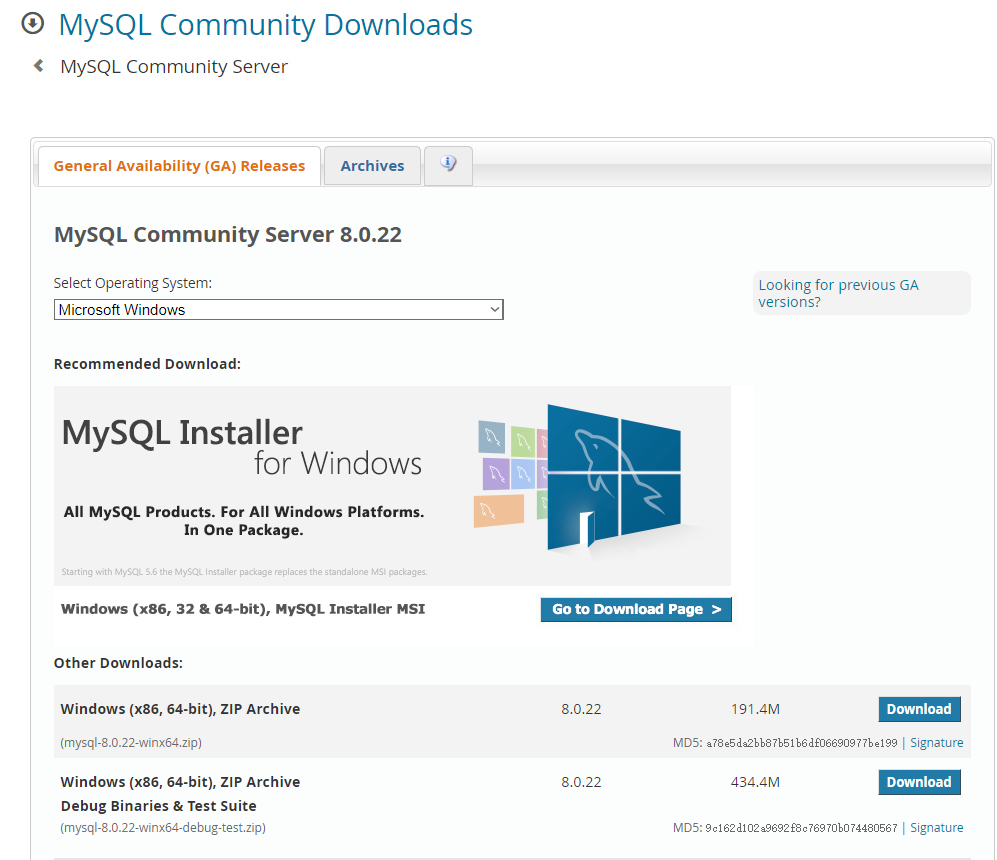

<!--
 * @Autor: 李逍遥
 * @Date: 2020-12-29 16:13:04
 * @LastEditors: 李逍遥
 * @LastEditTime: 2021-03-19 14:53:03
 * @Descriptiong: 
-->

# MySQL服务的安装和配置 #

- [MySQL服务的安装和配置](#mysql服务的安装和配置)
  - [在Windows上安装和配置](#在windows上安装和配置)
    - [下载](#下载)
    - [配置](#配置)
  - [在CentOS上安装(yum)](#在centos上安装yum)
    - [删除已安装的MySQL](#删除已安装的mysql)
    - [添加MySQL Yum Repository](#添加mysql-yum-repository)
    - [安装MySQL](#安装mysql)
  - [二进制安装部署](#二进制安装部署)
    - [准备安装包](#准备安装包)
    - [准备环境](#准备环境)
    - [启动数据库](#启动数据库)
  - [单独安装MySQL客户端](#单独安装mysql客户端)

## 在Windows上安装和配置 ##

### 下载 ###

- 下载地址  
  `https://dev.mysql.com/downloads/`

- 选择 `MySQL Community Server` （社区版）

- 下载打包的安装文件  
  如下图：



> 也可以下载MSI安装包直接下一步安装就行，这里进行静默安装的讲解。

### 配置 ###

- 按以下项进行配置  

  ```shell
  [mysqld]
  # 设置mysql的安装目录
  basedir=C:/MyProject/mysql-8.0.20-winx64
  # 设置mysql数据库的数据的存放目录
  datadir=C:/MyProject/mysql-8.0.20-winx64/data
  # 设置默认使用的端口
  port=3306
  # 允许最大连接数
  max_connections=200
  # 允许连接失败的次数。这是为了防止有人试图攻击数据库
  max_connect_errors=10
  # 服务端使用的字符集
  character-set-server=utf8mb4
  # 数据库字符集对应一些排序等规则使用的字符集
  collation-server=utf8mb4_general_ci
  # 创建新表时将使用的默认存储引擎
  default-storage-engine=INNODB
  # 默认使用"mysql_native_password"插件作为认证加密方式，否则会出现客户端连接出错
  # MySQL8.0默认认证加密方式为"caching_sha2_password"
  default_authentication_plugin=mysql_native_password

  [mysql]
  # 设置mysql客户端默认字符集
  default-character-set=utf8mb4

  [client]
  default-character-set=utf8mb4
  port=3306
  ````

### 初始化 ###

- 进入到MySQL安装目录的`bin`目录下，使用以下命令进行初始化  

  ```shell
  mysqld --initialize-insecure --user=mysql --console
  ```

  >insecure - 不会产生随机密码，第一次登陆数据库使用空密码

- 安装服务，在`bin`目录下，使用以下命令将MySQL服务加入到系统服务中

  ```shell
  mysqld -install [服务名](如:mysql/mysql58 等)
  ```

- 启动/关闭服务  

  ```shell
  net start mysql(服务名，需要根据自己的服务名进行替换)
  net stop mysql(服务名，需要根据自己的服务名进行替换)
  ```

>cmd必须以管理员身份启动才能执行上述命令

- 连接和初始化密码

```sql
# 连接MySQL服务
mysql -u root -p
# 修改密码
ALTER USER 'root'@'localhost' IDENTIFIED WITH mysql_native_password BY '你的密码';
# 允许远程连接
use mysql;
update user set host = '%' where user = 'root';
select host, user from user;
```

  >注：5.8版本废弃了password()函数，用update语句修改密码已经不适用了

## 在CentOS上安装(yum) ##

> MySQL也是在root用户下进行安装的；
>
> 本次使用yum进行安装，主要参照：<https://juejin.im/post/5d07cf13f265da1bd522cfb6#heading-51> (该文章中也提供了其他方法)；

### 删除已安装的MySQL ###

- 查MariaDB

  ```shell
  rpm -qa|grep mariadb
  ```

- 复制代码删除mariadb

  如果不存在（上面检查结果返回空）则跳过步骤；

  ```shell
  rpm -e --nodeps mariadb-server
  rpm -e --nodeps mariadb
  rpm -e --nodeps mariadb-libs
  ```

  > 其实yum方式安装是可以不用删除mariadb的，安装MySQL会覆盖掉之前已存在的mariadb；

- 检查MySQL  

  ```shell
  rpm -qa|grep mysql
  ```

### 添加MySQL Yum Repository ###

  > 从CentOS 7开始，MariaDB成为Yum源中默认的数据库安装包。也就是说在CentOS 7及以上的系统中使用yum安装MySQL默认安装的会是MariaDB（MySQL的一个分支）。如果想安装官方MySQL版本，需要使用MySQL提供的Yum源。

- 下载MySQL源  
  官网地址：<https://dev.mysql.com/downloads/repo/yum/>  
  查看系统版本：

  ```shell
  cat /etc/redhat-release
  ```

  选择对应的版本，使用wget命令进行下载

- 安装MySQL源  
  本次安装命令如下：

  ```shell
  rpm -Uvh mysql80-community-release-el7-3.noarch.rpm
  ```

- 检查是否安装成功  
  执行成功后会在 `/etc/yum.repos.d/` 目录下生成两个repo文件 `mysql-community.repo` 及 `mysql-community-source.repo`

  并且通过 `yum repolist` 可以看到mysql相关资源：

  ```shell
  yum repolist enabled | grep "mysql.*-community.*"
  !mysql-connectors-community/x86_64 MySQL Connectors Community                108
  !mysql-tools-community/x86_64      MySQL Tools Community                      90
  !mysql80-community/x86_64          MySQL 8.0 Community Server                113
  ```

### 安装MySQL ###

  ```shell
  sudo yum install mysql-community-server
  ```

  > 该命令会安装MySQL服务器 (mysql-community-server) 及其所需的依赖、相关组件，包括mysql-community-client、mysql-community-common、mysql-community-libs等；
  >
  > 另外，本次安装的是最新的MySQL8，如果想要选择版本的话请参照最开始的参照文章进行设置；

- 启动MySQL  
  **启动**

  ```shell
  sudo systemctl start mysqld.service
  # centos6
  sudo service mysqld start
  ```

  **查看状态**

  ```shell
  sudo systemctl status mysqld.service
  # centos6
  sudo service mysqld status
  ```

  **停止**

  ```shell
  sudo systemctl stop mysqld.service
  # centos6
  sudo service mysqld stop
  ```

  **重启**

  ```shell
  sudo systemctl restart mysqld.service
  # centos6
  sudo service mysqld restart
  ```

- 修改密码

  **初始密码**

  MySQL第一次启动后会创建超级管理员账号`root@localhost`，初始密码存储在日志文件中：

  ```shell
  grep 'temporary password' /var/log/mysqld.log
  ```

  **修改默认密码**

  先使用以下命令登录MySQL：

  ```shell
  mysql -uroot -p
  ```

  再使用以下命令修改root用户的密码：

  ```mysql
  ALTER USER 'root'@'localhost' IDENTIFIED BY 'xxxxxx';
  ```

- 允许root远程访问

  通过修改user表来实现

  ```mysql
  use mysql;
  update user set host = '%' where user = 'root';
  select host, user from user;
  ```

  > 这里有多种方式，参照：<https://www.cnblogs.com/cnblogsfans/archive/2009/09/21/1570942.html>

- 设置编码为utf-8

  **查看编码**

  ```mysql
  SHOW VARIABLES LIKE 'character%';
  ```

  **设置编码**

  编辑/etc/my.cnf，[mysqld]节点增加以下代码：

  ```shell
  [mysqld]
  character_set_server=utf8
  init-connect='SET NAMES utf8'
  ```

  > 一般MySQL8中已经默认编码是 utf8mb4 了；

- 设置开机启动

  ```shell
  systemctl enable mysqld
  systemctl daemon-reload
  ```

## 二进制安装部署 ##

>以Linux通用版(generic)为例  

### 准备安装包 ###

下载并上传二进制文件或者直接使用 wget 命令下载，解压并移动到指定目录。  
这里使用 `mysql-5.7.26-linux-glibc2.12-x86_64.tar.gz` 版本，命令如下：  

```shell
# 解压
tar xf mysql-5.7.26-linux-glibc2.12-x86_64.tar.gz
# 创建目录
mkdir /application
# 将MySQL文件移动并重命名
mv mysql-5.7.26-linux-glibc2.12-x86_64 /application/mysql
```

### 准备环境 ###

- 处理原始环境

  ```shell
  # 查看是否安装 mariadb
  rpm -qa|grep mariadb
  # 如果有，使用下面的命令卸载掉相关软件，否则会初始化失败
  rpm -e mariadb
  # 如果因为被依赖而无法卸载的话，可以使用以下命令进行卸载
  yum remove mariadb-libs-xxxx -y
  # 也可以加上 --nodeps 不检查依赖关系强制卸载
  rpm -e --nodeps mariadb
  ```

- 配置环境变量

  ```shell
  # 配置环境变量
  vim /etc/profile
  # 在最后一行添加下面的代码
  export PATH=/application/mysql/bin:$PATH
  # 让配置生效
  source /etc/profile
  # 查看MySQL版本(确认环境变量是否生效)
  mysql -V
  ```

- 挂载数据盘

  ```shell
  # 创建数据路径
  # 在虚拟机上可以添加一块新磁盘模拟数据盘
  # 查看磁盘情况
  fdisk -l
  # 可看到新加的虚拟硬盘，一般名为：Disk /dev/sdb
  # 格式化
  mkfs.xfs /dev/sdb
  # 创建目录
  mkdir /data
  # 挂载
  # 查看磁盘的UUID
  blkid
  # 在配置文件中将磁盘挂载到 data 目录下
  vim /etc/fstab
  # 添加以下代码
  UUID=xxxxxx-xxxx-xxxx-xxxx-xxxxxx /data xfs defaults 0 0
  # 自动挂载
  mount -a
  # 查看是否挂载成功
  df -h
  # 未挂载成功的话，也可以使用以下方法
  cd /sys/class/scsi_host
  echo "---" > host0/scan # 接口扫描新加磁盘
  ```

- 创建用户并授权

  ```shell
  # 创建管理MySQL的用户（不需要有登录权限）
  useradd -s /sbin/nologin mysql
  # 授权
  mkdir /data/mysql/data -p
  chown -R mysql.mysql /application/*
  chown -R mysql.mysql /data
  ```

- 初始化数据（创建系统数据）

  ```shell
  # 5.6的命令是：/application/mysql/scripts/mysql_install_db
  # 先进入MySQL安装目录
  cd /application/mysql/
  # 初始化
  mysqld --initialize --user=mysql --basedir=/application/mysql --datadir=/data/mysql/data
  # 如果初始化报错缺少 libaio 的话，需安装 libaio-devel
  yum install -y libaio-devel
  # 初始化后会生成一个临时密码，如下：
  #### ..... A temporary password is generated for root@localhost: xxxxxx
  ```

  >参数说明：
  >initialize
  >1.对密码复杂度进行定制，包含四种字符且达到12位；
  >2.给root@localhost 用户设置临时密码；
  >initialize-insecure : 无限制无临时密码，生产中往往使用该方式初始化。

- 配置文件

  ```shell
  # 准备配置文件
  # 在 /etc/my.cnf 中写入以下项(最基本的配置项)
  cat >/etc/my.cnf <<EOF
  [mysqld]
  user=mysql
  basedir=/application/mysql
  datadir=/data/mysql/data
  socket=/tmp/mysql.sock
  server_id=6
  port=3306
  [mysql]
  socket=/tmp/mysql.sock
  EOF
  ```

### 启动数据库 ###

- 1.使用 sys-v

  ```shell
  # 进入命令所在目录
  cd /application/mysql/support-files/
  # 启动
  ./mysql.server start

  # 还可以将 mysql.server 命令放到init.d中管理
  ## 将命令拷贝到 init.d
  cp /application/mysql/support-files/mysql.server /etc/init.d/mysqld
  ## 启动
  service mysqld start
  # 同 /etc/init.d/mysql start
  # 实际上是启动了 mysql.server 然后调用了 /application/mysql/bin/mysqld_safe(脚本)  然后启动了 mysqld

  # 以上还包括 start|stop|restart|status 等
  ```

- 2.使用systemd管理MySQL服务（5.7的新特性）

  ```shell
  # 将MySQL服务加入systemd
  cat >/etc/systemd/system/mysqld.service <<EOF
  [Unit]
  Description=MySQL Server
  Documentation=man:mysqld(7)
  Documentation=http://dev.mysql.com/doc/refman/en/using-systemd.html
  After=network.target
  After=syslog.target
  [Install]
  WantedBy=multi-user.target
  [Service]
  User=mysql
  Group=mysql
  ExecStart=/application/mysql/bin/mysqld --defaults-file=/etc/my.cnf
  LimitNOFILE = 5000
  EOF

  # 启动
  systemctl start mysqld

  # 设置开机启动
  systemctl enable mysqld

  ## 判断服务是否启动
  netstat -lnp|grep mysqld
  netstat -lnp|grep 3306
  ps -ef |grep mysqld
  systemctl status mysqld
  ss -tulpn|grep mysqld
  ss -tulpn|grep 3306
  lsof -i :3306
  ```

## 单独安装MySQL客户端 ##

>以centos为例  

- 根据系统情况选择安装包

  ```shell
  # 查看系统版本
  cat /etc/redhat-release
  # 查看系统信息
  uname -a
  ```

- 使用`rpm`命令安装

  ```shell
  # 例如
  rpm -ivh mysql-community-client-5.7.32-1.el7.x86_64.rpm
  ```

- 如遇报错，可能是以下种情况  
  首先看报错信息需要`libs`和`common`依赖包；  
  如果是，则要看系统是否已安装`mariadb`服务，需要先卸载`mariadb-libs`，代码如下：  

  ```shell
  # 查看是否安装mariadb服务
  rpm -qa | grep mariadb
  # 卸载
  rpm -e --nodeps mariadb-libs
  ```

  卸载后再依次使用`rpm`命令安装`libs`、`common`和`client`

