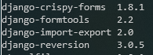
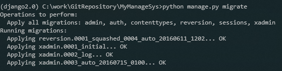
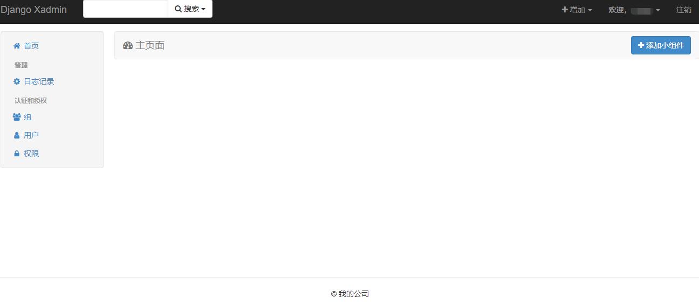

<!--
 * @Author: 李逍遥
 * @Date: 2019-12-16 16:55:25
 * @LastEditTime : 2019-12-22 20:01:05
 * @LastEditors  : 李逍遥
 * @Description: In User Settings Edit
 * @FilePath: \study_note\django\使用xadmin作为后台.md
 -->

# 使用xadmin替换Django自带后台管理(admin)的环境搭建和配置 #

文档：<http://sshwsfc.github.io/xadmin/>

环境：Python3.6+Django2.0+Xadmin2.0+mysqlclient1.4.6  
本次使用的xadmin官方仓库地址为：[xadmin](https://github.com/sshwsfc/xadmin)
>由于官方版本对Django2.0.x的支持问题(貌似已经不再更新了)，选用了一个修复版([xadmin修复版](https://github.com/vip68/xadmin_bugfix))  

## 1.环境准备 ##

- 创建虚拟环境
  - anaconda中  
    例如：`conda create -n django2.0 django=2.0`
  - virtualenvwrapper中  
    例如：`mkvirtualenv django2.0`  
    然后再`pip install django==2.0`

  >具体虚拟环境的配置见虚拟环境的文档

- 安装必要的包
  - 安装MySQLdb  
    推荐使用"mysqlclient"，可以直接`pip install mysqlclient`，也可以指定版本  
  - 安装MySQL服务端，并创建账号(不推荐使用root用户)和数据库  
    其中账号除了需要赋予create/insert/delete/drop等权限外，还需要“REFERENCES”权限  
  - 数据库的配置(settings.py)如下  

    ```python
    DATABASES = {
        'default': {
            # 'ENGINE': 'django.db.backends.sqlite3',
            # 'NAME': os.path.join(BASE_DIR, 'db.sqlite3'),
            'ENGINE': 'django.db.backends.mysql',
            'NAME': 'dbname',
            'USER': 'username',
            'PASSWORD': 'xxx',
            'HOST': 'localhost',
            'PORT': '3306',
            'OPTIONS': {
                # 初始化数据库的命令
                'init_command': "SET sql_mode='STRICT_TRANS_TABLES';"
            }
        }
    }
    ```

  - 可以在此时迁移数据，也可以在下面适配好xadmin之后一起迁移数据  
    使用命令：  

    ```linux
    python manage.py migrate
    ```

## 2.改造Django项目，适配xadmin ##

- 安装xadmin  
  使用命令`pip install git+git://github.com/sshwsfc/xadmin.git@django2`  
  该命令会安装以下依赖包：  
  

- 卸载xadmin  
  使用命令`pip uninstall xadmin`卸载xadmin，依赖包会保留下来；

- 配置项目
  - 将源码[下载](https://github.com/vip68/xadmin_bugfix)到本地
  - 将根目录下的*xadmin*复制到项目的extra_apps(自定义)目录下  
    
  - 将extra_apps目录设置为 Resource Root，右键 Mark Directory as -> Resource Root(在pycharm中操作)
  - 在settings.py中添加应用

    ```python
    # 将extra_apps的添加至python项目的搜索目录
    sys.path.insert(0, os.path.join(BASE_DIR, 'extra_apps'))

    INSTALLED_APPS = [
        'django.contrib.admin',
        'django.contrib.auth',
        'django.contrib.contenttypes',
        'django.contrib.sessions',
        'django.contrib.messages',
        'django.contrib.staticfiles',
        # 第三方管理后台
        'xadmin',
        # 相关依赖
        'crispy_forms',
        # 相关依赖
        'reversion',
    ]
    ```

  - 在urls.py中添加路由，替换掉官方admin  

    ```python
    # from django.contrib import admin
    from django.urls import path
    import xadmin


    urlpatterns = [
        # path('admin/', admin.site.urls),
        path('xadmin/', xadmin.site.urls),
    ]
    ```

  - 迁移数据  

    ```linux
    python manage.py migrate
    ```

    成功：  
    

  - 在settings.py中设置中文显示

    ```python
    LANGUAGE_CODE = 'zh-Hans'

    TIME_ZONE = 'Asia/Shanghai'
    ```

  - 大功告成，启动项目，登录<http://127.0.0.1:8000/xadmin>  
    
