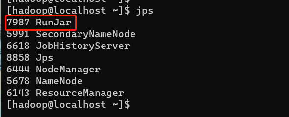
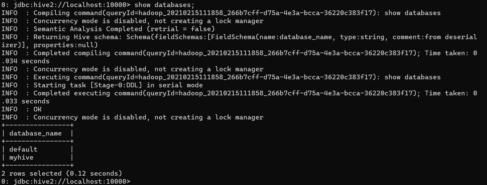
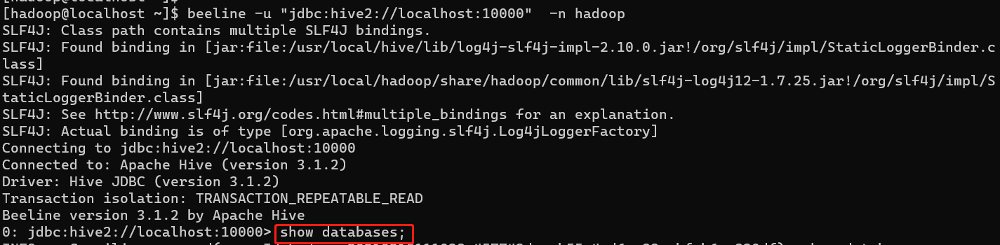

<!--
 * @Autor: 李逍遥
 * @Date: 2021-02-15 09:38:47
 * @LastEditors: 李逍遥
 * @LastEditTime: 2021-04-06 10:55:52
 * @Descriptiong: 
-->

# hive的连接方式 #

- [hive的连接方式](#hive的连接方式)
  - [CLI连接](#cli连接)
  - [HiveServer2/beeline](#hiveserver2beeline)
    - [修改hadoop和hive的配置文件](#修改hadoop和hive的配置文件)
    - [连接](#连接)
    - [beeline支持的操作](#beeline支持的操作)

## CLI连接 ##

命令

```shell
[hadoop@localhost ~]$ hive
which: no hbase in (/usr/local/bin:/usr/bin:/usr/local/sbin:/usr/sbin:/usr/local/hadoop/sbin:/usr/local/hadoop/bin:/usr/local/hive/bin:/home/hadoop/.local/bin:/home/hadoop/bin)
SLF4J: Class path contains multiple SLF4J bindings.
SLF4J: Found binding in [jar:file:/usr/local/hive/lib/log4j-slf4j-impl-2.10.0.jar!/org/slf4j/impl/StaticLoggerBinder.class]
SLF4J: Found binding in [jar:file:/usr/local/hadoop/share/hadoop/common/lib/slf4j-log4j12-1.7.25.jar!/org/slf4j/impl/StaticLoggerBinder.class]
SLF4J: See http://www.slf4j.org/codes.html#multiple_bindings for an explanation.
SLF4J: Actual binding is of type [org.apache.logging.slf4j.Log4jLoggerFactory]
Hive Session ID = ced676f2-c8f1-48cb-a1c4-xxxxxx

Logging initialized using configuration in jar:file:/usr/local/hive/lib/hive-common-3.1.2.jar!/hive-log4j2.properties Async: true
Loading class `com.mysql.jdbc.Driver'. This is deprecated. The new driver class is `com.mysql.cj.jdbc.Driver'. The driver is automatically registered via the SPI and manual loading of the driver class is generally unnecessary.
Hive-on-MR is deprecated in Hive 2 and may not be available in the future versions. Consider using a different execution engine (i.e. spark, tez) or using Hive 1.X releases.
Hive Session ID = 6a3b619a-85f4-4879-905b-e5648d12aa91
hive> show databases;
OK
default
myhive
Time taken: 3.533 seconds, Fetched: 2 row(s)
hive>
```

启动成功的话如上所示，可以做 hive 相关操作。

>补充：
>1、上面的 `hive` 命令相当于在启动的时候执行： `hive --service cli` 。
>2、使用 `hive --help`，可以查看 hive 命令可以启动那些服务。
>3、通过 `hive --service serviceName --help` 可以查看某个具体命令的使用方式。

## HiveServer2/beeline ##

### 修改hadoop和hive的配置文件 ###

- 1.修改 hadoop 集群的 hdfs-site.xml 配置文件

    加入一条配置信息，表示启用 webhdfs(远程访问)

    ```xml
    <property>
    <name>dfs.webhdfs.enabled</name>
    <value>true</value>
    </property>
    ```

- 2.修改 hadoop 集群的 core-site.xml 配置文件

    加入两条配置信息：表示设置 hadoop 的代理用户

    ```xml
    <property>
    <name>hadoop.proxyuser.hadoop.hosts</name>
    <value>*</value>
    </property>
    <property>
    <name>hadoop.proxyuser.hadoop.groups</name>
    <value>*</value>
    </property>
    ```

    >配置解析：
    >hadoop.proxyuser.hadoop.hosts 配置成*的意义，表示任意节点使用 hadoop 集群的代理用户 hadoop 都能访问 hdfs 集群。
    >hadoop.proxyuser.hadoop.groups 表示代理用户的组所属

>例如：配置文件在安装目录下的 etc/hadoop/ 路径下

- 3.修改hive目录中的conf文件夹下的hive-site.xml文件

    加入以下配置信息

    ```xml
    <!-- 这是hiveserver2 -->
    <property>
    <name>hive.metastore.warehouse.dir</name>
    <value>/hive/warehouse</value>
    <description>hive default warehouse, if nessecory, change it</description>
    </property>
    <property>
    <name>hive.server2.thrift.port</name>
    <value>10000</value>
    <description>Port number of HiveServer2 Thrift interface.
    Can be overridden by setting $HIVE_SERVER2_THRIFT_PORT</description>
    </property>
    <property>
    <name>hive.server2.thrift.bind.host</name>
    <value>192.168.3.119</value>
    <description>Bind host on which to run the HiveServer2 Thrift interface.
    Can be overridden by setting $HIVE_SERVER2_THRIFT_BIND_HOST</description>
    </property>
    <property>
    <name>hive.server2.long.polling.timeout</name>
    <value>5000</value>
    <description>Time in milliseconds that HiveServer2 will wait, before responding to asynchronous calls that use long polling</description>
    </property>
    ```

    >配置解析：
    >hive.metastore.warehouse.dir 该配置信息用来指定 Hive 数据仓库的数据存储在 HDFS 上的目录

### 连接 ###

>以上配置修改完毕后最好先重启hadoop集群。

- 启动 hiveserver2 服务
  - 前台启动
    使用命令 `hiveserver2` ，启动后会多一个进程，该方式需要占用一个会话窗口。

    

  - 后台启动

    ```shell
    # 以下3个命令都可以
    # 1.记录日志
    nohup hiveserver2 1>/home/hadoop/hiveserver.log 2>/home/hadoop/hiveserver.err &
    # 2.不记录日志
    nohup hiveserver2 1>/dev/null 2>/dev/null &
    # 3.不记录日志
    nohup hiveserver2 >/dev/null 2>&1 &
    ```

    >以上命令中的 1 和 2 的意义分别是：
    >1：表示标准日志输出。
    >2：表示错误日志输出。
    >如果没有配置日志的输出路径，日志会生成在当前工作目录，默认的日志名称叫做： nohup.xxx。
    >nohup 命令：一般形式为：nohup command &
    >如果你正在运行一个进程，而且你觉得在退出帐户时该进程还不会结束，可以使用 nohup 命令。该命令可以在退出帐户/关闭终端之后继续运行相应的进程，nohup 就是不挂起的意思(no hang up)。

- 启动 beeline 客户端去连接hive2服务
  - 直接连接

    ```shell
    beeline -u "jdbc:hive2://localhost:10000" -n hadoop -p xxxx
    ```

    >命令说明：
    >-u `<database URL>` 用于JDBC URL连接。用例：beeline -u db_URL，db_URL也可以不用引号，但要注意 hive2后有冒号；
    >-n `<username>` 连接时使用的用户名。
    >-p `<password>` 连接时使用的密码。可选的密码模式: 从Hive 2.2.0开始参数-p选项是可选的。如果密码不是在-p之后提供的，Beeline将在初始化连接时提示输入密码。

  - 使用命令 `beeline` 进入命令行后再连接hive2服务

    ```shell
    !connect jdbc:hive2://localhost:10000
    ```

- **注意：可能会有以下问题**

  - 权限问题
    报错信息如下：

    ```log
    Error: Failed to open new session: java.lang.RuntimeException: org.apache.hadoop.security.AccessControlException: Permission denied: user=lenmom, access=EXECUTE, inode="/tmp/hive":root:supergroup:drwxrwx---
    ```

    是由于Hive没有hdfs:/tmp目录的权限，赋权限即可：

    ```shell
    hdfs dfs -chmod -R 777 /tmp
    ```

  - 在使用beeline跑hive查询时候会产生很多无用的INFO日志
    如下图：

    

    **解决方法**
    a) 在使用 beeline 时加入以下设置即可

    ```shell
    beeline --hiveconf hive.server2.logging.operation.level=NONE
    ```

    b) 或者在hive-site.xml中加入如下配置也可以禁用在beeline中显示额外信息。

    ```xml
    <property>
    <name>hive.server2.logging.operation.enabled</name>
    <value>true</value>
    </property>
    <property>
    <name>hive.server2.logging.operation.log.location</name>
    <value>/home/hadoop/log/hive/operation_logs</value>
    </property>
    ```


如此便可以做 hive 操作了

### beeline支持的操作 ###

常用的几个command
!connect url –连接不同的Hive2服务器
!exit –退出shell
!help –显示全部命令列表
!verbose –显示查询追加的明细

>详细参数参照：<https://www.cnblogs.com/lenmom/p/11218807.html>
