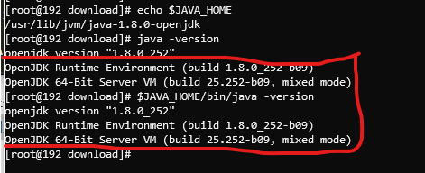

# 在centos7上安装hadoop和hive #

> 该文主要参考了厦门大学数据库实验室的文章：<http://dblab.xmu.edu.cn/blog/install-hadoop-in-centos/>

- [在centos7上安装hadoop和hive](#在centos7上安装hadoop和hive)
  - [环境](#环境)
  - [准备工作](#准备工作)
    - [创建hadoop用户](#创建hadoop用户)
    - [安装Java环境](#安装java环境)
    - [安装MySQL](#安装mysql)
  - [安装Hadoop2](#安装hadoop2)
  - [运行Hadoop伪分布式实例](#运行hadoop伪分布式实例)
  - [启动YARN](#启动yarn)
  - [安装和配置Hive](#安装和配置hive)
    - [安装和配置hive源程序](#安装和配置hive源程序)
    - [配置MySQL](#配置mysql)
    - [启动hive](#启动hive)
  - [问题汇总](#问题汇总)
    - [1.启动Hadoop时，出现无法加载本地hadoop库的问题](#1启动hadoop时出现无法加载本地hadoop库的问题)
    - [2.启动hadoop时，出现无法获取主机名的问题](#2启动hadoop时出现无法获取主机名的问题)
    - [3.Hadoop启动时，namenode启动失败](#3hadoop启动时namenode启动失败)
    - [4.Hadoop启动时，datanode启动失败](#4hadoop启动时datanode启动失败)
    - [5. 启动hive时未报错，但是执行命令时报错](#5-启动hive时未报错但是执行命令时报错)
  - [附录](#附录)
    - [hadoop和yarn的启动关闭命令](#hadoop和yarn的启动关闭命令)

## 环境 ##

- os

  CentOS7

  > 下载地址：<https://mirrors.tuna.tsinghua.edu.cn/centos/7.8.2003/isos/x86_64/>

- hadoop

  Hadoop-2.10.0

  > 下载地址：<https://mirrors.tuna.tsinghua.edu.cn/apache/hadoop/common/hadoop-2.10.0/>

- hive

  apache-hive-3.1.2

  > 下载地址：https://mirrors.tuna.tsinghua.edu.cn/apache/hive/hive-3.1.2/

- 依赖应用

  - jdk

    openjdk-1.8.0

  - mysql

     Ver 8.0.20

  - mysql-jdbc

    mysql-connector-java-8.0.20

    > 下载地址：<https://mirrors.tuna.tsinghua.edu.cn/mysql/downloads/Connector-J/>

## 准备工作 ##

### 创建hadoop用户 ###

- 使用以下命令创建hadoop用户(可登陆的)

  ```shell
  useradd -m hadoop -s /bin/bash
  ```

- 使用以下命令设置hadoop用户的密码

  ```shell
  passwd hadoop
  ```

- 使用以下命令为hadoop用户增加管理员权限

  ```shell
  visudo
  ```

  找到`root ALL=(ALL) ALL`这行(应该在100行，可以使用```:98```命令直接跳转到100行)，然后在这行下面增加一行内容`hadoop ALL=(ALL) ALL`（其中的间隔符使用tab），然后保存修改；

### 安装Java环境 ###

> Java环境需要在root用户下安装；

- 安装JDK

  通过yum命令安装JDK，这里选择1.8.0，一路确认就行（需要确认时会让输入[y/n]，输入y即可）：

  ```shell
  yum install java-1.8.0-openjdk java-1.8.0-openjdk-devel
  ```

  默认安装位置为 /usr/lib/jvm/java-1.8.0-openjdk（该路径可以通过执行 `rpm -ql java-1.8.0-openjdk-devel | grep '/bin/javac'` 命令确定，执行后会输出一个路径，除去路径末尾的 “/bin/javac”，剩下的就是正确的路径了）。OpenJDK 安装后就可以直接使用 java、javac 等命令了。

  > 使用 `yum -y list java*` 命令可以查看yum源中提供的JDK版本；

- 配置 JAVA_HOME 环境变量

  使用以下命令在 ~/.bashrc 中进行配置：

  ```shell
  vim ~/.bashrc
  ```

  在文件最后面添加如下配置，并保持：

  ```shell
  export JAVA_HOME=/usr/lib/jvm/java-1.8.0-openjdk
  ```

  接下来让该环境变量生效，执行如下代码：

  ```shell
  source ~/.bashrc
  ```

  使用以下命令进行验证：

  ```shell
  echo $JAVA_HOME     # 检验变量值
  java -version
  $JAVA_HOME/bin/java -version  # 与直接执行 java -version 一样
  ```

  如果配置正确的话，`$JAVA_HOME/bin/java -version` 会输出 java 的版本信息，且和 `java -version` 的输出结果一样，如下图所示：

  

### 安装MySQL ###

> MySQL也是在root用户下进行安装的；
>
> 本次使用yum进行安装，主要参照：<https://juejin.im/post/5d07cf13f265da1bd522cfb6#heading-51> (该文章中也提供了其他方法)；

- 删除已安装的MySQL

  **查MariaDB**

  ```shell
  rpm -qa|grep mariadb
  ```

  **复制代码删除mariadb**

  > 如果不存在（上面检查结果返回空）则跳过步骤；

  ```shell
  rpm -e --nodeps mariadb-server
  rpm -e --nodeps mariadb
  rpm -e --nodeps mariadb-libs
  ```

  > 其实yum方式安装是可以不用删除mariadb的，安装MySQL会覆盖掉之前已存在的mariadb；

   **检查MySQL**

  ```shell
  rpm -qa|grep mysql
  ```

- 添加MySQL Yum Repository

  > 从CentOS 7开始，MariaDB成为Yum源中默认的数据库安装包。也就是说在CentOS 7及以上的系统中使用yum安装MySQL默认安装的会是MariaDB（MySQL的一个分支）。如果想安装官方MySQL版本，需要使用MySQL提供的Yum源。

  **下载MySQL源**

  官网地址：<https://dev.mysql.com/downloads/repo/yum/>

  查看系统版本：

  ```shell
  cat /etc/redhat-release
  ```

  选择对应的版本，使用wget命令进行下载

  **安装MySQL源**

  本次安装命令如下：

  ```shell
  rpm -Uvh mysql80-community-release-el7-3.noarch.rpm
  ```

  **检查是否安装成功**

  执行成功后会在 `/etc/yum.repos.d/` 目录下生成两个repo文件 `mysql-community.repo` 及 `mysql-community-source.repo`

  并且通过 `yum repolist` 可以看到mysql相关资源：

  ```shell
  yum repolist enabled | grep "mysql.*-community.*"
  !mysql-connectors-community/x86_64 MySQL Connectors Community                108
  !mysql-tools-community/x86_64      MySQL Tools Community                      90
  !mysql80-community/x86_64          MySQL 8.0 Community Server                113
  ```

- 安装MySQL

  ```shell
  sudo yum install mysql-community-server
  ```

  > 该命令会安装MySQL服务器 (mysql-community-server) 及其所需的依赖、相关组件，包括mysql-community-client、mysql-community-common、mysql-community-libs等；
  >
  > 另外，本次安装的是最新的MySQL8，如果想要选择版本的话请参照最开始的参照文章进行设置；

- 启动MySQL  
  **启动**

  ```shell
  sudo systemctl start mysqld.service
  # centos6
  sudo service mysqld start
  ```

  **查看状态**

  ```shell
  sudo systemctl status mysqld.service
  # centos6
  sudo service mysqld status
  ```

  **停止**

  ```shell
  sudo systemctl stop mysqld.service
  # centos6
  sudo service mysqld stop
  ```

  **重启**

  ```shell
  sudo systemctl restart mysqld.service
  # centos6
  sudo service mysqld restart
  ```

- 修改密码

  **初始密码**

  MySQL第一次启动后会创建超级管理员账号`root@localhost`，初始密码存储在日志文件中：

  ```shell
  grep 'temporary password' /var/log/mysqld.log
  ```

  **修改默认密码**

  先使用以下命令登录MySQL：

  ```shell
  mysql -uroot -p
  ```

  再使用以下命令修改root用户的密码：

  ```mysql
  ALTER USER 'root'@'localhost' IDENTIFIED BY 'xxxxxx';
  ```

- 允许root远程访问

  通过修改user表来实现

  ```mysql
  use mysql;
  update user set host = '%' where user = 'root';
  select host, user from user;
  ```

  > 这里有多种方式，参照：<https://www.cnblogs.com/cnblogsfans/archive/2009/09/21/1570942.html>

- 设置编码为utf-8

  **查看编码**

  ```mysql
  SHOW VARIABLES LIKE 'character%';
  ```

  **设置编码**

  编辑/etc/my.cnf，[mysqld]节点增加以下代码：

  ```shell
  [mysqld]
  character_set_server=utf8
  init-connect='SET NAMES utf8'
  ```

  > 一般MySQL8中已经默认编码是 utf8mb4 了；

- 设置开机启动

  ```shell
  systemctl enable mysqld
  systemctl daemon-reload
  ```

## 安装Hadoop2 ##

> 以下操作是在hadoop用户下进行的；

- **安装**

  根据“环境”中列的镜像地址选择hadoop的版本，使用wget命令进行下载，保存到指定目录（比如 ~/download）；

  使用以下命令讲Hadoop安装至 /user/local 中：

  ```shell
  sudo tar -zxf ~/download/hadoop-2.10.0.tar.gz -C /usr/local    # 解压到/usr/local中
  cd /usr/local/
  sudo mv ./hadoop-2.10.0/ ./hadoop            # 将文件夹名改为hadoop
  sudo chown -R hadoop:hadoop ./hadoop        # 修改文件权限
  ```

  使用如下命令来检查 Hadoop 是否可用，成功则会显示 Hadoop 版本信息：

  ```shell
  cd /usr/local/hadoop
  ./bin/hadoop version
  ```

- **Hadoop单机配置(非分布式)**

  Hadoop 默认模式为非分布式模式，无需进行其他配置即可运行。非分布式即单 Java 进程，方便进行调试。

  现在我们可以执行例子来感受下 Hadoop 的运行。Hadoop 附带了丰富的例子（运行 `./bin/hadoop jar ./share/hadoop/mapreduce/hadoop-mapreduce-examples-2.10.0.jar` 可以看到所有例子），包括 wordcount、terasort、join、grep 等。

  在此我们选择运行 grep 例子，我们将 input 文件夹中的所有文件作为输入，筛选当中符合正则表达式 `dfs[a-z.]+` 的单词并统计出现的次数，最后输出结果到 output 文件夹中。

  ```shell
  cd /usr/local/hadoop
  mkdir ./input
  cp ./etc/hadoop/*.xml ./input   # 将配置文件作为输入文件
  ./bin/hadoop jar ./share/hadoop/mapreduce/hadoop-mapreduce-examples-*.jar grep ./input ./output 'dfs[a-z.]+'
  cat ./output/*          # 查看运行结果
  ```

  - 问题1：

    若出现提示 “WARN util.NativeCodeLoader: Unable to load native-hadoop library for your platform… using builtin-java classes where applicable”，该 WARN 提示可以忽略，不会影响 Hadoop 正常运行。

    > 解决方法见问题汇总；

  - 问题2：

    若出现提示 “INFO metrics.MetricsUtil: Unable to obtain hostName java.net.UnknowHostException”，这需要执行如下命令修改 hosts 文件，为你的主机名增加IP映射：

    ```shell
    sudo vim /etc/hosts
    ```

    主机名在终端窗口标题里可以看到，或执行命令 `hostname` 查看，在最后面增加一行 “127.0.0.1 主机名”。

    保存文件后，重新运行 hadoop 实例。

  作业的结果会输出在指定的 output 文件夹中，通过命令 `cat ./output/*` 查看结果，符合正则的单词 dfsadmin 出现了1次。

  > **注意**，Hadoop 默认不会覆盖结果文件，因此再次运行上面实例会提示出错，需要先将 `./output` 删除。

- **Hadoop伪分布式配置**

  Hadoop 可以在单节点上以伪分布式的方式运行，Hadoop 进程以分离的 Java 进程来运行，节点既作为 NameNode 也作为 DataNode，同时，读取的是 HDFS 中的文件。

  - 设置 HADOOP 环境变量

    执行如下命令在 ~/.bashrc 中设置：

    ```shell
    vim ~/.bashrc
    ```

    在文件最后面增加如下内容：

    ```shell
    # Hadoop Environment Variables
    export HADOOP_HOME=/usr/local/hadoop
    export HADOOP_INSTALL=$HADOOP_HOME
    export HADOOP_MAPRED_HOME=$HADOOP_HOME
    export HADOOP_COMMON_HOME=$HADOOP_HOME
    export HADOOP_HDFS_HOME=$HADOOP_HOME
    export YARN_HOME=$HADOOP_HOME
    export HADOOP_COMMON_LIB_NATIVE_DIR=$HADOOP_HOME/lib/native
    export PATH=$PATH:$HADOOP_HOME/sbin:$HADOOP_HOME/bin
    ```

    保存后，执行如下命令使配置生效：

    ```shell
    source ~/.bashrc
    ```

  - 修改Hadoop的配置

    Hadoop 的配置文件位于 `/usr/local/hadoop/etc/hadoop/` 中，伪分布式需要修改2个配置文件 **core-site.xml** 和 **hdfs-site.xml** 。Hadoop的配置文件是 xml 格式，每个配置以声明 property 的 name 和 value 的方式来实现。

    - 修改配置文件 **core-site.xml**

      使用 `vim ./etc/hadoop/core-site.xml` 命令，将其中的：

      ```xml
      <configuration>
      </configuration>
      ```

      修改为下面的配置：

      ```xml
      <configuration>
          <property>
              <name>hadoop.tmp.dir</name>
              <value>file:/usr/local/hadoop/tmp</value>
              <description>Abase for other temporary directories.</description>
          </property>
          <property>
              <name>fs.defaultFS</name>
              <value>hdfs://localhost:9000</value>
          </property>
      </configuration>
      ```

    - 修改配置文件 **hdfs-site.xml**

      同样修改为下面的配置：

      ```xml
      <configuration>
          <property>
              <name>dfs.replication</name>
              <value>1</value>
          </property>
          <property>
              <name>dfs.namenode.name.dir</name>
              <value>file:/usr/local/hadoop/tmp/dfs/name</value>
          </property>
          <property>
              <name>dfs.datanode.data.dir</name>
              <value>file:/usr/local/hadoop/tmp/dfs/data</value>
          </property>
      </configuration>
      ```

    **配置完成后，需要对 NameNode 进行格式化，命令如下：**

    ```shell
    ./bin/hdfs namenode -format
    ```

    > 成功的话，会看到 “successfully formatted” 和 “Exitting with status 0” 的提示，若为 “Exitting with status 1” 则是出错。

  - 开启Hadoop

    使用以下命令开启 `NaneNode` 和 `DataNode` 守护进程：

    ```shell
    ./sbin/start-dfs.sh
    ```

    若出现提示 “Are you sure you want to continue connecting”，输入 yes 即可。

    > 启动时可能会有 WARN 提示 “WARN util.NativeCodeLoader…” 如前面提到的，这个提示不会影响正常使用，解决方法如前面所述。

    **判断是否启动成功**

    可以通过命令 `jps` 来判断是否成功启动，若成功启动则会列出如下进程: “NameNode”、”DataNode”和“SecondaryNameNode”。

    >如果没有 NameNode 或 DataNode ，那就是配置不成功，请仔细检查之前步骤，或通过查看启动日志排查原因，解决方法请见下面的问题汇总；

    成功启动后，可以访问 Web 界面 <http://ip:50070> 查看 NameNode 和 Datanode 信息，还可以在线查看 HDFS 中的文件。

    > CentOS系统默认开启了防火墙，需要关闭防火墙，CentOS7中使用以下命令关闭：
    >
    > ```shell
    > systemctl stop firewalld.service    # 关闭firewall
    > systemctl disable firewalld.service # 禁止firewall开机启动
    > ```

## 运行Hadoop伪分布式实例 ##

上面的单机模式，grep 例子读取的是本地数据，伪分布式读取的则是 HDFS 上的数据。要使用 HDFS，首先需要在 HDFS 中创建用户目录：

```shell
./bin/hdfs dfs -mkdir -p /user/hadoop
```

接着将 ./etc/hadoop 中的 xml 文件作为输入文件复制到分布式文件系统中，即将 /usr/local/hadoop/etc/hadoop 复制到分布式文件系统中的 /user/hadoop/input 中。我们使用的是 hadoop 用户，并且已创建相应的用户目录 /user/hadoop ，因此在命令中就可以使用相对路径如 input，其对应的绝对路径就是 /user/hadoop/input:

```shell
./bin/hdfs dfs -mkdir input
./bin/hdfs dfs -put ./etc/hadoop/*.xml input
```

复制完成后，可以通过如下命令查看 HDFS 中的文件列表：

```shell
./bin/hdfs dfs -ls input
```

伪分布式运行 MapReduce 作业的方式跟单机模式相同，区别在于伪分布式读取的是HDFS中的文件（可以将单机步骤中创建的本地 input 文件夹，输出结果 output 文件夹都删掉来验证这一点）。

```shell
./bin/hadoop jar ./share/hadoop/mapreduce/hadoop-mapreduce-examples-*.jar grep input output 'dfs[a-z.]+'
```

查看运行结果的命令（查看的是位于 HDFS 中的输出结果）：

```shell
./bin/hdfs dfs -cat output/*
```

我们也可以将运行结果取回到本地：

```shell
rm -r ./output    # 先删除本地的 output 文件夹（如果存在）
./bin/hdfs dfs -get output ./output     # 将 HDFS 上的 output 文件夹拷贝到本机
cat ./output/*
```

> **注意：**Hadoop 运行程序时，输出目录不能存在，否则会提示错误 “org.apache.hadoop.mapred.FileAlreadyExistsException: Output directory hdfs://localhost:9000/user/hadoop/output already exists” ，因此若要再次执行，需要执行如下命令删除 output 文件夹:
>
> ```shell
> ./bin/hdfs dfs -rm -r output    # 删除 output 文件夹
> ```
>
> **运行程序时，输出目录不能存在**
>
> 运行 Hadoop 程序时，为了防止覆盖结果，程序指定的输出目录（如 output）不能存在，否则会提示错误，因此运行前需要先删除输出目录。在实际开发应用程序时，可考虑在程序中加上如下代码，能在每次运行时自动删除输出目录，避免繁琐的命令行操作：
>
> ```java
> Configuration conf = new Configuration();
> Job job = new Job(conf);
>  
> /* 删除输出目录 */
> Path outputPath = new Path(args[1]);
> outputPath.getFileSystem(conf).delete(outputPath, true);
> ```

**若要关闭 Hadoop，则运行**

```shell
./sbin/stop-dfs.sh
```


## 启动YARN ##

> 伪分布式不启动 YARN 也可以，一般不会影响程序执行；
>
> YARN 是从 MapReduce 中分离出来的，负责资源管理与任务调度。YARN 运行于 MapReduce 之上，提供了高可用性、高扩展性，YARN 的更多介绍在此不展开，有兴趣的可查阅相关资料。

上述通过 `./sbin/start-dfs.sh` 启动 Hadoop，仅仅是启动了 MapReduce 环境，我们可以启动 YARN ，让 YARN 来负责资源管理与任务调度。

首先修改配置文件 **mapred-site.xml**，这边需要先进行重命名：

```shell
mv ./etc/hadoop/mapred-site.xml.template ./etc/hadoop/mapred-site.xml
```

然后再进行编辑  `vim ./etc/hadoop/mapred-site.xml` ：

```xml
<configuration>
    <property>
        <name>mapreduce.framework.name</name>
        <value>yarn</value>
    </property>
</configuration>
```

接着修改配置文件 **yarn-site.xml**：

```xml
<configuration>
    <property>
        <name>yarn.nodemanager.aux-services</name>
        <value>mapreduce_shuffle</value>
        </property>
</configuration>
```

然后就可以启动 YARN 了（需要先执行过 `./sbin/start-dfs.sh`）：

```shell
./sbin/start-yarn.sh      $ 启动YARN
./sbin/mr-jobhistory-daemon.sh start historyserver  # 开启历史服务器，才能在Web中查看任务运行情况
```

开启后通过 `jps` 查看，可以看到多了 NodeManager 和 ResourceManager 两个后台进程；

启动 YARN 之后，运行实例的方法还是一样的，仅仅是资源管理方式、任务调度不同。观察日志信息可以发现，不启用 YARN 时，是 “mapred.LocalJobRunner” 在跑任务，启用 YARN 之后，是 “mapred.YARNRunner” 在跑任务。启动 YARN 有个好处是可以通过 Web 界面查看任务的运行情况：<http://ip:8088/cluster> ；

但 YARN 主要是为集群提供更好的资源管理与任务调度，然而这在单机上体现不出价值，反而会使程序跑得稍慢些。因此在单机上是否开启 YARN 就看实际情况了。

> **不启动 YARN 需重命名 mapred-site.xml**
>
> 如果不想启动 YARN，务必把配置文件 **mapred-site.xml** 重命名，改成 mapred-site.xml.template，需要用时改回来就行。否则在该配置文件存在，而未开启 YARN 的情况下，运行程序会提示 “Retrying connect to server: 0.0.0.0/0.0.0.0:8032” 的错误，这也是为何该配置文件初始文件名为 mapred-site.xml.template。

**关闭 YARN 的脚本如下：**

```shell
./sbin/stop-yarn.sh
./sbin/mr-jobhistory-daemon.sh stop historyserver
```

## 安装和配置Hive ##

### 安装和配置hive源程序 ###

- **1.下载并解压hive源程序**

  使用wget命令从“环境”目录中给出的镜像站下载源程序

  ```shell
  sudo tar -zxvf ./apache-hive-3.1.2-bin.tar.gz -C /usr/local   # 解压到/usr/local中
  cd /usr/local/
  sudo mv apache-hive-3.1.2-bin hive       # 将文件夹名改为hive
  sudo chown -R hadoop:hadoop hive            # 修改文件权限
  ```

- **2.配置环境变量**

  为了方便使用，我们把hive命令加入到环境变量中去，
  请使用vim编辑器打开.bashrc文件，命令如下：

  ```shell
  vim ~/.bashrc
  ```

  在该文件最前面一行添加如下内容：

  ```shell
  export HIVE_HOME=/usr/local/hive
  export PATH=$PATH:$HIVE_HOME/bin
  ```

  保存退出后，运行如下命令使配置立即生效：

  ```shell
  source ~/.bashrc
  ```

- **3. 修改`/usr/local/hive/conf`下的hive-site.xml**

  执行如下命令：

  ```shell
  cd /usr/local/hive/conf
  mv hive-default.xml.template hive-default.xml
  ```

  上面命令是将hive-default.xml.template重命名为hive-default.xml；
  然后，使用vim编辑器新建一个配置文件hive-site.xml，命令如下：

  ```shell
  cd /usr/local/hive/conf
  vim hive-site.xml
  ```

  在hive-site.xml中添加如下配置信息：

  ```xml
  <?xml version="1.0" encoding="UTF-8" standalone="no"?>
  <?xml-stylesheet type="text/xsl" href="configuration.xsl"?>
  <configuration>
    <property>
      <name>javax.jdo.option.ConnectionURL</name>
      <value>jdbc:mysql://localhost:3306/hive?createDatabaseIfNotExist=true</value>
      <description>JDBC connect string for a JDBC metastore</description>
    </property>
    <property>
      <name>javax.jdo.option.ConnectionDriverName</name>
      <value>com.mysql.jdbc.Driver</value>
      <description>Driver class name for a JDBC metastore</description>
    </property>
    <property>
      <name>javax.jdo.option.ConnectionUserName</name>
      <value>hive</value>
      <description>username to use against metastore database</description>
    </property>
    <property>
      <name>javax.jdo.option.ConnectionPassword</name>
      <value>hive</value>
      <description>password to use against metastore database</description>
    </property>
  </configuration>
  ```

  >注意，如果使用MySQL8.0保存hive元数据的话，驱动需要使用 `com.mysql.jdbc.Driver`  

### 配置MySQL ###

这里我们采用MySQL数据库保存Hive的元数据，而不是采用Hive自带的derby来存储元数据。

- **1.下载MySQL jdbc包**

  下载地址见“环境”目录，还是使用wget命令

  ```shell
  tar -zxvf mysql-connector-java-8.0.20.tar.gz   #解压
  cp mysql-connector-java-8.0.20/mysql-connector-java-8.0.20.jar  /usr/local/hive/lib #将mysql-connector-java-8.0.20.jar拷贝到/usr/local/hive/lib目录下
  ```

- **2.启动并登陆mysql shell**

  ```mysql
  service mysql start #启动mysql服务
  mysql -u root -p  #登陆shell界面
  ```

- **3.新建hive数据库**

  ```mysql
  mysql> create database hive;    #这个hive数据库与hive-site.xml中localhost:3306/hive的hive对应，用来保存hive元数据
  ```

- **4.配置mysql允许hive接入：**

  >参照[安装MySQL](#安装mysql)进行配置

### 启动hive ###

启动hive之前，请先启动hadoop集群。

```shell
start-dfs.sh #启动Hadoop的HDFS
hive  #启动hive
```

## 问题汇总 ##

### 1.启动Hadoop时，出现无法加载本地hadoop库的问题 ###

提示信息为：“WARN util.NativeCodeLoader: Unable to load native-hadoop library for your platform… using builtin-java classes where applicable”；

>**该 WARN 提示可以忽略，不会影响 Hadoop 正常运行，如需解决请按以下方法解决**
>可以通过在 `~/.bashrc` 中的Hadoop环境变量中添加一行配置来解决，即 `export HADOOP_OPTS="-Djava.library.path=$HADOOP_HOME/lib/native"`；
>其中，可以开启Hadoop调试信息进行问题排查：`export HADOOP_ROOT_LOGGER=DEBUG,console` ，关闭使用命令：`export HADOOP_ROOT_LOGGER=INFO,console` 。
>参考文章：
><https://www.cnblogs.com/likui360/p/6558749.html>
><https://blog.csdn.net/xichenguan/article/details/38797331>

### 2.启动hadoop时，出现无法获取主机名的问题 ###

提示信息为：“INFO metrics.MetricsUtil: Unable to obtain hostName java.net.UnknowHostException”；

解决该问题需要执行如下命令修改 hosts 文件，为你的主机名增加IP：

```shell
sudo vim /etc/hosts
```

主机名在终端窗口标题里可以看到，或执行命令 `hostname` 查看，在最后面增加一行 “127.0.0.1 主机名”。

保存文件后，重新运行 hadoop 实例。

### 3.Hadoop启动时，namenode启动失败 ###

查看日志，如果报错是获取edit log日志出错的话，就是namenode元数据破坏了，需要修复。

使用如下命令，需要同意的地方按c或y就行

```shell
hadoop namenode -recover
```

> 具体排查错误情况参考文章：<https://www.cnblogs.com/yjt1993/p/10476933.html>

### 4.Hadoop启动时，datanode启动失败 ###

- **原因**

  当我们使用hadoop namenode -format格式化namenode时，会在namenode数据文件夹（这个文件夹为自己配置文件中dfs.name.dir的路径）中保存一个current/VERSION文件，记录clusterID，datanode中保存的current/VERSION文件中的clustreID的值是上一次格式化保存的clusterID，这样，datanode和namenode之间的ID不一致。

- **解决方法**

  - 第一种：如果dfs文件夹中没有重要的数据，那么删除dfs文件夹，再重新运行下列指令：

    ```shell
    hadoop namenode -format
    sbin/start-dfs.sh
    ```

  - 第二种:如果dfs文件中有重要的数据，那么在dfs/name目录下找到一个current/VERSION文件，记录clusterID并复制。然后dfs/data目录下找到一个current/VERSION文件，将其中clustreID的值替换成刚刚复制的clusterID的值即可；

- **总结**

  每次运行结束Hadoop后，都应该关闭Hadoop.

  ```shell
  sbin/stop-dfs.sh
  ```

  下次想重新运行Hadoop，不用再格式化namenode,直接启动Hadoop即可

  ```shell
  sbin/start-dfs.sh
  ```

### 5. 启动hive时未报错，但是执行命令时报错 ###

例如执行 `show tables;` 命令时，报错“FAILED: HiveException java.lang.RuntimeException: Unable to instantiate org.apache.hadoop.hive.ql.metadata.SessionHiveMetaStoreClient”；

- **解决方法**

  需要初始化元数据库：

  进入hive安装目录（比如 /usr/local/hive），执行如下命令：`./bin/schematool -dbType mysql -initSchema`  

## 附录 ##

### hadoop和yarn的启动关闭命令 ###

```shell
# 启动
start-dfs.sh
start-yarn.sh
mr-jobhistory-daemon.sh start historyserver

# 停止
stop-yarn.sh
stop-dfs.sh
mr-jobhistory-daemon.sh stop historyserver
```
