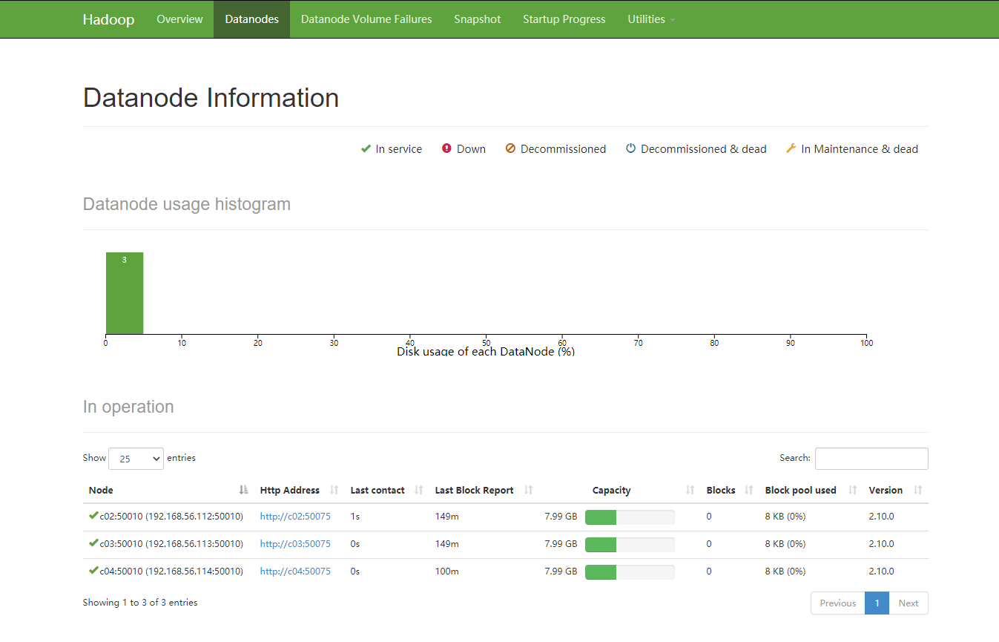

<!--
 * @Autor: 李逍遥
 * @Date: 2021-03-21 12:02:04
 * @LastEditors: 李逍遥
 * @LastEditTime: 2021-04-06 17:26:58
 * @Descriptiong: 
-->

# 目录 #

- [目录](#目录)
- [HADOOP](#hadoop)
  - [安装和配置](#安装和配置)
    - [安装jdk环境](#安装jdk环境)
    - [安装配置Hadoop2](#安装配置hadoop2)
    - [Hadoop集群管理](#hadoop集群管理)
  - [Hadoop分布式文件系统](#hadoop分布式文件系统)
    - [hdfs的设计](#hdfs的设计)
    - [hdfs的概念](#hdfs的概念)
    - [hdfs常用操作](#hdfs常用操作)
    - [使用客户端API访问hdfs](#使用客户端api访问hdfs)

# HADOOP #

The Apache™ Hadoop® project develops open-source software for reliable, scalable, distributed computing.  

The Apache Hadoop software library is a framework that allows for the distributed processing of large data sets across clusters of computers using simple programming models.  
It is designed to scale up from single servers to thousands of machines, each offering local computation and storage.  
Rather than rely on hardware to deliver high-availability, the library itself is designed to detect and handle failures at the application layer, so delivering a highly-available service on top of a cluster of computers, each of which may be prone to failures.  

- hdfs 存储系统  
- mapreduce MR，编程模型  
- yarn 资源调度  

## 安装和配置 ##

>以centos7系统为例，jdk版本为Java8，hadoop版本为2.10  

### 安装jdk环境 ###

>在root用户下安装  

- 使用Linux通用包进行安装  

    ```shell
    # 解压
    tar xf jdk-8u281-linux-x64.tar.gz
    # 创建目录
    mkdir /application
    # 移动到刚刚创建的目录中
    mv jdk1.8.0_281 /application/
    # 创建jdk的软连接(符号连接)
    cd /application
    ln -s jdk1.8.0_281 jdk
    # 验证jdk是否安装成功
    cd /application/jdk/bin
    ./java -version
    ```

- 配置JAVA_HOME环境变量  

    ```shell
    # 编辑全局配置文件
    vim /etc/profile
    # 添加以下配置项
    export JAVA_HOME=/application/jdk
    export PATH=$PATH:$JAVA_HOME/bin
    # 使配置生效
    source /etc/profile
    # 验证
    java -version
    ```

### 安装配置Hadoop2 ###

- 创建hadoop用户  

    ```shell
    # 创建一个可登陆的用户
    useradd -m hadoop -s /bin/bash
    # 设置密码
    passwd hadoop
    # 为hadoop用户增加管理员权限
    visudo
    # 找到 root ALL=(ALL) ALL 这行(应该在100行，可以使用```:98```命令直接跳转到100行)
    # 然后在这行下面增加一行内容 hadoop ALL=(ALL) ALL（其中的间隔符使用tab），然后保存修改；
    hadoop ALL=(ALL) ALL
    ```

- 安装hadoop  

    ```shell
    # 解压
    tar xf hadoop-2.10.0.tar.gz
    # 移动到刚刚创建的目录中
    mv hadoop-2.10.0 /application/
    # 赋予hadoop用户权限
    chown -R hadoop:hadoop /application/hadoop-2.10.0
    # 切换到hadoop用户
    su hadoop
    # 创建jdk的软连接
    cd /application
    sudo ln -s hadoop-2.10.0 hadoop
    # 验证是否安装成功
    cd /application/hadoop/bin
    ./hadoop version
    ```

- 配置hadoop环境变量  

    ```shell
    # 编辑全局配置文件
    sudo vim /etc/profile
    # 添加以下配置项
    export HADOOP_HOME=/application/hadoop
    export PATH=$PATH:$HADOOP_HOME/bin:$HADOOP_HOME/sbin
    # 使配置生效
    sudo source /etc/profile
    # 验证
    hadoop version
    ```

- 本地模式:standalone(local)  
  安装好hadoop之后就是本地模式，使用的就是centos的文件系统，不需要启动单独的hadoop进程。  

- 伪分布式:Pseudodistributed mode  
  - 进入${HADOOP_HOME}/etc/hadoop目录配置四个文件  

    ```txt
    core-site.xml
    hdfs-site.xml
    mapred-site.xml
    yarn-site.xml
    后两个是yarn的配置文件，如果不需要启动yarn的话，可以不用配置
    ```

  - 在 core-site.xml 中增加以下配置  

    ```xml
    <configuration>
        <property>
            <name>fs.defaultFS</name>
            <value>hdfs://localhost:9000</value>
        </property>
    </configuration>
    ```

  - 在 hdfs-site.xml 中增加以下配置  

    ```xml
    <configuration>
        <property>
            <name>dfs.replication</name>
            <value>1</value>
        </property>
    </configuration>
    ```

  - 在 mapred-site.xml 中增加以下配置  
    注意，要先复制 mapred-site.xml.template 为 mapred-site.xml 文件  

    ```xml
    <configuration>
        <property>
            <name>mapreduce.framework.name</name>
            <value>yarn</value>
        </property>
    </configuration>
    ```

  - 在 yarn-site.xml 中增加以下配置  

    ```xml
    <configuration>
        <property>
            <name>yarn.resourcemanager.hostname</name>
            <value>localhost</value>
        </property>
        <property>
            <name>yarn.nodemanager.aux-services</name>
            <value>mapreduce_shuffle</value>
        </property>
    </configuration>
    ```

  - 配置本机的SSH免密登录  
    即在本地配置ssh登录，配置方法见 linux/使用笔记  
    另外，最好配置下主机名和静态ip，配置方法见 linux/使用笔记 和 开发环境/为virtual虚拟机设置静态ip  

  - 配置完后格式化文件系统  
    `hadoop namenode -format`  

  - 启动hadoop  
    `start-all.sh`

  - 通过 `jps` 查看是否启动成功  

  - 停止hadoop所有进程  
    `stop-all.sh`

  - 报错  
    报错信息如下：  

    ```shell
    [hadoop@c01 download]$ start-all.sh
    This script is Deprecated. Instead use start-dfs.sh and start-yarn.sh
    Starting namenodes on [localhost]
    localhost: Error: JAVA_HOME is not set and could not be found.
    localhost: Error: JAVA_HOME is not set and could not be found.
    Starting secondary namenodes [0.0.0.0]
    0.0.0.0: Error: JAVA_HOME is not set and could not be found.
    starting yarn daemons
    starting resourcemanager, logging to /application/hadoop-2.10.0/logs/yarn-hadoop-resourcemanager-c01.out
    localhost: Error: JAVA_HOME is not set and could not be found.

    # 需要修改 hadoop-env.sh 文件中的 Java配置
    [hadoop@c01 hadoop]$ vim /application/hadoop/etc/hadoop/hadoop-env.sh
    # 找到以下配置
    export JAVA_HOME=${JAVA_HOME}
    # 将 JAVA_HOME 修改为实际值
    export JAVA_HOME=/application/jdk
    ```

  - 通过webui查看hadoop文件系统  
    默认地址：<http://ip:50070/>  

  - 关闭centos防火墙  

    ```shell
    # centos7
    # 停止防火墙
    sudo systemctl stop firewalld.service
    # 禁止开机启动
    sudo systemctl disable firewalld.service
    # 查看防火墙状态
    sudo systemctl status firewalld.service

    #另一种方法
    # 启用开机自启
    sudo chkconfig firewalld on
    # 禁用开机自启
    sudo chkconfig firewalld off
    ```

- 完全分布式  
  namenode 名称节点，目录  
  datanode 数据节点，数据  

  - 准备4台机器，并创建hadoop用户  
    四台机器分别命名为 c01,c02,c03,c04  
    创建登录用户hadoop并赋予管理员权限，配置Java环境和hadoop本地安装，操作参照上面。  
    >注意各主机的 /etc/hosts 配置要去掉localhost项，并且要配置互信主机的ip+主机名。  
  - 配置其它主机与c01的相互ssh免密登陆  

    ```shell
    # 先配置本机的ssh免密登录
    cat id_rsa.pub >> authorized_keys
    # 查看其它服务器的家目录情况
    ssh hadoop@c02 ls -al ~
    # 没有 .ssh 目录，可以先用以下命令生成，然后再清空目录
    ssh-keygen -t rsa -P '' -f ~/.ssh/id_rsa
    # 将c01的公钥登记到其他主机的授权文件中(注意，该命令为覆盖)
    scp id_rsa.pub hadoop@c02:~/.ssh/authorized_keys
    scp id_rsa hadoop@c02:~/.ssh/
    ```

  - 修改以下配置文件(${HADOOP_HOME}/etc/hadoop目录下)  

    ```txt
    core-site.xml
    hdfs-site.xml
    yarn-site.xml
    slaves
    hadoop-env.sh
    ```

    >注意，可以将${HADOOP_HOME}/etc下的hadoop目录分别复制两个——伪分布式和分布式，以软连接的方式调整hadoop目录的指向。比如复制为 local,pseud,full 在三个目录下分别配置不同模式。  

  - 在 core-site.xml 中修改为以下配置  

    ```xml
    <configuration>
        <property>
            <name>fs.defaultFS</name>
            <value>hdfs://c01/</value>
        </property>
    </configuration>
    ```

  - 在 hdfs-site.xml 中修改以下配置  

    ```xml
    <configuration>
        <property>
            <name>dfs.replication</name>
            <value>3</value>
        </property>
    </configuration>
    ```

  - 在 yarn-site.xml 中修改以下配置  

    ```xml
    <configuration>
        <property>
            <name>yarn.resourcemanager.hostname</name>
            <value>c01</value>
        </property>
        <property>
            <name>yarn.nodemanager.aux-services</name>
            <value>mapreduce_shuffle</value>
        </property>
    </configuration>
    ```

  - 在 slaves 中修改成以下配置  

    ```txt
    c02
    c03
    c04
    ```

  - 修改 hadoop-env.sh 中的Java配置  
    `export JAVA_HOME=/application/jdk`  

  - 分发配置到其他主机  

    ```shell
    scp -r full hadoop@c02:/application/hadoop/etc/
    scp -r full hadoop@c03:/application/hadoop/etc/
    scp -r full hadoop@c04:/application/hadoop/etc/
    ```

    >使用 rsync 命令可以把软连接也分发到远程主机上。  

  - 修改各主机的 `etc/hadoop` 软连接  

    ```shell
    # 先删除软连接
    rm hadoop
    ssh c02 rm /application/hadoop/etc/hadoop
    ssh c03 rm /application/hadoop/etc/hadoop
    ssh c04 rm /application/hadoop/etc/hadoop
    # 再建新的软连接
    ln -s full hadoop
    ssh c02 ln -s /application/hadoop/etc/full /application/hadoop/etc/hadoop
    ssh c03 ln -s /application/hadoop/etc/full /application/hadoop/etc/hadoop
    ssh c04 ln -s /application/hadoop/etc/full /application/hadoop/etc/hadoop
    ```

  - 删除临时目录文件  

    ```shell
    rm -rf /tmp/hadoop-hadoop
    ssh c02 rm -rf /tmp/hadoop-hadoop
    ssh c03 rm -rf /tmp/hadoop-hadoop
    ssh c04 rm -rf /tmp/hadoop-hadoop
    ```

  - 删除hadoop运行日志

    ```shell
    rm -rf /application/hadoop/logs/*
    ssh c02 rm -rf /application/hadoop/logs/*
    ssh c03 rm -rf /application/hadoop/logs/*
    ssh c04 rm -rf /application/hadoop/logs/*
    ```

  - 配置完后格式化namenode节点(c01主机)  
    `hadoop namenode -format`  

  - 启动hadoop  
    `start-all.sh`  
    推荐使用：`start-dfs.sh` + `start-yarn.sh`  

  - 最终通过webui查看各数据节点的情况  
    地址为：<http://ip:50070/>  
    

### Hadoop集群管理 ###

- 制作一个简单的分发同步脚本  
  使用 `rsync` 命令  
  各个节点主机都要安装 `rsync`  

  ```shell
  yum -y install rsync
  #启动rsync服务
  systemctl start rsyncd.service
  systemctl enable rsyncd.service

  #检查是否已经成功启动
  netstat -lnp|grep 873
  ```

  在 `/usr/local/bin` 下制作分发同步脚本  

  ```shell
  # 文件名 xsync.sh
  # 脚本内容
  #!/bin/bash
  # 1. 获取输入的参数的个数,如果没有参数,直接退出
  put_count=$#
  if(($put_count==0));then
      echo "没有输入需要同步的文件名称!请在运行是输入 ! 例如 ./xsync test.txt";
      exit;
  fi

  # 2. 获取文件名称
  p1=$1
  file_name=`basename $p1`
  echo file_name=$file_name

  # 3. 获取上级目录的绝对路径
  put_dir=`cd -P $(dirname $p1);pwd`
  echo put_dir=$put_dir

  # 4. 获取当前用户名称（已经设置无密登录，不需要这步）
  # user=`whoami`

  # 5. 循环同步到各个节点
  i=1
  for (( i=2 ; i <= 4 ; i = $i + 1 )) ; do
      echo -------------------c0$i---------------------
      rsync -rvl $put_dir/$file_name c0$i:$put_dir
  done

  # 添加可执行权限
  chmod +x xsync.sh
  ```

  之后就可以在任何地方使用 `xsync.sh filename` 来进行各节点的同步。  

- 创建一个查看集群jps脚本 xcall.sh  

  ```shell
  cd /usr/local/bin
  touch xcall.sh
  vim xcall.sh

  # xcall.sh 内容
  #!/bin/bash
  params=$@
  i=1
  for (( i=1 ; i <= 4 ; i = $i + 1 )) ; do
      echo ============= c0$i $params =============
      ssh c0$i "$params"
  done

  # 添加执行权限
  chmod +x xcall.sh

  # 所有的主机都要建软连接
  ln -s /application/jdk/bin/java java
  ln -s /application/jdk/bin/jps jps
  ```

  查看各节点的进程 `xcall.sh jps`  

  ```txt
  ============= c01 jps =============
  2930 Jps
  1639 NameNode
  1834 SecondaryNameNode
  1981 ResourceManager
  ============= c02 jps =============
  2957 NodeManager
  3326 Jps
  2847 DataNode
  ============= c03 jps =============
  3014 Jps
  2733 NodeManager
  2623 DataNode
  ============= c04 jps =============
  2737 NodeManager
  2627 DataNode
  3022 Jps
  ```

  关闭各节点防火墙  

  ```shell
  su root
  xcall.sh "systemctl stop firewalld"
  xcall.sh "systemctl disable firewalld"
  ```

- 符号连接的相关操作  

  ```shell
  # -h 针对符号连接本身，而不是所指文件
  sudo chown -h hadoop:hadoop jps
  # 修改符号连接(覆盖原有的连接)
  sudo ln -sfT xxx yyy
  ```

- Hadoop启动脚本分析  
  - `sbin/start-all.sh` 脚本包含以下脚本  

    ```txt
    libexec/hadoop-config.sh
    start-dfs.sh
    start-yarn.sh
    ```

  - `sbin/start-dfs.sh` 脚本包含以下脚本  

    ```shell
    libexec/hadoop-config.sh
    sbin/hadoop-daemons.sh --config .. --hostname .. start namenode ...
    sbin/hadoop-daemons.sh --config .. --hostname .. start datanode ...
    sbin/hadoop-daemons.sh --config .. --hostname .. start secondarynamenode ...
    # 容灾进程
    # bin/hadoop-daemons.sh --config .. --hostname .. start zkfc ...
    ```

  - `sbin/start-yarn.sh` 脚本包含以下脚本  

    ```shell
    libexec/hadoop-config.sh
    sbin/yarn-daemon.sh --config .. start resourcemanager
    sbin/yarn-daemons.sh --config .. start nodemanager
    ```

  - `sbin/hadoop-daemons.sh` 脚本包含以下脚本  

    ```shell
    libexec/hadoop-config.sh
    slaves
    sbin/hadoop-daemon.sh 
    ```

  - `sbin/hadoop-daemon.sh` 脚本包含以下脚本  

    ```shell
    libexec/hadoop-config.sh
    bin/hdfs ...
    ```

  - `sbin/yarn-daemon.sh` 脚本包含以下脚本  

    ```shell
    libexec/hadoop-config.sh
    bin/hdfs ...
    ```

  - 综上，单独启动停止节点进程  

    ```shell
    # 启动本机上的名称节点
    hadoop-daemon.sh start namenode
    # 启动所有的数据节点
    hadoop-daemons.sh start datanode
    # 启动辅助名称节点
    hadoop-daemon.sh start secondarynamenode
    ```

    >注意：  
    >1.将start改成stop就是停止进程的命令。  
    >2.daemon 脚本启动/停止的是本机，daemons 脚本启动/停止的是slaves  

- 配置新的本地目录  
  在 `core-site.xml` 配置文件中加入以下配置：  

  ```xml
  <property>
      <name>hadoop.tmp.dir</name>
      <value>file:/home/hadoop/tmp</value>
      <description>Abase for other temporary directories.</description>
  </property>
  ```

  清空各节点的临时目录和日志目录。  
  分发文件 `xsync.sh core-site.xml`  
  在namenode节点格式化文件系统 `hadoop namenode -format` (等价于 hdfs ...)  
  启动hadoop `start-dfs.sh`  

## Hadoop分布式文件系统 ##

### hdfs的设计 ###

HDFS以流式数据访问模式来存储超大文件，运行于商用集群上。  

- **超大文件** GB/TB/PB级别的文件。  
- **流式访问** 一次写入多次读取的访问模式。  
- **低时间延迟的数据访问** 对时间延迟特别敏感的数据访问应用，不适合在HDFS上运行。HDFS是为高数据吞吐量应用优化的，会造成时间延迟比较高。对于低延迟的访问需求，建议使用HBASE。  
- **大量的小文件** 由于 namenode 将文件系统的元数据存储在内存中，因此该文件系统所能存储的文件总数受限于 namenode 的内存容量。  
- **多用户写入，任意修改** HDFS 中的文件写入只支持单个写入者，且写操作是以追加的方式进行的。对于多用户的写入和任意位置的修改不支持或者比较低效。  

### hdfs的概念 ###

- 数据块  
  文件系统最小的存储单元，默认为128M。  
  块的大小定为128M是平衡了寻址开销与数据传输速率(100M/s)，为了使寻址时间仅占传输时间的1%，随着磁盘传输速率的提升块的大小可以设置的更大。  

- namenode 和 datanode  
  HDFS 集群有两类节点以管理节点-工作节点的模式运行，即一个 namenode和多个datanode。  

- 块缓存  
- 联邦 HDFS  
- HDFS 的高可用  

### hdfs常用操作 ###

- bin/hadoop 命令  

  ```shell
  # 查看版本信息
  hadoop version
  # 开启文件系统客户端
  hadoop fs
  #
  hadoop jar
  # 查看类路径
  hadoop classpath
  hadoop checknative
  ```

- bin/hdfs 命令  

  ```txt
  dfs                 ——  等价于 hadoop fs
  classpath
  namenode -format
  secondarynamenode
  namenode
  journalnode
  zkfc
  datanode
  debug
  dfsadmin
  dfsrouter
  dfsrouteradmin
  haadmin
  fsck
  balancer
  jmxget
  mover

  oiv
  oiv_legacy
  oev
  fetchdt
  getconf
  groups
  snapshotDiff

  lsSnapshottableDir

  portmap
  nfs3
  cacheadmin
  crypto
  storagepolicies
  version
  ```

- `hdfs dfs` 命令  

  ```shell
  # 查看支持的全部命令
  hdfs dfs
  # 查看全部/具体命令帮助
  hdfs dfs -help [cmd ...]
  # 类似Linux文件系统的命令
  -ls
  -rm
  -mkdir
  -mv
  -cat
  # 上传本地文件到hadoop文件系统中
  -put
  # 从hadoop文件系统中下载文件到本地
  -get
  ```

### 使用客户端API访问hdfs ###

>这里主要使用Java接口。  

- 通过Java来操作hdfs系统  
  - 创建Java项目  
  - 导入hadoop类库  
  - 通过FileSystem API读取数据  
  - 实现增删改查

- maven  
  项目管理软件，管理软件之间的依赖关系。  
  - 下载  
    地址为：<http://maven.apache.org/download.cgi>  
  - 解压后将路径配置到环境变量中  
    `M2_HOME=D:\work\apache-maven-3.8.1`
    `PATH=...;%M2_HOME%\bin`
  - 验证是否安装成功  
    `mvn -v`  
  >Linux中配置方法相似。  

- maven依赖  

  ```xml
  <dependency>
    <!-- 组id，解析成目录 org/apache/hadoop/hadoop-hdfs/2.10.0 -->
    <groupId>org.apache.hadoop</groupId>
    <!-- 工件id -->
    <artifactId>hadoop-hdfs</artifactId>
    <!-- 版本 -->
    <version>2.10.0</version>
  </dependency>
  ```

