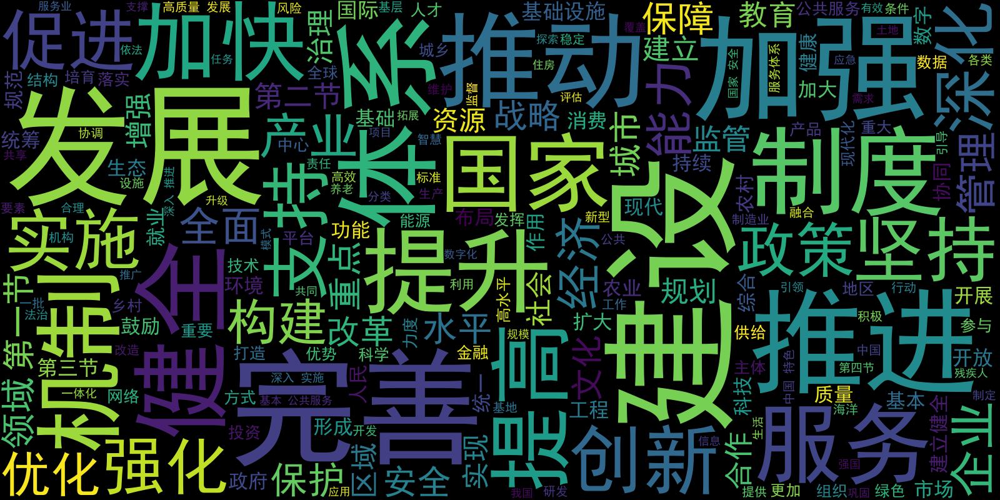
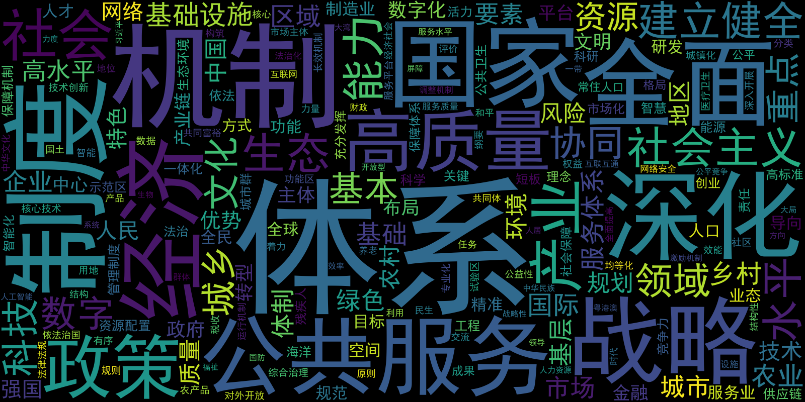
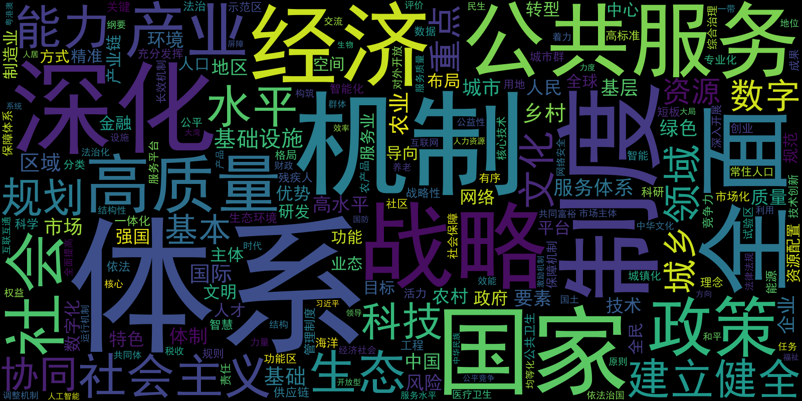
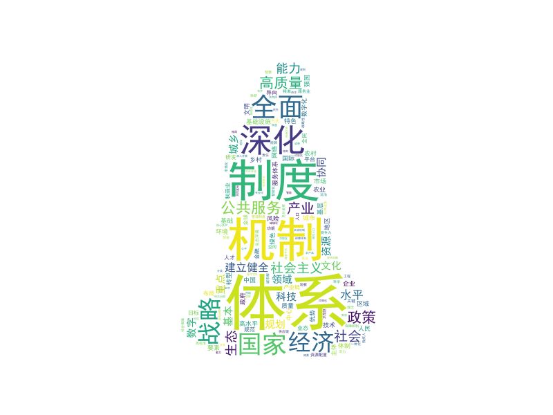

<!--
 * @Autor: 李逍遥
 * @Date: 2021-03-19 15:15:42
 * @LastEditors: 李逍遥
 * @LastEditTime: 2021-03-19 16:12:49
 * @Descriptiong: 
-->

# 目的 #

- [目的](#目的)
- [步骤](#步骤)
  - [制作报告文本](#制作报告文本)
  - [开始分析](#开始分析)
    - [文本预处理](#文本预处理)
    - [1.根据文本生成词云](#1根据文本生成词云)
    - [2.根据词频生成词云](#2根据词频生成词云)
    - [3.将词云制作到指定的背景轮廓中](#3将词云制作到指定的背景轮廓中)
- [总结](#总结)

使用Python对《第十四个五年规划和2035年远景目标纲要》进行数据可视化分析，即从中提取关键词制作成词云图，观察其中的重点内容。  

# 步骤 #

## 制作报告文本 ##

找到报告文本，将其保存成txt格式的文件。  
链接为：<http://www.gov.cn/xinwen/2021-03/13/content_5592681.htm>  

## 开始分析 ##

### 文本预处理 ###

- 直接读取文本到列表中

    ```python
    with open('GovernmentWorkingReport_2021.txt', encoding='utf-8') as f:
        st2 = f.readlines()
    ```

- 发现文本中有很多\n ,这里去除掉换行干扰

    ```python
    st3 = []
    for sentence in st2:
        if sentence != '\n':
            st3.append(sentence.rstrip('\n'))
    ```

- 使用结巴分词

    ```python
    # 使用列表解析遍历st3，并将其做分词切割后做成列表
    word_list = [" ".join(jieba.cut(sentence)) for sentence in st3]
    # 将分词后的列表用空格连接起来
    new_text = ' '.join(word_list)
    ```

### 1.根据文本生成词云 ###

- 直接制作词云图

    ```python
    # 设置词云的字体和背景颜色
    wc = WordCloud(font_path='simhei.ttf', background_color='black', width=1600, height=800).generate(new_text)
    # 作图
    plt.imshow(wc)
    # 不显示轴
    plt.axis("off")
    # 显示词云图
    plt.show()
    # 保存词云图
    wc.to_file('GWR_2021_1.png')
    ```

    

- 对分词进行过滤保留名词等，再制作词云图

    ```python
    # 看到词云明显有太多数词被，这里试着过滤出名词等看看词云的情况
    import jieba.analyse
    allowPOS = ('n','ng','nr','nrfg','nrt','ns','nt','nz','i','l','j','q')
    # 使用列表解析遍历st3，并将其做分词切割后做成列表
    word_list = [" ".join(jieba.analyse.extract_tags(sentence, allowPOS=allowPOS)) for sentence in st3]
    # 将分词后的列表用空格连接起来
    new_text = ' '.join(word_list)
    # 重新生成词云
    # 设置词云的字体和背景颜色
    wc = WordCloud(font_path='simhei.ttf', background_color='black', width=1600, height=800).generate(new_text)
    # 作图
    plt.imshow(wc)
    plt.axis("off")
    plt.show()
    wc.to_file('GWR_2021_2.png')
    ```

    

### 2.根据词频生成词云 ###

```python
from collections import Counter
# 计算词频
con_words = [x for x in jieba.cut(new_text) if len(x) >= 2]
# 生成词频字典
frequencies = Counter(con_words).most_common()
frequencies = dict(frequencies)
# 设置词云的字体、背景颜色、画布的宽和高
# 注意，如果不设置宽和高，默认是400和200
wc = WordCloud(font_path='simhei.ttf', background_color='black', width=1600, height=800, max_words=200).fit_words(frequencies)
# 作图
plt.imshow(wc)
plt.axis("off")
plt.show()
wc.to_file('GWR_2021_fre.png')
```



### 3.将词云制作到指定的背景轮廓中 ###

- 来一张小姐姐

    

    >注意这里的背景图片的画布一定要设置为白色(#FFFFFF)  

- 制作词云图

    ```python
    from scipy.misc import imread
    # 引入背景轮廓图
    pc_mask = imread('apchong.png')
    # 为上述词频词云设置背景轮廓
    wc = WordCloud(font_path='simhei.ttf', background_color='white', width=1600, height=800, max_words=200, mask=pc_mask).fit_words(frequencies)
    plt.imshow(wc)
    plt.axis('off')
    plt.show()
    wc.to_file('GWR_2021_fre_girl.png')
    ```

    

# 总结 #

从以上的分析可以看出，纲要中提到的最多的词除了“体系”、“机制”、“深化”、“经济”等，展示了国家在深入改革方面的态度外，还能看到诸如“高质量”、“绿色”、“研发”、“基础设施”、“文化”、“乡村”等词，我们有没有从中找到下个五年或者十五年的发展方向呢。  
