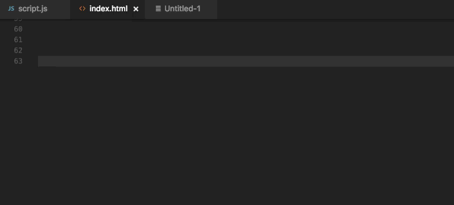
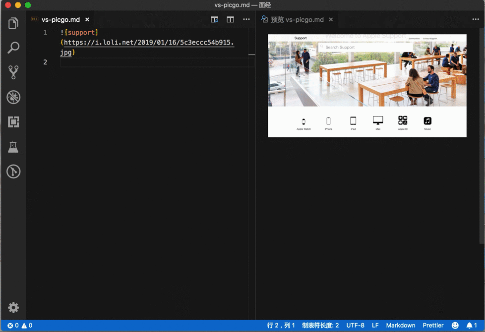
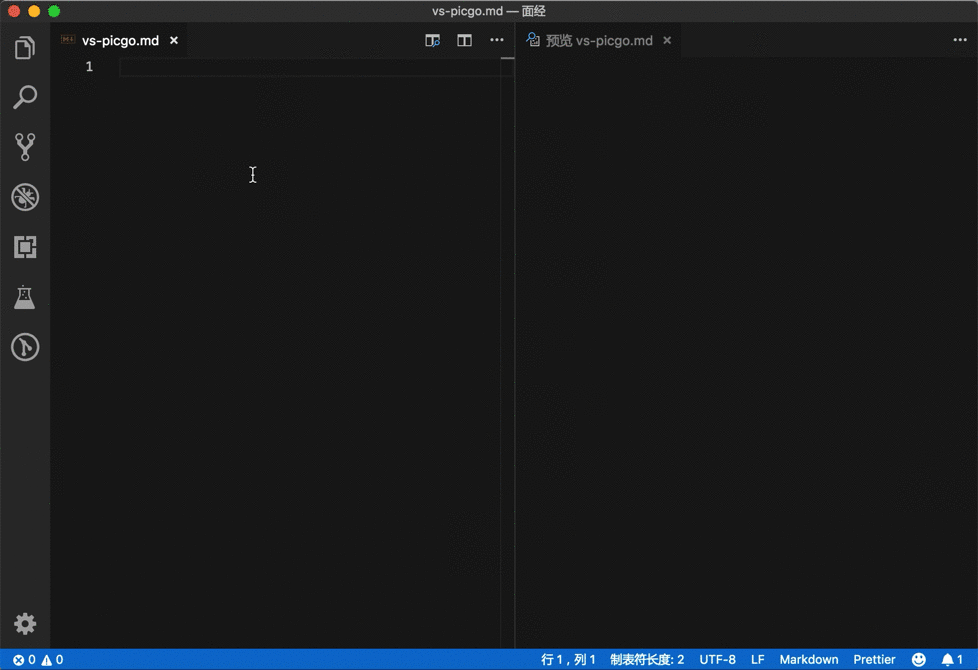
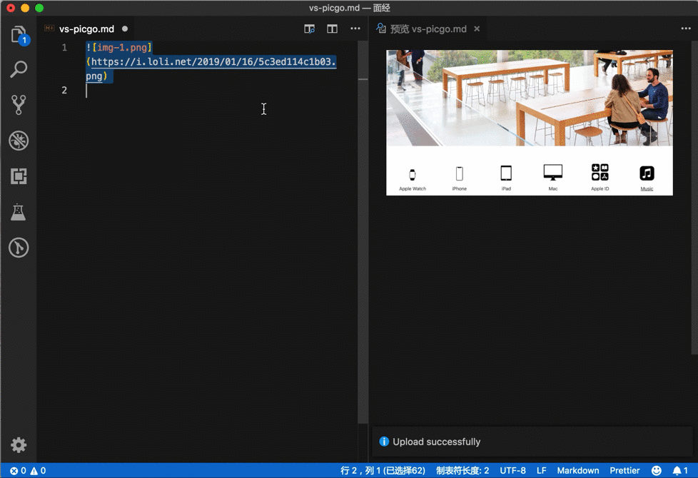

<!--
 * @Author: your name
 * @Date: 2019-12-02 11:06:37
 * @LastEditTime: 2021-03-09 06:29:32
 * @LastEditors: 李逍遥
 * @Description: In User Settings Edit
 * @FilePath: \GitRepository\study_note\vscode\setting.md
 -->

# vscode配置和插件学习 #

## 用户配置 ##

- 配置文件(settings.json)地址： C:\Users\icss\AppData\Roaming\Code\User

## 插件 ##

- Icon Fonts

  这是一个能够在项目中添加图标字体的插件。该插件支持超过 20 个热门的图标集，包括了 Font Awesome、Ionicons、Glyphicons 和 Material Design Icons。  

  >插件地址：<https://marketplace.visualstudio.com/items?itemName=idleberg.icon-fonts>  

- PicGo  
  图床「神器」  
  VSCode的PicGo插件vs-picgo，操作方式如下：  
  

  - 从剪贴板上传图片到图床  
    Windows/Unix: Ctrl + Alt + u
    OsX: Cmd + Opt + u
    

  - 从文件夹上传图片到图床  
    Windows/Unix: Ctrl + Alt + e  
    OsX: Cmd + Opt + e  
    

  - 从输入框中输入图片名称上传到图床  
    Windows/Unix: Ctrl + Alt + o  
    OsX: Cmd + Opt + 0  
    

  >插件地址：<https://marketplace.visualstudio.com/items?itemName=Spades.vs-picgo>  
  >GitHub地址：<https://github.com/PicGo>  
  >PicGo产品介绍：<https://sspai.com/post/52527>  
  >PicGo产品文档：<https://picgo.github.io/PicGo-Doc/zh/guide/>  
