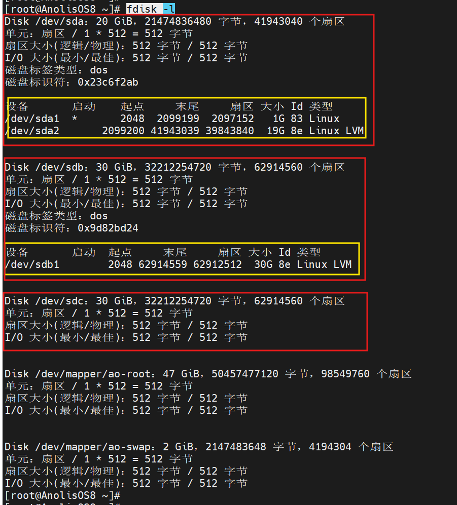
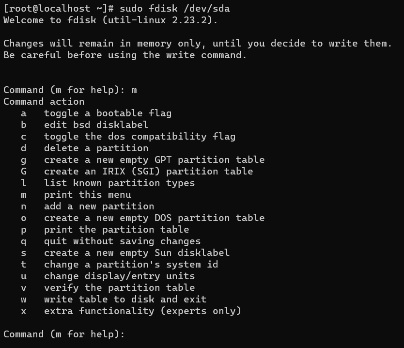
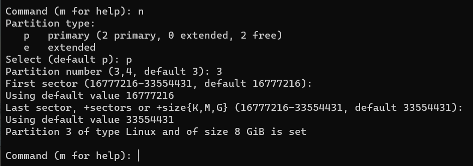
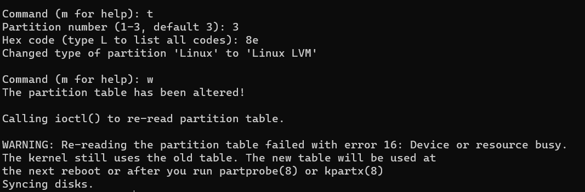
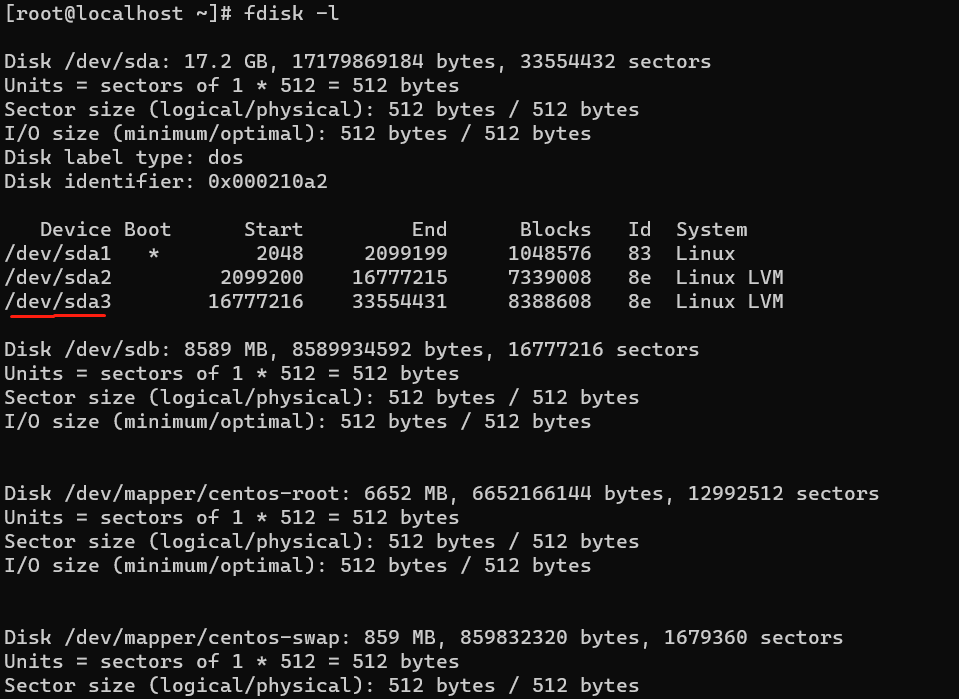
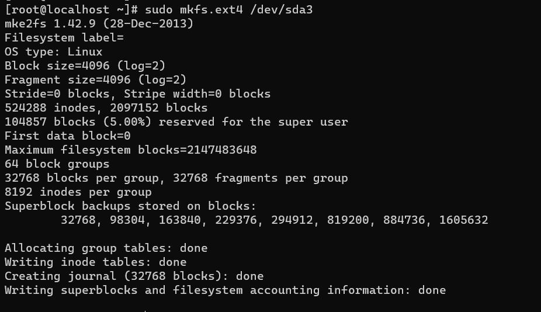
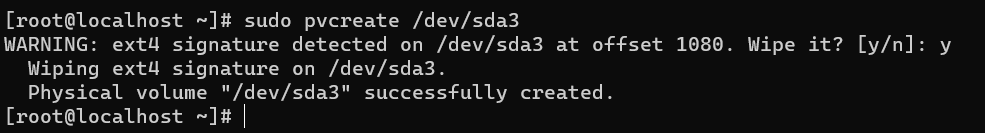
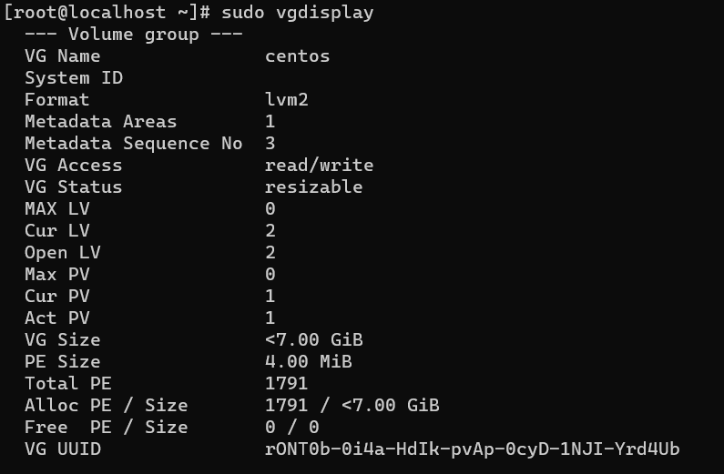
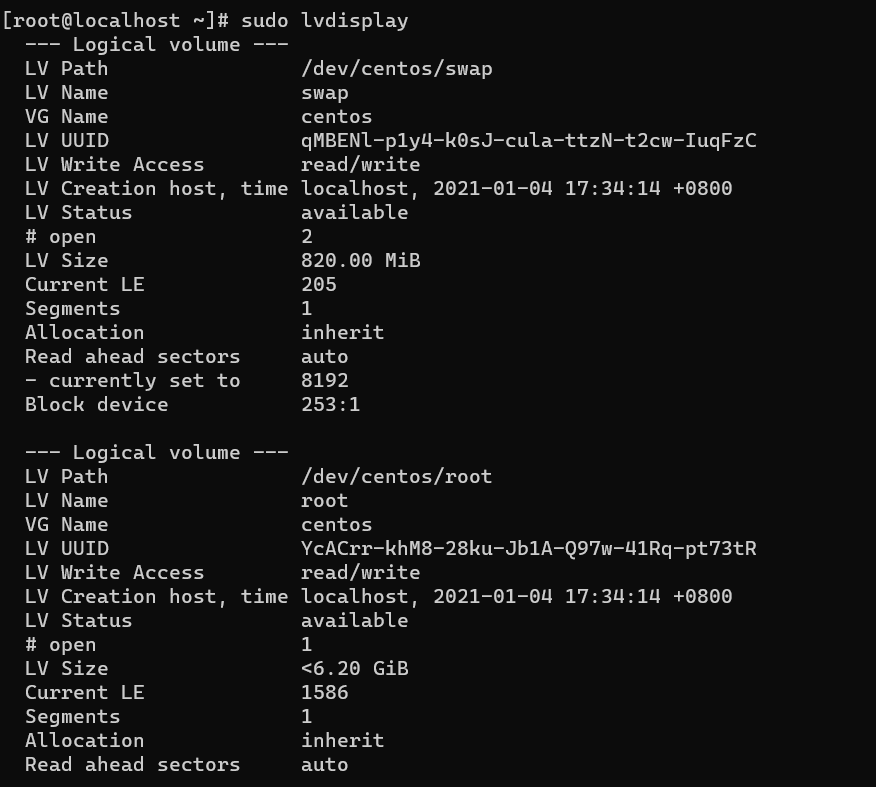
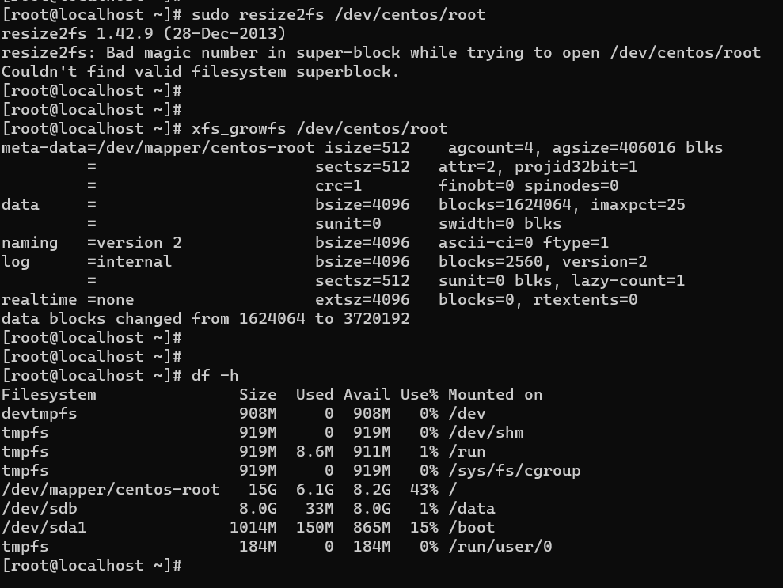

<!--
 * @Autor: 李逍遥
 * @Date: 2021-02-13 11:34:25
 * @LastEditors: 学海
 * @LastEditTime: 2024-07-09 22:00:27
 * @Descriptiong: 
-->

# 给VirtualBox的centos7虚拟机扩容 #

>在Windows中使用VirtualBox虚拟机时，当创建虚拟机时分配的存储不够用时，需要给存储扩容，这里以centos7为例。

## 在宿主机中为虚拟硬盘文件扩容 ##

打开cmd命令行，将目录切换到 VirtualBox 的安装目录，使用 `VBoxManage modifyhd` 重新分配虚拟硬盘空间，命令如下：

```cmd
VBoxManage modifyhd "D:\work\workspace\VirtualBox\mysql_train\mysql_train.vdi" --resize 16384
```

>注意：
>1.需要在命令行中先将目录切换到VirtualBox的安装目录，即 `VBoxManage.exe` 所在的目录；
>2.resize 后的参数是要分配的空间大小，以M为单位；
>3.也可以在VirtualBox的设置中直接添加虚拟磁盘，可以参考该博文，<https://blog.csdn.net/weixin_51722520/article/details/129763328>，后续磁盘的挂载步骤是一样的，挂载到一个新目录请参考该博文，挂载到系统目录请继续按照以下文档操作。

## 启动虚拟机，将新增空间挂载到系统盘 ##

### 使用 fdisk 程序创建分区 ###

- 查看磁盘  
  如果是分配过的磁盘会有黄框中的分区信息，需要对 /dev/sdc 进行分区。  

    ```shell
    fdisk -l
    ```

    

- 进入 `fdisk`

    ```shell
    sudo fdisk /dev/sda
    ```

- 获取帮助文档
  输入命令 `m`

    

- 添加一个分区
  输入命令 `n` ，选择 `p` ，这里不能选择 `e` ，不然后面的操作会受阻，其它操作用默认的，直接按回车就行了

    

- 将新分区类型修改为 `Linux LVM`
  输入命令 `t` 来改变磁盘的system id，输入8e，输入 `w` 保存并退出

    

- 使用 `reboot` 命令重启系统

### 挂载分区 ###

- 查看分区

    ```shell
    sudo fdisk -l
    ```

    

- 将分区格式化为ext4格式

    ```shell
    sudo mkfs.ext4 /dev/sda3
    ```

    

- 创建新的物理分区

    ```shell
    sudo pvcreate /dev/sda3
    ```

    

- 查看虚拟卷
  `pvdisplay` 查看物理卷, `lvdisplay` 查看逻辑卷

    ```shell
    sudo vgdisplay
    ```

    

- 扩展到卷组

    ```shell
    sudo vgextend centos /dev/sda3
    ```

- 查看逻辑卷

    ```shell
    sudo lvdisplay
    ```

    

- 扩展逻辑卷空间

    ```shell
    sudo lvextend /dev/centos/root /dev/sda3
    ```

- 刷新逻辑分区容量

    ```shell
    # 刷新逻辑分区容量
    sudo resize2fs /dev/centos/root
    # 如果报错则是因为某些分区使用的是xfs的文件系统，执行以下命令刷新逻辑分区即可
    xfs_growfs /dev/centos/root
    # 再执行下面的命令，就发现根目录容量变大了
    sudo df -h
    ```

    
