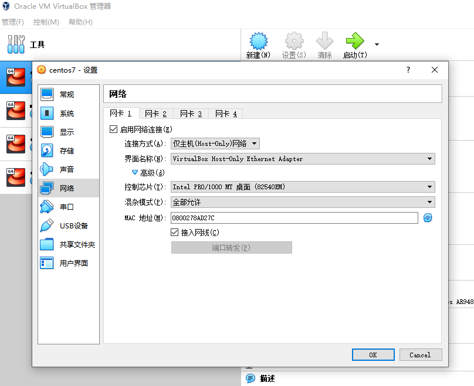
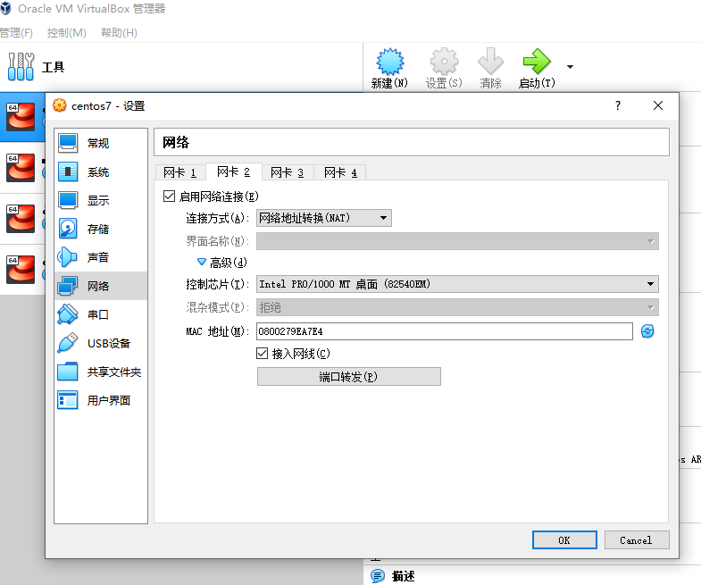
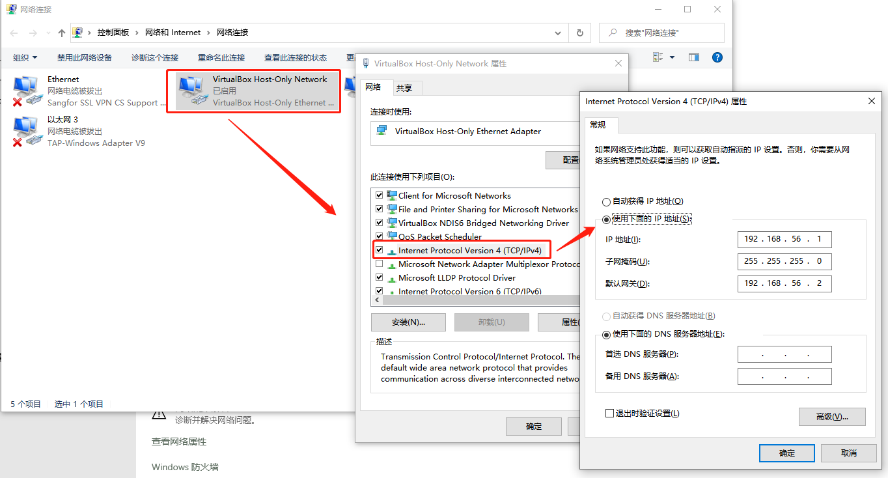

# 目录 #

- [目录](#目录)
- [背景介绍](#背景介绍)
  - [虚拟机支持的常用网络模式](#虚拟机支持的常用网络模式)
    - [网络地址转换(NAT)模式](#网络地址转换nat模式)
    - [Host-Only模式](#host-only模式)
    - [桥接模式](#桥接模式)
  - [目的](#目的)
    - [1.静态ip](#1静态ip)
    - [2.虚拟机和宿主机互相访问](#2虚拟机和宿主机互相访问)
    - [3.能访问网络](#3能访问网络)
  - [选择](#选择)
- [实施步骤](#实施步骤)
  - [网络模式设置](#网络模式设置)
    - [1.设置网卡1](#1设置网卡1)
    - [2.设置网卡2](#2设置网卡2)
    - [3.设置宿主机的VirtualBox Host-Only Network网络](#3设置宿主机的virtualbox-host-only-network网络)
  - [虚拟机配置](#虚拟机配置)
    - [编辑enp0s3的配置](#编辑enp0s3的配置)
    - [设置网关](#设置网关)
    - [重启网络](#重启网络)
    - [测试](#测试)

# 背景介绍 #

## 虚拟机支持的常用网络模式 ##

### 网络地址转换(NAT)模式 ###

Net Adress transform 网络地址转换，共享主机的IP地址。  
使用的最多，默认为该模式。  
客户机能访问外网，也可以访问局域网内的其他物理主机，但局域网内的其他物理主机不能访问客户机。  

### Host-Only模式 ###

仅主机模式，与主机共享的专用网络。  
与NAT非常像，但不能访问外网，客户机可以访问宿主机和网络，宿主机不能访问客户机。  

### 桥接模式 ###

客户机（虚拟机）完全等同于一台物理主机，和宿主机同样直接连接到物理网络（外部网络）。  
如果局域网中是DHCP，将虚拟机设置为静态ip，存在ip冲突的风险。  

## 目的 ##

### 1.静态ip ###

动态ip每次开机都随机分配ip，从宿主机连接虚拟机(ssh)或者客户端连接等ip设置无法固定，急需静态ip  

### 2.虚拟机和宿主机互相访问 ###

方便使用ssh登录虚拟机  

### 3.能访问网络 ###

虚拟机需要联机  

## 选择 ##

基于虚拟机网络模式的特点，这里选择 NAT+Host-Only 两种模式结合，以达到上述目的。  

# 实施步骤 #

## 网络模式设置 ##

### 1.设置网卡1 ###

打开虚拟机的设置，找到网络设置，启动网卡1，选择链接方式为 host-only模式。  
>桥接模式可以保证宿主机和虚拟机相互网络访问。  



### 2.设置网卡2 ###

打开虚拟机的设置，找到网络设置，启动网卡2，连接方式选择网络地址转换(NAT)。  
>网络地址转换模式可以保证虚拟机可以联网。  



### 3.设置宿主机的VirtualBox Host-Only Network网络 ###

设置宿主机的ip，子网掩码，默认网关  



## 虚拟机配置 ##

先启动centos系统  

### 编辑enp0s3的配置 ###

在enp0s3配置中设置静态ip地址（enp0s8 是用来联网的，不需要手动指定）。  

```shell
# 修改 enp0s3 配置
vim /etc/sysconfig/network-scripts/ifcfg-enp0s3
# 完整内容如下，只需要修改 BOOTPROTO 和 ONBOOT
TYPE=Ethernet
PROXY_METHOD=none
BROWSER_ONLY=no
BOOTPROTO=static    #使用静态ip
DEFROUTE=yes
IPV4_FAILURE_FATAL=no
IPV6INIT=yes
IPV6_AUTOCONF=yes
IPV6_DEFROUTE=yes
IPV6_FAILURE_FATAL=no
IPV6_ADDR_GEN_MODE=stable-privacy
NAME=enp0s3
UUID=41d7b138-9785-49e1-b1b7-4957372d9155
DEVICE=enp0s3
ONBOOT=yes      #设置开机启动
IPADDR=192.168.56.111   #设置静态ip地址
# 以下可以不设置
#PREFIX=24
#GATEWAY=192.168.56.2
#DNS=192.168.56.2
```

参数说明：  

```txt
TYPE=Ethernet                               # 网卡类型：为以太网
PROXY_METHOD=none                           # 代理方式：关闭状态
BROWSER_ONLY=no                             # 只是浏览器：否
BOOTPROTO=dhcp                              # 网卡的引导协议：DHCP[中文名称: 动态主机配置协议]
DEFROUTE=yes                                # 默认路由：是, 不明白的可以百度关键词 `默认路由` 
IPV4_FAILURE_FATAL=no                       # 是不开启IPV4致命错误检测：否
IPV6INIT=yes                                # IPV6是否自动初始化: 是[不会有任何影响, 现在还没用到IPV6]
IPV6_AUTOCONF=yes                           # IPV6是否自动配置：是[不会有任何影响, 现在还没用到IPV6]
IPV6_DEFROUTE=yes                           # IPV6是否可以为默认路由：是[不会有任何影响, 现在还没用到IPV6]
IPV6_FAILURE_FATAL=no                       # 是不开启IPV6致命错误检测：否
IPV6_ADDR_GEN_MODE=stable-privacy           # IPV6地址生成模型：stable-privacy [这只一种生成IPV6的策略]
NAME=ens33                                  # 网卡物理设备名称
UUID=f47bde51-fa78-4f79-b68f-d5dd90cfc698   # 通用唯一识别码, 每一个网卡都会有, 不能重复, 否两台linux只有一台网卡可用
DEVICE=ens33                                # 网卡设备名称, 必须和 `NAME` 值一样
ONBOOT=no                                   # 是否开机启动， 要想网卡开机就启动或通过 `systemctl restart network`控制网卡,必须设置为 `yes` 
```

>上述IPV6相关配置项可以都设置成no  

### 设置网关 ####

>该步骤可以省略。  

编辑 `/etc/resolv.conf` 文件，添加以下配置：  
`nameserver 192.168.56.2`  

### 重启网络 ###

centos7可以使用命令 `systemctl restart network` 重启网络  
>注意，这里是虚拟机，最好还是直接重启。  

### 测试 ###

```shell
#分别测试外网，宿主机，虚拟机之间是否可以访问
ping www.baidu.com
ping 192.168.56.1
ping 192.168.56.111
```
