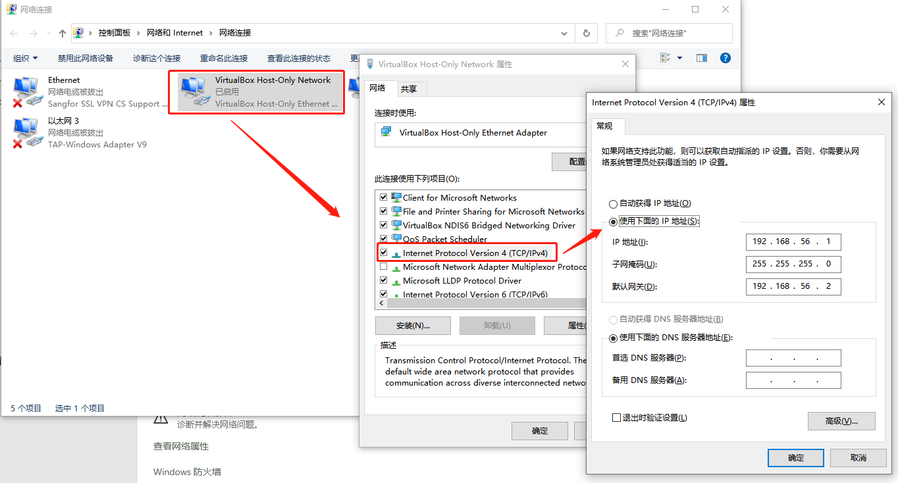
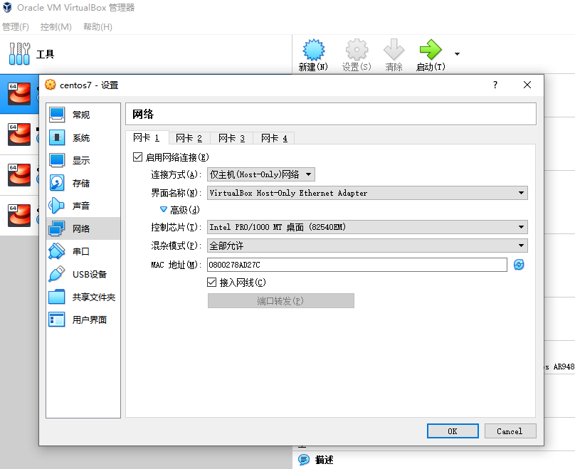
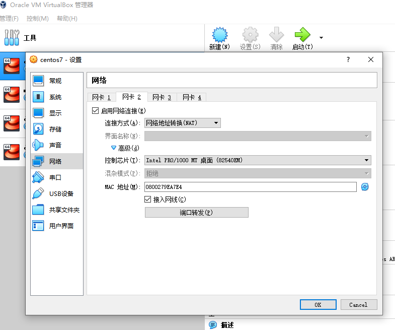

# 目录 #

- [目录](#目录)
- [背景介绍](#背景介绍)
  - [虚拟机支持的常用网络模式](#虚拟机支持的常用网络模式)
    - [网络地址转换(NAT)模式](#网络地址转换nat模式)
    - [Host-Only模式](#host-only模式)
    - [桥接模式](#桥接模式)
  - [目的](#目的)
    - [1.静态ip](#1静态ip)
    - [2.虚拟机和宿主机互相访问](#2虚拟机和宿主机互相访问)
    - [3.能访问网络](#3能访问网络)
  - [选择](#选择)
- [实施步骤](#实施步骤)
  - [网络模式设置](#网络模式设置)
    - [1.设置网卡1](#1设置网卡1)
    - [2.设置网卡2](#2设置网卡2)
    - [3.VirtualBox 网络配置（宿主机操作）](#3virtualbox-网络配置宿主机操作)
  - [虚拟机配置](#虚拟机配置)
    - [编辑enp0s3的配置](#编辑enp0s3的配置)
    - [设置网关](#设置网关)
    - [重启网络](#重启网络)
    - [测试](#测试)

# 背景介绍 #

## 虚拟机支持的常用网络模式 ##

### 网络地址转换(NAT)模式 ###

Net Adress transform 网络地址转换，共享主机的IP地址。  
使用的最多，默认为该模式。  
客户机能访问外网，也可以访问局域网内的其他物理主机，但局域网内的其他物理主机不能访问客户机。  

### Host-Only模式 ###

仅主机模式，与主机共享的专用网络。  
与NAT非常像，但不能访问外网，客户机可以访问宿主机和网络，宿主机不能访问客户机。  

### 桥接模式 ###

客户机（虚拟机）完全等同于一台物理主机，和宿主机同样直接连接到物理网络（外部网络）。  
如果局域网中是DHCP，将虚拟机设置为静态ip，存在ip冲突的风险。  

## 目的 ##

### 1.静态ip ###

动态ip每次开机都随机分配ip，从宿主机连接虚拟机(ssh)或者客户端连接等ip设置无法固定，急需静态ip  

### 2.虚拟机和宿主机互相访问 ###

方便使用ssh登录虚拟机  

### 3.能访问网络 ###

虚拟机需要联机  

## 选择 ##

基于虚拟机网络模式的特点，这里选择 NAT+Host-Only 两种模式结合，以达到上述目的。  

# 实施步骤 #

## 网络模式设置 ##

### 1.VirtualBox 网络配置（宿主机操作） ###
#### 创建Host-Only 网络
1. 打开 VirtualBox → 管理 → 工具 → 主机网络管理器
2. 点击 创建 按钮，生成一个 Host-Only 网络（默认名称：VirtualBox Host-Only Ethernet Adapter）
3. 配置网络属性（建议）：
   • IPv4 地址：192.168.56.1
   • IPv4 网络掩码：255.255.255.0

4. 禁用 DHCP 服务器（重要，确保 IP 固定）

#### 查看宿主机中网络配置
按 `Win + R`，输入 `ncpa.cpl`，回车，查看名为 **"VirtualBox Host-Only Ethernet Adapter"​** 的网络连接，如下图：



### 2.设置网卡1 ###

打开虚拟机的设置，找到网络设置，启动网卡1，选择链接方式为 host-only模式。  
>桥接模式可以保证宿主机和虚拟机相互网络访问。  



### 3.设置网卡2 ###

打开虚拟机的设置，找到网络设置，启动网卡2，连接方式选择网络地址转换(NAT)。  
>网络地址转换模式可以保证虚拟机可以联网。  




## 虚拟机配置 ##

先启动centos系统  

### 编辑enp0s3的配置 ###

在enp0s3配置中设置静态ip地址（enp0s8 是用来联网的，不需要手动指定）。  

```shell
# 修改 enp0s3 配置
vim /etc/sysconfig/network-scripts/ifcfg-enp0s3
# 完整内容如下，只需要修改 BOOTPROTO 和 ONBOOT
TYPE=Ethernet
PROXY_METHOD=none
BROWSER_ONLY=no
BOOTPROTO=static    #使用静态ip
DEFROUTE=yes
IPV4_FAILURE_FATAL=no
IPV6INIT=yes
IPV6_AUTOCONF=yes
IPV6_DEFROUTE=yes
IPV6_FAILURE_FATAL=no
IPV6_ADDR_GEN_MODE=stable-privacy
NAME=enp0s3
UUID=41d7b138-9785-49e1-b1b7-4957372d9155
DEVICE=enp0s3
ONBOOT=yes      #设置开机启动
IPADDR=192.168.56.111   #设置静态ip地址
# 以下可以不设置
#PREFIX=24
#GATEWAY=192.168.56.2
#DNS=192.168.56.2
```

参数说明：  

```txt
TYPE=Ethernet                               # 网卡类型：为以太网
PROXY_METHOD=none                           # 代理方式：关闭状态
BROWSER_ONLY=no                             # 只是浏览器：否
BOOTPROTO=dhcp                              # 网卡的引导协议：DHCP[中文名称: 动态主机配置协议]
DEFROUTE=yes                                # 默认路由：是, 不明白的可以百度关键词 `默认路由` 
IPV4_FAILURE_FATAL=no                       # 是不开启IPV4致命错误检测：否
IPV6INIT=yes                                # IPV6是否自动初始化: 是[不会有任何影响, 现在还没用到IPV6]
IPV6_AUTOCONF=yes                           # IPV6是否自动配置：是[不会有任何影响, 现在还没用到IPV6]
IPV6_DEFROUTE=yes                           # IPV6是否可以为默认路由：是[不会有任何影响, 现在还没用到IPV6]
IPV6_FAILURE_FATAL=no                       # 是不开启IPV6致命错误检测：否
IPV6_ADDR_GEN_MODE=stable-privacy           # IPV6地址生成模型：stable-privacy [这只一种生成IPV6的策略]
NAME=ens33                                  # 网卡物理设备名称
UUID=f47bde51-fa78-4f79-b68f-d5dd90cfc698   # 通用唯一识别码, 每一个网卡都会有, 不能重复, 否两台linux只有一台网卡可用
DEVICE=ens33                                # 网卡设备名称, 必须和 `NAME` 值一样
ONBOOT=no                                   # 是否开机启动， 要想网卡开机就启动或通过 `systemctl restart network`控制网卡,必须设置为 `yes` 
```

>上述IPV6相关配置项可以都设置成no  

### 设置网关 ####

>该步骤可以省略。  

编辑 `/etc/resolv.conf` 文件，添加以下配置：  
`nameserver 192.168.56.2`  

### 重启网络 ###

centos7使用命令 `systemctl restart network` 重启网络。  
AnoLisOS使用命令 `systemctl restart NetworkManager` 重启网络  
>注意，这里是虚拟机，最好还是直接重启。  

### AnoLisOS的NAT网卡（enp0s8）可能会有异常

如下：接口状态为 `UP`，**但没有分配任何 IPv4 地址**（只有 IPv6 的链路本地地址 `fe80::...`）
```shell
ip addr show
3: enp0s8: <BROADCAST,MULTICAST,UP,LOWER_UP> mtu 1500 qdisc fq_codel state UP group default qlen 1000
    link/ether 08:00:27:ad:87:e2 brd ff:ff:ff:ff:ff:ff
```

正常的是这样的：
```shell
ip addr show
3: enp0s8: <BROADCAST,MULTICAST,UP,LOWER_UP> mtu 1500 qdisc fq_codel state UP group default qlen 1000
    link/ether 08:00:27:ad:87:e2 brd ff:ff:ff:ff:ff:ff
    inet 10.0.3.15/24 brd 10.0.3.255 scope global dynamic noprefixroute enp0s8
       valid_lft 86391sec preferred_lft 86391sec
    inet6 fe80::3ea:884:ad62:e3b7/64 scope link noprefixroute
       valid_lft forever preferred_lft forever
```

**解决方法：
#### 使用 `nmcli`（NetworkManager 命令行工具）激活连接

1. **查看现有的网络连接**，找到与 `enp0s8`设备关联的那个：
	```shell
	nmcli connection show
	```

	在输出列表中，查找 `NAME`和 `DEVICE`列。如 `enp0s3`的连接（设备为 `enp0s3`）。`enp0s8`对应的连接可能处于“未连接”状态，或者其 `DEVICE`列为空、`--`或显示为 `enp0s8`。

2. **为 `enp0s8`激活连接**。
	- **如果存在一个连接，其 `DEVICE`列为 `enp0s8`**，可以直接激活它：
		```shell
		nmcli connection up <连接的NAME>
		```

	- **如果 `enp0s8`没有关联的连接**，需要先创建一个。通常，NetworkManager 会自动为网络接口创建连接。可以尝试让 NetworkManager 重新发现并连接设备：
		```shell
		nmcli device connect enp0s8
		```
	  这条命令会尝试为 `enp0s8`设备创建并激活一个使用 DHCP 的默认连接。

3. **验证结果
	再次运行 `ip addr show enp0s8`。如果成功，您应该能看到它获取到了一个 `10.0.x.x/24`网段的 IPv4 地址。
### 测试 ###

```shell
#分别测试外网，宿主机，虚拟机之间是否可以访问
ping www.baidu.com
ping 192.168.56.1
ping 192.168.56.111
```

## Ubuntu虚拟机内配置静态 IP

>Ubuntu中设置网卡是网卡1设置为NAT，网卡2设置为Host-Only

### 1. 查看网络接口名称

启动虚拟机，打开终端执行：

```
ip addr show
```

通常显示为：

- NAT 网卡：`enp0s3`或类似
    
- Host-Only 网卡：`enp0s8`或类似
    

### 2. 配置 Netplan（Ubuntu 17.10+）

编辑 Netplan 配置文件：

```
sudo nano /etc/netplan/00-installer-config.yaml
```

添加以下配置（根据实际接口名调整）：

```
network:
  version: 2
  renderer: networkd
  ethernets:
    # NAT 网卡 - 用于访问外网（保持 DHCP）
    enp0s3:
      dhcp4: true
      optional: true
    
    # Host-Only 网卡 - 固定 IP 用于 SSH 连接
    enp0s8:
      dhcp4: false
      addresses: [192.168.56.100/24]  # 固定 IP，需在 192.168.56.2-254 范围内
      # 注意：Host-Only 网络通常不需要网关和 DNS
      # 如需访问外网，网关应指向 NAT 网卡的网关（如 10.0.2.1）
      # gateway4: 10.0.2.1
      nameservers:
        addresses: [8.8.8.8, 114.114.114.114]
```

### 3. 应用网络配置

```
sudo netplan apply
```

### 4. 验证配置

```
# 查看 IP 配置
ip addr show enp0s8

# 测试宿主机连通性
ping 192.168.56.1  # 宿主机 Host-Only 网卡 IP

# 测试外网连通性
ping baidu.com
```

## 安装和配置 SSH 服务

### 1. 安装 OpenSSH 服务器

```
sudo apt update
sudo apt install openssh-server -y
```

### 2. 启动并启用 SSH 服务

```
sudo systemctl start ssh
sudo systemctl enable ssh
```

### 3. 检查 SSH 服务状态

```
sudo systemctl status ssh
```

### 4. 配置防火墙（如有）

```
# 如果启用了 UFW 防火墙
sudo ufw allow ssh
sudo ufw enable
```

## 从宿主机 SSH 连接虚拟机

### 1. 确认虚拟机 IP

在虚拟机中执行：

```
ip addr show enp0s8 | grep inet
```

应显示：`192.168.56.100/24`

### 2. 从宿主机连接

在宿主机终端执行：

```
ssh username@192.168.56.100
```

- `username`：Ubuntu 虚拟机的用户名
    
- 输入密码即可连接
    

## 备选方案：桥接模式（如需与局域网其他设备互通）

如果希望虚拟机与宿主机在同一局域网，可使用桥接模式：

### 1. VirtualBox 配置

- 网卡 1：桥接网卡
    
- 选择宿主机的物理网卡
    

### 2. Ubuntu 静态 IP 配置

```
network:
  version: 2
  renderer: networkd
  ethernets:
    enp0s3:
      dhcp4: false
      addresses: [192.168.1.100/24]  # 与宿主机同一网段的固定 IP
      gateway4: 192.168.1.1          # 路由器网关
      nameservers:
        addresses: [192.168.1.1, 8.8.8.8]
```

## 故障排除

|问题|解决方案|
|---|---|
|无法 ping 通宿主机|检查 VirtualBox Host-Only 网络配置，确认 IP 在同一网段|
|SSH 连接被拒绝|检查 SSH 服务是否运行：`sudo systemctl status ssh`|
|网络配置不生效|重启网络服务：`sudo netplan apply`或重启虚拟机|
|双网卡冲突|确保 Host-Only 网卡不设置网关，避免路由冲突|

## 配置验证清单

1. ✅ VirtualBox Host-Only 网络已创建且 DHCP 已禁用
    
2. ✅ 虚拟机配置了 NAT + Host-Only 双网卡
    
3. ✅ Ubuntu 中 Host-Only 网卡配置了静态 IP（192.168.56.100）
    
4. ✅ SSH 服务已安装并运行
    
5. ✅ 宿主机能 ping 通虚拟机（192.168.56.100）
    
6. ✅ 虚拟机可通过 NAT 访问外网
    

这种双网卡方案既能保证虚拟机有固定 IP 便于 SSH 连接，又能通过 NAT 访问互联网，是最稳定可靠的配置方式。
