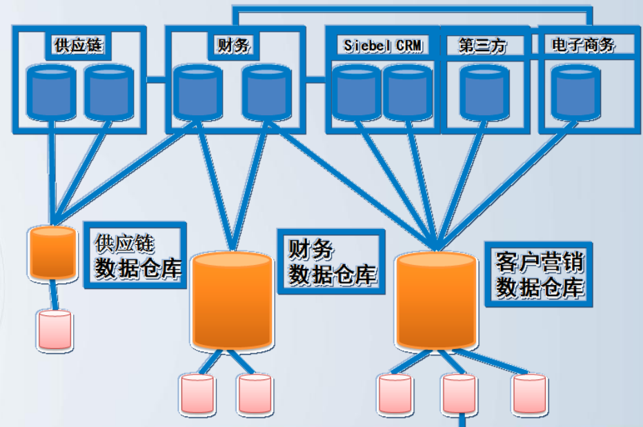

<!--
 * @Autor: 李逍遥
 * @Date: 2021-02-13 21:23:38
 * @LastEditors: 李逍遥
 * @LastEditTime: 2021-03-22 17:43:41
 * @Descriptiong: 
-->

# 目录 #

- [目录](#目录)
- [为什么需要数仓](#为什么需要数仓)
- [概述](#概述)
  - [数据仓库的定义](#数据仓库的定义)
    - [数据仓库的学术定义](#数据仓库的学术定义)
  - [数仓的特点](#数仓的特点)
    - [面向主题](#面向主题)
    - [集成的](#集成的)
    - [稳定的](#稳定的)
    - [反映时间变化](#反映时间变化)
  - [DWBI体系架构](#dwbi体系架构)
    - [几种常见的架构](#几种常见的架构)
    - [DWBI建设的七个主要环节](#dwbi建设的七个主要环节)
    - [DWBI系统建设中涉及的技术](#dwbi系统建设中涉及的技术)
    - [DWBI体系架构中的功能层](#dwbi体系架构中的功能层)
- [数据仓库的构建](#数据仓库的构建)
  - [数据仓库的构建模式](#数据仓库的构建模式)
    - [先局部再整体](#先局部再整体)
    - [先整体再局部](#先整体再局部)
  - [数据仓库设计](#数据仓库设计)
    - [策略规划](#策略规划)
    - [设计原则](#设计原则)
    - [DW模型](#dw模型)
    - [一、概念模型设计](#一概念模型设计)
    - [二、逻辑模型设计](#二逻辑模型设计)
    - [三、物理模型设计](#三物理模型设计)
    - [维度建模](#维度建模)

# 为什么需要数仓 #

- 数据分散  
  业务多数据分散在不同地方，行为日志区别于业务数据等  
- 数据脏乱  
  数据质量不好，信息密度低  
- 缺少历史  
  业务系统只关心当前数据，所以一般业务库没有保留历史数据  
- 性能慢  
  专注于事务  

# 概述 #

## 数据仓库的定义 ##

### 数据仓库的学术定义 ###

Data warehouse is a subject oriented, integrated, nonvolatile and time variant collection of data in support of management’s decision.  
—— William Inmon,1990  

数据仓库是一个面向主题的、集成的、稳定的、反映时间变化的，用于支持管理决策的数据集合。  

## 数仓的特点 ##

### 面向主题 ###

- 什么是主题  
  主题是一个抽象的概念，是在较高层次上将企业信息系统的数据综合、归类并进行分析利用的抽象。  
  - 以零售业为例  
    “销售”、“库存”、“供应商”、“客户”等就是一些可以进行分析研究的主题。  
  - 以钢铁行业为例  
    市场行情（行业发展情况，生产、供需、进出口）、钢材品种发展、钢铁上下游关联行业发展情况、财务（各种关注的财务指标）、销售（经营情况【销量、业绩】、库存、供应商和客户）等。  

- 面向主题组织数据的特点  
  - 各个主题有完整、一致的内容以便在此基础上作分析处理  
  - 主题之间有重迭的内容，反映主题间的联系  
    重迭是逻辑上的，不是物理上的。  
  - 各主题的综合方式存在不同  
  - 主题域应该具有独立性、完备性  
    独立性：有明确界限，数据是否属于该主题。  
    完备性：对该主题进行分析所涉及的内容均要在主题域内。  

### 集成的 ###

- 数据仓库里的数据是面向整个企业  
- 整合并统一多个业务系统数据的集合  
- 数据要保证一致性、完整性、有效性、精确性  

### 稳定的 ###

- 数据仓库在某个时间段来看是保持不变的  
- 数据仓库中的数据极少更新  
  一般只追加不删除数据，不用的数据从DW移出。  
  一般只被用作查询作用。  

### 反映时间变化 ###

- 数据仓库大多关注的是历史数据  
- 数据仓库中的表大多含有时间属性  
- 定期从OLTP接收新的数据内容  

## DWBI体系架构 ##

### 几种常见的架构 ###

实施方法：  

实际生产中数仓的一种架构：  

### DWBI建设的七个主要环节 ###

- 异种数据源集成  
- ODS层的设计  
- 数据仓库模型设计  
- ETL过程的设计  
- 元数据管理  
- 专题分析与数据挖掘  
- 前端展现  

### DWBI系统建设中涉及的技术 ###

### DWBI体系架构中的功能层 ###

一般来说，DWBI的体系架构中大致可分为以下几个功能层：  

- 数据整合层  
  一般是指构建ODS（Operational Data Store，操作性数据存储区）的过程，有些构建过程中可能会做成Stage+ODS。  
  数据整合层是整个系统中数据的统一入口，可以说是为数据仓库提供数据准备的工作区。  

  **说明**：  
  - 1.从各数据源抽取数据，以后所有的过程便属于同一局域网内位置。  
  - 2.后续相关处理过程面对的数据接口将统一和稳定，减少了技术的复杂性。  
  - 3.同时规避了因网络因素可能造成的其他以外问题。  

  **作用**：  
  - 1.快速接收数据采集过程传过来的大量数据，缩短数据采集时间，减少数据采集对应用系统的冲击。  
  - 2.实现对跨系统、多数据源的统一数据采集，提高了采集数据的可靠性和一致性。  
  - 3.所有文本式的数据，应先在整合层集中，再作后续处理。  
  - 4.所有的数据后续处理，因为数据整合层，而统一了接口，降低了技术复杂性和网络不良等因素。  
  - 5.数据整合层保存了要加载的数据，避免了数据转换过程对数据源的直接操作，减少了对数据源的影响。  
  - 6.当数据仓库中的数据转换出错或失败时，可以从数据整合层中再次抽取数据进行转换，而不必从数据源系统中抽取，减少的数据源系统的负载，也提高了系统的效率。  
- 存储服务层  
  数据仓库中的数据根据分析主题通常按照星型模型组织，每个分析主题在数据仓库中有对应的事实表及维表。  
- 应用分析层  
  利用数据仓库的数据，根据用户需求建立多维分析模型（CUBE多维立方体）。  
  模型以ROLAP、MOLAP方式存储，以使用户能方便地从任意角度、任意细节来共享、存取和分析企业的数据。  
- 信息展现层  
  按照用户的分析需求，实现把数据仓库系统中的信息和分析结果提供给最终用户。  
  例如以定制报表、即席查询、多维分析和数据挖掘等方法和技术进行数据展现。  

各层对于的数据类别：  

各层中对应的数据结构：  

# 数据仓库的构建 #

## 数据仓库的构建模式 ##

### 先局部再整体 ###

- 在实际生产过程中需要选择的一个切实可行的方法：  
  - 1.范围局限于一个主题区域。  
  - 2.局部的商业需求快速得到满足。  
  - 3.对其他部门数据集市是一个好的指导。  
  - 4.扩大到企业数据仓库(EDW)，作为一个长期的目标。  
- **优点**  
  - 投资少、见效快  
  - 设计上相对灵活  
  - 快速部署、便于复制  
- **缺点**  
  - 数据需要逐步清洗，信息需进一步提炼
  - 需要为每个部门做模型和数据重建  
  - 从部门扩充到企业有一定的困难  
  - 数据在ETL时有一定的重复工作，还会有一定级别的冗余和不一致性  

### 先整体再局部 ###

- 先创建企业数据仓库  
  - 构建中心数据模型  
  - 提供全局数据视图  
  - 最小化的冗余与不一致性  
  - 当前数据、历史数据与详细数据整合，实现全局数据的分析和挖掘  
- 再分离部门级数据集市  
  - 从数据仓库中分离部门业务的数据集市  
  - 部门级数据集市直接依赖于企业数据仓库  
- **优点**  
  - 数据规范化程度高  
  - 面向全企业构建了结构稳定和数据质量可靠的数据中心  
  - 相对快速有效地分离面向部门的应用  
- **缺点**  
  - 建设周期长、见效慢  
  - 风险程度相对大  

## 数据仓库设计 ##

### 策略规划 ###

- 1.明确用户的战略远景、业务目标  
- 2.确定数据仓库设计的目的和目标  
- 3.定义清楚数据仓库的范围、主题和针对的业务  
- 4.确定系统所需的平台和工具  
- 5.确定数据访问方式和各类接口服务  
- 6.数据仓库管理及安全  

### 设计原则 ###

- 以业务和需求为中心，以数据来驱动  
  - 业务和需求为中心是指围绕业务方向性需求、业务问题等，确定系统范围和总体框架  
  - 数据驱动是指根据当前数据基础和质量等情况，对数据源进行深入的分析  

### DW模型 ###

- IT系统的(数据)模型  
  - 是对现实世界中某些事物的一种抽象表示  
  - 是通过抽象的实体及实体间联系的形式，来表示现实世界中事物相互关系的一种方法  
  - 模型是理解、分析、开发或改造事物原型的一种常用手段  
  - 在信息系统中，模型是开发过程中的不可缺少的一个环节  
- 数据仓库的数据模型  
  - 是指使用实体、属性及其关系对企业运营和逻辑规则进行统一的定义、编码和命名  
  - 数据模型是业务人员、it人员和开发商的之间进行沟通的一套语言  
- 数据仓库数据模型的作用  
  - 统一企业的数据视图  
  - 定义业务部门对于信息的需求  
  - 是构建数据仓库原子层的基础  
  - 支持数据仓库的发展规划  
  - 初始化业务数据的归属  
- 数据仓库数据模型分类  
  - 业务模型  
  - 概念模型  
  - 逻辑模型  
  - 物理模型  
- 数据仓库模型设计的步骤  
  
- DW与业务系统模型设计的区别  
  |不同点|业务系统DB|分析系统DW|
  |:-|:-|:-|
  |处理类型不同|操作型数据环境，面向业务和应用|面向主题的分析型数据环境|
  |面向需求不同|确定的应用和业务需求|需求不确定不明了|
  |设计目标不同|快速响应，大量用户并发DML操作|少量用户大数据量的查询和分析|
  |数据来源不同|业务流程中产生的数据|生产系统中的历史数据及外部数据|
  |设计方法不同|应用需求驱动|业务驱动＋数据驱动|

- DW的模型结构  
  

- 业务系统的模型结构  
  

### 一、概念模型设计 ###

- 1.界定系统边界  
  数据仓库是面向决策分析，在数据仓库设计的最初无法得到详尽而明确的需求，但是一些基本的方向性的需求可以通过调查访问得到：  
  - 要做的决策类型有哪些?  
  - 决策者感兴趣的是什么问题?  
  - 这些问题需要什么样的信息?  
  - 要得到这些信息需要包含原有数据库系统的哪些部分的数据?  

  由此，可以得出当前大致的系统边界，集中精力进行最需要的部分的开发。  
  从某种意义上讲，界定系统边界的工作也可以看作是数据仓库系统设计的需求分析。  
- 2.确定主要的主题域及其内容  
  确定系统所包含的主题域，然后对每个主题域的内容进行较明确的描述。  
  - 主题域的公共码键  
  - 主题域之间的联系  
  - 充分代表主题的属性组  

>往往要参照业务模型，而一般中小型企业没有业务模型，所以一般也需要先构建业务模型。  

### 二、逻辑模型设计 ###

- 1.维度建模  
  - 事实表  
  - 维度表  
- 2.以星型和雪花型模型来组织数据  
  例如，“销售分析”主题的星型模型  

  

### 三、物理模型设计 ###

将数据仓库的逻辑模型物理化到数据库的过程。  
注意，不同的关系型数据库一些物理属性不一样。  

- 数据仓库的物理化  
  - 确定数据仓库的存储结构  
  - 制定索引策略  
  - 确定数据存放位置  
  - 设计存储分配  

### 维度建模 ###

- 步骤  
  - 根据业务过程确定相关的分析主题  
  - 定义业务处理所涉及事实的粒度  
  - 确定用于分析处理的维度  
  - 确定用于分析的数值型事实从而形成事实表  

- 事实和维度  
  - 数据仓库是为分析数据而设计，它的两个基本的元素就是事实和维度  
  - 维度是看问题的角度，比如时间、部门、产品，维表放的就是这些东西的定义  
  - 事实表里放着要查询分析的度量（数据值），同时还有维的ID  

- 事实表  
  - 事实表通常包含了处理所关心业务和操作的一系列度量值  
  - 事实表结构主要由两部分组成  
    - 反映业务和操作的数值型事实数据。  
    - 还包括由多个部分组成的复合键。其中除事实表本身的主键外，其余均是维表的外键。  
  - 反映业务事实的数据可以汇总以提供有关业务历史的信息  
  - 通过事实表的复合键，将事实表与维表联系起来  

- 事实表与维度表的比较  
  |事实表|维度表|
  |:-|:-|
  |属性较少（窄）|属性较多（宽）|
  |记录数较多（大）|记录数较少（小）|
  |多是数值型度量|描述型属性|
  |数据累积速度快|变化较少|

- 维度表的粒度处理  
  - 在建立维度表时，要精心选择并确定每一维度表的粒度  
    在数据仓库中做数据分析时就是要依据维度表的粒度来进行操作。  
  - 维表的数据量一般来说都比较小，所以一般采用单一粒度，设计到最小粒度，即原子粒度  

- 概念解释  
  - 度量  
    表示事实数据，如销售额、成本、利润和盈余。  
  - 粒度  
    数据仓库的数据单位中保存数据的细化或综合程度的级别。细化程度越高，粒度级就越小；相反，细化程度越低，粒度级就越大。  
  - 维度  
    - 维度是观察事物的角度  
      例如，维度包括时间、产品、地理位置和分销渠道。  
    - 维度也是事实表中用来描述数据分类的层次结构  
      在 OLAP 系统中是常用的，层次结构就是为了进行分析而将一个维度中相似的成员组合在一起的逻辑结构。  
    - 维度的结构基于父子关系进行分层组织  
      这些关系能够在级别之间导航并且可以将子值聚合到父值。  
      例如时间维可由年、月、周、日组成，所以可以按时间维统计每年、每月、每周、每日的一些数据。  
  - 层次结构(hierarchy)  
    维度层次结构是维度中成员的集合以及这些成员之间的相对位置。  
    维度有2种常见层次结构类型：均衡层次结构和不均衡层次结构。  

